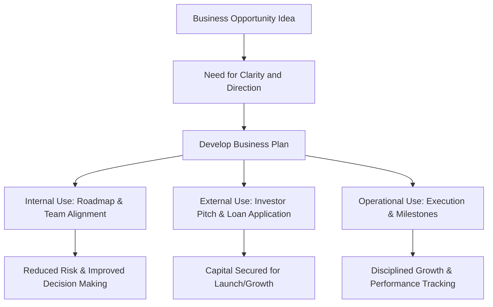

# Rationale for developing a Business Plan

## Video Explanation

* [https://www.youtube.com/watch?v=HfZy6sUeP6A](https://www.youtube.com/watch?v=HfZy6sUeP6A)

## Visual Aids

## 1. Definition

The rationale for developing a business plan refers to the logical and compelling reasons why an entrepreneur must create a formal written document outlining the business goals, strategies, and operational details. It explains the purpose and necessity of a business plan as a roadmap, a communication tool, and a decision-making framework for the venture.

## 2. Concept Explanation

A business plan is not just a formality. The basic idea behind its rationale is simple. A business is a complex journey with many unknowns. A written plan acts like a guide that reduces confusion and increases the odds of success.

How it works: The entrepreneur sits down to research, analyse, and document every aspect of the business idea. This includes the product, market, finances, and operations. The process of writing forces clarity. The final document then becomes a multi-purpose tool. It guides the founder's own actions day to day. It is shown to banks for loans. It attracts investors. It aligns team members to common goals. Why it is important: Without a strong rationale driving its creation, a business plan becomes a meaningless document that collects dust. Entrepreneurs who understand why they need a plan use it to save money, avoid fatal mistakes, secure funding, and build a disciplined organisation. The rationale transforms the plan from paperwork into a powerful asset.

## 3. Key Characteristics / Features

- **Deliberate Action Framework:** The rationale emphasises that a business plan forces the entrepreneur to move from a vague dream to deliberate, planned action.
- **Multi-Stakeholder Communication:** A key rationale is that the plan becomes a common document to communicate the vision to investors, bankers, employees, and partners consistently.
- **Risk and Assumption Testing:** The process of developing a plan is justified because it tests business assumptions on paper before real money and time are spent.
- **Milestone and Performance Benchmarking:** A solid rationale includes setting financial and operational targets in the plan against which actual performance can be measured.
- **Strategic Decision Support:** The document provides a framework for making critical decisions, such as pricing changes, market entry, or cost-cutting, based on prior analysis.

## 4. Types / Classification

The rationale can be viewed from different perspectives based on who the plan serves.

- **Internal Rationale (For the Entrepreneur and Team):** The plan acts as a management tool. It clarifies goals, sets the strategy, assigns responsibilities, and keeps the entire team focused on the same objectives.
- **External Rationale (For Investors and Lenders):** The plan is a sales document. It presents the business case to secure equity investment or debt financing. It proves due diligence, market potential, and the team's capability.
- **Operational Rationale (For Execution):** The plan provides detailed operational guidelines — who does what, by when, and with what resources. It is the blueprint for building the business.
- **Validation Rationale (For Feasibility Testing):** The rationale includes using the plan to test the feasibility of the idea. It validates whether the product is needed, the market is big enough, and the model can be profitable.

## 5. Working / Mechanism

The following steps outline how the rationale translates into the development and use of a business plan.

1.  An entrepreneur identifies a business opportunity and initially has scattered thoughts.
2.  The first internal rationale activates: the need to organise thoughts and test feasibility forces the entrepreneur to start writing a plan.
3.  The entrepreneur conducts market research and financial projections, documenting every assumption. This reduces the risk of proceeding with a flawed idea.
4.  The completed draft serves the operational rationale: it breaks down the vision into actionable tasks, timelines, and resource plans for the next 12 to 36 months.
5.  To raise capital, the external rationale comes into play. The plan is polished and presented to investors or banks, demonstrating credibility and reducing perceived risk.
6.  After funding, the internal rationale once again becomes critical. The plan serves as a dashboard to track progress against milestones and make corrective decisions.
7.  As the venture evolves, the plan is revised. The cycle of rationale—plan, execute, measure, revise—continues.

## 6. Diagram

## 7. Mathematical Formulation

Not applicable for this topic.

## 8. Example

Priya has an idea for an organic skincare brand. Initially, it is just a thought. She realises she cannot explain it clearly to anyone, nor does she know if it will make money. The rationale for a business plan hits her. She writes one, researching ingredient costs, target customers, and competitor pricing. The plan reveals that boutique retail stores will give better margins than online initially. She uses the plan to get a ₹10 lakh MUDRA loan. The bank sanctions it because the plan shows projected cash flow. Today, her brand is profitable because a document turned a dream into a disciplined strategy.

## 9. Analogy

Imagine an architect constructing a skyscraper without a blueprint. That would be absurd because mistakes would be costly and dangerous. A business is the skyscraper, and the business plan is the blueprint. The rationale for creating the blueprint is to calculate the structural load (finances), design the plumbing and wiring (operations), visualise the final building (vision), and convince the building authority (investors) that the building will not collapse.

## 10. Comparison

| Feature | Venture With a Business Plan | Venture Without a Business Plan |
|--------|------------------------------|----------------------------------|
| Direction | Clear roadmap with milestones | Ad-hoc decisions, vague direction |
| Funding | Higher chance of securing loans and investment | Very low credibility with lenders |
| Risk Control | Assumptions tested; risks identified early | Risks discovered after losses occur |
| Team Management | Roles and targets clearly assigned | Confusion over who does what |
| Performance | Measured against planned targets | No objective measure of success or failure |

## 11. Advantages

- It forces the entrepreneur to research and fully understand the market, competition, and financial requirements.
- A well-developed plan significantly improves the chances of obtaining bank loans or equity funding.
- It creates a clear strategic direction, helping the entrepreneur avoid distractions and stay focused on core goals.
- It serves as a communication tool that aligns partners, employees, and advisors to a single vision.
- It establishes benchmarks and performance metrics, enabling the entrepreneur to track progress and make data-driven adjustments.
- The process itself often uncovers hidden flaws or new opportunities, making the venture stronger before it even launches.

## 12. Disadvantages / Limitations

- Developing a genuine, research-backed business plan is time-consuming and may delay the actual launch.
- Entrepreneurs can become too attached to the plan and fail to adapt when the market changes, a phenomenon known as "plan rigidity."
- For very early-stage start-ups, the financial projections can be highly speculative and give a false sense of certainty.
- A beautifully written plan can hide a fundamentally weak idea, fooling the writer and even investors.
- Focusing excessively on the document can take away time from actually talking to customers and building a prototype.

## 13. Important Points / Exam Notes

- The primary rationale for a business plan is to serve as a roadmap and reduce the risk of failure.
- For external use, the plan is a marketing document for the business idea aimed at investors and lenders.
- The discipline of writing the plan is as valuable as the plan itself because it forces critical thinking.
- A business plan is not static; the rationale for updating it arises from market feedback and changing conditions.
- The lack of a clear business plan is one of the most common reasons for new venture failure cited by incubators and investors.
- The plan answers the fundamental questions: Where are we now? Where do we want to go? How will we get there?

## 14. Applications / Use Cases

- **Start-up Fundraising:** Founders write a detailed business plan to pitch to angel investors and venture capitalists, explaining the problem, solution, and exit strategy.
- **Bank Loan Sanction (MUDRA, MSME Loans):** Government and private banks mandatorily require a business plan with projected balance sheets and cash flow statements.
- **Business Incubation Programmes:** Applicants to incubators like IIT Start-up centres must submit a business plan to prove their idea's merit and readiness.
- **Strategic Partnerships:** A company seeking a tie-up with a distributor or a large vendor uses a business plan to show market traction and future value.
- **Internal Annual Planning:** Existing small businesses create annual business plans to set sales targets, marketing budgets, and hiring goals.

## 15. MCQs

**Q1. The primary internal rationale for writing a business plan is to:**

A. Immediately attract billions in investment  
B. Create a roadmap and strategic guide for the entrepreneur and team  
C. File tax returns  
D. Design a company logo  
**Answer:** B  
**Explanation:** Internally, the business plan acts as a management tool that provides direction and aligns the team.

**Q2. Which of the following is an external rationale for developing a business plan?**

A. Setting employee work schedules  
B. Convincing a bank to sanction a loan  
C. Deciding the office interior colour  
D. Writing a personal diary  
**Answer:** B  
**Explanation:** Externally, a business plan is used to persuade lenders and investors of the venture's viability.

**Q3. The process of writing a business plan forces an entrepreneur to:**

A. Ignore market competition  
B. Avoid financial calculations  
C. Test assumptions and research the market thoroughly  
D. Launch the product immediately without thinking  
**Answer:** C  
**Explanation:** The discipline of building a plan uncovers blind spots and validates hypotheses about the business.

**Q4. The blueprint analogy for a business plan highlights its role as:**

A. A decorative document  
B. A detailed guide that shows how to build the venture and avoid costly mistakes  
C. A legal requirement for registering a company  
D. A tax saving instrument  
**Answer:** B  
**Explanation:** Just as a blueprint guides construction and prevents structural errors, a business plan guides the venture and prevents business errors.

**Q5. Which of the following is a disadvantage of over-adhering to a business plan?**

A. Increased adaptability to market changes  
B. Plan rigidity, which prevents necessary pivots  
C. Better team communication  
D. Easier funding  
**Answer:** B  
**Explanation:** An entrepreneur may stick too rigidly to the original plan and ignore market feedback, causing failure (plan rigidity).

**Q6. A business plan used as a "performance benchmark" means it is used to:**

A. Compare actual results against planned targets  
B. Only attract investors  
C. Get copyright for the idea  
D. Hire a graphic designer  
**Answer:** A  
**Explanation:** The plan sets targets for sales, costs, and timelines; actual performance is measured against these to maintain control.

**Q7. The rationale behind giving a business plan to an investor is:**

A. To entertain them with stories  
B. To demonstrate the business model, market potential, and the team's capability to generate returns  
C. To file for tax exemption  
D. To legally transfer ownership immediately  
**Answer:** B  
**Explanation:** Investors look for a well-researched plan that shows how their money will be used and when they will get a return.

**Q8. A major advantage of developing a business plan is that it:**

A. Guarantees instant success without any work  
B. Helps uncover hidden flaws in the business idea before launch  
C. Eliminates all competition  
D. Replaces the need for customer contact  
**Answer:** B  
**Explanation:** The planning process itself often identifies weaknesses in the idea, which can then be corrected early.

**Q9. What does a business plan communicate to employees in a start-up?**

A. The personal vacation schedule of the founder  
B. The company's vision, goals, and their specific roles in achieving them  
C. The favourite foods of investors  
D. The building's construction material  
**Answer:** B  
**Explanation:** A business plan aligns the team by clarifying what the company aims to achieve and what is expected of each member.

**Q10. A business plan is considered a "living document" because:**

A. It is printed on biodegradable paper  
B. It should be regularly updated based on market feedback and changing conditions  
C. It breathes like a human  
D. It only exists in oral form  
**Answer:** B  
**Explanation:** The rationale is not a one-time event; the plan must be revised as the business learns and evolves.