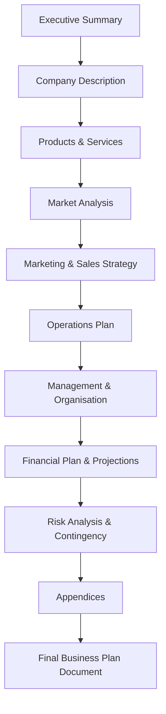

# Structure and Contents of a Typical Business Plan

## 1. Definition

A business plan is a formal written document that describes the goals of a business, the reasons why these goals are achievable, and the detailed plan for reaching them. It covers the product or service, market, management team, operations, and financial projections.

---

## 2. Concept Explanation

**Basic idea:** A business plan transforms a business idea into a clear, step‑by‑step roadmap. It explains what the business will sell, to whom, how it will operate, and how much money it will make.

**How it works:** The entrepreneur systematically gathers information about the target market, competition, required resources, legal structure, and financial needs. This information is organised into standard chapters. The finished document is used to convince investors, lenders, and partners to support the venture. It also serves as an internal guide for daily operations and long‑term decision‑making.

**Why it is important:** Without a business plan, a venture runs without direction. It is easy to overspend, miss opportunities, or misunderstand the market. A well‑written plan increases the chance of survival, attracts funding, and provides measurable milestones to track progress. Banks and investors almost always ask for a business plan before granting funds.

---

## 3. Key Characteristics / Features

- **Structured and systematic:** The plan follows a logical flow of sections, making complex ideas easy to follow.
- **Forward‑looking:** It makes realistic projections for the next 3 to 5 years, covering sales, expenses, and cash flow.
- **Comprehensive:** It covers every aspect of the business: product, market, operations, team, and finances.
- **Action‑oriented:** It includes specific milestones, timelines, and responsibilities.
- **Living document:** A good business plan is reviewed and updated as the market or internal situation changes.
- **Persuasive and clear:** It is written in simple language to convince outsiders (investors, banks) while serving as a guide for insiders.
- **Based on research:** All statements about demand, pricing, and competition are supported by data and referenced sources.

---

## 4. Types / Classification

Business plans can be classified by purpose and audience:

- **Internal business plan:** Used by the management team for strategic planning, goal setting, and tracking. It focuses on operations, milestones, and resource allocation. Confidential and not for external distribution.
- **External business plan (or investment‑grade plan):** Prepared for investors, banks, or grant agencies. It highlights the market opportunity, competitive advantage, financial returns, and the exit strategy. Polished and persuasive.
- **Lean business plan (or summary plan):** A concise version concentrating on key elements: value proposition, customer segments, revenue streams, and cost structure. Suitable for start‑ups that need to iterate quickly or present a high‑level overview.
- **Operational business plan:** Emphasises the day‑to‑day processes, production schedules, quality control, and supply chain details.
- **Strategic business plan:** Defines the long‑term vision, core mission, and the strategies for growth. Often used by established companies to realign.

---

## 5. Working / Mechanism (Structure and Contents)

A typical business plan is organised in the following sequence. Each point describes a standard section and its content.

1. **Executive Summary:** A one‑ to two‑page snapshot of the entire plan. It states the business concept, key financial highlights, and the amount of funding needed. Even though it appears first, it is written last.
2. **Company Description:** Provides basic information – business name, legal form, location, mission, and vision. It explains what the company does and what makes it unique.
3. **Products and Services:** Describes exactly what the business sells. Highlights benefits, unique features, stage of development, and any intellectual property.
4. **Market Analysis:** Presents research on industry trends, target customer profile, market size, growth potential, and competitor analysis. It demonstrates that a real demand exists.
5. **Marketing and Sales Strategy:** Explains how products will be promoted, priced, distributed, and sold. Includes digital marketing plans, branding, sales channels, and customer retention methods.
6. **Operations Plan:** Details how the business will run day‑to‑day. Covers location, facilities, machinery, technology, production process, inventory, and supply chain management.
7. **Management and Organisation:** Introduces key team members, their qualifications, and roles. Shows the organisational structure (chart) and mentions the board of directors or advisors if any.
8. **Financial Plan and Projections:** Contains historical financial data (if existing business) and projected income statements, cash‑flow statements, and balance sheets for 3‑5 years. Includes break‑even analysis, funding request, use of funds, and expected return on investment.
9. **Risk Analysis and Contingency Plan:** Identifies major risks (market, operational, financial) and the steps to mitigate them if they occur.
10. **Appendix:** Supplementary documents such as market survey questionnaires, product blueprints, patents, legal agreements, resumes of key team members, and detailed spreadsheets.

The plan concludes with a clear call to action – usually a request for specific investment or loan amount and the terms proposed.

---

## 6. Diagram

---

## 7. Mathematical Formulation

The financial section often uses a simple sales forecast and break‑even formula:

**Sales Forecast:**

$$
\text{Revenue} = \text{Estimated number of units sold} \times \text{Selling price per unit}
$$

**Break‑Even Point (BEP):**

$$
\text{BEP (units)} = \frac{\text{Total Fixed Costs}}{\text{Selling Price per Unit} - \text{Variable Cost per Unit}}
$$

Where:  
- **Total Fixed Costs** = Expenses that do not change with output (rent, salaries, insurance).  
- **Selling Price per Unit** = Price at which one unit is sold.  
- **Variable Cost per Unit** = Cost that varies directly with each unit produced (raw material, direct labour).  

These simple calculations are the backbone of the financial projections in a business plan.

---

## 8. Example

**Business Plan for “BeanBrew Coffee House”**

- *Executive Summary:* Specialty coffee shop targeting college students and freelancers. Seeking ₹15 lakh loan for equipment and initial inventory. Projected to break even in 14 months.
- *Company Description:* Partnership firm located near a busy university campus. Mission: “A perfect blend of taste, comfort, and community.”
- *Products and Services:* Gourmet coffee, fresh pastries, and free high‑speed Wi‑Fi. Unique feature – silent study pods for booking.
- *Market Analysis:* 8,000 students within 1 km; only two canteens, no dedicated coffee shop. Survey shows 70% demand.
- *Marketing Strategy:* Student loyalty card, Instagram influencer tie‑ups, university club event sponsorships.
- *Operations Plan:* 400 sq. ft. rented space. Equipment from standard coffee machine supplier. Inventory reordered weekly.
- *Management Team:* Two founders – one with hospitality experience, one with marketing background.
- *Financial Plan:* Projected revenue of ₹30 lakh in Year 1, net profit margin 18%. Loan repayment schedule included.
- *Risk Analysis:* Primary risk: new competitor opening nearby. Mitigation: build strong brand and introduce unique seasonal drinks.
- *Appendix:* Survey results, equipment quotation, CVs, lease agreement draft.

---

## 9. Analogy

A business plan is like an architect’s complete blueprint and construction schedule for a house. The blueprint shows every room, electrical point, and plumbing line (the product, market, operations). The schedule lists when each phase will be done, what materials are needed, and how much it will cost (financials). Without a blueprint, the builder would waste materials, miss deadlines, and perhaps build a house that collapses. The business plan prevents the entrepreneur from wasting money on a venture that was never structurally sound.

---

## 10. Comparison (Business Plan vs. Feasibility Study)

| Feature | Business Plan | Feasibility Study |
|--------|---------------|-------------------|
| Meaning | A detailed roadmap for how the business will be built and run | A preliminary analysis to check if the idea will work |
| Purpose | Implementation and funding | Go/No‑Go decision |
| Timing | After the idea is found feasible | Before committing significant resources |
| Depth | Very detailed: all operations, marketing, HR | Broad level: focuses on viability in key areas |
| Audience | Investors, banks, management team, partners | Promoters, early investors, pre‑sanction lenders |
| Outcome | A comprehensive action document | A recommendation report |
| Financials | Detailed projections for 3‑5 years | Rough estimates to gauge profitability potential |

---

## 11. Advantages

- Provides a clear, documented path from idea to execution, reducing confusion.
- Helps secure funding by showing that the venture has been carefully planned.
- Allows the entrepreneur to set benchmarks and measure performance.
- Identifies potential pitfalls early through risk analysis.
- Aids in attracting skilled team members who can see the company’s vision.
- Forces the founder to think deeply about every aspect of the business.
- Essential for partnerships; it aligns all co‑founders on goals and strategies.

---

## 12. Disadvantages / Limitations

- Creating a thorough business plan is time‑consuming; a start‑up may miss a market window.
- Based on assumptions that can quickly become outdated in a fast‑changing environment.
- A lengthy, rigid plan may discourage necessary pivoting when real customer feedback arrives.
- Requires research skills – many small entrepreneurs struggle to collect and present data convincingly.
- The plan is no guarantee of success; execution and market dynamics matter equally.
- If used as a one‑time static report, it loses value; it must be continuously updated.

---

## 13. Important Points / Exam Notes

- A business plan is a formal document describing business goals, the strategy to achieve them, and financial projections.
- Standard sections: Executive summary, company description, product/service, market analysis, marketing strategy, operations, management team, financial plan, risk analysis, appendix.
- The executive summary is written last but placed first; it must grab the reader’s attention.
- Financial projections typically cover 3‑5 years and include income statement, cash flow, and balance sheet.
- Break‑even point is calculated to show when the business will start generating profit.
- A business plan is both an internal guide and a tool to raise external capital.
- Lean business plans are shorter versions focusing on core value proposition and key metrics.
- It should be reviewed and revised periodically to stay relevant.
- A business plan answers four fundamental questions: What? For whom? How? With what results?

---

## 14. Applications / Use Cases

- **Start‑up fund‑raising:** A compelling business plan is essential for presenting to venture capitalists or banks.
- **Expansion projects:** An existing business prepares a plan to open new branches or launch new product lines.
- **Government grants and subsidies:** Many schemes (like PMEGP in India) require a detailed business plan.
- **Partnership negotiation:** A written plan helps potential partners understand the business and their roles clearly.
- **University entrepreneurship courses:** Students write business plans as a capstone project to practice planning.
- **Franchise proposals:** A franchisee submits a business plan to the franchisor to obtain approval.

---

## 15. MCQs

**Q1. The first section of a business plan, intended to catch the reader’s attention, is the:**  
A. Market Analysis  
B. Executive Summary  
C. Financial Plan  
D. Appendix  
**Answer:** B  
**Explanation:** The executive summary appears first and provides a concise overview of the entire plan.

**Q2. Which of the following is NOT a typical component of a business plan?**  
A. Operations Plan  
B. Marketing Strategy  
C. Daily Employee Attendance Log  
D. Financial Projections  
**Answer:** C  
**Explanation:** A business plan includes strategic sections; daily attendance logs are operational records, not part of the plan.

**Q3. The “marketing and sales strategy” section explains:**  
A. The manufacturing process  
B. How the product will be promoted, priced, and distributed  
C. The educational qualifications of the owner  
D. The company’s legal structure  
**Answer:** B  
**Explanation:** It details the tactics to attract customers and generate revenue.

**Q4. The break‑even analysis is typically placed in which section of a business plan?**  
A. Company Description  
B. Product Description  
C. Financial Plan  
D. Risk Analysis  
**Answer:** C  
**Explanation:** Break‑even point is a key financial metric, so it appears in the financial plan section.

**Q5. A business plan intended to be shared with investors for funding is classified as a(n):**  
A. Internal business plan  
B. External (investment‑grade) business plan  
C. Operational plan  
D. Lean canvas  
**Answer:** B  
**Explanation:** An external business plan is tailored to attract outside capital, highlighting returns and exit strategy.

**Q6. One major advantage of preparing a business plan is that it:**  
A. Eliminates all risk from the venture  
B. Guarantees instant profit  
C. Serves as a roadmap and helps secure funding  
D. Replaces the need for any market research  
**Answer:** C  
**Explanation:** It provides direction, benchmarks, and a professional document for investors.

**Q7. The “management and organisation” section typically includes:**  
A. The list of raw materials  
B. The organisational chart and key team member profiles  
C. The break‑even chart only  
D. Detailed competitor price list  
**Answer:** B  
**Explanation:** This section showcases who is running the business and their qualifications.

**Q8. A lean business plan differs from a traditional business plan by being:**  
A. Longer and more detailed  
B. Shorter and focused on core elements like value proposition and key metrics  
C. Written only by accountants  
D. Mandatory for tax filing  
**Answer:** B  
**Explanation:** Lean plans summarise the idea concisely, suitable for rapid iteration and early‑stage communication.

**Q9. Financial projections in a business plan typically cover:**  
A. The past 10 years  
B. Only the next month  
C. The next 3 to 5 years  
D. No specific time period  
**Answer:** C  
**Explanation:** Medium‑term projections (3‑5 years) show expected growth and allow investors to gauge returns.

**Q10. Which of the following best explains why the executive summary is written last?**  
A. It is not important  
B. It summarises the other sections, so it can only be completed after the full plan is written  
C. It is usually handwritten  
D. It contains raw data  
**Answer:** B  
**Explanation:** Since it is a summary of the entire plan, it is drafted after all other sections are finalised.