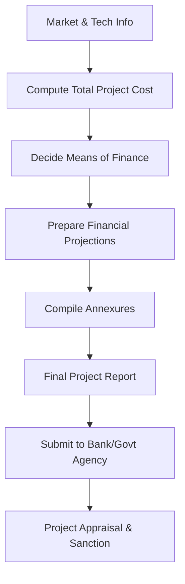

# 04 Project Report: 01 Concept

## 1. Definition

A project report is a detailed, written document that presents all aspects of a proposed business venture. It includes technical, financial, marketing, and managerial information in a structured format. Its primary purpose is to obtain financial assistance from banks, government agencies, and investors by proving the viability and profitability of the project.

## 2. Concept Explanation

After an entrepreneur has a business idea and a business plan, the next step is often to prepare a project report. While a business plan is an internal roadmap, a project report is a formal document created specifically for external stakeholders, especially for loan applications and subsidy claims. It follows a standard structure required by financial institutions and government schemes.

The basic idea is to present all critical facts and figures in one place. It works by compiling market and technical details, construction and machinery costs, projected revenues, expenses, and profit, along with the necessary legal documents, into a single file. It is often supported by quotations from machinery suppliers, certifications, and land records.

Why it is important: Banks and government bodies do not sanction money based on informal discussion. They need a professionally prepared project report to assess risk, understand the repayment capacity, and ensure the project is technically sound and financially feasible. For diploma‑level entrepreneurs, a well‑made project report is the ticket to loans under schemes like MUDRA, PMEGP, and others.

## 3. Key Characteristics / Features

- **Formal and structured:** The report follows a prescribed format, often supplied by the bank or scheme.
- **Loan‑oriented:** It focuses on total project cost, means of finance, and repayment schedule.
- **Evidence‑based:** All figures are backed by quotations, survey data, or technical specifications.
- **Comprehensive:** Covers technical know‑how, raw material sourcing, machinery, utilities, manpower, and financial projections.
- **Time‑bound:** Project implementation schedule is an essential part of the report.
- **Approval‑ready:** It includes all necessary certificates and annexures so that the funding agency can process it without delay.

## 4. Types / Classification

Project reports can be classified based on the purpose and scale.

- **Bankable project report:** Prepared strictly as per the bank’s guidelines for loan sanction. It emphasises collateral, repayment guarantee, and profitability.
- **Detailed Project Report (DPR):** Used for large infrastructure or industrial projects. It includes detailed engineering, environmental impact, and social cost‑benefit analysis.
- **Scheme‑specific project report:** Tailored for a particular government subsidy scheme like PMEGP, CMEGP, or MUDRA, following the scheme’s format.
- **Internal project report:** Prepared for the entrepreneur’s own team to secure approval from the board or partners; may be less formal but still comprehensive.

## 5. Working / Mechanism

The preparation of a project report follows a logical sequence.

1.  **Collect preliminary information:** Gather market data, site details, machinery quotations, raw material costs, and legal requirements.
2.  **Compile the technical specifications:** Describe the production process, machinery list with costs, capacity, power and water requirements, and civil works.
3.  **Calculate total project cost:** Sum up fixed capital (land, building, machinery, erection) and working capital (inventory, wages, expenses).
4.  **Work out the means of finance:** Decide the proportion of own contribution (margin money) and the amount to be borrowed as loan or subsidy.
5.  **Prepare financial projections:** Create projected income statements, cash flow statements, and balance sheets for the next five or more years. Calculate break‑even point and return on investment.
6.  **Develop implementation schedule:** Provide a timeline for loan sanction, machinery procurement, installation, trial runs, and commercial start.
7.  **Add supporting documents:** Attach land ownership documents, partnership deed, trade licences, quotations, technical certifications, and architect plans.
8.  **Finalise and submit:** Bind the report professionally and submit it along with the loan application or subsidy form.

## 6. Diagram

## 7. Mathematical Formulation

Key equations embedded in a project report:

Total Project Cost:

$$
\text{Total Project Cost} = \text{Fixed Capital} + \text{Net Working Capital}
$$

Break‑even Point (used to show viability):

$$
\text{BEP (units)} = \frac{\text{Total Fixed Cost}}{\text{Selling Price per Unit} - \text{Variable Cost per Unit}}
$$

Debt‑Service Coverage Ratio (DSCR) – important for loan assessment:

$$
DSCR = \frac{\text{Net Profit After Tax} + \text{Depreciation} + \text{Interest}}{\text{Interest Paid} + \text{Principal Repayment}}
$$

A DSCR above 1.5 indicates comfortable repayment ability.

## 8. Example

A diploma engineer wants to start a corrugated cardboard box manufacturing unit. The project report includes:

- **Technical detail:** A semi‑automatic corrugation machine costing ₹6 lakh, cutting and stitching tools, power requirement 10 HP, raw material – kraft paper rolls.
- **Total capital:** Fixed capital ₹8 lakh, working capital ₹2.5 lakh; total project cost ₹10.5 lakh.
- **Means of finance:** Own margin ₹2.1 lakh (20%), bank loan ₹8.4 lakh under MUDRA.
- **Financials:** Expected monthly sales ₹3 lakh, net monthly profit ₹45,000, break‑even in 11 months, DSCR 1.8.
- **Attachments:** Quotation for machine, rent agreement, trade licence application copy, Udyam registration.

The report convinces the bank about the project’s viability, and the loan is sanctioned.

## 9. Analogy

A project report is like a detailed health check‑up report before major surgery. The doctor (bank) will not operate (give money) without knowing the exact condition of the patient (business). The report shows the pulse (market demand), blood counts (cash flow), X‑rays (technical setup), and past medical history (entrepreneur’s background). If the report is clear and positive, the surgery gets a green signal.

## 10. Comparison

| Feature | Project Report | Business Plan |
|--------|----------------|---------------|
| **Primary audience** | Banks, financial institutions, government agencies | Internal management, potential investors, partners |
| **Focus** | Loan appraisal, repayment capacity, technical feasibility | Market strategy, operational plan, growth roadmap |
| **Structure** | Follows a rigid prescribed format or guideline | Flexible; can be lean or detailed |
| **Key content** | Project cost, means of finance, DSCR, BEP, implementation schedule | Executive summary, market analysis, marketing plan, management team |
| **Usage** | To secure debt, subsidy, or grant | To run the business and attract equity investment |

## 11. Advantages

- **Facilitates funding:** Banks and government schemes mandate a project report; it is impossible to access institutional finance without it.
- **Presents a unified view:** All technical, financial, and legal details are compiled, leaving no question unanswered.
- **Increases credibility:** A professionally prepared report builds trust and shows that the entrepreneur has done thorough homework.
- **Helps in implementation:** The implementation schedule and cost estimate become the baseline for monitoring project progress.
- **Supports government subsidy claims:** Many schemes require a project report in a specific template to release subsidies.

## 12. Disadvantages / Limitations

- **Time‑consuming and requires expertise:** A proper project report needs attention to detail; a first‑time entrepreneur may need to hire a consultant.
- **Based on assumptions:** If cost estimates or demand projections are incorrect, the report may give a false picture of viability.
- **Rigid format:** Deviating from the bank’s desired format can delay or reject the application.
- **Prepares a static picture:** Markets and costs can change quickly; the report may become outdated even before approval.
- **May require bribe or pressure for clearance:** In some cases, without proper guidance, getting the report accepted can be a hurdle (though ethical norms discourage this).

## 13. Important Points / Exam Notes

- A project report is the formal document required by banks and government bodies to sanction loans and subsidies.
- It is not the same as a business plan; a business plan is broader, while a project report is specific to the investment proposition.
- The total project cost = fixed capital (land, building, machinery) + working capital (raw material, wages, etc.).
- Means of finance = own contribution (margin) + debt (loan) + subsidy (if any).
- Break‑even point and DSCR are crucial financial indicators included in the report.
- The report must include supporting documents like machinery quotations, land records, and trade licence.
- An implementation schedule with a clear timeline is necessary.
- For PMEGP and similar schemes, the project report must be in the prescribed format, often with a maximum project cost limit.
- A project report should be typed, neatly bound, and error‑free to create a good impression.
- The entrepreneur’s educational qualifications, technical skills, and experience are often highlighted in the report.

## 14. Applications / Use Cases

- **MSME loan application:** A small unit seeks a term loan for purchasing a CNC machine; the bank demands a project report.
- **Government subsidy:** A self‑help group applies for a food processing subsidy under PMEGP; a project report is attached.
- **Venture capital funding:** A start‑up provides a detailed project report to an angel investor to prove technical viability.
- **Franchise agreement:** A potential franchisee submits a project report to the franchisor showing that the local area can support the outlet.
- **Partnership proposal:** When a technical expert joins a business as a partner, the project report helps value the business and the capital contribution.

## 15. MCQs

**Q1. A project report is primarily prepared for**

A. Internal staff motivation  
B. Getting financial assistance from banks or government agencies  
C. Preparing an income tax return  
D. Hiring an accountant  

**Answer:** B  
**Explanation:** Its primary purpose is to support a loan or subsidy application.

---

**Q2. Which of the following is a mandatory component of a project report for a bank loan?**

A. Owner’s daily schedule  
B. Project cost and means of finance  
C. Favourite colour of the promoter  
D. List of relatives  

**Answer:** B  
**Explanation:** The report must show total project cost and how it will be financed.

---

**Q3. Total project cost includes**

A. Only the cost of machinery  
B. Fixed capital plus net working capital  
C. Only the loan amount  
D. Only the subsidy amount  

**Answer:** B  
**Explanation:** It is the sum of all capital needed for long‑term assets and day‑to‑day operations.

---

**Q4. The Debt‑Service Coverage Ratio (DSCR) is used to measure**

A. The size of the market  
B. The ability to repay loan instalments  
C. The number of employees  
D. The colour scheme of the factory  

**Answer:** B  
**Explanation:** A higher DSCR indicates comfortable repayment capacity.

---

**Q5. The break‑even point in a project report tells the entrepreneur**

A. When he will get a bank loan  
B. The volume of sales needed to cover all costs  
C. The maximum possible profit  
D. The number of machines required  

**Answer:** B  
**Explanation:** It is the point where total revenue equals total cost.

---

**Q6. A project report differs from a business plan because the project report**

A. Is written before the business idea  
B. Follows a prescribed format for loan sanction  
C. Is only for internal team members  
D. Does not contain any financial figures  

**Answer:** B  
**Explanation:** It is prepared specifically to satisfy the requirements of funding agencies.

---

**Q7. Which of the following is NOT typically included in a project report?**

A. Machinery specifications and quotations  
B. Project implementation schedule  
C. The entrepreneur’s childhood stories  
D. Projected cash flow statement  

**Answer:** C  
**Explanation:** Only business‑relevant information is included.

---

**Q8. Government subsidy schemes like PMEGP require**

A. A project report in the scheme’s specific format  
B. Only a verbal explanation  
C. No documents at all  
D. A newspaper advertisement  

**Answer:** A  
**Explanation:** Each scheme provides a template that must be filled accurately.

---

**Q9. The margin money in means of finance refers to**

A. The profit earned after one year  
B. The bank’s processing fee  
C. The entrepreneur’s own contribution to the project cost  
D. The interest charged on the loan  

**Answer:** C  
**Explanation:** Margin is the portion of the total cost that the entrepreneur must invest from personal funds.

---

**Q10. A diploma holder preparing a project report for a small manufacturing unit should**

A. Exaggerate the costs to get more loan  
B. Base cost estimates on genuine quotations and realistic market data  
C. Not include any financial statements  
D. Submit it only after the business has failed  

**Answer:** B  
**Explanation:** Accurate, honest figures ensure credibility and proper appraisal.