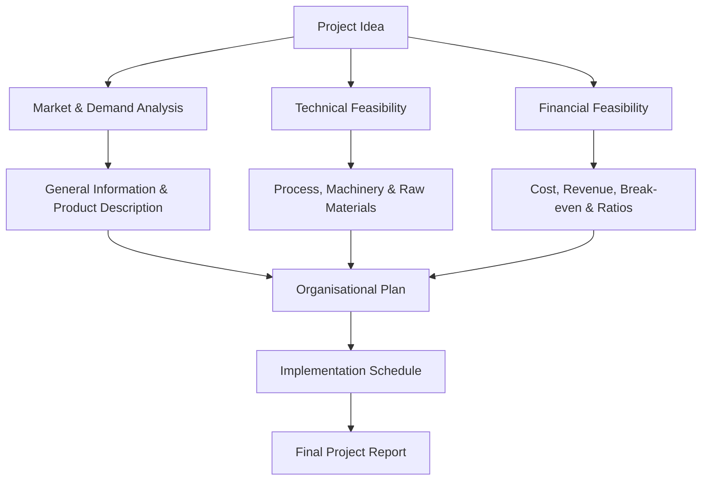

# Features and components

## Video Explanation

* [https://www.youtube.com/watch?v=HfZy6sUeP6A&t=200s](https://www.youtube.com/watch?v=HfZy6sUeP6A&t=200s)

## Visual Aids

## 1. Definition

A project report is a written document that systematically describes all essential aspects of a proposed business venture. It covers technical, financial, marketing, and organisational details. Its purpose is to prove the viability of the project, guide its implementation, and help secure loans or investments.

## 2. Concept Explanation

An entrepreneur may have a brilliant idea, but a mere idea cannot secure a bank loan or guide a team. The basic idea behind a project report is to convert the idea into a concrete, data-backed document. A well-prepared project report answers all key questions: What will be produced? Where? How? By whom? At what cost? With what profit?

How it works: The entrepreneur studies the project from every angle. Technical feasibility, market demand, financial projections, and legal requirements are all investigated. The findings are compiled into neat sections. The final report is presented to bankers, government agencies, or partners. Even after funding, the report serves as a reference to keep the project on track.

Why it is important: A project report minimises guesswork and surprises. It forces the entrepreneur to think through every detail before spending money. It communicates the project's soundness to outsiders. Without such a structured document, critical gaps may remain hidden until it is too late. It is the single most important document for obtaining term loans, working capital, and government approvals in the MSME sector.

## 3. Key Characteristics / Features

- **Comprehensiveness:** A good project report covers every relevant dimension — technical, financial, market, and organisational — leaving no major question unanswered.
- **Systematic Presentation:** Information is arranged under standard headings and subheadings, making it easy for a loan officer or investor to review.
- **Objectivity and Realism:** The report uses actual data, market surveys, and realistic assumptions, not wishful thinking or exaggerated claims.
- **Future-Oriented:** It makes projections for the next 5 to 10 years, forecasting costs, revenues, and profits.
- **Legally and Technically Sound:** It respects existing laws, licensing requirements, and environmental norms, and proposes proven technologies.
- **Decision-Making Tool:** The report is not just for external readers; it helps the entrepreneur take informed decisions about plant capacity, location, and product mix.

## 4. Types / Classification (Major Components of a Project Report)

A standard project report is divided into several components, each addressing a specific area of the venture.

- **General Information:** Includes name of the entrepreneur, proposed business name, location, objective, and type of ownership (proprietorship, partnership, etc.).
- **Product and Market Analysis:** Describes the product or service, its uses, target customers, demand-supply gap, competitor analysis, proposed pricing, and distribution strategy.
- **Technical Feasibility:** Covers the manufacturing process, plant capacity, required machinery and equipment, raw materials, utilities (power, water), and technology source. It also specifies the building and civil works needed.
- **Organisational and Management Plan:** Details the organisational structure, key personnel, their qualifications, and manpower requirements (skilled and unskilled).
- **Financial Analysis:** This is the most critical component. It includes total project cost, means of finance (own capital, loan, subsidy), projected profitability statement, cash flow statement, projected balance sheet, break-even analysis, and financial ratios (like debt-equity ratio, ROI). This is often called the Detailed Project Report (DPR) core.
- **Economic and Social Justification:** Explains the project's benefit to the local area, such as employment generation, utilisation of local resources, and contribution to the regional economy.
- **Implementation Schedule:** A timeline showing the sequence and duration of activities from land acquisition to commercial production, often using a bar chart or network diagram.

## 5. Working / Mechanism

The process of developing a project report follows a systematic path.

1.  The entrepreneur identifies a viable business idea and conducts a preliminary feasibility check.
2.  A detailed market survey is carried out to estimate demand and competition. Primary and secondary data are collected.
3.  Technical experts are consulted to select the right machinery, prepare a plant layout, and estimate raw material consumption.
4.  All costs are estimated: land, building, plant and machinery, preliminary expenses, and working capital margin.
5.  Sources of funds are finalised: promoter's contribution, bank term loan, and government subsidy under schemes like PMEGP or MUDRA.
6.  Financial statements are projected. The profitability, cash flow, and balance sheet are prepared in a format acceptable to banks.
7.  The break-even point is calculated and financing ratios are checked to ensure they meet lending norms.
8.  The complete report is compiled, reviewed, and then submitted to the bank or financial institution along with the loan application.

## 6. Diagram

## 7. Mathematical Formulation

The **Break-Even Point (BEP)** is a standard financial calculation included in the project report.

$$
\text{BEP (in units)} = \frac{\text{Fixed Costs}}{\text{Selling Price per Unit} - \text{Variable Cost per Unit}}
$$

Where:
- Fixed Costs include rent, salaries, depreciation, and interest that remain constant regardless of output.
- Selling Price per Unit is the amount at which one unit will be sold.
- Variable Cost per Unit includes raw material, direct labour, and power that vary with production.

The project report uses this formula to show the minimum production at which the unit starts earning profit. A lower BEP indicates lower risk.

## 8. Example

An aspiring entrepreneur, Vikram, wants to set up a paper cup manufacturing unit. He prepares a project report with these components:
- **General Information:** Sole proprietorship, named "EcoCup", located in an industrial estate.
- **Market Analysis:** Demand study for paper cups in nearby tea stalls and hospitals shows a daily demand of 50,000 cups; only two small competitors exist.
- **Technical Details:** Automatic cup-forming machine with capacity of 30,000 cups per day, raw material supply of paper rolls from a local mill.
- **Financials:** Total project cost ₹35 lakhs. Promoter margin ₹10 lakhs, term loan ₹25 lakhs. Projected net profit in year 1: ₹6.5 lakhs. Break-even at 40% capacity utilisation. Debt-equity ratio 2.5:1.
- **Implementation:** 6 months from sanction to first sale.
The project report is submitted to the bank, which sanctions the loan seeing clear viability.

## 9. Analogy

A project report is like the "plans and specifications" of a house before construction. Before building a house, you prepare a detailed map showing the location of rooms, water pipes, electrical wiring, and calculate the total cost. The project report is exactly this blueprint for a business. It shows every room (component), ensures the structure won't collapse (financial feasibility), and gives the builder (entrepreneur) and the bank (loan officer) a clear picture.

## 10. Comparison

| Feature | Project Report | Business Plan |
|--------|---------------|---------------|
| Primary Purpose | To secure funding from banks and financial institutions | To guide strategy, attract equity investors, and manage operations |
| Focus | Heavy emphasis on technical specifications, machinery, and cost of project | Heavy emphasis on business model, market strategy, and management team |
| Audience | Bank loan officers, government subsidy agencies | Investors, partners, internal management |
| Detail Level | Extremely detailed technical and financial annexures | More strategic, with a focus on the pitch and value proposition |

## 11. Advantages

- It provides a complete, data-backed document that increases the confidence of lenders and sanctioning authorities.
- The process of creating the report forces the entrepreneur to examine every detail, reducing the chance of oversights.
- It helps in accurately estimating the total fund requirement, avoiding under-financing or over-financing.
- The report acts as a baseline against which actual progress can be compared during implementation.
- A well-prepared project report can speed up loan processing, as it answers all routine queries upfront.

## 12. Disadvantages / Limitations

- Preparing a detailed project report can be time-consuming and may require hiring consultants, which adds to the pre-operative cost.
- Over-reliance on projections and assumptions can give a false sense of security if the market or input costs behave differently.
- For very small micro units, the standard format may seem overly complex and overwhelming for a first-time entrepreneur.
- Once submitted, changes in the project scope or cost require revised reports and fresh approvals, causing delays.
- A beautiful report cannot compensate for a fundamentally unviable idea; it may mask the truth if the entrepreneur is overly optimistic.

## 13. Important Points / Exam Notes

- A project report is the primary document for obtaining term loans from banks under MSME schemes.
- The major components are: General Information, Market Analysis, Technical Feasibility, Organization Plan, Financial Analysis, and Implementation Schedule.
- The financial section must include the cost of project, means of finance, projected profit and loss, cash flow, balance sheet, break-even point, and debt-equity ratio.
- The report should be realistic and based on verifiable facts, not exaggeration.
- The implementation schedule may be presented as a bar chart or PERT/CPM chart.
- For government subsidy claims (like PMEGP), the format of the project report is often prescribed.

## 14. Applications / Use Cases

- **Bank Loan Applications:** Every MSME loan application must be accompanied by a detailed project report to appraise the proposal.
- **Government Subsidy Schemes:** Agencies like KVIC, DIC, and MSME DI require a project report to release margin money or capital subsidy.
- **Term Loan for Machinery:** An entrepreneur wanting to purchase expensive machinery for a new unit uses the report to prove the equipment's necessity and return.
- **Joint Venture Partnerships:** When two parties establish a new unit, a project report serves as the mutually agreed foundation document.
- **Business Incubator/Accelerator Admission:** While a pitch deck is common, some traditional incubators still ask for a summarised project report.

## 15. MCQs

**Q1. What is the primary purpose of a project report in a small business context?**

A. To serve as a legal registration document  
B. To obtain loans and guide project implementation  
C. To replace all employee contracts  
D. To record daily sales transactions  
**Answer:** B  
**Explanation:** A project report is used chiefly to secure financing and to provide a blueprint for executing the project.

**Q2. Which component of the project report contains details of the demand-supply gap and competitor analysis?**

A. Technical feasibility  
B. Financial analysis  
C. Product and market analysis  
D. Implementation schedule  
**Answer:** C  
**Explanation:** The market analysis section covers demand estimation, target customers, and competitive landscape.

**Q3. The break-even point calculation in a project report shows:**

A. The total investment needed  
B. The minimum sales level at which the unit makes no profit and no loss  
C. The maximum profit possible  
D. The total number of employees required  
**Answer:** B  
**Explanation:** BEP indicates the volume of output where total revenue equals total cost.

**Q4. Which of the following is NOT a major component of a standard project report?**

A. Organisational and management plan  
B. Technical feasibility  
C. Personal autobiography of the entrepreneur  
D. Financial analysis  
**Answer:** C  
**Explanation:** Personal autobiography is not a standard component; the focus is on the business, not the personal life story.

**Q5. The implementation schedule in a project report typically uses:**

A. A cooking recipe  
B. A bar chart or network diagram showing timelines  
C. A random list of tasks  
D. Only written paragraphs without any chart  
**Answer:** B  
**Explanation:** A timeline or Gantt chart is used to display when each activity will be completed.

**Q6. Debt-equity ratio is a part of which section of the project report?**

A. Market analysis  
B. Technical feasibility  
C. Financial analysis  
D. Implementation schedule  
**Answer:** C  
**Explanation:** Financial ratios like debt-equity ratio are calculated in the financial analysis section to show capital structure.

**Q7. Which of the following is a key feature of a good project report?**

A. Exaggerated profit figures  
B. Ignoring competitors  
C. Objectivity and realistic assumptions  
D. Avoiding any mention of risks  
**Answer:** C  
**Explanation:** A good report is based on factual data and conservative, realistic estimates.

**Q8. The process of preparing a project report helps the entrepreneur primarily by:**

A. Guaranteeing immediate profit  
B. Forcing a deep analysis of all aspects of the venture  
C. Eliminating the need for market research  
D. Reducing the cost of raw materials  
**Answer:** B  
**Explanation:** The discipline of writing the report uncovers hidden issues and ensures thorough planning.

**Q9. The "technical feasibility" component specifically deals with:**

A. Number of workers in the canteen  
B. Manufacturing process, machinery, raw material, and technology  
C. Only the selling price of the product  
D. The colour of the office walls  
**Answer:** B  
**Explanation:** Technical aspects include the how-to-make details — process flow, equipment, and inputs.

**Q10. When a bank evaluates a project report, which section is most critical to assess repayment capacity?**

A. Only the cover page design  
B. The projected cash flow and profitability statements  
C. The list of competitors' website links  
D. The engineer's educational degrees  
**Answer:** B  
**Explanation:** Banks scrutinize the cash flow statement to see if the unit will generate enough cash to pay monthly loan instalments.