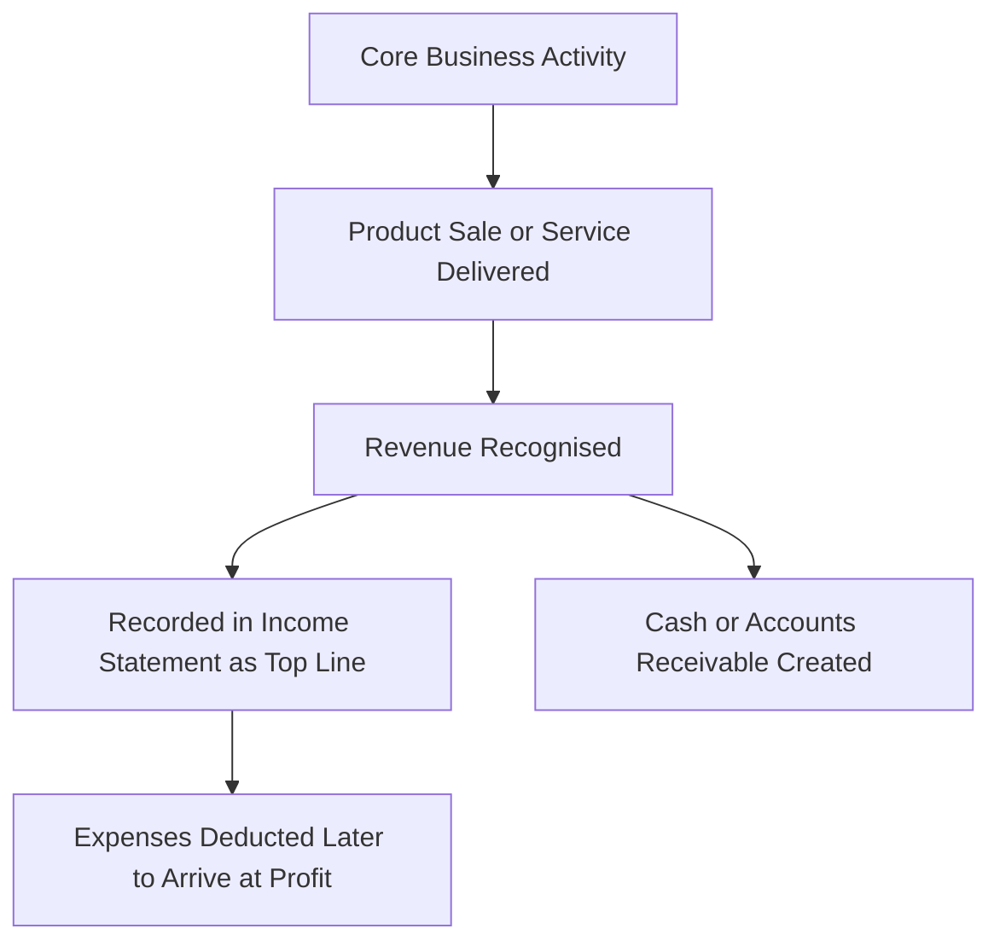

# Revenue

## 1. Definition

Revenue is the total income generated by a business from its normal business activities, usually from the sale of goods and services to customers. It is the top line or gross income figure from which all costs and expenses are subtracted to arrive at net profit.

---

## 2. Concept Explanation

The basic idea is that revenue is the money a business brings in before paying any bills. If you run a small bakery, the cash you receive when someone buys a loaf of bread or a cake is your revenue.

How it works: Revenue is recorded when a product is delivered or a service is performed, not necessarily when cash is received (accrual concept). Every business activity that forms the primary purpose of the firm creates revenue; for a shop, it is the sale of merchandise; for a consultancy, it is the fees from clients. Revenue is calculated by multiplying the number of units sold by the selling price. It appears at the very top of the income statement (profit and loss account).

Why it is important: Revenue is the lifeblood of any enterprise. Without sufficient and growing revenue, a business cannot cover its costs, invest in expansion, or reward its owners. It is the first figure investors and lenders look at to judge the scale and health of a business. Tracking revenue trends helps entrepreneurs understand whether customers are accepting their product and if their marketing efforts are working.

---

## 3. Key Characteristics / Features

- **Top line item:** Revenue is the first figure reported in the income statement, before any expense deduction.
- **Gross inflow:** It represents the total inflow of economic benefits before subtracting any costs.
- **Earned from core operations:** Revenue typically comes from the sale of goods, rendering of services, or use by others of enterprise resources.
- **Measurable:** Revenue can be reliably measured in monetary terms based on the agreed price.
- **Accrual-based recording:** Revenue is recognised when it is earned, regardless of when the cash is received.
- **Indicator of market scale:** Higher revenue generally indicates a larger customer base or higher prices, reflecting business growth.

---

## 4. Types / Classification

Revenue can be broadly classified into two main types:

- **Operating Revenue (Main Revenue):** Income generated from the primary business activities. For a manufacturer, it is the sale of finished goods; for a school, it is tuition fees; for a software firm, it is license fees or subscriptions. This is the core revenue that shows the health of the business.
- **Non-operating Revenue (Other Income):** Income that is not directly related to the main business. Examples include interest earned on bank deposits, rent received from spare property, profit from sale of old machinery, and dividends from investments. It is usually smaller and irregular.

Additionally, depending on the nature of the business, operating revenue may have sub-categories like:
- **Product revenue:** From selling physical goods.
- **Service revenue:** From providing intangible services.
- **Recurring revenue:** Income that repeats regularly (subscriptions, maintenance contracts).
- **Transaction-based revenue:** One-time income from a specific sale.

---

## 5. Working / Mechanism

The process of revenue recognition and recording follows these steps in a typical business:

1. A customer places an order or signs a service agreement, establishing the price and terms.
2. The business delivers the product or performs the service, completing its performance obligation.
3. An invoice is raised showing the amount due, the date, and the payment period.
4. Revenue is recognised in the accounting books on the date the goods are delivered or the service is rendered, not on the payment date.
5. The revenue amount is recorded as a credit in the revenue (sales) account and a debit in cash or accounts receivable.
6. At the end of the accounting period, total revenue is transferred to the income statement.
7. If payment is received later, it simply converts the receivable into cash without affecting the revenue already booked.

---

## 6. Diagram

---

## 7. Mathematical Formulation

The simplest formula for revenue is:

$$
\text{Revenue} = \text{Quantity Sold} \times \text{Selling Price per Unit}
$$

Where:
- **Quantity Sold** = Number of units of product sold or hours of service billed during a period.
- **Selling Price per Unit** = Price at which one unit is sold, net of any discounts and taxes.

For a business with multiple products:

$$
\text{Total Revenue} = \sum_{i=1}^{n} (Q_i \times P_i)
$$

Where \( Q_i \) and \( P_i \) are the quantity and price of the \( i \)-th product.

---

## 8. Example

Suppose a start-up called “PrintPro” sells custom‑designed T‑shirts online.

- In January, they sell 800 T‑shirts at an average price of ₹500 each.
- Revenue = 800 × ₹500 = ₹4,00,000.
- They also earn ₹2,000 as interest from their savings account, which is non‑operating revenue.
- In their January income statement, operating revenue is ₹4,00,000; total revenue is ₹4,02,000.

This top line tells the owner that the business generated ₹4 lakh from its core activity. Later, after subtracting the cost of the T‑shirts, website fees, packing, and other expenses, they find out whether this revenue led to a profit or loss.

---

## 9. Analogy

Think of revenue as the water flowing into a tank from a tap. The tank is the business. The tap is the sales activity. As long as water (revenue) keeps flowing in, the tank can supply the kitchen, garden, and bathroom (operating expenses, owner’s drawings, and investments). If the inflow stops or reduces, the tank will eventually run dry, no matter how efficiently water is used inside. So, maintaining a healthy flow of revenue is the first priority.

---

## 10. Comparison (Revenue vs. Profit)

| Feature | Revenue | Profit |
|--------|---------|--------|
| Meaning | Total income from sales and other sources | Income left after subtracting all expenses |
| Position in income statement | Top line | Bottom line |
| Calculation | Quantity sold × Price per unit | Revenue – Total Expenses |
| Depends on | Sales volume and pricing | Revenue, plus cost management |
| Indication | Size and scale of business activity | Efficiency and financial success |
| Example | A shop sells ₹10 lakh of goods | After ₹9 lakh expenses, profit is ₹1 lakh |

---

## 11. Advantages (of tracking and understanding revenue)

- It reveals the scale of business operations and market demand for the product.
- Revenue growth trends help entrepreneurs evaluate the success of marketing and sales strategies.
- It is the primary source of cash to meet all business obligations and invest in growth.
- Helps in setting realistic sales targets and performance benchmarks.
- Required by lenders and investors to assess risk and extend credit or funding.
- Simplifies break‑even analysis and sales forecasting.

---

## 12. Disadvantages / Limitations

- High revenue alone does not guarantee success; a business can have large sales and still be unprofitable if costs are uncontrolled.
- Revenue recognition rules can be complex, and aggressive booking of revenue can mislead stakeholders.
- Does not reflect cash availability, as many sales may be on credit.
- Can be seasonal or volatile, making short‑term figures less meaningful for planning.
- Different businesses recognise revenue differently (e.g., construction vs. retail), making comparison difficult without understanding accounting policies.

---

## 13. Important Points / Exam Notes

- Revenue is the total inflow from operating and non‑operating activities; operating revenue is from core business.
- Formula: Revenue = Units Sold × Price per Unit.
- It is the top line of the income statement.
- Revenue is recognised when earned, not when cash is collected (accrual basis).
- Non‑operating revenue includes interest, rent, profit on asset sale.
- Revenue should not be confused with receipts or cash flow.
- Consistent revenue growth is a sign of a healthy, expanding business.
- Entrepreneurs must forecast revenue realistically in their business plans using market data.

---

## 14. Applications / Use Cases

- **Business plan financials:** The first forecast prepared is the revenue projection based on expected customers and pricing.
- **Sales team targets:** Quarterly revenue targets are set for the sales department to measure performance.
- **Loan assessment:** Banks evaluate loan repayment capacity by checking the stability and trend of operating revenue.
- **Valuation of start‑ups:** Investors value a start‑up often based on revenue multiples, especially in early stages.
- **Government tax returns:** Revenue (turnover) is the starting point for calculating indirect taxes like GST and income tax.

---

## 15. MCQs

**Q1. Revenue is also known as:**  
A. Net income  
B. Bottom line  
C. Top line  
D. Gross profit  
**Answer:** C  
**Explanation:** Revenue appears at the top of the income statement, hence it is called the top line.

**Q2. Which of the following is an example of operating revenue for a bakery?**  
A. Sale of an old oven  
B. Interest on fixed deposit  
C. Sale of cakes and bread  
D. Rent received from subletting the store  
**Answer:** C  
**Explanation:** Sale of cakes and bread is the core business activity of a bakery, generating operating revenue.

**Q3. The formula for calculating revenue is:**  
A. Units sold × Fixed cost per unit  
B. Units sold × Variable cost per unit  
C. Units sold × Selling price per unit  
D. Profit + Expenses  
**Answer:** C  
**Explanation:** Revenue is simply the quantity sold multiplied by the price at which it was sold.

**Q4. Revenue is recognised in the books of accounts when:**  
A. Cash is received from the customer  
B. An order is placed  
C. The goods are delivered or services performed  
D. The financial year ends  
**Answer:** C  
**Explanation:** As per accrual accounting, revenue is recognised when it is earned, which is upon delivery or performance.

**Q5. A company sells 500 units at ₹200 each and has non‑operating income of ₹5,000. Its total revenue is:**  
A. ₹1,00,000  
B. ₹1,05,000  
C. ₹95,000  
D. ₹5,000  
**Answer:** B  
**Explanation:** Operating revenue = 500 × 200 = ₹1,00,000. Total revenue = 1,00,000 + 5,000 = ₹1,05,000.

**Q6. Which of the following statements is TRUE?**  
A. High revenue guarantees high profit  
B. Revenue and profit are the same  
C. Revenue is the money coming in from sales before expenses  
D. Revenue is always equal to cash inflow  
**Answer:** C  
**Explanation:** Revenue is the total gross inflow before any costs are deducted; profit is what remains after all expenses.

**Q7. Non‑operating revenue generally includes:**  
A. Sale of manufactured products  
B. Service fees  
C. Interest earned on bank deposits  
D. Subscription income  
**Answer:** C  
**Explanation:** Interest from bank deposits is not from the main business operations, so it is non‑operating revenue.

**Q8. In a software company, annual license fees received from clients would be classified as:**  
A. Non‑operating revenue  
B. Operating revenue  
C. Capital receipt  
D. Deferred revenue (until realised)  
**Answer:** B  
**Explanation:** License fees are the core business income, making it operating revenue.

**Q9. One major limitation of relying only on revenue as a performance indicator is that:**  
A. It is too difficult to calculate  
B. It does not indicate whether the business is actually profiting  
C. It is always inaccurate  
D. It is not used by investors  
**Answer:** B  
**Explanation:** A company can generate huge revenue but still make a loss if its costs exceed the revenue.

**Q10. Revenue from the sale of an old factory machine is categorised as:**  
A. Operating revenue  
B. Other income (non‑operating)  
C. Manufacturing expense  
D. Owner’s equity  
**Answer:** B  
**Explanation:** Unless the company is in the business of selling machines, the gain from asset sale is non‑operating other income.