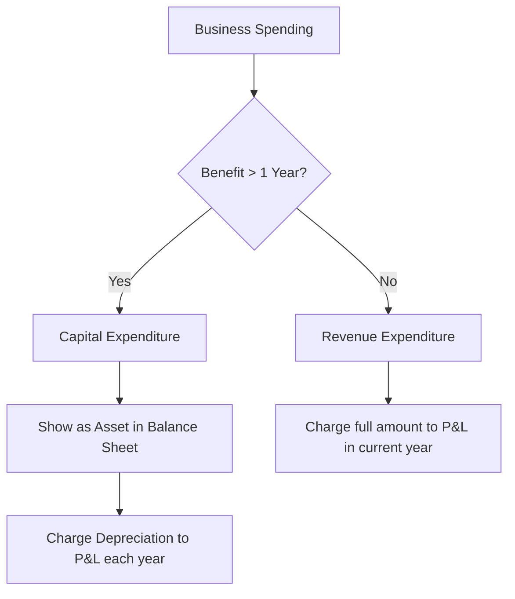

# 02 Expenses Revenue capital Exp

## 1. Definition

**Revenue** is the gross inflow of economic benefits arising from the ordinary activities of a business, such as sales of goods, fees for services, or rental income. It increases owner’s equity.

**Expenses** are the costs incurred in earning revenue. They represent the outflow of resources that reduce owner’s equity during an accounting period.

**Capital Expenditure (CapEx)** is money spent by a business to acquire, upgrade, or maintain long‑term assets like machinery, buildings, or vehicles. It provides benefits over many years.

**Revenue Expenditure (RevEx)** is the spending on day‑to‑day operations and maintenance that keeps the business running. Its benefit is consumed within the current accounting year.

## 2. Concept Explanation

Every business needs to spend money to earn money. Understanding where that money goes and how to record it is critical. A business buys raw material, pays wages, rents a factory, and purchases machines. These outflows are all expenses, but they are treated differently in the financial statements.

The basic idea is simple. If an item will help the business earn for several years, it is a capital expenditure. The cost is written off gradually as depreciation. If the benefit is used up in less than a year, it is a revenue expenditure and is fully charged to the income statement in that same year. This classification directly affects profit, tax, and the valuation of assets.

How it works: Suppose a workshop buys a new lathe machine (benefit for 10 years) – that is a capital expenditure. It is recorded as an asset. The wages paid to the operator each month are revenue expenditure. If the owner mixes them up – for example, treating the machine as a revenue expense – profit will be understated in the first year and assets under‑reported. Lenders and tax authorities rely on proper classification.

Why it is important: For diploma‑level entrepreneurs, knowing the difference helps in preparing accurate financial statements, computing correct taxes, and presenting a realistic picture to banks and investors. It also helps in project costing, break‑even analysis, and working capital estimation.

## 3. Key Characteristics / Features

- **Revenue is recognised when earned**, not necessarily when cash is received (accrual basis).
- **Expenses are matched with revenue** of the same period to show the true profit.
- **Capital expenditure appears on the balance sheet** as an asset and is depreciated over its useful life.
- **Revenue expenditure appears in the income statement** (Profit & Loss A/c) and reduces the current year’s profit.
- **Capital expenditure increases the earning capacity** or extends the life of an asset.
- **Revenue expenditure maintains the existing earning capacity** without creating a new asset.
- **The amount of capital expenditure is usually large** and non‑recurring, while revenue expenditure is smaller and recurring.

## 4. Types / Classification

These expenses can be classified broadly.

- **Capital Expenditure (CapEx):**
  - *Acquisition of fixed assets:* Buying land, buildings, machinery, vehicles, furniture.
  - *Installation and erection charges:* Costs to bring the asset to working condition.
  - *Major overhauls and additions:* Extending a factory shed, adding a floor, re‑engineering a machine to increase capacity.
  - *Legal fees for acquiring property:* Expenses related to the purchase of long‑term assets.

- **Revenue Expenditure (RevEx):**
  - *Operating expenses:* Rent, electricity, insurance, fuel, office supplies.
  - *Repairs and maintenance:* Routine servicing of machinery, painting the office.
  - *Selling expenses:* Advertising, commissions, delivery costs.
  - *Administrative expenses:* Salaries, telephone bills, stationery.
  - *Finance costs:* Interest on short‑term loans (interest on a term loan for asset acquisition may be capitalised till the asset is ready, otherwise it is revenue).

- **Deferred Revenue Expenditure (special type):**
  Some heavy promotional or preliminary expenses that are expected to yield benefit over a few years (e.g., heavy advertisement campaign for a new brand) may be spread over a few years but are not capital assets.

## 5. Working / Mechanism

The process of classifying an expenditure is logical.

1.  **Assess the purpose of the spending:** Ask what the money was used for – buying an asset, maintaining an asset, or running daily business.
2.  **Determine the period of benefit:** If the benefit will last more than one accounting year, it is likely capital. If it is consumed within the year, it is revenue.
3.  **Check whether a new asset is created or an existing one is improved:** Building a new delivery van is capital; fixing its punctured tyre is revenue.
4.  **Apply the materiality concept:** If an amount is very small, even if technically a capital item (like a ₹500 calculator), it may be treated as revenue for simplicity, though the principle would class it as capital.
5.  **Record the transaction:** For capital expenditure, debit the relevant asset account. For revenue expenditure, debit the appropriate expense account in the income statement.
6.  **Ensure matching:** At year‑end, revenue expenditure is totally set against revenue. For capital expenditure, only the depreciation of that year is charged against revenue.
7.  **Review for tax implications:** Tax laws often define rules for depreciation and capitalisation; adherence ensures correct tax liability.

## 6. Diagram

## 7. Mathematical Formulation

Profit calculation is directly linked to the classification:

$$
\text{Net Profit} = \text{Revenue} - (\text{Revenue Expenditure} + \text{Depreciation})
$$

Where Depreciation is the portion of capital expenditure allocated to that year. If a capital expenditure is wrongly charged fully as revenue expense, profit is understated.

Break‑even point also uses fixed costs (which include depreciation of capital assets) and variable costs (revenue expenses like raw material and hourly wages).

The cost of an asset for capital expenditure calculation includes all costs to make it ready:

$$
\text{Capital Cost} = \text{Purchase Price} + \text{Transport} + \text{Installation} + \text{Non‑refundable Taxes}
$$

## 8. Example

A diploma holder starts a welding workshop. He spends:

- ₹2,00,000 to buy a new welding machine (life 8 years).
- ₹500 for a routine service of an old drill machine.
- ₹15,000 on welding rods, electricity, and monthly wages.

**Classification:**
- Welding machine: **Capital Expenditure**. It will be depreciated, say ₹25,000 per year.
- Old machine service: **Revenue Expenditure** (repair).
- Consumables and wages: **Revenue Expenditure**.

If the entire ₹2,00,000 were wrongly shown as revenue expense, the first‑year profit would be much lower, which could make the bank think the business is unprofitable. Proper classification shows the true earning picture.

## 9. Analogy

Imagine you buy a house. The purchase price of the house is like a capital expenditure – you record it as an asset and it stays for years. The monthly expense on groceries, water, and cleaning is like revenue expenditure – it is consumed immediately and you never see it again as an asset. If you start calling your lifetime house cost a monthly “grocery” expense, your household budget would look completely wrong. Similarly, in business, mixing up capital and revenue spending distorts the financial health.

## 10. Comparison

| Feature | Capital Expenditure | Revenue Expenditure |
|--------|---------------------|---------------------|
| **Purpose** | To acquire or improve fixed assets | To run day‑to‑day operations |
| **Duration of benefit** | Long term (more than one year) | Short term (consumed within the year) |
| **Accounting treatment** | Shown as an asset in the balance sheet, depreciated over life | Charged fully to the Profit & Loss Account |
| **Effect on profit** | Not fully charged in the year of purchase; only depreciation | Entire amount reduces current year profit |
| **Recurrence** | Usually non‑recurring, large amount | Recurring, generally smaller amounts |
| **Examples** | Buying a lathe, building a shed, acquiring a patent | Rent, salaries, raw materials, repair of machinery |

## 11. Advantages

- **True financial picture:** Proper classification ensures balance sheet and profit & loss account reflect reality.
- **Correct tax calculation:** Tax laws allow depreciation on capital assets but revenue expenses are fully deductible in the year; mistake leads to wrong tax payment.
- **Better cost control:** Separating maintenance (revenue) from asset addition (capital) highlights where money is being spent unproductively.
- **Informed decision making:** Knowing which expenditures build long‑term capacity helps in budgeting and investment planning.
- **Investor and lender confidence:** Properly maintained accounts as per accounting standards build credibility.
- **Compliance with legal requirements:** The Companies Act and income tax rules require correct classification.

## 12. Disadvantages / Limitations

- **Borderline cases create confusion:** Some expenditures like major engine overhaul may be revenue or capital depending on interpretation.
- **Subjectivity:** What is “material” and what is “routine” can differ from person to person, leading to inconsistent treatment.
- **Accounting standards complexity:** Detailed rules (AS‑10, Ind AS 16) may be hard for a small entrepreneur to follow without expert help.
- **Tax treatment differences:** Tax depreciation rules may differ from accounting depreciation, requiring separate records.
- **Manipulation possibility:** Classifying a revenue expense as capital artificially inflates profit and asset value, which can mislead stakeholders.

## 13. Important Points / Exam Notes

- Revenue = income from normal operations. Expense = cost to earn that income.
- Capital expenditure = money spent on fixed assets or their improvement; shown on the balance sheet.
- Revenue expenditure = routine spending for operations; charged to Profit & Loss account.
- Deferred revenue expenditure is a special category; heavy initial promotional cost spread over few years.
- All costs incurred to bring an asset to its working condition (including installation, carriage) are capitalised.
- Interest on loans taken to acquire fixed assets is capitalised till the asset is ready for use, thereafter revenue.
- Repair vs. replacement: normal repair is revenue; replacing a major part that extends life significantly may be capital.
- Depreciation is the systematic allocation of capital expenditure over its useful life.
- Financial statements are meaningless if expenses are misclassified.
- An entrepreneur must keep original bills and invoices to prove the nature of expenditure.

## 14. Applications / Use Cases

- **Project report preparation:** Loan applications require a clear split of fixed capital (capital expenditure) and working capital (revenue expenses in initial months).
- **Tax filing:** A sole proprietor running a fabrication unit deducts wages and electricity as revenue expenses while claiming depreciation on the welding set.
- **Cost estimation for quoting:** A contractor classifies concrete mixer rental as revenue and purchase of a new mixer as capital while computing tender price.
- **Break‑even analysis:** The fixed cost component includes depreciation (on capital assets); variable cost includes revenue expenses like fuel.
- **Business valuation:** When selling a business, fixed assets are valued separately from ongoing revenue‑generating ability; correct classification creates a clean record.

## 15. MCQs

**Q1. Which of the following is a capital expenditure?**

A. Payment for monthly rent  
B. Purchase of raw material  
C. Payment for a new delivery van  
D. Electric bill for the factory  

**Answer:** C  
**Explanation:** A van is a long‑term asset; its benefit lasts many years.

---

**Q2. Revenue expenditure is charged to the**

A. Balance sheet  
B. Profit & Loss Account  
C. Fixed Asset Register  
D. Cash Book only  

**Answer:** B  
**Explanation:** Revenue expenses are matched against revenue in the income statement.

---

**Q3. If a business pays ₹20,000 for a complete engine overhaul that extends the life of a machine by five years, this is**

A. Revenue Expenditure  
B. Deferred Revenue Expenditure  
C. Capital Expenditure  
D. None of the above  

**Answer:** C  
**Explanation:** Major overhaul that extends useful life is capitalised.

---

**Q4. Depreciation is the process of allocating**

A. Revenue expenditure over many years  
B. Capital expenditure over the useful life of the asset  
C. Cash payments to suppliers  
D. Owner’s personal expenses  

**Answer:** B  
**Explanation:** Capitalised costs are gradually written off through depreciation.

---

**Q5. Which of the following is a revenue expenditure?**

A. Factory extension cost  
B. Registration fees of a new trademark  
C. Annual insurance premium of the factory  
D. Purchase price of furniture  

**Answer:** C  
**Explanation:** Insurance is a recurring, short‑term operating expense.

---

**Q6. All expenses related to the acquisition of a fixed asset, like transport and installation, are**

A. Treated as revenue expenses  
B. Added to the cost of the asset (capitalised)  
C. Ignored completely  
D. Shown as loans  

**Answer:** B  
**Explanation:** Every cost necessary to bring the asset to working condition is part of its capital cost.

---

**Q7. Salaries paid to office staff is an example of**

A. Capital Expenditure  
B. Deferred Revenue Expenditure  
C. Revenue Expenditure  
D. Deferred Capital Expenditure  

**Answer:** C  
**Explanation:** Salaries are a routine operating expense.

---

**Q8. Treating a revenue expense as capital expenditure will result in**

A. Overstating profit and assets  
B. Understating profit and assets  
C. No effect on financial statements  
D. Decreasing taxes only  

**Answer:** A  
**Explanation:** Expense not charged fully reduces expenses in P&L, raising profit, and the item appears as an asset on the balance sheet.

---

**Q9. The monthly payment for a leased photocopier used in the office is a**

A. Capital Expenditure  
B. Revenue Expenditure  
C. Investment  
D. Personal expense  

**Answer:** B  
**Explanation:** Leasing payments are operating expenses unless they are a finance lease where ownership transfers.

---

**Q10. A start‑up entrepreneur using a government scheme purchases a generator set. In her project report, the generator set cost is shown under**

A. Working Capital  
B. Revenue Expenditure  
C. Fixed Capital (Capital Expenditure)  
D. Contingency  

**Answer:** C  
**Explanation:** Generator is a long‑term asset, part of the project’s fixed capital.