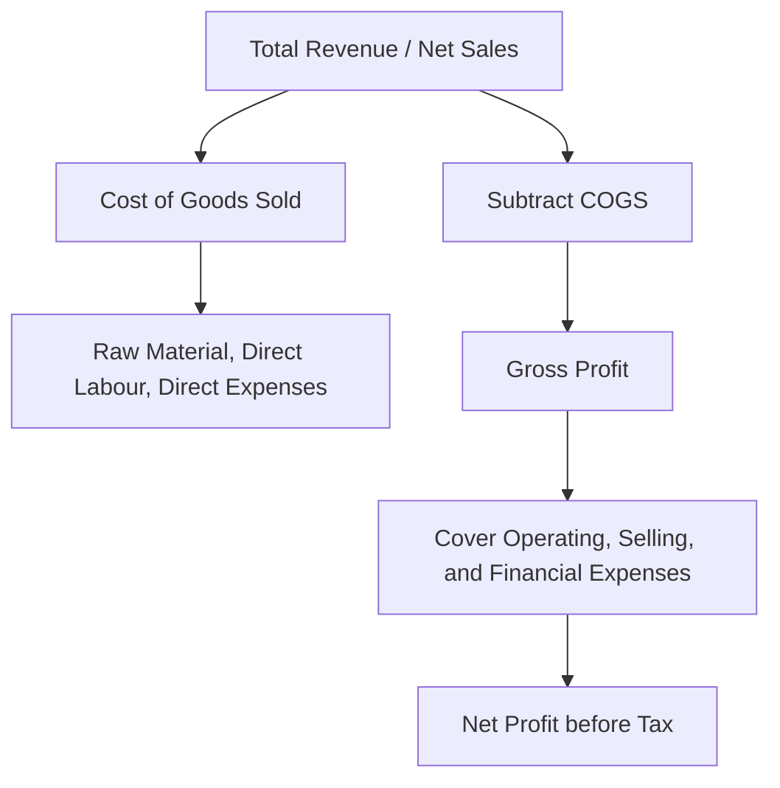

# Gross Profit

## 1. Definition

Gross profit is the residual income a business earns after deducting the direct costs of producing or purchasing the goods it sells. It is calculated as total revenue from sales minus the cost of goods sold (COGS). It shows how efficiently a business produces and prices its core products before considering indirect expenses.

## 2. Concept Explanation

Every business that sells goods must first spend money to make or buy them. Gross profit looks only at this core relationship. It answers a simple question: Does the selling price cover the direct cost of making the product, and if so, by how much?

The basic idea is to separate production and purchasing efficiency from other operating activities. Revenue from selling a product is recorded. From this, we subtract all costs directly tied to those sales, such as raw material, factory labour, and manufacturing overheads. The difference is the gross profit. If this number is small or negative, the business cannot survive because it means the product itself loses money before even considering rent, office salaries, or advertising.

Why it is important: Gross profit reveals the fundamental earning power of a company’s core products. It is the first critical checkpoint on the income statement. A decline in gross profit margin signals rising production costs or falling selling prices, prompting management action. It is essential for pricing decisions, production planning, and evaluating business health. Investors and lenders closely watch gross profit to judge a company’s ability to cover operating expenses and generate net profit.

## 3. Key Characteristics / Features

- **Focus on Direct Costs:** Gross profit only accounts for expenses that change directly with production or purchase volumes, such as materials and direct labour.
- **First Stage of Profitability:** It is the initial profit figure on the income statement, before deducting selling, administrative, and financial costs.
- **Indicator of Production Efficiency:** A higher gross profit (relative to sales) indicates the company is managing its manufacturing or procurement costs well.
- **Basis for Gross Profit Margin:** Gross profit is often expressed as a percentage of revenue, allowing comparison across periods and with competitors.
- **Affected by Price and Cost:** Any change in the selling price, raw material cost, or production process directly impacts gross profit.

## 4. Types / Classification

Not applicable for this topic. Gross profit itself is a distinct accounting figure, not further classified into subtypes.

## 5. Working / Mechanism

The calculation and use of gross profit follow a clear, step-by-step process.

1.  Identify the total revenue earned from selling goods or services during a specific period.
2.  Identify all direct costs that can be traced to those goods sold. This is the Cost of Goods Sold (COGS).
3.  COGS includes the opening stock value, purchases, direct wages, factory power, and freight, minus the closing stock.
4.  Subtract COGS from the total revenue.
5.  The resulting figure is the gross profit.
6.  Calculate the gross profit margin: `(Gross Profit / Revenue) × 100`.
7.  Compare this margin against previous periods and industry benchmarks to assess cost control and pricing power.
8.  The remainder of the income statement then uses gross profit to cover operating expenses, interest, and taxes to arrive at net profit.

## 6. Diagram

## 7. Mathematical Formulation

The formula for gross profit is straightforward.

$$
\text{Gross Profit} = \text{Net Sales} - \text{Cost of Goods Sold (COGS)}
$$

Expanding the COGS:

$$
\text{COGS} = \text{Opening Stock} + \text{Purchases} + \text{Direct Expenses} - \text{Closing Stock}
$$

Where:
- **Net Sales** = Total revenue from sales minus returns and discounts.
- **Opening Stock** = Value of unsold goods at the beginning of the period.
- **Purchases** = Cost of new goods bought or manufactured during the period.
- **Direct Expenses** = Costs like factory wages, power, and freight directly attributed to production.
- **Closing Stock** = Value of goods remaining unsold at the end of the period.

The Gross Profit Margin is computed as:

$$
\text{Gross Profit Margin (\%)} = \left( \frac{\text{Gross Profit}}{\text{Net Sales}} \right) \times 100
$$

## 8. Example

Priya runs a small business making cloth bags. In one month, her records show:
- Net sales from selling 1000 bags: ₹2,00,000.
- Opening stock of cloth and unfinished bags: ₹15,000.
- Cloth purchases during the month: ₹80,000.
- Salary for tailoring labour: ₹30,000.
- Electricity and machine thread: ₹5,000.
- Closing stock of unused cloth: ₹10,000.

First, calculate COGS:
COGS = 15,000 + 80,000 + 30,000 + 5,000 – 10,000 = ₹1,20,000.

Then, Gross Profit = 2,00,000 – 1,20,000 = ₹80,000.
Gross Profit Margin = (80,000 / 2,00,000) × 100 = 40%.

This means for every ₹100 of sales, Priya retains ₹40 to cover her shop rent, marketing, and her own profit.

## 9. Analogy

Think of a fruit vendor. The vendor buys a basket of mangoes for ₹500. He sells them all for ₹800. The ₹300 difference is his gross profit — it shows how well he bought and sold the fruit. If he had to pay a helper to carry the basket and a storage fee, those are direct costs and reduce his gross profit further. After he pays for his bicycle rent and his own lunch, whatever remains is his net profit. The gross profit is purely about the mango business, nothing else.

## 10. Comparison

| Feature | Gross Profit | Net Profit |
|--------|-------------|------------|
| Meaning | Profit after subtracting direct costs of production | Profit left after subtracting all operating, financial, and tax expenses |
| Costs Considered | Only cost of goods sold (direct materials, labour, manufacturing overheads) | All expenses, including rent, salaries, advertising, interest, and taxes |
| Location in Income Statement | First profit line item | Bottom line, last profit figure |
| Indicates | Production and pricing efficiency | Overall business health and shareholder returns |

## 11. Advantages

- It reveals how efficiently a company manages its core production or procurement costs.
- It helps in setting and adjusting selling prices to maintain profitability.
- The gross profit margin allows quick comparison across different sizes of businesses within the same industry.
- A steady or growing gross profit trend signals pricing power and cost control to investors and lenders.
- It isolates product-level problems; if gross profit falls, management knows the issue lies in production or sales price, not in office overheads.

## 12. Disadvantages / Limitations

- It does not reflect the impact of operating expenses like sales commissions, rent, or management salaries; a healthy gross profit can still result in a net loss.
- It can be misleading if a company arbitrarily classifies some costs as indirect to artificially inflate gross profit.
- Service businesses often have difficulty computing a clear gross profit because the "direct cost of service" is less defined.
- Comparing gross profit margins across industries is meaningless because margins differ vastly, e.g., jewellery versus groceries.
- Inventory valuation methods (FIFO, LIFO, weighted average) can change COGS and thus gross profit, reducing comparability.

## 13. Important Points / Exam Notes

- Gross Profit = Net Sales – Cost of Goods Sold (COGS).
- COGS = Opening Stock + Purchases + Direct Expenses – Closing Stock.
- Gross Profit Margin = (Gross Profit / Net Sales) × 100.
- Gross profit is the first indicator of a company's production efficiency and pricing strategy.
- It is called "gross" because it is before deducting indirect expenses like office rent, selling expenses, and interest.
- A high gross profit margin is generally desired, but the benchmark varies by industry.

## 14. Applications / Use Cases

- **Pricing Decisions:** A bakery uses its gross profit per loaf to decide if a price increase is needed to cover rising flour costs.
- **Loan Appraisals:** Banks examine gross profit trends to check if a small manufacturing unit generates enough to repay a term loan.
- **Inventory Management:** A retail store monitors gross profit monthly; a sudden drop may indicate theft, wastage, or a need to renegotiate supplier contracts.
- **Investor Analysis:** Equity investors track gross profit margins of a company over quarters to detect early signs of competitive pressure.
- **Product Line Profitability:** A company with multiple products uses gross profit to identify which items are stars and which are losers, aiding in discontinuing unprofitable lines.

## 15. MCQs

**Q1. Gross profit is calculated by deducting which cost from net sales?**

A. Administrative expenses  
B. Cost of goods sold  
C. Interest on loans  
D. Income tax  
**Answer:** B  
**Explanation:** Gross profit looks only at the direct costs tied to production, contained in the Cost of Goods Sold.

**Q2. If net sales are ₹5,00,000 and COGS is ₹3,00,000, what is the gross profit?**

A. ₹2,00,000  
B. ₹1,00,000  
C. ₹5,00,000  
D. ₹8,00,000  
**Answer:** A  
**Explanation:** Gross Profit = 5,00,000 – 3,00,000 = ₹2,00,000.

**Q3. Which of the following is included in the Cost of Goods Sold?**

A. Office stationery expenses  
B. Advertising costs  
C. Raw material consumed  
D. CEO's salary  
**Answer:** C  
**Explanation:** Raw material is a direct production cost and is part of COGS; the other items are operating expenses.

**Q4. Gross profit margin is computed as:**

A. (Net Profit / Sales) × 100  
B. (Gross Profit / Sales) × 100  
C. (COGS / Sales) × 100  
D. (Sales / Gross Profit) × 100  
**Answer:** B  
**Explanation:** The margin expresses gross profit as a percentage of net sales to measure pricing efficiency.

**Q5. A high gross profit margin indicates that the business is:**

A. Spending too much on advertising  
B. Efficient in managing production costs or commanding a good price  
C. Paying high taxes  
D. Incurring huge office rent  
**Answer:** B  
**Explanation:** A high margin shows that a larger portion of sales revenue remains after covering direct manufacturing costs.

**Q6. Which of the following is NOT subtracted while calculating gross profit?**

A. Direct labour wages  
B. Factory power and fuel  
C. Office rent  
D. Freight on raw material  
**Answer:** C  
**Explanation:** Office rent is an indirect operating expense subtracted later to arrive at net profit, not gross profit.

**Q7. The formula for COGS is:**

A. Opening Stock + Purchases - Direct Expenses + Closing Stock  
B. Opening Stock + Purchases + Direct Expenses - Closing Stock  
C. Sales - Opening Stock  
D. Purchases + Closing Stock  
**Answer:** B  
**Explanation:** COGS = Opening Stock + Purchases + Direct Expenses – Closing Stock.

**Q8. A company's gross profit is ₹80,000 and its net sales are ₹4,00,000. Its gross profit margin is:**

A. 10%  
B. 20%  
C. 5%  
D. 50%  
**Answer:** B  
**Explanation:** Margin = (80,000 / 4,00,000) × 100 = 20%.

**Q9. Why is gross profit called "gross"?**

A. It represents total income from all sources  
B. It is the profit before deducting indirect operating expenses  
C. It is the final profit distributed to shareholders  
D. It is calculated after paying income tax  
**Answer:** B  
**Explanation:** "Gross" indicates that this profit is yet to be reduced by operating, administrative, and financial costs.

**Q10. A grocery store's gross profit margin declined from 25% to 18%. What could be a likely reason?**

A. A decrease in shop rent  
B. An increase in the supplier's purchase price without a corresponding increase in selling price  
C. A reduction in electricity bill  
D. Improved employee productivity  
**Answer:** B  
**Explanation:** If the cost of goods rises and the store does not raise its selling price proportionally, gross profit margin shrinks.