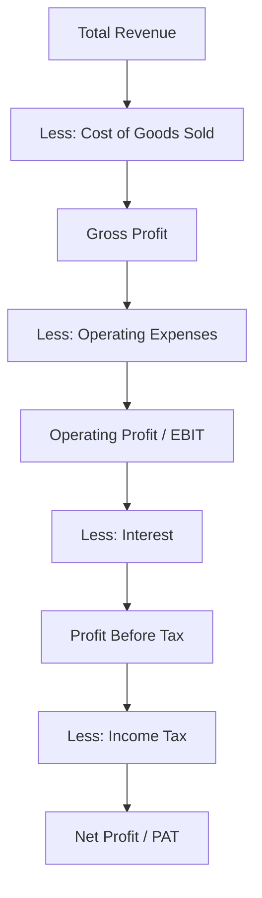

# Net Profit

## Video Explanation

* [https://www.youtube.com/watch?v=2q3K5xX0WmE](https://www.youtube.com/watch?v=2q3K5xX0WmE)

## Visual Aids

## 1. Definition

Net profit is the final profit earned by a business after all operating costs, interest, taxes, and other expenses have been deducted from total revenue. It is the amount that truly belongs to the owners and is often called the bottom line.

---

## 2. Concept Explanation

**Basic idea:** Net profit tells you how much money a business actually made after paying every single bill. While revenue shows the total sales, net profit reveals what is left to reinvest or distribute to owners.

**How it works:** The income statement starts with total revenue at the top. From that, the cost of goods sold (direct costs) is subtracted to get gross profit. Then all indirect operating expenses (salaries, rent, electricity) are deducted to arrive at operating profit. Interest on loans is taken away to find profit before tax, and finally income tax is paid. The remaining amount is net profit.

**Why it is important:** Net profit is the ultimate measure of a business’s financial success. It determines whether the venture is sustainable, supports dividend payments, attracts investors, and influences loan approvals. Even a company with high revenue can fail if net profit is consistently negative.

---

## 3. Key Characteristics / Features

- **Bottom line:** It appears as the last line of the income statement, summarizing the final financial result.
- **Comprehensive measure:** It accounts for all costs – direct, operating, financial, and statutory.
- **Owner’s reward:** Net profit belongs to the shareholders; it can be kept in the business (retained earnings) or distributed as dividends.
- **Performance indicator:** It reflects both the efficiency of operations and the impact of financial structure and tax planning.
- **Not the same as cash:** Non‑cash expenses like depreciation and amortization are already deducted, so net profit does not equal cash in the bank.
- **Absolute figure:** It is expressed in rupees (or other currency), showing the actual monetary gain for the period.

---

## 4. Types / Classification

Based on the stages leading to net profit, we classify profit as:

- **Gross Profit:** Total revenue minus cost of goods sold. Indicates production and trading efficiency.
- **Operating Profit (EBIT):** Gross profit minus operating expenses like salary, rent, and depreciation. Reflects core business performance.
- **Profit Before Tax (PBT):** Operating profit minus interest expense. Shows profit before meeting tax liability.
- **Net Profit (PAT):** Profit Before Tax minus income tax. This is the final profit available to equity shareholders.

For financial reporting, net profit can also be split into:
- **Net profit before exceptional items:** Excludes one‑time gains or losses for a clearer picture.
- **Net profit after tax (PAT):** The standard bottom line, including all items.

---

## 5. Working / Mechanism

The calculation of net profit follows a clear step‑by‑step deduction:

1. Record total revenue from operating activities (sales) and non‑operating sources (interest, rent).
2. Subtract the cost of goods sold (raw material, direct labour, direct manufacturing expenses) to obtain **Gross Profit**.
3. From Gross Profit, deduct all operating expenses such as salaries, rent, electricity, depreciation, advertising, and administrative costs. The result is **Operating Profit (EBIT)**.
4. Subtract interest paid on loans and borrowings from Operating Profit to get **Profit Before Tax (PBT)**.
5. Deduct the provision for income tax as per applicable rates to arrive at **Net Profit (Profit After Tax – PAT)**.
6. The net profit is then transferred to the retained earnings reserve on the balance sheet or partly paid out as dividends.

---

## 6. Diagram

---

## 7. Mathematical Formulation

The general formula for net profit is:

$$
\text{Net Profit} = \text{Total Revenue} - (\text{Cost of Goods Sold} + \text{Operating Expenses} + \text{Interest} + \text{Tax})
$$

Alternatively, stepwise:

$$
\text{Net Profit} = \text{Sales} - \text{COGS} - \text{Opex} - \text{Interest} - \text{Tax}
$$

Where:  
- **Sales (Revenue)** = Gross inflow from customers.  
- **COGS (Cost of Goods Sold)** = Direct cost of production.  
- **Opex (Operating Expenses)** = Indirect costs like rent, salaries, depreciation.  
- **Interest** = Cost of borrowed funds.  
- **Tax** = Income tax provision.

---

## 8. Example

**"StyleHub"** is a small clothing boutique. Its monthly financials are:

- Total revenue from sales: ₹2,50,000  
- Cost of goods sold (clothing purchase): ₹1,00,000  
- Shop rent, electricity, and other operating costs: ₹60,000  
- Interest on a small business loan: ₹5,000  
- Income tax provision: ₹12,000  

Calculation:  
Gross Profit = ₹2,50,000 – ₹1,00,000 = ₹1,50,000  
Operating Profit = ₹1,50,000 – ₹60,000 = ₹90,000  
Profit Before Tax = ₹90,000 – ₹5,000 = ₹85,000  
Net Profit = ₹85,000 – ₹12,000 = ₹73,000  

Thus, StyleHub’s bottom line net profit for the month is ₹73,000.

---

## 9. Analogy

Consider your monthly salary. Your gross salary is like revenue. From that, various deductions are made: provident fund, professional tax, loan EMI, and insurance premiums. The amount that is finally credited to your bank account is like net profit. Even though your gross salary is high, what matters for your daily expenses is the net take‑home amount. Similarly, a business may boast huge sales, but its real health is seen in net profit.

---

## 10. Comparison (Net Profit vs. Gross Profit)

| Feature | Gross Profit | Net Profit |
|--------|--------------|------------|
| Meaning | Sales minus direct cost of goods sold | Sales minus all expenses, including indirect costs, interest, and taxes |
| Position in income statement | Appears after COGS | Appears as the last line |
| Scope | Narrow – reflects production efficiency | Comprehensive – reflects overall profitability |
| Includes | Only direct costs | Direct costs, operating expenses, interest, tax |
| Use | Pricing decisions, production analysis | Dividend payout, reinvestment, valuation, performance bonus |

---

## 11. Advantages

- It gives the true picture of a company’s ability to generate surplus after meeting all obligations.
- Investors and lenders rely on net profit to assess financial strength and decide on funding.
- Net profit serves as the base for key ratios like earnings per share (EPS) and return on equity (ROE).
- Management can decide on bonuses, expansion, and dividends based on the net profit figure.
- A consistent upward trend in net profit signals a sustainable and growing business.

---

## 12. Disadvantages / Limitations

- Net profit can be influenced by accounting policies (depreciation method, inventory valuation) making comparisons tricky.
- It includes non‑cash items like depreciation, so it does not reflect immediate cash availability.
- One‑time gains or losses (sale of assets, write‑offs) can distort the operating reality.
- Tax rates change, affecting year‑on‑year comparability of net profit.
- High net profit does not guarantee a healthy cash flow if working capital is mismanaged.

---

## 13. Important Points / Exam Notes

- Net profit = Total Revenue – All Expenses (including tax). It is the “bottom line”.
- Also called Profit After Tax (PAT).
- The income statement sequence: Revenue → COGS → Gross Profit → Operating Expenses → Operating Profit → Interest → Profit Before Tax → Tax → Net Profit.
- Net profit belongs to shareholders; it can be retained or distributed as dividends.
- Net profit margin = (Net Profit / Revenue) × 100%.
- It is a key indicator for valuation, credit rating, and financial health.
- Unlike gross profit, it accounts for office, selling, financial, and tax costs.

---

## 14. Applications / Use Cases

- **Investor decision‑making:** Shareholders examine net profit growth before buying or holding shares.
- **Bank loan appraisal:** Banks assess whether net profit is sufficient to service additional debt.
- **Performance bonuses:** Companies often link management bonuses to net profit targets.
- **Business valuation:** Analysts use net profit to compute discounted cash flows and price‑earnings ratios.
- **Tax filing:** The starting point for corporate tax returns is the net profit as per the income statement.

---

## 15. MCQs

**Q1. Net profit is also known as:**  
A. Gross income  
B. Top line  
C. Bottom line  
D. Operating revenue  
**Answer:** C  
**Explanation:** It appears at the bottom of the income statement, hence called the bottom line.

**Q2. Net profit is calculated by deducting which of the following from total revenue?**  
A. Only cost of goods sold  
B. Only operating expenses  
C. Only income tax  
D. All expenses including COGS, operating expenses, interest, and tax  
**Answer:** D  
**Explanation:** Net profit is the residual after removing every cost and statutory obligation.

**Q3. If Revenue = ₹5,00,000, COGS = ₹2,00,000, Operating expenses = ₹1,00,000, Interest = ₹20,000, Tax = ₹50,000, the net profit is:**  
A. ₹2,00,000  
B. ₹1,80,000  
C. ₹1,30,000  
D. ₹2,50,000  
**Answer:** C  
**Explanation:** Net profit = 5,00,000 – (2,00,000 + 1,00,000 + 20,000 + 50,000) = ₹1,30,000.

**Q4. Which profit figure is obtained after deducting operating expenses from gross profit?**  
A. Net profit  
B. Operating profit  
C. Profit before tax  
D. Revenue  
**Answer:** B  
**Explanation:** Operating profit (EBIT) = Gross profit – Operating expenses.

**Q5. Which of the following is TRUE about net profit?**  
A. It is always equal to cash in bank  
B. It includes only direct costs  
C. It is the profit after all deductions, available to owners  
D. It appears before deduction of income tax  
**Answer:** C  
**Explanation:** Net profit is the final owner’s earning after tax; it is not the same as cash.

**Q6. Non‑cash expenses like depreciation are deducted in arriving at net profit. This means net profit:**  
A. Overstates cash availability  
B. Understates cash availability  
C. Is equal to cash flow  
D. Is independent of depreciation  
**Answer:** A  
**Explanation:** Since depreciation is a non‑cash charge, net profit is lower than operating cash flow; it doesn’t mean that much cash has gone out.

**Q7. The net profit margin is calculated as:**  
A. (Net Profit / Total Assets) × 100  
B. (Net Profit / Revenue) × 100  
C. (Gross Profit / Revenue) × 100  
D. (Net Profit / Equity) × 100  
**Answer:** B  
**Explanation:** Net profit margin = (Net Profit ÷ Revenue) × 100; it shows what percentage of sales becomes profit.

**Q8. Which of the following can distort net profit comparison over years?**  
A. Constant tax rate  
B. Stable revenue  
C. One‑time gains from asset sale  
D. Regular salary payments  
**Answer:** C  
**Explanation:** Exceptional or one‑time items inflate or deflate net profit, affecting trend analysis.

**Q9. Profit Before Tax (PBT) minus income tax equals:**  
A. Operating profit  
B. Gross profit  
C. Net profit  
D. Retained earnings  
**Answer:** C  
**Explanation:** Net profit = PBT – Tax. It is the final amount transferred to the balance sheet.

**Q10. For a lender assessing a loan application, the most important profit figure is:**  
A. Gross profit  
B. Operating profit  
C. Net profit  
D. Total revenue  
**Answer:** C  
**Explanation:** Lenders look at net profit because it shows the surplus available after all payments, indicating repayment capacity.