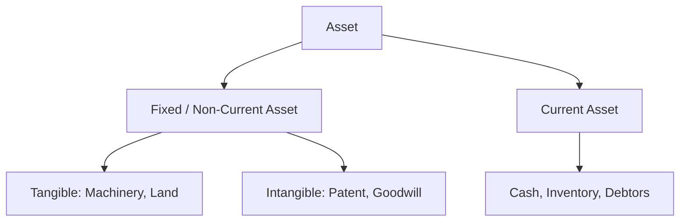

# 05 Asset

## 1. Definition

An asset is a resource owned or controlled by a business that has economic value and is expected to provide future benefits. In simple terms, assets are what a business owns or has the right to use that will help it earn money in the future.

## 2. Concept Explanation

Every business needs something to start and run its operations. Those ‘somethings’ are called assets. They can be physical items like a machine or a building, or they can be non‑physical like a brand name or a legal right.

The basic idea is that assets are the resources that a company uses to produce goods or services, generate sales, and ultimately make a profit. How it works: when an entrepreneur spends money to acquire something that will be useful beyond the current year, that spending is not treated as an immediate expense. Instead, it is recorded as an asset on the balance sheet. Over time, as the asset is used up, its cost is gradually charged as depreciation or amortisation.

Why it is important: Assets show what a business is worth and how much it can produce. Banks, investors, and even the entrepreneur look at assets to judge financial health. A good project report must clearly list all assets and their values. Without understanding assets, an entrepreneur cannot compute proper depreciation, ask for the right loan amount, or evaluate the real value of the business.

## 3. Key Characteristics / Features

- **Owned or controlled by the business:** The business must have legal ownership or the right to use the resource.
- **Future economic benefit:** An asset must generate cash, reduce expenses, or improve sales in the future.
- **Measurable in monetary terms:** The value can be expressed reliably in rupees.
- **Result of a past transaction:** An asset exists because the business already bought or created it; a promise to buy something is not yet an asset.
- **Used over a period of time:** Assets provide benefits for more than one accounting year (long‑term) or within a year (short‑term).
- **Shown on the balance sheet:** All assets appear on one side of the balance sheet, representing what the business holds.

## 4. Types / Classification

Assets are broadly classified into several categories based on their nature and holding period.

- **Non‑current assets (Fixed Assets):**
  - Tangible fixed assets: land, buildings, machinery, furniture, vehicles.
  - Intangible fixed assets: patents, trademarks, copyrights, goodwill, software.
  - Long‑term investments: fixed deposits with banks for more than a year, shares of another company held for long term.

- **Current assets:**
  - Cash and bank balances: cash in hand, current account balance.
  - Inventory: raw materials, work‑in‑progress, finished goods.
  - Trade receivables (debtors): money customers owe for sales on credit.
  - Prepaid expenses: insurance paid in advance, rent paid in advance.

- **Fictitious assets (special case):** Expenses that are not realisable in cash but are shown as assets temporarily, like heavy advertisement expenditure that is written off over a few years.

- **Wasting assets:** Natural resources like mines, oil wells whose value reduces as extraction happens (shown under fixed assets but with depletion).

## 5. Working / Mechanism

Assets are recorded and managed through a clear process.

1.  **Identification:** The business acquires or creates an item that meets the asset definition (e.g., buying a printer).
2.  **Initial measurement:** Record the asset at its cost, which includes all costs to bring it to working condition (purchase price, transport, installation).
3.  **Classification:** Decide whether it is a current asset (will be used or converted to cash within 12 months) or a non‑current asset (benefit beyond 12 months).
4.  **Valuation and depreciation:** For fixed assets, the cost is systematically charged to the profit and loss account over its useful life as depreciation. Intangible assets are amortised.
5.  **Presentation in balance sheet:** Fixed assets and current assets are shown separately. Fixed assets are listed at net book value (original cost minus accumulated depreciation).
6.  **Revaluation or impairment (if needed):** If an asset loses value permanently, it is written down to its recoverable amount.
7.  **Disposal:** When an asset is sold or scrapped, it is removed from the books, and gain or loss is computed.

## 6. Diagram

## 7. Mathematical Formulation

The fundamental accounting equation ties assets to liabilities and equity:

$$
\text{Assets} = \text{Liabilities} + \text{Owner's Equity}
$$

For a fixed asset, the book value is:

$$
\text{Book Value} = \text{Cost of Asset} - \text{Accumulated Depreciation}
$$

Current assets are used in liquidity ratios:

$$
\text{Current Ratio} = \frac{\text{Current Assets}}{\text{Current Liabilities}}
$$

A healthy ratio (generally > 1.33:1) indicates that the business can meet its short‑term obligations.

## 8. Example

A diploma holder opens a small printing press. Her assets include:

- **Fixed Assets:** A digital printer costing ₹5,00,000, a binding machine ₹1,20,000, furniture ₹30,000, and design software (intangible) ₹40,000.
- **Current Assets:** Paper stock worth ₹70,000, ink and plates ₹20,000, cash in bank ₹50,000, and ₹35,000 due from a customer who ordered wedding cards.

On the balance sheet, the total fixed assets (after depreciation) are shown under non‑current assets. The ₹70,000 paper is inventory under current assets. The total of all assets gives the bank a clear idea of what she owns and supports her loan application.

## 9. Analogy

Think of assets like the tools and ingredients in a kitchen. The oven, refrigerator, mixer grinder are like fixed assets – they last many years and help prepare meals. The vegetables, spices, and milk in the fridge are current assets – they get used up quickly and need to be replaced. If you take stock of your kitchen, you list both the durable tools and the daily ingredients. A business balance sheet does the same: it lists long‑term earning tools and short‑term consumables as assets.

## 10. Comparison

| Feature | Fixed Assets | Current Assets |
|--------|-------------|----------------|
| **Time horizon** | Used for more than a year | Used or converted into cash within a year |
| **Purpose** | To produce goods/services | To support day‑to‑day operations |
| **Liquidity** | Not easily convertible to cash | Can be converted to cash quickly |
| **Depreciation** | Depreciated over useful life | Not depreciated; inventory is valued at cost or market price, debtors are collected |
| **Examples** | Plant and machinery, factory building | Stock of raw material, bank balance, trade receivables |

## 11. Advantages

- **Shows business strength:** A healthy asset base provides collateral for loans and builds investor confidence.
- **Generates revenue:** Fixed assets produce the goods; current assets fund daily sales.
- **Helps in financial planning:** Knowing asset values aids in calculating depreciation, insurance, and replacement needs.
- **Supports creditworthiness:** Lenders look at asset quality to decide loan eligibility and interest rates.
- **Valuation baseline:** If the entrepreneur wants to sell the business, assets form a major part of the selling price.
- **Tax benefit:** Depreciation on fixed assets reduces taxable income, improving cash flow.

## 12. Disadvantages / Limitations

- **Depreciation reduces value:** Fixed assets continuously lose book value even if physically in good condition.
- **Obsolete quickly:** Technology‑based assets like computers and software may become outdated faster than their accounting life.
- **Cash is tied up:** Too much money locked in fixed assets can strain working capital.
- **Inventory risk:** Current assets like stock may perish, become unsellable, or get stolen.
- **Valuation subjectivity:** Intangible assets like goodwill are difficult to value accurately and may not reflect real sale price.
- **False sense of wealth:** Assets shown in books may not fetch the same amount in a distress sale.

## 13. Important Points / Exam Notes

- An asset must have a future economic benefit and be a result of a past event.
- Assets are classified as non‑current (fixed) and current based on the period of benefit.
- Fixed assets are depreciated; current assets are consumed within an operating cycle.
- Intangible assets (patents, software) lack physical substance but have value.
- Fictitious assets are not realisable in cash; they represent accumulated expenses written off over time.
- The balance sheet equation: Assets = Liabilities + Capital.
- Net Book Value = Cost – Accumulated Depreciation.
- Current assets include cash, inventory, debtors, and prepaid expenses.
- Prepaid expenses (advance rent) are current assets because they give future benefit.
- A bank FDR with maturity > 1 year is a non‑current asset; if maturity < 1 year, it is a current asset.

## 14. Applications / Use Cases

- **Loan application:** A project report lists fixed assets as security; the bank provides a term loan based on the asset’s value.
- **Business valuation:** When a start‑up seeks investment, investors evaluate tangible assets (machines) and intangible assets (brand, technology).
- **Insurance claim:** The owner must declare asset values to insure against fire or theft.
- **Tax computation:** The depreciation schedule of fixed assets is a key attachment to income tax returns.
- **Internal performance review:** The manager checks inventory turnover and debtor collection to maintain current asset health.

## 15. MCQs

**Q1. Which of the following best defines an asset?**

A. A loan taken from a bank  
B. A resource controlled by the business that will bring future economic benefit  
C. An expense paid during the year  
D. The owner’s personal car  

**Answer:** B  
**Explanation:** Assets are resources expected to generate future income.

---

**Q2. Machinery used in a factory is classified as a**

A. Current asset  
B. Intangible fixed asset  
C. Tangible fixed asset  
D. Fictitious asset  

**Answer:** C  
**Explanation:** Machinery is a physical, long‑term asset.

---

**Q3. Which of the following is a current asset?**

A. Factory building  
B. Goodwill  
C. Stock of raw materials  
D. Office furniture  

**Answer:** C  
**Explanation:** Raw material is consumed or sold within an operating cycle.

---

**Q4. The book value of a fixed asset is equal to**

A. Its market price  
B. Cost minus accumulated depreciation  
C. Cost plus accumulated depreciation  
D. Cost at which it was purchased  

**Answer:** B  
**Explanation:** Book value = original cost – total depreciation charged till date.

---

**Q5. A patent held by a technology start‑up is an example of a**

A. Current tangible asset  
B. Wasting asset  
C. Intangible fixed asset  
D. Fictitious asset  

**Answer:** C  
**Explanation:** Patent has no physical form and gives long‑term rights.

---

**Q6. Which accounting equation includes assets?**

A. Assets = Liabilities – Capital  
B. Assets = Liabilities + Capital  
C. Assets = Liabilities × Capital  
D. Assets = Capital – Liabilities  

**Answer:** B  
**Explanation:** The basic equation balances what a business owns with what it owes and the owner’s stake.

---

**Q7. Prepaid insurance of ₹12,000 for the next year will appear as**

A. A liability  
B. A fixed asset  
C. A current asset  
D. An expense in next year’s books  

**Answer:** C  
**Explanation:** Prepaid expenses give benefit in future, so they are current assets.

---

**Q8. Which of the following is not an asset?**

A. Cash in bank  
B. Amount owed by customers  
C. Loan taken from a bank  
D. Delivery van  

**Answer:** C  
**Explanation:** A loan taken is a liability, not an asset.

---

**Q9. Fixed assets are shown in the balance sheet at**

A. Market value  
B. Replacement cost  
C. Net book value (cost less depreciation)  
D. Original cost forever  

**Answer:** C  
**Explanation:** They are shown at the written‑down value after depreciation.

---

**Q10. A small business owner buys a computer for ₹40,000 expecting to use it for 4 years. In the first year, the computer is a**

A. Current asset, fully charged as expense  
B. Fixed asset, partly expensed through depreciation  
C. Liability until fully paid  
D. Intangible asset  

**Answer:** B  
**Explanation:** The computer is a fixed asset; its cost is spread over its life as depreciation.