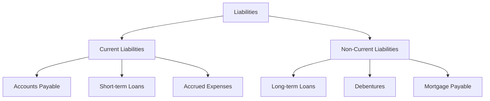

# Liability

## 1. Definition

A liability is a present obligation of a business arising from past events, the settlement of which is expected to result in an outflow of resources embodying economic benefits. In simple terms, it is what the business owes to outsiders, such as loans, bills to be paid, and amounts due to suppliers.

## 2. Concept Explanation

When a business starts or operates, it needs funds. Some funds come from the owner (equity), but often the business borrows money or buys goods on credit. These borrowings and credit purchases create obligations. Liabilities represent these obligations. The basic idea is that the business has a duty to pay money, provide services, or transfer assets to another party at a future date.

How it works: Every liability arises from a past transaction. For example, when a company purchases raw materials on credit, a liability called "accounts payable" is created. When a bank lends money, a "loan payable" is created. Liabilities are recorded on the right side of the balance sheet. As the business pays off these amounts, liabilities decrease. If liabilities are not managed properly, the business may face legal trouble or insolvency.

Why it is important: Understanding liabilities is crucial because they show how much the business relies on borrowed money versus owner's funds. Lenders and investors look at the level and type of liabilities to assess risk. A high level of liabilities might indicate financial stress, while a well-managed mix of debt can help the business grow. It is also essential for calculating net worth (Assets – Liabilities = Owner's Equity).

## 3. Key Characteristics / Features

- **Present Obligation:** The business has a current duty or responsibility that it cannot avoid. It is not a future or hypothetical commitment.
- **Result of Past Transactions:** The obligation has already been created by a past event, such as receiving a loan or purchasing an asset on credit.
- **Outflow of Resources Required:** Settlement will usually involve paying cash, transferring other assets, or providing services.
- **Measurable:** Liabilities are recorded at a specific monetary amount that can be reliably measured.
- **Classification by Maturity:** Liabilities are split into current (due within one year) and non-current (due after more than one year) to help assess short-term solvency.

## 4. Types / Classification

Liabilities are broadly classified into two main categories based on when they are due.

- **Current Liabilities:** These are obligations that are expected to be settled within the normal operating cycle of the business or within 12 months from the balance sheet date. Examples include:
    - *Accounts Payable (Creditors):* Amounts owed to suppliers for goods purchased on credit.
    - *Short-term Loans and Bank Overdrafts:* Borrowings repayable within a year.
    - *Accrued Expenses:* Expenses incurred but not yet paid, like wages payable or rent due.
    - *Current Portion of Long-term Debt:* The part of a long-term loan that must be repaid within the next year.
- **Non-Current Liabilities (Long-term Liabilities):** These are obligations not due for settlement within the next 12 months. Examples include:
    - *Long-term Bank Loans:* Loans taken for machinery or expansion, repayable over several years.
    - *Debentures:* Bonds issued by the company to raise long-term funds.
    - *Mortgages:* Loans secured against property, typically for the long term.

## 5. Working / Mechanism

The life cycle of a liability in financial statements follows a logical process.

1.  A transaction creates an obligation. For example, the business buys inventory on credit.
2.  The liability is recorded in the books at its original amount — accounts payable increases.
3.  The liability remains on the balance sheet until it is settled.
4.  When the due date arrives, the business makes payment.
5.  The cash or bank balance decreases, and the liability account is reduced by the same amount.
6.  For long-term loans, periodic repayments are split: the portion due within 12 months is reclassified as a current liability, while the remaining balance stays as non-current.
7.  At any point, the total liabilities are reported on the balance sheet, showing the business's total obligations to outsiders.

## 6. Diagram

## 7. Mathematical Formulation

The fundamental accounting equation shows the relationship between assets, liabilities, and equity.

$$
\text{Assets} = \text{Liabilities} + \text{Owner's Equity}
$$

Where:
- **Assets**: Everything the business owns (cash, inventory, machinery, etc.)
- **Liabilities**: Everything the business owes to outsiders.
- **Owner's Equity**: The owner's claim on the business assets after all liabilities are settled.

Rearranged, it shows that the owner's net worth is:

$$
\text{Owner's Equity} = \text{Assets} - \text{Liabilities}
$$

This highlights that liabilities reduce the residual value belonging to the owners.

## 8. Example

Rahul owns a small furniture workshop "Rahul Furnishers". On 31st March, the business records show:
- Bank loan for machinery: ₹5,00,000 (Repayable in 5 years, but ₹1,00,000 due within 12 months)
- Amount owed to wood supplier: ₹80,000
- Unpaid electricity bill: ₹5,000
- Unpaid wages to workers: ₹15,000

Classification:
- Current Liabilities: Supplier (₹80,000) + Electricity (₹5,000) + Wages (₹15,000) + Current portion of loan (₹1,00,000) = ₹2,00,000.
- Non-Current Liabilities: Remaining loan ₹4,00,000.
Total liabilities = ₹6,00,000. These are the obligations the business must settle in due course.

## 9. Analogy

Think of your own pocket. You have some cash (asset). You might have borrowed ₹100 from a friend (liability) and also put in ₹500 of your own savings (equity). Your total resources (assets) are ₹600. Your liability is what you owe to your friend. If you pay back the friend, your liabilities decrease. Liabilities are simply the debts you must repay from what you own.

## 10. Comparison

| Feature | Liability | Asset |
|--------|----------|-------|
| Meaning | What the business owes to others | What the business owns |
| Nature | Obligation / Debt | Resource / Property |
| Example | Bank loan, accounts payable | Cash, machinery, inventory |
| Impact on Business | Creates future outflow of resources | Provides future inflow or benefit |
| Placement in Balance Sheet | Right side (credit side) | Left side (debit side) |

## 11. Advantages

- Liabilities provide necessary funds for business expansion without diluting ownership (unlike equity).
- Well-structured liabilities can reduce the cost of capital, as debt interest is tax-deductible.
- Tracking liabilities helps in disciplined cash flow management and planning for repayments.
- A reasonable level of liabilities can enhance return on equity through financial leverage.
- Classifying liabilities into current and non-current allows management to monitor short-term solvency.

## 12. Disadvantages / Limitations

- Excessive liabilities increase financial risk and the burden of regular interest payments.
- Defaulting on liabilities can lead to legal action, asset seizure, and damage to creditworthiness.
- High debt levels may discourage investors because of the risk of low or negative net profits after interest.
- Liabilities are fixed commitments; during business downturns, repaying them becomes extremely stressful.
- They reduce the net worth available to owners, as the equation shows: Equity = Assets – Liabilities.

## 13. Important Points / Exam Notes

- Liability represents an obligation to transfer economic benefits as a result of past events.
- The two main types are Current Liabilities (due within 12 months) and Non-Current Liabilities (due after 12 months).
- The fundamental accounting equation is Assets = Liabilities + Owner's Equity.
- A liability is recognised when it is probable that an outflow of resources will occur and the amount can be measured reliably.
- Contingent liabilities (possible obligations depending on a future event) are not recorded in the books but disclosed in the notes to financial statements.
- The Debt-to-Equity ratio uses total liabilities to assess financial leverage.

## 14. Applications / Use Cases

- **Bank Loan Assessment:** Before sanctioning a loan, banks analyze the business's existing liabilities to check its repayment capacity and debt burden.
- **Working Capital Management:** Businesses use current liabilities like trade credit to fund daily operations without using cash.
- **Investment Decisions:** Investors study a company's long-term liabilities to decide if the firm is over-leveraged and risky.
- **Government Tax Calculation:** Interest paid on certain liabilities is an allowable expense, reducing taxable income.
- **Business Valuation:** The net worth or equity value is directly derived by subtracting total liabilities from total assets.

## 15. MCQs

**Q1. Which of the following best defines a liability?**

A. A resource controlled by the business  
B. An amount owed by the business to outsiders  
C. The owner's investment in the business  
D. Income earned from sales  
**Answer:** B  
**Explanation:** A liability is a present obligation of the business to transfer economic benefits to others.

**Q2. Amounts due to suppliers for goods purchased on credit are called:**

A. Bank loan  
B. Debentures  
C. Accounts payable  
D. Prepaid expenses  
**Answer:** C  
**Explanation:** It is a current liability representing unpaid bills for purchases.

**Q3. A bank loan repayable in 5 years is classified as a:**

A. Current liability  
B. Non-current liability  
C. Contingent liability  
D. Equity  
**Answer:** B  
**Explanation:** Since it is due beyond the next 12 months, it is a long-term (non-current) liability.

**Q4. Which part of a long-term debt that is due within the next 12 months is shown as:**

A. Non-current liability  
B. Current liability  
C. Owner's equity  
D. Asset  
**Answer:** B  
**Explanation:** The current portion is classified under current liabilities because it requires settlement within a year.

**Q5. According to the accounting equation, Owner's Equity equals:**

A. Assets + Liabilities  
B. Assets – Liabilities  
C. Liabilities – Assets  
D. Assets × Liabilities  
**Answer:** B  
**Explanation:** Equity is the residual interest after deducting all obligations from total assets.

**Q6. Which of the following is NOT a liability?**

A. Mortgage payable  
B. Accrued wages  
C. Prepaid insurance  
D. Bank overdraft  
**Answer:** C  
**Explanation:** Prepaid insurance is an asset (payment made in advance), not an obligation.

**Q7. An unpaid electricity bill is an example of:**

A. Long-term liability  
B. Accrued expense (current liability)  
C. Deferred income  
D. Fixed asset  
**Answer:** B  
**Explanation:** It is an expense incurred but not paid, hence a current liability.

**Q8. High levels of liabilities can be risky because:**

A. They increase the owner's equity automatically  
B. The business must generate enough cash to meet interest and principal obligations  
C. They reduce the need for cash  
D. They have no impact on business operations  
**Answer:** B  
**Explanation:** Heavy debt requires regular cash outflows, increasing financial risk in case of low profits.

**Q9. Debentures are issued by a company to raise funds and are classified as:**

A. Current asset  
B. Non-current liability  
C. Share capital  
D. Current liability  
**Answer:** B  
**Explanation:** Debentures are typically long-term borrowings, hence non-current liabilities.

**Q10. If a company has total assets of ₹10,00,000 and total liabilities of ₹6,00,000, the owner's equity is:**

A. ₹4,00,000  
B. ₹16,00,000  
C. ₹6,00,000  
D. Cannot be determined  
**Answer:** A  
**Explanation:** Equity = Assets – Liabilities = ₹10,00,000 – ₹6,00,000 = ₹4,00,000.