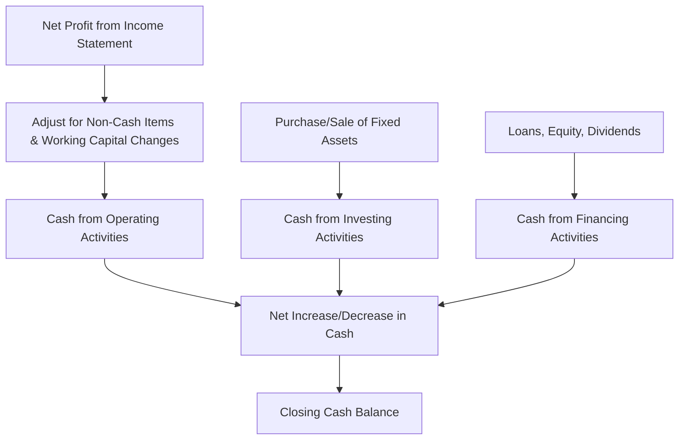

# Cash Flow

## 1. Definition

Cash flow refers to the movement of actual cash into and out of a business during a specific period. It reflects the money received (inflows) and the money spent (outflows), showing the net increase or decrease in the company’s cash balance.

---

## 2. Concept Explanation

**Basic idea:** Cash flow is the lifeblood of any business. While profit measures what a business has earned, cash flow measures whether the business has enough liquid money to pay its bills, salaries, and suppliers on time. A business cannot operate on profit alone if cash is trapped in debtors or inventory.

**How it works:** A cash flow statement tracks all sources from which cash entered the business (like customer payments) and all purposes for which cash left the business (like rent, raw material purchases, loan instalments). It separates these movements into three categories: operating activities (day‑to‑day business), investing activities (buying/selling assets), and financing activities (borrowing/repaying loans, issuing shares).

**Why it is important:** Even a profitable company can fail if it runs out of cash. Cash flow analysis helps entrepreneurs forecast cash shortages, plan for big expenses, and avoid insolvency. Lenders and investors examine cash flow to assess the business’s ability to generate stable cash and repay debt.

---

## 3. Key Characteristics / Features

- **Measures liquidity, not profitability:** It focuses on actual cash transactions, ignoring non‑cash items like depreciation and credit sales.
- **Covers all cash movements:** It records every rupee coming in and going out, regardless of when the related revenue or expense was booked.
- **Classified by activity type:** Cash flows are grouped into operating, investing, and financing compartments for meaningful analysis.
- **Time‑specific:** It is reported for a defined period (month, quarter, year), showing the change in cash position.
- **Cash basis accounting:** Unlike the income statement that follows accrual accounting, cash flow deals only with realised cash.
- **Reconciles profit and cash:** It explains why net profit and the cash balance are not the same by adjusting for non‑cash items and working capital changes.

---

## 4. Types / Classification

As per standard accounting, cash flows are categorised into three distinct types:

- **Operating Cash Flow (OCF):** Cash generated or used by the core business operations. Inflows include cash sales and collection from debtors; outflows include payments to suppliers, employees, rent, and taxes. This is the most sustainable source of cash.
- **Investing Cash Flow:** Cash spent on or received from long‑term assets. Outflows include purchase of machinery, land, or investments. Inflows include sale of old assets, maturity of fixed deposits, or dividends from other investments.
- **Financing Cash Flow:** Cash movement between the business and its owners or lenders. Inflows come from issuing shares, taking new loans, or owner contributions. Outflows include repayment of loans, buy‑back of shares, and payment of dividends.

---

## 5. Working / Mechanism (How a Cash Flow Statement is Prepared)

The creation of a cash flow statement involves the following logical steps:

1. Start with the net profit (or loss) for the period from the income statement.
2. Adjust net profit for non‑cash items such as depreciation, amortisation, and provisions, because these reduced profit but did not consume cash.
3. Adjust for changes in working capital accounts: increases in debtors or inventory consume cash; increases in creditors generate cash.
4. The result is **Cash from Operating Activities**. This shows whether daily operations actually produce cash.
5. List all cash outflows for purchasing fixed assets (property, plant, equipment) and all cash inflows from selling such assets. The net is **Cash from Investing Activities**.
6. List all inflows from new borrowings or equity injection and all outflows for loan repayment, interest, and dividends. The net is **Cash from Financing Activities**.
7. Sum the three categories to find the **Net Increase or Decrease in Cash** for the period.
8. Add this net change to the opening cash balance to arrive at the closing cash balance that will appear in the balance sheet.

---

## 6. Diagram

---

## 7. Mathematical Formulation

The net change in cash is computed as:

$$
\text{Net Cash Flow} = \text{Cash Inflows} - \text{Cash Outflows}
$$

Or, using the three sections:

$$
\Delta \text{Cash} = \text{CF}_{\text{Operating}} + \text{CF}_{\text{Investing}} + \text{CF}_{\text{Financing}}
$$

Ending cash balance:

$$
\text{Cash}_{\text{end}} = \text{Cash}_{\text{start}} + \Delta \text{Cash}
$$

Where:  
- \( \text{CF}_{\text{Operating}} \) = Net cash provided (or used) by operations.  
- \( \text{CF}_{\text{Investing}} \) = Net cash from investing activities (often negative during growth).  
- \( \text{CF}_{\text{Financing}} \) = Net cash from financing activities.

---

## 8. Example

**“CampusCafe”** is a small food outlet. Its cash movements for March:

- *Opening cash balance:* ₹50,000  
- Cash sales: ₹1,20,000 (operating inflow)  
- Cash paid to food suppliers: ₹45,000 (operating outflow)  
- Staff salary paid: ₹25,000 (operating outflow)  
- Purchased a new coffee machine: ₹30,000 (investing outflow)  
- Received a small bank loan: ₹40,000 (financing inflow)  

**Cash from Operations:** 1,20,000 – 45,000 – 25,000 = ₹50,000  
**Cash from Investing:** – ₹30,000  
**Cash from Financing:** + ₹40,000  

**Net increase in cash:** 50,000 – 30,000 + 40,000 = ₹60,000  
**Closing cash balance:** 50,000 + 60,000 = ₹1,10,000  

This positive cash flow shows CampusCafe’s operations are generating cash, and even after buying an asset, overall cash grew.

---

## 9. Analogy

Think of cash flow as the water flowing through a pipe. The net profit is like the amount of water that a water treatment plant produces. However, if the pipes are clogged (debtors not paying) or there is a leak (high expenses paid upfront), the actual water reaching the storage tank (bank account) is less. The cash flow statement tracks exactly how much water actually enters and leaves the tank each day.

---

## 10. Comparison (Cash Flow vs. Net Profit)

| Feature | Cash Flow | Net Profit |
|--------|-----------|------------|
| Basis | Cash basis (actual cash movement) | Accrual basis (revenue earned, expenses incurred) |
| Includes | Only cash transactions | Both cash and credit transactions, non‑cash items |
| Purpose | Shows liquidity and solvency | Shows profitability over a period |
| Non‑cash items | Excluded (e.g., depreciation added back) | Included (depreciation reduces profit) |
| Timing | Immediate, reflects real‑time cash position | Matched to period of economic activity |
| Example | A sale on credit is not recorded until cash is received | A credit sale is recorded as revenue immediately |

---

## 11. Advantages

- It reveals the true ability of a business to generate cash to meet obligations, independent of accounting policies.
- Helps in planning for large future expenses or investments by forecasting cash surpluses and deficits.
- Detects early warning signs of financial distress even when the income statement shows profit.
- Investors and banks rely on cash flow to assess the safety of their capital and interest coverage.
- Assists in working capital management by showing the impact of inventory and receivables on cash.
- Separates sustainable operational cash from one‑time asset sales or fresh borrowings.

---

## 12. Disadvantages / Limitations

- It does not show the overall profitability or performance over the long term; a cash‑rich company can still be unprofitable.
- Preparing a cash flow statement requires detailed data and can be time‑consuming for small businesses.
- Looking at a single period’s cash flow can be misleading; seasonal variations must be considered.
- A high positive cash flow may be due to heavy borrowing or asset disposal, which is not sustainable.
- It ignores non‑cash benefits like brand building or credit relationships that aid future growth.
- The indirect method of operating cash flow can be difficult to understand for non‑finance people.

---

## 13. Important Points / Exam Notes

- Cash flow deals with actual movement of cash; it is a component of the financial statements along with income statement and balance sheet.
- Three categories: Operating (core business), Investing (assets), Financing (capital and debt).
- Formula: Net Cash Flow = Cash Inflows – Cash Outflows.
- The cash flow statement reconciles net profit to operating cash flow by adjusting for non‑cash items and working capital changes.
- Positive operating cash flow is a sign of a healthy business.
- A company can be profitable but still fail due to negative cash flow (cash crunch).
- Free Cash Flow (FCF) = Cash from Operations – Capital Expenditure; it shows cash available for expansion or dividends.
- Cash flow statement is prepared under the indirect or direct method.

---

## 14. Applications / Use Cases

- **Start‑up survival:** A tech start‑up monitors monthly cash burn rate to ensure it has enough runway before the next funding round.
- **Loan assessment:** Banks analyse the operating cash flow to determine if a loan applicant can service EMI payments.
- **Dividend decisions:** Management checks free cash flow before declaring dividends to avoid borrowing to pay shareholders.
- **Investment appraisal:** Investors examine historical cash flow stability before valuing a company for acquisition.
- **Personal finance analogy:** Freelance entrepreneurs maintain a cash flow projection to ensure they can pay rent and buy supplies even when client payments are delayed.

---

## 15. MCQs

**Q1. Cash flow refers to:**  
A. The net profit earned during a period  
B. The movement of cash into and out of a business  
C. The total sales revenue booked  
D. Depreciation charged in a year  
**Answer:** B  
**Explanation:** Cash flow tracks actual cash receipts and payments, not accounting profits.

**Q2. Which of the following is NOT a category in the cash flow statement?**  
A. Operating activities  
B. Investing activities  
C. Marketing activities  
D. Financing activities  
**Answer:** C  
**Explanation:** Marketing is an operational function; the three categories are operating, investing, and financing.

**Q3. Cash paid to purchase a new machine is classified under:**  
A. Operating cash flow  
B. Investing cash flow  
C. Financing cash flow  
D. Revenue expenditure  
**Answer:** B  
**Explanation:** Buying a long‑term asset like machinery is an investment activity outflow.

**Q4. An increase in trade debtors (accounts receivable) will cause operating cash flow to:**  
A. Increase  
B. Decrease  
C. Remain unchanged  
D. Double  
**Answer:** B  
**Explanation:** Higher debtors mean sales are made on credit, so less cash has been collected; operating cash flow reduces.

**Q5. A company reports a net profit of ₹80,000 but its cash balance decreased by ₹10,000. This is possible because:**  
A. Cash flow and profit are always identical  
B. The company might have made large credit sales or purchased assets  
C. Profit is calculated on a cash basis  
D. Cash flow does not consider expenses  
**Answer:** B  
**Explanation:** Profit includes credit sales (not yet cash) and non‑cash expenses; actual cash may fall due to asset purchases or delayed collections.

**Q6. Which of the following would appear as a cash inflow from financing activities?**  
A. Cash received from customers  
B. Sale of an old delivery van  
C. A new bank loan received  
D. Interest received on fixed deposit  
**Answer:** C  
**Explanation:** Borrowing money is a financing activity that brings cash into the business.

**Q7. Free Cash Flow (FCF) is calculated as:**  
A. Net Profit + Depreciation  
B. Cash from Operations – Capital Expenditure  
C. Total Revenue – Total Expenses  
D. Cash from Financing + Cash from Investing  
**Answer:** B  
**Explanation:** FCF = Operating Cash Flow – Capital Expenditure; it indicates surplus cash after maintaining capital assets.

**Q8. The indirect method of preparing operating cash flow starts with:**  
A. Cash payments to suppliers  
B. Net profit from the income statement  
C. Cash received from customers  
D. Closing cash balance  
**Answer:** B  
**Explanation:** The indirect method begins with net profit and adjusts for non‑cash items and working capital changes.

**Q9. Which statement is TRUE?**  
A. Positive cash flow always means the company is profitable  
B. A company with high net profit never faces a cash shortage  
C. Cash flow shows the liquidity position, while net profit shows profitability  
D. Cash flow and bank statement are the same thing  
**Answer:** C  
**Explanation:** Cash flow measures liquidity; profit measures earning capacity. They are distinct and can move differently.

**Q10. If a business has opening cash of ₹25,000, net cash from operations +₹60,000, investing -₹40,000, financing +₹15,000, closing cash is:**  
A. ₹60,000  
B. ₹25,000  
C. ₹60,000  
D. ₹60,000 (recalculation needed)  
Let's calculate: 25,000 + 60,000 - 40,000 + 15,000 = 60,000. So answer is ₹60,000. Option A.  
**Answer:** A  
**Explanation:** Closing cash = Opening + Net change = 25,000 + (60,000 – 40,000 + 15,000) = ₹60,000.