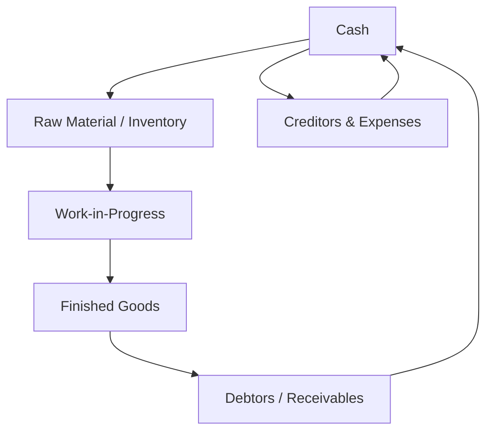

# 08 Working capital

## 1. Definition

Working capital is the capital required for the day‑to‑day operations of a business. It is the difference between current assets and current liabilities. In simple words, it is the money and resources that keep the business running smoothly in the short term.

## 2. Concept Explanation

When an entrepreneur sets up a business, fixed capital buys the land, building, and machines. But after that, cash is needed every day to purchase raw materials, pay wages, meet electricity bills, and allow customers some time to pay. This everyday money is working capital.

The basic idea is that there is a time gap between spending cash on inputs and receiving cash from sales. A manufacturing unit buys raw materials, converts them into finished goods, sells them, and then collects payment later – often after 30 or 60 days. Working capital bridges this gap. Without enough working capital, even a profitable business can fail because it cannot pay its immediate bills.

Why it is important: Banks and financial institutions assess working capital very carefully before giving a loan. If a business has too much cash tied up in stock or gives too much credit to customers, it will face a cash crunch. If it has too little working capital, it might miss production or lose sales. For a diploma‑level entrepreneur, estimating and managing working capital properly is as important as planning fixed investment.

## 3. Key Characteristics / Features

- **Short‑term nature:** Working capital is used and recycled within one operating cycle, typically less than a year.
- **Liquidity:** It consists of items that can be converted to cash quickly, like inventory and receivables.
- **Circulating concept:** It continuously moves from cash → raw material → finished goods → debtors → cash.
- **Net working capital:** It is the difference between current assets and current liabilities; a positive figure indicates safety.
- **Variable requirement:** Working capital need changes with seasons, sales volume, and production cycles.
- **Direct impact on cash flow:** Inadequate working capital leads to payment defaults, while excessive working capital means idle funds.

## 4. Types / Classification

Working capital can be classified based on concept and time.

- **On the basis of concept:**
  - *Gross working capital:* Total current assets of the business (cash, inventory, debtors, short‑term investments).
  - *Net working capital:* Current assets minus current liabilities. This shows the liquid cushion available.

- **On the basis of time / permanence:**
  - *Permanent (fixed) working capital:* The minimum level of current assets that must be maintained at all times to operate even in the leanest season.
  - *Temporary (variable) working capital:* The extra working capital needed above the permanent level to meet seasonal demand, bulk orders, or unexpected delays.

## 5. Working / Mechanism

Working capital circulates through the business in a continuous cycle.

1.  **Start with cash:** The business holds cash or a bank balance.
2.  **Purchase raw materials:** Cash is converted into inventory. Some material may be bought on credit, creating current liabilities (creditors).
3.  **Production:** Raw materials become work‑in‑progress and then finished goods. Labour, power, and overheads are paid, consuming more cash.
4.  **Sales (credit):** Finished goods are sold, often on credit. Inventory converts into trade debtors (receivables).
5.  **Collection from debtors:** Customers pay after a certain credit period. Debtors turn back into cash.
6.  **Repay short‑term obligations:** The business pays suppliers, wages, and other short‑term dues from the cash collected.
7.  **Cycle repeats:** The cash left after all payments again funds the next round of raw material purchases.

## 6. Diagram

## 7. Mathematical Formulation

Net working capital (NWC) is the fundamental measure:

$$
\text{NWC} = \text{Current Assets} - \text{Current Liabilities}
$$

Where:
- Current Assets = Cash + Inventory + Trade Debtors + Prepaid Expenses
- Current Liabilities = Trade Creditors + Short‑term Loans + Outstanding Expenses

Working capital requirement for a project is often estimated as a percentage of sales or using the operating cycle formula:

$$
\text{Working Capital Requirement} = \text{Estimated Annual Operating Cost} \times \frac{\text{Operating Cycle (days)}}{365}
$$

The operating cycle in days is:
$$
\text{Operating Cycle} = \text{Raw Material Holding Period} + \text{Production Period} + \text{Finished Goods Holding Period} + \text{Debtors Collection Period} - \text{Creditors Payment Period}
$$

## 8. Example

A small engineering unit makes metal brackets. It buys steel rods worth ₹60,000 each month, takes 7 days to convert them into brackets, keeps finished stock for 15 days, and gives customers 30 days to pay. The supplier gives 20 days’ credit. Monthly expenses are ₹1,00,000. The operating cycle is 7 + 15 + 30 – 20 = 32 days. Working capital requirement = ₹1,00,000 × (32 / 30) ≈ ₹1,06,667. So the business needs roughly ₹1.07 lakh as working capital to run smoothly without cash shortage.

## 9. Analogy

Think of working capital like the fuel in a delivery truck. Fixed capital is the truck itself. No matter how good the truck is, if you do not have enough petrol to drive it and make deliveries, the truck is useless. The petrol gets used up and must be refilled regularly. Similarly, working capital gets consumed in daily operations and must be recovered from sales to keep the business moving.

## 10. Comparison

| Feature | Fixed Capital | Working Capital |
|--------|---------------|-----------------|
| **Purpose** | To buy long‑term assets that generate production capacity | To finance day‑to‑day operating cycle |
| **Duration** | Remains invested for many years | Circulates and gets converted into cash within a year |
| **Liquidity** | Low; assets cannot be sold quickly without loss | High; items like cash, debtors, and inventory are meant to be converted into cash |
| **Financing** | Financed by long‑term sources like equity, debentures, term loans | Financed by short‑term sources like cash credit, overdraft, trade credit |
| **Example** | Factory building, CNC machine | Stock of steel, bank balance, amounts due from customers |

## 11. Advantages

- **Ensures smooth operations:** Adequate working capital prevents interruptions due to cash shortage.
- **Improves creditworthiness:** Timely payment to suppliers and employees builds a strong business reputation.
- **Supports sales growth:** Having enough stock and the ability to extend credit helps capture more orders.
- **Cushions against emergencies:** A healthy working capital reserve covers unexpected delays or price hikes.
- **Reduces borrowing cost:** Proper estimation means less reliance on expensive emergency loans or overdrafts.

## 12. Disadvantages / Limitations

- **Risk of shortage:** Underestimating working capital leads to missed production, penalty on late payments, and loss of customer goodwill.
- **Excess working capital is inefficient:** Too much cash or stock lying idle earns no return and increases storage or spoilage cost.
- **Constant monitoring needed:** Working capital components change daily; the entrepreneur must stay alert.
- **Financing cost:** Bank cash credit and overdraft incur interest, which reduces profit if working capital is inefficiently used.
- **Seasonal stress:** Businesses with peak seasons face temporary huge increase in working capital need; arranging that extra finance is difficult.

## 13. Important Points / Exam Notes

- Working capital = current assets – current liabilities.
- Gross working capital = total current assets only.
- The operating cycle shows the time between cash spent on raw materials and cash collected from customers.
- Permanent working capital is the minimum level always maintained; temporary working capital fluctuates.
- Sources of working capital include trade credit, bank cash credit, overdraft, short‑term loans, and accruals.
- A current ratio of 2:1 is a traditional benchmark for adequate net working capital.
- Insufficient working capital is one of the top reasons for small business failure.
- In a project report, working capital is calculated based on one complete operating cycle.
- Working capital loan is usually disbursed as a cash credit limit or overdraft facility by banks.
- Effective inventory management and debtor collection directly improve working capital efficiency.

## 14. Applications / Use Cases

- **Manufacturing unit:** A small furniture maker needs working capital to buy wood, pay carpenters, and hold finished sofas till showrooms pay after 45 days.
- **Service business:** A computer repair shop needs working capital for spare parts stock and to pay the technician’s salary before receiving payment from customers.
- **Seasonal business:** An agricultural processing unit (like mango pulp) needs huge temporary working capital during the 3‑month harvest season.
- **Construction contractor:** Needs working capital to pay labour and buy materials on‑site before getting running bills from the client.
- **Retail shop:** A garment store needs working capital to hold variety in stock and to pay rent and electricity between sales.

## 15. MCQs

**Q1. Working capital is defined as**

A. Total assets – Total liabilities  
B. Current assets – Current liabilities  
C. Fixed assets – Fixed liabilities  
D. Cash balance only  

**Answer:** B  
**Explanation:** Net working capital is the difference between short‑term assets and short‑term obligations.

---

**Q2. Which of the following is NOT a component of current assets?**

A. Inventory  
B. Trade debtors  
C. Machinery  
D. Cash in hand  

**Answer:** C  
**Explanation:** Machinery is a fixed, long‑term asset.

---

**Q3. The operating cycle of a business refers to the duration between**

A. Purchase of fixed asset and its sale  
B. Cash payment for raw material and cash collection from sales  
C. Loan sanction and loan repayment  
D. Hiring and firing of workers  

**Answer:** B  
**Explanation:** The operating cycle converts cash to inventory to receivables and back to cash.

---

**Q4. A business has current assets of ₹3,00,000 and current liabilities of ₹1,20,000. Net working capital is**

A. ₹4,20,000  
B. ₹1,80,000  
C. ₹1,20,000  
D. ₹3,00,000  

**Answer:** B  
**Explanation:** NWC = 3,00,000 – 1,20,000 = 1,80,000.

---

**Q5. Permanent working capital is the amount that**

A. Changes every day  
B. Is required only during festival season  
C. Is maintained at all times as a minimum base  
D. Is borrowed as a term loan  

**Answer:** C  
**Explanation:** It is the core working capital kept irrespective of fluctuations.

---

**Q6. Which of the following is a source of working capital finance?**

A. Term loan for machinery  
B. Issue of equity shares for building  
C. Bank cash credit facility  
D. Public deposit for 5 years  

**Answer:** C  
**Explanation:** Cash credit is a short‑term facility to fund current assets.

---

**Q7. A longer credit period allowed to customers will generally**

A. Decrease working capital requirement  
B. Increase working capital requirement  
C. Have no effect on working capital  
D. Reduce current assets  

**Answer:** B  
**Explanation:** Longer credit means debtors stay as current assets longer, raising working capital need.

---

**Q8. Which ratio is commonly used to assess working capital health?**

A. Debt‑Equity Ratio  
B. Net Profit Ratio  
C. Current Ratio  
D. Fixed Asset Turnover Ratio  

**Answer:** C  
**Explanation:** Current ratio (Current Assets / Current Liabilities) measures short‑term liquidity.

---

**Q9. If raw material holding period is 20 days, production 10 days, finished goods holding 15 days, debtors 30 days, and creditors 25 days, the operating cycle in days is**

A. 100 days  
B. 75 days  
C. 50 days  
D. 30 days  

**Answer:** C  
**Explanation:** 20+10+15+30 – 25 = 50 days.

---

**Q10. A business with inadequate working capital is likely to face**

A. High fixed asset turnover  
B. Cash crunch and difficulty in paying short‑term dues  
C. Surplus funds idle in the bank  
D. Permanent increase in long‑term liabilities  

**Answer:** B  
**Explanation:** Shortage of working capital leads to inability to meet immediate obligations.