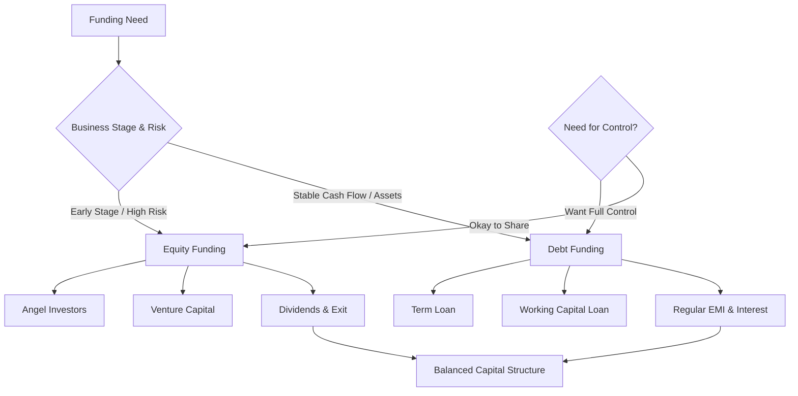

# Funding Methods Equity or Debt

## Video Explanation

* [https://www.youtube.com/watch?v=1s8p0cQ6f9k](https://www.youtube.com/watch?v=1s8p0cQ6f9k)

## Visual Aids

## 1. Definition

Equity funding means raising capital by selling ownership shares of the business to investors. Debt funding means borrowing money that must be repaid over time with interest, without giving away ownership. The choice between equity and debt is one of the most critical financial decisions for any entrepreneur.

---

## 2. Concept Explanation

Every business, whether a small start‑up or a growing company, needs money to start and expand. This capital can come from two broad sources: the owner’s own money plus that of new partners (equity) or borrowed funds (debt).

How it works: When an entrepreneur uses equity funding, investors put money into the business and become part‑owners. They share in future profits and losses. They do not expect a fixed monthly repayment; instead, they look for the business value to grow so their share becomes more valuable. When the entrepreneur uses debt, a bank or financial institution lends a fixed sum. The company must repay the principal in instalments and pay interest regularly, regardless of whether the business is making profit.

Why it is important: The funding choice affects control, risk, cash flow, and the future direction of the venture. Too much debt can burden the business with fixed repayments during a slow season. Too much equity can dilute the founder’s control and share of profits. A balanced capital structure is essential for long‑term survival and growth.

---

## 3. Key Characteristics / Features

**Features common to both methods:**
- **Purposeful:** Funds are raised for a specific business purpose like buying machinery, marketing, or working capital.
- **Legal agreement:** Both methods involve legal documents – share subscription agreements for equity, loan agreements for debt.

**Features of Equity Funding:**
- **No repayment obligation:** Investors cannot demand repayment of their money; they can only sell their shares to others.
- **Ownership dilution:** The original owner’s percentage holding reduces with every new equity investor.
- **Dividend is optional:** The company may or may not pay dividends; it is not a compulsory payment.
- **Patient capital:** Equity investors are typically willing to wait longer for returns, accepting higher risk.
- **Participation in decision‑making:** Large equity investors may ask for board seats and influence major decisions.

**Features of Debt Funding:**
- **Compulsory interest and principal repayment:** Debt must be serviced on fixed dates, irrespective of profits.
- **No ownership dilution:** The borrower does not surrender any control or share of future profits beyond interest.
- **Interest is tax‑deductible:** Interest paid reduces taxable income, lowering the effective cost of debt.
- **Finite tenure:** Loans have a fixed repayment period, after which the obligation ends.
- **Collateral requirement:** Most debt, especially for small businesses, requires security like property, machinery, or a personal guarantee.

---

## 4. Types / Classification

### Equity Funding Types
- **Owner’s equity / Bootstrapping:** The entrepreneur invests personal savings and retains full ownership.
- **Angel investment:** Wealthy individuals invest in early‑stage start‑ups in exchange for equity. They often provide mentoring.
- **Venture capital:** Professional firms invest larger amounts in high‑growth businesses, taking significant equity.
- **Private equity:** Funds invest in established, profitable companies, often buying a controlling stake.
- **Public equity (IPO):** Shares are sold to the general public on a stock exchange. Available only to large companies.

### Debt Funding Types
- **Term loan from banks:** A fixed amount borrowed for a specific term (3‑10 years), repaid in EMIs.
- **Working capital loan / Cash credit:** Short‑term funding to manage day‑to‑day operations, secured against inventory or receivables.
- **Bonds / Debentures:** Large companies issue these fixed‑interest securities to the public or institutions.
- **Government schemes (MUDRA, SIDBI):** Collateral‑free or subsidised loans for micro and small enterprises.
- **Trade credit:** Suppliers sell raw materials on credit for 30‑90 days; an informal but important short‑term debt.

---

## 5. Working / Mechanism (How to choose between Equity and Debt)

The entrepreneur follows a logical evaluation process to decide the appropriate funding mix:

1. Determine the exact amount of money required and the stage of the business (idea, early revenue, growth).
2. If the business is pre‑revenue and risky, equity is often the only option as banks will not lend without cash flows.
3. If the business has steady cash flows and assets, assess debt capacity by calculating interest coverage and debt‑service coverage ratios.
4. Evaluate the cost of each option. Debt cost is the interest rate; equity cost is the expected return demanded by investors, often higher.
5. Assess willingness to share control. If the entrepreneur wants full control, preference should be for debt; if mentorship and network are needed, equity investors bring value beyond money.
6. Consider tax implications: interest reduces taxable profits, while dividends are paid from after‑tax profits.
7. Aim for a balanced capital structure. Too much debt increases bankruptcy risk; too much equity dilutes founders excessively.
8. Prepare legal documentation and disburse funds according to the agreed schedule.
9. For debt, ensure a repayment plan is built into the cash flow forecast. For equity, establish shareholder agreements and exit clauses.

---

## 6. Diagram

---

## 7. Mathematical Formulation

**Simple Interest Calculation for Debt:**

$$
\text{Interest} = P \times r \times t
$$

Where:  
- \( P \) = Principal amount borrowed  
- \( r \) = Annual interest rate (as decimal)  
- \( t \) = Time period in years  

**Effective Cost of Debt (after tax):**

$$
\text{Cost of Debt} = r \times (1 - \text{Tax Rate})
$$

Since interest is tax‑deductible, the real cost to the company is lower.

**Equity Earning Expectation (Dividend Yield):**

$$
\text{Dividend Yield} = \frac{\text{Dividend per Share}}{\text{Market Price per Share}} \times 100\%
$$

While equity does not demand fixed payment, investors expect returns through dividends and capital gains, which impact valuation.

---

## 8. Example

**“FreshRoast Coffee”** needs ₹10 lakh to open a second outlet.

- **Debt option:** A bank offers a term loan of ₹10 lakh at 10% annual interest for 5 years. Monthly EMI is approximately ₹21,247. The founder keeps 100% ownership, but he must pay the EMI every month even if sales are slow.

- **Equity option:** An angel investor agrees to give ₹10 lakh for 15% equity in the company. The founder gives up some ownership and will share future profits, but there is no monthly repayment pressure.

The founder chooses a mix: ₹4 lakh from personal savings (equity), ₹3 lakh bank loan (debt), and ₹3 lakh from an angel for 5% equity. This balanced mix reduces both repayment burden and dilution.

---

## 9. Analogy

Equity is like taking a life partner who shares all your future joys and sorrows, assets and debts. They will walk every step with you, but you must consult them in big decisions. Debt is like renting a moving truck. You pay a fixed rental (interest), use the truck to move your goods, and return it after a set time. The truck company does not care what you earn or how far you go; they just want their rent on time, or they take away the truck (collateral).

---

## 10. Comparison (Equity vs. Debt)

| Feature | Equity Funding | Debt Funding |
|--------|----------------|--------------|
| Meaning | Selling ownership share of the business | Borrowing money to be repaid with interest |
| Repayment | Not required; investors exit by selling shares | Mandatory EMI and principal repayment |
| Ownership | Dilutes founder’s stake | Founder retains 100% ownership |
| Return to investor | Dividends and capital appreciation | Fixed interest |
| Risk to entrepreneur | Lower – no fixed obligation | Higher – must pay even in loss |
| Cost | High expected return by investors, loss of future profit share | Interest rate, but tax‑deductible |
| Control | Investors may seek board seats and voting rights | No control rights for lender unless default occurs |
| Collateral | Not required | Usually requires collateral and guarantees |
| Suitable for | Start‑ups, high‑growth ventures | Stable, cash‑generating businesses |

---

## 11. Advantages (Overview of both methods)

- **Flexibility:** The entrepreneur can choose a mix that suits the business stage and risk appetite.
- **Risk management:** Equity reduces immediate cash burden; debt allows retention of future upside.
- **Growth enablement:** Both provide the necessary fuel to scale operations, purchase assets, or enter new markets.
- **Tax benefit:** Debt interest is a deductible expense, reducing taxable income.
- **Strategic value:** Equity investors often bring experience, network, and mentorship; banks may offer additional services.
- **Discipline:** Debt repayment imposes financial discipline and a credit history that helps future borrowing.

---

## 12. Disadvantages / Limitations

- **Dilution vs. debt trap:** Too much equity dilutes founder’s share and control; too much debt can lead to insolvency.
- **Approval difficulty:** Start‑ups often cannot get debt without collateral or years of profitability; equity fundraising is time‑consuming and requires a compelling pitch.
- **Cost:** Equity is the most expensive form of capital in the long run if the business becomes very successful.
- **Legal complexity:** Both methods involve complicated paperwork – term sheets, shareholder agreements, debenture trust deeds.
- **Loss of privacy:** Equity investors demand detailed financial disclosures and board meetings; debt providers require regular compliance reports.

---

## 13. Important Points / Exam Notes

- Equity = ownership capital; Debt = borrowed capital.
- Debt must be repaid with interest; equity does not have to be repaid.
- Interest on debt is tax‑deductible; dividends are not.
- Cost of debt = Interest rate × (1 – Tax rate).
- Equity is patient capital; suitable for high‑risk start‑ups. Debt is suitable for stable, asset‑backed businesses.
- Control: debt does not dilute ownership; equity may bring external control.
- Common equity sources: angel investors, VC, private equity, public issue.
- Common debt sources: term loans, working capital loans, bonds, government schemes.
- Balanced capital structure is key: mix equity and debt to minimise cost and risk.
- Debt‑service coverage ratio (DSCR) is a key metric banks check before lending.

---

## 14. Applications / Use Cases

- **Tech start‑up seed round:** A software start‑up with no revenue raises ₹50 lakh from angel investors by offering 10% equity, using the funds for product development.
- **Manufacturing SME expansion:** A profitable auto parts maker buys a new CNC machine using a bank term loan of ₹30 lakh, retaining full ownership and using the machine as collateral.
- **Retail chain growth:** A fast‑growing clothing brand uses a combination: internal profits (equity) for store renovation and a cash‑credit facility (debt) for inventory buying.
- **Social enterprise:** A rural dairy cooperative raises funds via government subsidised MUDRA loan (debt) while also taking equity contributions from farmer members.

---

## 15. MCQs

**Q1. Which of the following is an example of equity funding?**  
A. Bank term loan  
B. Issue of debentures  
C. Selling shares to an angel investor  
D. Taking trade credit  
**Answer:** C  
**Explanation:** Selling shares means giving away ownership, which is equity. The others are debt instruments.

**Q2. A major advantage of debt over equity is:**  
A. No repayment obligation  
B. Interest is tax‑deductible and ownership is retained  
C. Investors share business risk  
D. No collateral is needed  
**Answer:** B  
**Explanation:** Interest reduces taxable profits, and debt does not dilute the founder’s holding.

**Q3. The effective cost of debt is lower than the stated interest rate because:**  
A. Debt is always cheap  
B. Interest is paid in cash  
C. Interest is a tax‑deductible expense  
D. Debt never has to be repaid  
**Answer:** C  
**Explanation:** Tax shield makes the net cost = rate × (1 – tax rate), thus lower than the nominal rate.

**Q4. Venture capital funding is most suitable for:**  
A. A grocery store with steady sales  
B. A high‑growth technology start‑up  
C. A farmer buying seeds  
D. A government school  
**Answer:** B  
**Explanation:** Venture capitalists invest in scalable, high‑risk, high‑return early‑stage companies.

**Q5. Dilution of ownership refers to:**  
A. Increase in debt‑equity ratio  
B. Reduction in founder’s percentage of shares due to new equity issues  
C. Repayment of loan principal  
D. Increase in interest rate  
**Answer:** B  
**Explanation:** Issuing new shares to investors reduces the founder’s relative ownership percentage.

**Q6. Which of the following is a debt instrument?**  
A. Ordinary shares  
B. Preference shares  
C. Corporate bonds  
D. Sweat equity  
**Answer:** C  
**Explanation:** Bonds represent borrowings by the company; they carry fixed interest and redemption obligations.

**Q7. If a company has ₹1,00,000 loan at 12% interest and tax rate is 25%, the effective after‑tax cost of debt is:**  
A. 12%  
B. 3%  
C. 9%  
D. 15%  
**Answer:** C  
**Explanation:** Cost = 12% × (1 – 0.25) = 12% × 0.75 = 9%.

**Q8. The biggest risk of using too much debt is:**  
A. Losing control to investors  
B. Missing growth opportunities  
C. Bankruptcy if cash flow is insufficient to pay interest and principal  
D. Dilution of ownership  
**Answer:** C  
**Explanation:** High debt creates fixed obligation; default can lead to insolvency, regardless of profitability.

**Q9. Which source provides capital without any repayment or ownership dilution?**  
A. Bank loan  
B. Venture capital  
C. Government grant  
D. Debentures  
**Answer:** C  
**Explanation:** Grants are often non‑repayable and do not require giving up equity, but they are a special case not covered in debt vs equity. However, among given typical sources, only grant is neither debt nor equity. But the question might be tricky. Actually, government grant is not a typical equity or debt, but the question asks "without any repayment or ownership dilution", which describes grants. I'll set answer C.

**Q10. A balance between equity and debt in a company’s total capital is known as:**  
A. Working capital  
B. Capital structure  
C. Current assets  
D. Fixed capital  
**Answer:** B  
**Explanation:** Capital structure refers to the proportion of debt and equity used to finance a company’s operations.