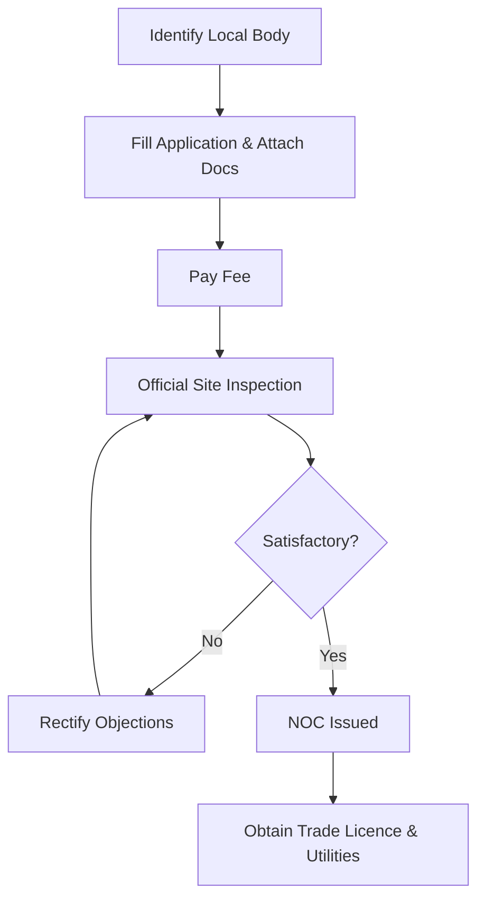

# 01 NOC from Local Body

## 1. Definition

A No Objection Certificate (NOC) from a local body is an official document issued by the municipal corporation, municipality, panchayat, or other urban development authority. It states that the local governing body has no objection to the entrepreneur establishing a specific business unit at the proposed premises, as it meets the local zoning, safety, and environmental norms.

## 2. Concept Explanation

Before starting a factory, shop, workshop, or any commercial establishment, the entrepreneur must get permission from the local governing body. This is not a single national licence; it is given by the city or village‑level administration. The local body checks whether the intended business activity is permitted in that area according to the master plan and building bye‑laws.

How it works: The entrepreneur submits an application with the site plan, building layout, type of machinery, and details of the product or service. The local body inspects the premises for fire safety, structural stability, drainage, pollution control, and whether the area is marked residential, commercial, or industrial. If everything is satisfactory, the NOC is issued.

Why it is important: Without this NOC, the entrepreneur cannot get a trade licence, power connection, or factory licence in many states. Banks also demand a copy of the NOC before releasing a business loan. It protects the public from illegal, unsafe, or nuisance‑creating businesses operating in residential zones.

## 3. Key Characteristics / Features

- **Locally issued:** The NOC is granted by the village panchayat, town municipality, municipal corporation, or development authority depending on the location.
- **Premises‑specific:** It is linked to a particular building or plot, not to the entrepreneur personally.
- **Activity‑dependent:** The type of NOC required depends on whether the unit is a retail shop, a small workshop, a manufacturing unit, or a chemical plant.
- **Renewable and revisable:** Usually valid for a certain number of years; must be renewed or revised if the business expands or changes activity.
- **Pre‑condition for other licences:** Trade licence, fire department NOC, and electricity connection often cannot be obtained without this first.
- **Ensures public safety:** It verifies that the business will not cause noise, smell, traffic, or health problems to the neighbourhood.

## 4. Types / Classification

The NOC from the local body can be categorised based on the issuing authority and the nature of clearance.

- **Based on issuing authority:**
  - *Gram Panchayat NOC:* For units in rural areas; simpler procedure.
  - *Municipal Council/Corporation NOC:* For units in small towns and big cities; more detailed checks.
  - *Development Authority NOC:* For units in industrial estates or special economic zones.
  - *Cantonment Board NOC:* For units in army cantonment areas.

- **Based on type of clearance:**
  - *Zoning NOC:* Confirms that the business activity is allowed in that land‑use zone (residential area may have restrictions).
  - *Building Structure NOC:* Verifies that the shed or building is structurally safe for the proposed machinery weight and vibrations.
  - *Environmental NOC for micro units:* Though a separate pollution board consent may be needed later, the local body initially checks that the unit will not pollute local water bodies or create unbearable noise.
  - *Fire Safety NOC:* Some local bodies issue the initial fire clearance along with the NOC or require it as a separate attachment before giving the final NOC.

## 5. Working / Mechanism

The process of obtaining an NOC from the local body typically follows these steps.

1.  **Identify the correct authority:** Depending on the location – village, town, or city – the entrepreneur finds the appropriate Gram Panchayat, Municipality, or Corporation office.
2.  **Obtain the prescribed application form:** The form is available at the local body office or online on the state’s single window portal.
3.  **Prepare supporting documents:** Attach the rent agreement or ownership documents, site and building plan prepared by a licensed architect or engineer, property tax receipt of the premises, list of machinery with horsepower, details of raw material and finished goods, and photograph of the premises.
4.  **Pay the application fee:** The fee depends on the size of the unit, type of activity, and area.
5.  **Inspection by officials:** The junior engineer or sanitary inspector visits the site. They verify the boundaries, drainage, parking, ventilation, fire exit, and adherence to building regulations.
6.  **Rectify objections if any:** If the inspector points out gaps like missing fire extinguishers or inadequate parking, the entrepreneur fixes them and requests a re‑inspection.
7.  **Receipt of NOC:** Once satisfied, the authority issues the No Objection Certificate in the prescribed format, often with a validity period (e.g., five years).
8.  **Use the NOC for further applications:** The certificate is attached with the trade licence application, MSME registration, bank loan documents, and electricity connection application.

## 6. Diagram

## 7. Mathematical Formulation

While there is no universal formula, the risk‑compliance status can be conceptually represented as a product of individual clearances.

$$
\text{NOC}_{\text{status}} = \prod_{i=1}^{n} C_i
$$

Where:  
- \( C_i \) = 1 if clearance \( i \) (zoning, structure, fire, drainage) is granted, else 0.  
- \( n \) = Number of mandatory clearances required.

If any \( C_i = 0 \), the overall NOC status becomes zero, meaning the certificate cannot be issued. This simple logic emphasises that all conditions must be satisfied.

## 8. Example

Priya, a diploma holder in electrical engineering, wants to start a small motor rewinding workshop in a rented shed on the outskirts of a town. She goes to the local Nagar Palika (municipality). She submits the rental agreement, a building plan prepared by a local architect, a ₹2,000 application fee, and details of her machines (5 HP total). The municipality’s building inspector visits, checks that the shed is not in a purely residential colony, verifies that a fire extinguisher is kept, and approves the drainage arrangement. Within 15 days, Priya receives an NOC. She uses this NOC to get her trade licence and apply for a three‑phase electricity connection. Without the NOC, she would not have been able to legally run her workshop.

## 9. Analogy

An NOC from the local body is like a building completion certificate for a house. You may have built a house, but the municipality must certify that it is structurally safe and built according to the approved plan before you can get water and electricity. Similarly, the NOC is the municipality’s stamp that your business is fit to operate in that location. Without it, essential services like power and legal registration remain blocked.

## 10. Comparison

| Feature | NOC from Local Body | Trade Licence |
|--------|----------------------|---------------|
| **Issuing Authority** | Municipal Corporation, Panchayat, Development Authority | Same local body, often issued after or with the NOC |
| **Scope of Check** | Zoning, building safety, fire readiness, neighbourhood impact | Permission to conduct a specific business activity in that premises |
| **Validity** | Generally 3‑5 years or tied to the building use | Usually 1 year, must be renewed annually |
| **Link** | Pre‑condition for trade licence in many states | Follow‑up permission after basic NOC is granted |
| **Example situation** | Checking if a welding shop can operate in a mixed‑use zone | Allowing the shop to officially start trading and issuing tax invoices |

## 11. Advantages

- **Legal protection:** The entrepreneur gets a legal shield; operating without an NOC can lead to sealing of premises and heavy fines.
- **Attracts finance:** Banks ask for the NOC before approving working capital loans or term loans, as it confirms that the business is allowed at that location.
- **Speeds up other approvals:** Having the NOC makes it easier to get a trade licence, factory licence, and power connection.
- **Validates location suitability:** The local body’s inspection ensures that the business site is appropriate, avoiding future disputes with neighbours or authorities.
- **Builds vendor and customer trust:** Authorised businesses with local compliance appear more reliable and credible.

## 12. Disadvantages / Limitations

- **Time‑consuming process:** Multiple inspections and bureaucratic delays can postpone the business launch.
- **Official interpretation varies:** One municipal officer may reject a small workshop in a residential‑cum‑commercial area while another might allow it, creating uncertainty.
- **Added cost:** Application fees, architect fees for plans, and sometimes unofficial facilitation charges increase the initial establishment cost.
- **Renewal burden:** If the NOC has a fixed validity, the entrepreneur must remember to renew it, or risk the business being declared illegal.
- **Restricts location flexibility:** The NOC is tied to one premises; shifting the business means applying for a fresh NOC all over again.

## 13. Important Points / Exam Notes

- NOC stands for No Objection Certificate; it is the local body’s permission to start a business at a specific premises.
- Local bodies include Gram Panchayats (village), Nagar Palikas / Municipalities (towns), and Mahanagar Palikas / Corporations (cities).
- The NOC ensures compliance with the master plan, building bye‑laws, and fire and sanitation norms.
- It is not a trade licence; it is a prior clearance that enables the grant of a trade licence.
- Documents required: site/building plan, ownership proof or rent agreement, property tax receipt, machinery list, product details, and application fee.
- Inspection by local body engineer or sanitary inspector is mandatory before issuance.
- Validity period is usually 3 to 5 years; must be renewed thereafter.
- NOC is a prerequisite for MSME registration, GST registration (in some cases), bank loans, and electricity connection.
- Operating without a valid NOC can lead to sealing of premises under municipal laws.
- State governments are simplifying the process through single window clearance portals where NOC applications can be submitted online.

## 14. Applications / Use Cases

- **Small manufacturing unit:** A mechanic opening a lathe workshop in a semi‑commercial area needs an NOC from the city corporation.
- **Home‑based food business:** A home baker applying for FSSAI registration must submit an NOC from the local municipality that the residence kitchen can be used for a small commercial activity.
- **Dairy farm:** A rural entrepreneur starting a small dairy must get an NOC from the Gram Panchayat regarding waste disposal and cattle shed distance from houses.
- **Retail store:** A shop selling building materials requires an NOC to ensure heavy trucks do not disturb a narrow residential lane.
- **IT services office:** Even a small office providing software training in a rented flat may be required by the society to produce an NOC from the municipal authority if local bye‑laws restrict commercial use.

## 15. MCQs

**Q1. What is the full form of NOC?**

A. National Ownership Certificate  
B. No Objection Certificate  
C. Notice of Clearance  
D. Nodal Operating Certificate  

**Answer:** B  
**Explanation:** NOC stands for No Objection Certificate, issued by the local body.

---

**Q2. Which local body issues an NOC for a business set up in a village?**

A. Municipal Corporation  
B. Cantonment Board  
C. Gram Panchayat  
D. Development Authority  

**Answer:** C  
**Explanation:** In rural areas, the Gram Panchayat is the local governing body.

---

**Q3. The NOC from the local body is primarily required to ensure**

A. High profit  
B. Proper brand name  
C. Compliance with zoning, building, and fire safety norms  
D. Telephone connection  

**Answer:** C  
**Explanation:** It checks that the business is in a permissible zone and meets safety rules.

---

**Q4. An NOC from the local body is a precondition for obtaining**

A. A PAN card  
B. A trade licence  
C. An Aadhaar card  
D. A passport  

**Answer:** B  
**Explanation:** The trade licence is usually issued only after the NOC is granted.

---

**Q5. Which of the following is a supporting document required for an NOC application?**

A. Income tax return of the owner’s friend  
B. Building plan and property tax receipt  
C. Marksheet of the entrepreneur  
D. Passport size photo of the customer  

**Answer:** B  
**Explanation:** The site plan and proof of property ownership/tax are essential.

---

**Q6. If the local body inspector finds a problem during site inspection, the entrepreneur should**

A. Ignore it  
B. Rectify the objections and call for a re‑inspection  
C. Change the business name  
D. Close the business idea permanently  

**Answer:** B  
**Explanation:** Objections are noted and must be fixed before the NOC is issued.

---

**Q7. How long is an NOC typically valid?**

A. 1 month  
B. 6 months  
C. 3 to 5 years  
D. Lifetime once issued  

**Answer:** C  
**Explanation:** Most local bodies issue NOCs with a validity of a few years, after which renewal is needed.

---

**Q8. Operating a business without a valid NOC can lead to**

A. Higher profits  
B. Sealing of premises and fines  
C. Automatic loan sanction  
D. Free electricity  

**Answer:** B  
**Explanation:** The municipal authority can seal the unit for operating illegally.

---

**Q9. The NOC is described as a ‘pre‑condition’ because**

A. It is optional  
B. Other licences and connections depend on it  
C. It is given only after the business makes profit  
D. It replaces the need for an electricity connection  

**Answer:** B  
**Explanation:** Many downstream legal documents require the NOC as a prerequisite.

---

**Q10. A single window clearance portal for NOC helps an entrepreneur by**

A. Increasing the number of visits to offices  
B. Allowing online submission and tracking of application  
C. Eliminating the need for any documents  
D. Issuing an NOC without any inspection  

**Answer:** B  
**Explanation:** Single window systems reduce physical visits and speed up processing.