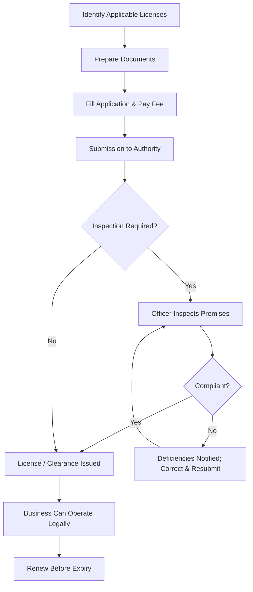

# Statutory License or Clearance

## 1. Definition

A statutory license or clearance is an official permission, certificate, or approval issued by a government authority that a business must obtain before starting and operating. It certifies that the enterprise meets the legal requirements related to public health, safety, environment, and industry regulations.

---

## 2. Concept Explanation

The basic idea is that a business cannot simply open its doors and start selling. Societies create laws to ensure that economic activities do not harm people, workers, or the environment. The government, through various departments, makes it mandatory for businesses to obtain specific written approvals – these are statutory licenses and clearances.

How it works: An entrepreneur identifies the licences applicable to the nature of the business and location. Application forms are filled, required documents are attached, and prescribed fees are paid. The concerned authority may inspect the premises to verify safety, hygiene, and other standards. Once satisfied, the license is granted. The business must display it and renew it as per validity.

Why it is important: Operating without mandatory licenses is illegal and can lead to heavy fines, closure, or even imprisonment. Valid licenses build trust among customers, suppliers, and investors. Banks ask for them before sanctioning loans, and government incentives are only available to legally compliant units.

---

## 3. Key Characteristics / Features

- **Mandatory by law:** No discretion; the business cannot legally operate without them.
- **Issued by designated authority:** A specific government department or municipal body has the power to grant each license.
- **Validity and renewal:** Licenses have a fixed period and must be renewed before expiry to keep operations legal.
- **Condition‑based:** The business must maintain certain standards continuously; the license can be suspended if conditions are violated.
- **Inspection linked:** Most licenses require a physical inspection of the site by a competent officer before issuance.
- **Public document:** They must often be displayed at the business premises and are verifiable by any citizen or authority.

---

## 4. Types / Classification

Statutory licenses for a new small enterprise can be classified as:

- **Universal / General Licenses (required by almost all businesses):**
  - **Udyam Registration** (MSME registration – now mandatory for small units in India).
  - **GST Registration** – required for goods and services tax, mandatory if turnover exceeds a threshold.
  - **Shop and Establishment Act License** – regulates working conditions in shops and commercial establishments.
  - **Trade License** – issued by the local municipal corporation for operating a trade in a specific area.
  - **Professional Tax Registration** – if applicable in the state.

- **Industry‑specific Licenses:**
  - **FSSAI License** – mandatory for any food‑related business.
  - **Drug License** – for pharmaceutical manufacturing or pharmacy.
  - **Pollution Control Board (PCB) Consent** – “Consent to Establish” and “Consent to Operate” for units generating waste, air, or water pollution.
  - **Fire Department No Objection Certificate (NOC)** – for buildings with certain height or handling inflammable material.
  - **Factory License** – under the Factories Act for units employing 10 or more workers with power, or 20 without power.

---

## 5. Working / Mechanism (Step‑by‑step Process to Obtain a Statutory License)

1. Identify the exact licenses and clearances required by listing the business activity, scale, and location.
2. Gather necessary supporting documents: identity proof of owner, address proof of premises, rent agreement or ownership deed, layout plan, partnership deed or certificate of incorporation, and so on.
3. Fill the prescribed application form available on the respective department’s online portal or office, and attach the documents.
4. Pay the prescribed fee online or through a challan.
5. Submit the application and acknowledge receipt. For many clearances, a provisional reference number is assigned.
6. The concerned officer schedules a site inspection to verify that the premises meet legal standards (e.g., fire exits, ventilation, waste disposal).
7. If the inspection is satisfactory, the license or clearance certificate is issued. If deficiencies are found, time is given to correct them.
8. Once received, the license must be prominently displayed at the place of business.
9. The entrepreneur must note the expiry date and apply for renewal well before it lapses, repeating the documentation and fee process.

---

## 6. Diagram

---

## 7. Mathematical Formulation

*There is no mathematical formula associated with statutory licenses and clearances. They are qualitative legal requirements.*

---

## 8. Example

**“GreenBite”** is a small unit manufacturing packaged salads.

- They first obtain a **Trade License** from the city municipal corporation.
- Since they deal with food, they apply for an **FSSAI License** (Food Safety and Standards Authority of India).
- Their production process uses considerable water, so they need **Consent to Establish** and **Consent to Operate** from the State Pollution Control Board.
- The unit employs 12 workers and uses electric mixers, so a **Factory License** from the Directorate of Industrial Safety and Health is required.
- The rented kitchen building must have a **Fire NOC** from the fire department.
- They also complete **GST registration** and **Udyam Registration**.

Only after all these clearances are obtained can GreenBite legally start selling its salads.

---

## 9. Analogy

A statutory license is like a **hall ticket for an examination**. You may be fully prepared, but without the hall ticket you are not allowed to enter the examination hall. Similarly, a business may be ready with all machines and workers, but without the legal license it cannot begin operations. The inspector’s visit is like the invigilator verifying your identity before you take the exam.

---

## 10. Comparison (Statutory License vs. Voluntary Certification)

| Feature | Statutory License / Clearance | Voluntary Certification (e.g., ISO) |
|--------|--------------------------------|--------------------------------------|
| Meaning | Mandatory government permission to operate | Optional quality or standard certificate |
| Issued by | Government regulatory body | Independent certification agencies |
| Consequence of absence | Business is illegal; fines and closure | Business is legal but may lose market trust |
| Example | Trade license, FSSAI, Factory license | ISO 9001, organic certification, BIS |
| Focus | Minimum safety, health, environmental norms | Excellence, customer satisfaction, premium branding |

---

## 11. Advantages

- The unit gains legal identity and can operate without fear of being shut down.
- Customers and clients trust a business that displays valid government‑issued licenses.
- Banks and financial institutions require statutory clearances before sanctioning loans or credit.
- The business becomes eligible for government subsidies, MSME benefits, and tax concessions.
- Licenses set minimum standards for worker safety and public health, reducing liability.
- Avoiding penalties and legal prosecution saves time, money, and reputation.

---

## 12. Disadvantages / Limitations

- The process can be time‑consuming, involving multiple departments and lengthy paperwork.
- Bureaucratic delays and occasional corruption can increase the cost of starting a business.
- Multiple renewals with different dates create a compliance burden, especially for micro‑enterprises.
- Small businesses sometimes avoid applying out of ignorance, which later results in penalty and closure.
- Regulatory norms may be designed for large units, making compliance costlier for start‑ups.

---

## 13. Important Points / Exam Notes

- Statutory licenses are compulsory legal permissions; voluntary certifications are optional.
- Key licenses for a new unit in India: Udyam Registration, GST Registration, Trade License, Shop & Establishment License.
- Industry‑specific examples: FSSAI for food, Drug License for pharma, Pollution Control Board consent for polluting industry.
- Fire NOC and Factory License are needed if certain employment or building criteria are met.
- The process involves application, document submission, fee payment, inspection, and issuance.
- Operating without a required license can lead to fines, sealing of premises, and legal action.
- Licenses must be renewed before expiry; renewal process is similar to initial application.
- Display of licenses at the place of business is usually a condition.

---

## 14. Applications / Use Cases

- **Restaurant start‑up:** Needs FSSAI license, municipal trade license, police eating‑house licence (in some states), fire NOC, and GST registration.
- **Small garment factory:** Requires Factory License (if worker count exceeds threshold), Trade License, Electricity Board approval for power load, and ESI/EPF registration for employees.
- **Pharmacy shop:** Must obtain a Drug License from the State Drug Controller, GST registration, and Shop and Establishment License.
- **Home‑based bakery:** Even a home‑based operation selling food requires FSSAI basic registration and a local trade permit in many cities.

---

## 15. MCQs

**Q1. A statutory license is:**  
A. An optional quality certificate  
B. A mandatory government permission to operate a business  
C. A bank guarantee  
D. A marketing document  
**Answer:** B  
**Explanation:** By definition, a statutory license is a compulsory legal approval without which business cannot be started.

**Q2. Which of the following is a universal license required for most businesses in India?**  
A. Drug License  
B. FSSAI License  
C. GST Registration  
D. Pollution Control Board Consent  
**Answer:** C  
**Explanation:** GST registration is a tax registration required for most businesses, whereas the others are industry‑specific.

**Q3. Consent to Establish and Consent to Operate are issued by:**  
A. Food Safety Department  
B. Municipal Corporation  
C. Pollution Control Board  
D. Fire Department  
**Answer:** C  
**Explanation:** These environmental clearances are granted by the State Pollution Control Board to control pollution.

**Q4. A Fire NOC is typically required when:**  
A. The business deals with food products  
B. The building exceeds a certain height or handles inflammable materials  
C. The total number of employees is less than 5  
D. The business is purely online  
**Answer:** B  
**Explanation:** Fire department clearance is linked to building height, occupancy, and fire hazard risk.

**Q5. The most important immediate consequence of operating without a required trade license is:**  
A. Reduced customer walk‑ins  
B. The business is illegal and can be sealed by authorities  
C. Lower profits  
D. Payment of higher taxes  
**Answer:** B  
**Explanation:** Operating without a mandatory license is a legal offence; the premises can be closed down by the municipal body.

**Q6. Which license is specifically required for a food‑related business in India?**  
A. FSSAI License  
B. Factory License  
C. Drug License  
D. Clinical Establishment License  
**Answer:** A  
**Explanation:** The Food Safety and Standards Authority of India (FSSAI) license is mandatory for all food business operators.

**Q7. A major disadvantage of obtaining multiple statutory licenses is:**  
A. Increased customer trust  
B. Time and cost of compliance with multiple departments  
C. Better safety standards  
D. Access to bank loans  
**Answer:** B  
**Explanation:** While licenses have benefits, the process can be slow, bureaucratic, and expensive for a small entrepreneur.

**Q8. Udyam Registration in India is primarily meant for:**  
A. Large corporations only  
B. Micro, Small, and Medium Enterprises (MSMEs)  
C. Export‑import businesses  
D. Foreign companies  
**Answer:** B  
**Explanation:** Udyam Registration is the government’s registration portal for MSMEs to avail benefits and schemes.

**Q9. The typical first step in obtaining any statutory license is:**  
A. Paying the penalty  
B. Displaying the license  
C. Identifying which licenses are applicable to the business  
D. Closing the business  
**Answer:** C  
**Explanation:** The entrepreneur must first research and list all required licenses based on the business activity and location.

**Q10. Which statement about statutory license renewal is TRUE?**  
A. Licenses never expire  
B. Renewal is optional and only for large businesses  
C. Licenses have an expiry date and must be renewed before it lapses  
D. Only the original license is valid; duplicates are not issued  
**Answer:** C  
**Explanation:** Licenses have a fixed validity period; renewal is mandatory to keep the business legally compliant.