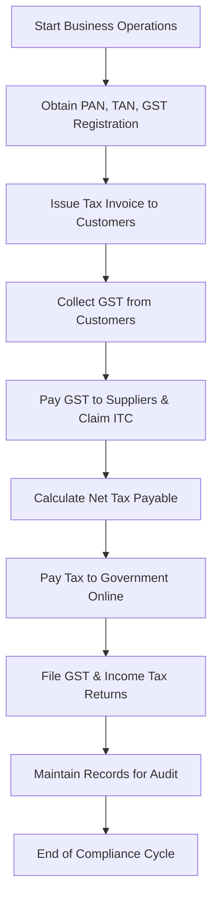

# 04 Tax Compliances

## 1. Definition

Tax compliance means following all the tax laws and rules set by the government. It includes registering for taxes, filing returns on time, paying correct taxes, and maintaining proper records.

## 2. Concept Explanation

When a new business unit is established, it must comply with various tax regulations. The basic idea is that every business earns income and makes transactions that may be taxable. Therefore, the business needs to obtain tax registration, calculate taxes correctly, deposit them with the government, and submit returns periodically.

Tax compliance works through a system of self-assessment. The business owner calculates the tax liability, pays it, and files a return. The government may audit or verify these filings. Tax compliance is important because it keeps the business legal, avoids penalties, and builds trust with customers and banks.

## 3. Key Characteristics / Features

- **Mandatory registration:** Every business must register under applicable tax laws such as Goods and Services Tax (GST) and Income Tax.
- **Timely filing of returns:** Businesses must file tax returns monthly, quarterly, or annually as per the due dates.
- **Accurate calculation of tax:** Tax liability must be computed correctly based on sales, purchases, and profits.
- **Payment within due dates:** Taxes collected or payable must be deposited to the government before the deadline.
- **Maintenance of records:** All invoices, bills, and accounts must be preserved for a minimum period (usually 5 to 6 years).
- **Deduction of tax at source (TDS):** Businesses making specified payments (salary, rent, contract) must deduct TDS and deposit it.

## 4. Types / Classification

For a small enterprise, tax compliances are mainly classified into three categories:

**Direct Tax Compliance (Income Tax):**
- Obtaining Permanent Account Number (PAN) and Tax Deduction and Collection Account Number (TAN) if required.
- Filing Income Tax Return (ITR) each year based on business income.
- Paying advance tax if tax liability exceeds a certain limit.

**Indirect Tax Compliance (GST):**
- Registering for GST if turnover exceeds the threshold limit (Rs. 20 lakhs for services, Rs. 40 lakhs for goods in most states).
- Filing monthly or quarterly GST returns (GSTR-1, GSTR-3B) and annual return.
- Paying output GST and claiming input tax credit.

**Other Tax Compliances:**
- Professional Tax (if applicable in the state).
- TDS compliance for payments made to employees, contractors, etc.

## 5. Working / Mechanism

1. **Obtain tax registrations:** The business owner applies for PAN, TAN, and GST registration (if required) before starting operations.

2. **Collect tax on sales:** Under GST, the business charges GST from customers and records it as output tax.

3. **Pay tax on purchases:** The business pays GST to suppliers and records it as input tax credit.

4. **Calculate net tax liability:** For GST, net tax = output tax – input tax credit. For income tax, net tax = applicable rate on taxable profit.

5. **Deposit tax to government:** The business pays the net GST or TDS amount online through the government portal by the due date.

6. **File returns:** The business submits periodic returns (GST returns, TDS returns, income tax return) with details of sales, purchases, tax collected, and tax paid.

7. **Maintain records:** All tax-related documents such as invoices, payment receipts, and return acknowledgements are stored for future reference or audit.

## 6. Diagram

## 7. Mathematical Formulation

For GST compliance, the net tax payable is calculated as:

$$
\text{Net GST Payable} = \text{Output GST} - \text{Input Tax Credit (ITC)}
$$

Where:
- Output GST = Total GST collected from customers on sales
- Input Tax Credit = Total GST paid on purchases used for business

For Income Tax (simplified for small enterprise):

$$
\text{Income Tax Liability} = \text{Taxable Business Income} \times \text{Applicable Tax Rate} - \text{TDS Credit}
$$

Where:
- Taxable Business Income = Total revenue – allowable expenses – depreciation
- TDS Credit = Total tax already deducted by customers or paid as advance tax

## 8. Example

Ramesh starts a small furniture manufacturing unit. His annual turnover is Rs. 50 lakhs. He registers for GST and obtains PAN. During a month, he sells furniture worth Rs. 5 lakhs and collects 18% GST (Rs. 90,000). He buys raw materials worth Rs. 3 lakhs and pays 18% GST (Rs. 54,000) as input tax. His net GST payable for the month is Rs. 90,000 – Rs. 54,000 = Rs. 36,000. He pays this amount online by the 20th of next month and files GSTR-3B return. At the year end, he files his income tax return showing a profit of Rs. 8 lakhs and pays income tax as per slab rate.

## 9. Analogy

Think of tax compliance like running a canteen in a school. You must take permission (registration), collect money for each item sold (collect tax), pay the school for ingredients purchased (input tax), calculate your net payment to the school (net tax payable), submit a report of sales and purchases (returns), and keep all receipts in a file (record maintenance). If you skip any step, the school will fine you or stop your canteen.

## 10. Comparison

| Feature | GST Compliance | Income Tax Compliance |
|---------|---------------|----------------------|
| Applicability | On supply of goods/services | On business profits |
| Registration | Required if turnover exceeds threshold | Required through PAN for all businesses |
| Filing frequency | Monthly/quarterly + annual | Annually (with advance tax quarterly) |
| Tax base | Value of supply | Net taxable income |
| Credit mechanism | Input tax credit available | No credit, only deductions for expenses |

## 11. Advantages

- **Legal protection:** Compliant businesses avoid penalties, fines, and legal trouble.
- **Better access to finance:** Banks and investors prefer tax-compliant businesses for loans and funding.
- **Input tax credit benefit:** Under GST, businesses can reduce tax liability by claiming credit on purchases.
- **Builds customer trust:** Registered businesses can issue proper invoices, which increases credibility.
- **Easy to expand:** Compliant businesses can participate in government tenders and sell across states without restrictions.

## 12. Disadvantages / Limitations

- **Time consuming:** Preparing returns, maintaining records, and calculating taxes takes significant time.
- **Requires knowledge:** Small business owners may need to hire accountants or learn tax rules.
- **Penalty risk:** Late filing or minor errors can lead to heavy penalties and interest.
- **Cash flow impact:** Taxes must be paid even before receiving payment from customers in some cases.
- **Frequent changes:** Tax laws and return forms change regularly, making compliance complex.

## 13. Important Points / Exam Notes

- Every business must have a PAN; it is mandatory for filing income tax returns.
- GST registration is mandatory if turnover exceeds Rs. 20 lakhs (Rs. 10 lakhs for special category states) for services, and Rs. 40 lakhs for goods.
- Due date for GST return (GSTR-3B) is usually the 20th of next month.
- Income tax return for businesses must be filed by 31st July of the assessment year (for non-audit cases).
- TDS must be deducted on payments like salary (if above exemption limit), contract payments (above Rs. 30,000), rent (above Rs. 2,40,000 per year), etc.
- Late filing of GST returns attracts a late fee of Rs. 50 per day (Rs. 20 for nil returns) and interest at 18% per annum.
- Maintaining proper invoice-wise records is essential for claiming input tax credit.
- Small businesses can opt for the Composition Scheme under GST if turnover is below Rs. 1.5 crore, which reduces compliance burden.

## 14. Applications / Use Cases

- **E-commerce seller:** An online seller must collect GST, file monthly returns, and comply with TCS (tax collected at source) by the e-commerce platform.
- **Small manufacturing unit:** A plastic bottle manufacturer with Rs. 60 lakhs turnover must register for GST, file quarterly returns, and pay advance income tax.
- **Consultancy firm:** A management consultant with Rs. 25 lakhs turnover must register for GST (since threshold for services is Rs. 20 lakhs), issue tax invoices, and file GST returns.
- **Restaurant owner:** A restaurant must comply with GST (5% or 18% depending on type), deduct TDS on employee salaries, and file income tax return.
- **Contractor:** A small construction contractor must deduct TDS on payments to subcontractors and comply with GST on works contract services.

## 15. MCQs

**Q1. What is the mandatory registration required for every business under income tax?**  
A. GST registration  
B. TAN registration  
C. PAN registration  
D. Professional tax registration  
**Answer:** C  
**Explanation:** PAN (Permanent Account Number) is mandatory for all businesses to file income tax returns and conduct financial transactions.

**Q2. Under GST, what is the net tax payable?**  
A. Output GST + Input tax credit  
B. Output GST – Input tax credit  
C. Input tax credit – Output GST  
D. Output GST × Input tax credit  
**Answer:** B  
**Explanation:** Net GST payable is calculated by subtracting input tax credit from output GST collected from customers.

**Q3. What is the due date for filing GSTR-3B (monthly return) generally?**  
A. 10th of next month  
B. 15th of next month  
C. 20th of next month  
D. 31st of next month  
**Answer:** C  
**Explanation:** For most businesses, the due date for GSTR-3B is the 20th of the month following the tax period.

**Q4. Which type of tax is a direct tax?**  
A. GST  
B. Income tax  
C. Professional tax  
D. Customs duty  
**Answer:** B  
**Explanation:** Income tax is a direct tax because it is levied directly on the income of the business or individual.

**Q5. What is the benefit of claiming input tax credit under GST?**  
A. It reduces output tax liability  
B. It increases profit margin  
C. It waives late payment penalty  
D. It eliminates the need to file returns  
**Answer:** A  
**Explanation:** Input tax credit reduces the net GST payable by allowing the business to deduct the tax paid on purchases from tax collected on sales.

**Q6. For a goods business in a normal category state, what is the GST registration turnover threshold?**  
A. Rs. 10 lakhs  
B. Rs. 20 lakhs  
C. Rs. 40 lakhs  
D. Rs. 50 lakhs  
**Answer:** C  
**Explanation:** For supply of goods in most states, the threshold for mandatory GST registration is Rs. 40 lakhs annual turnover.

**Q7. What happens if a business files its GST return late?**  
A. No penalty for first time  
B. Late fee of Rs. 50 per day  
C. Business license is cancelled  
D. Only interest is charged  
**Answer:** B  
**Explanation:** Late filing attracts a late fee of Rs. 50 per day (Rs. 20 per day for nil returns) plus interest at 18% per annum on the tax due.

**Q8. Which of the following payments requires TDS deduction by a business?**  
A. Purchase of raw materials from GST registered dealer  
B. Salary payment of Rs. 25,000 per month  
C. Sale of goods to customer  
D. Payment of GST to government  
**Answer:** B  
**Explanation:** Salary payment exceeding the basic exemption limit (Rs. 2,50,000 per year) requires TDS deduction under section 192 of Income Tax Act.

**Q9. What is the annual due date for filing income tax return for a small business not requiring audit?**  
A. 31st March  
B. 30th June  
C. 31st July  
D. 30th September  
**Answer:** C  
**Explanation:** For businesses not requiring tax audit, the due date for filing income tax return is 31st July of the assessment year.

**Q10. Which scheme under GST reduces compliance for small businesses with turnover below Rs. 1.5 crore?**  
A. Composition Scheme  
B. Input Service Distributor Scheme  
C. E-way Bill Scheme  
D. TDS Scheme  
**Answer:** A  
**Explanation:** The Composition Scheme allows small taxpayers to pay tax at a fixed rate on turnover and file simplified quarterly returns, reducing compliance burden.
