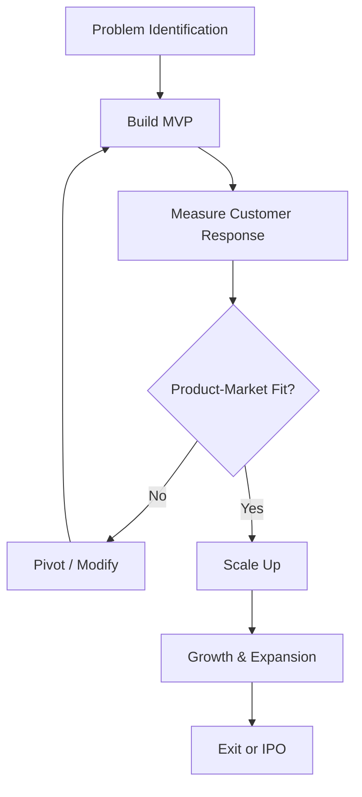

# Concept Features

## Video Explanation

* [https://www.youtube.com/watch?v=3gZz5c7X8l8](https://www.youtube.com/watch?v=3gZz5c7X8l8)

## Visual Aids

## 1. Definition

A start‑up is a young company founded to develop a unique product or service, bring it to market, and scale up rapidly under conditions of extreme uncertainty. It is a temporary organisation designed to search for a repeatable and scalable business model.

## 2. Concept Explanation

The basic idea behind a start‑up is different from simply starting a small shop. A start‑up is a venture that aims to solve a problem in a new or significantly better way, often using technology. The goal is not just to earn a steady profit from day one, but to find a business model that can grow to serve a large number of customers, sometimes all over the world.

How it works: A small team with a strong idea begins with a minimum viable product (MVP) – a simple version just good enough to test with customers. They gather feedback, learn, change features, and iterate rapidly. This cycle continues until they find a product‑market fit, meaning customers love the solution and are willing to pay for it. Once that fit is found, the start‑up focuses on scaling up – raising large investments, hiring more people, and expanding quickly.

Why it is important: Start‑ups drive innovation, create high‑quality employment, and solve pressing problems. For diploma engineers, start‑ups offer a platform to convert technical skills into a high‑growth business. Unlike a traditional business that competes on efficiency, a start‑up competes on speed, innovation, and disruption. Understanding the start‑up concept is essential to participate in the modern innovation economy.

## 3. Key Characteristics / Features

- **Innovation at core:** A start‑up is built around a novel idea, product, process, or service that differentiates it from existing solutions.
- **High scalability:** The business model is designed to grow exponentially without a proportional increase in costs.
- **Rapid experimentation:** Start‑ups use a build‑measure‑learn feedback loop; the product evolves based on real customer behaviour, not just internal belief.
- **Extreme uncertainty:** The market, technology, customer demand, and revenue model are unknown initially; the start‑up exists to resolve these unknowns.
- **Temporary phase:** A successful start‑up eventually becomes a large company, merges, or gets acquired; it is not intended to remain a small entity forever.
- **Funding through investment:** Instead of relying only on loans or personal savings, start‑ups often raise funds from angel investors, venture capital, or government schemes.
- **Flat and agile structure:** Teams are small, hierarchy is minimal, and decisions are made quickly to adapt to changes.

## 4. Types / Classification

Start‑ups can be classified based on their business model, technology, or market approach.

- **Technology‑led start‑up:** The core innovation is a new technology platform (e.g., an AI‑based app, a new material). These involve high R&D and patent filing.
- **E‑commerce and marketplace start‑up:** An online platform connecting buyers and sellers without holding inventory (e.g., an online handicraft marketplace).
- **Social impact start‑up:** Aims to solve a social or environmental problem while remaining financially sustainable (e.g., affordable water purification for villages).
- **Software‑as‑a‑Service (SaaS) start‑up:** Offers software on a subscription basis, hosted on the cloud (e.g., an inventory management app for small retailers).
- **Hardware/IoT start‑up:** Designs and builds physical connected devices (e.g., a smart energy metre start‑up).
- **Fintech, health‑tech, ed‑tech, agri‑tech:** Start‑ups focused on a specific sector using technology to disrupt traditional industry models.

## 5. Working / Mechanism

A typical start‑up journey follows a lean methodology.

1.  **Ideation and validation:** The founder identifies a problem and proposes a solution. Initial research and customer interviews check if the problem is real and painful.
2.  **Build a Minimum Viable Product (MVP):** Develop the simplest version of the product that can test the core value proposition.
3.  **Measure customer response:** Release the MVP to a small group of early adopters. Track user behaviour, feedback, and willingness to pay.
4.  **Learn and pivot or persevere:** Based on data, the start‑up either tweaks the product (persevere) or makes a fundamental change to the idea (pivot).
5.  **Achieve product‑market fit:** Identify a product feature set and customer segment where demand is high and organic growth begins.
6.  **Scale operations:** Raise growth capital, hire aggressively, ramp up marketing, automate processes, and expand to new geographies.
7.  **Exit or institutionalise:** The start‑up may get acquired by a larger company, launch an Initial Public Offering (IPO), or stabilise as a large private corporation.

## 6. Diagram

## 7. Mathematical Formulation

A simple start‑up valuation method (pre‑money valuation) reflects the concept of value potential before actual profit:

$$
\text{Pre‑money Valuation} = \frac{\text{Estimated Future Cash Flow} \times \text{Growth Rate}}{(\text{Discount Rate} - \text{Growth Rate})}
$$

A start‑up’s unit economics often uses:

$$
\text{CAC} = \frac{\text{Total Sales and Marketing Expense}}{\text{Number of New Customers Acquired}}
$$

$$
\text{LTV} = \text{Average Revenue per Customer} \times \frac{1}{\text{Churn Rate}}
$$

Where:  
- CAC = Customer Acquisition Cost  
- LTV = Lifetime Value of a customer  
- If LTV > 3 × CAC, the unit economics are considered healthy.

## 8. Example

A team of diploma engineers notices that local electricians struggle to manage service requests and billing. They develop “VoltBuddy,” a simple Android app that lets electricians schedule jobs, generate bills, and track payments. The team builds a basic app (MVP) and gives it to five electricians. Feedback reveals they need a voice input feature and a local language interface. The team iterates, adds these features, and soon 200 electricians use the app paying ₹200 per month. They raise ₹25 lakh from an angel investor to expand to five states. VoltBuddy is a software‑as‑a‑service start‑up that innovates, scales, and disrupts the skilled‑trade sector.

## 9. Analogy

A start‑up is like a search expedition to find a hidden treasure. You have a rough map (your idea), and you set out with limited provisions (the MVP). As you walk, you constantly check your compass (customer feedback) and adjust your route. Sometimes you realise the map is wrong and you turn to a completely different path (a pivot). A traditional business is like a well‑paved highway bus service – the route is fixed, demand is known, and the goal is efficient operation. A start‑up is more about exploration than exploitation.

## 10. Comparison

| Feature | Start‑up Venture | Traditional Small Business |
|--------|------------------|----------------------------|
| **Primary Goal** | Search for a repeatable, scalable business model; grow exponentially | Generate steady income; serve a local market with known demand |
| **Innovation** | Very high; creates something new or radically improved | Low to moderate; uses proven business models |
| **Growth Rate** | Designed for rapid, hockey‑stick growth | Organic, linear growth |
| **Funding** | Angel investors, venture capital, equity dilutions | Own savings, bank loans, retained earnings |
| **Risk** | Extremely high during the search phase; pivot is common | Moderate; business model is tested and stable |
| **Exit Strategy** | IPO, acquisition, merger | Rarely sold; often passed to the next generation |

## 11. Advantages

- **High wealth creation potential:** A successful start‑up can grow into a multi‑crore enterprise within a few years.
- **Unique problem solving:** Start‑ups address gaps that traditional businesses ignore, improving lives.
- **Job creation for skilled talent:** Start‑ups hire designers, developers, and engineers, generating high‑quality employment.
- **Attracts foreign investment:** Successful start‑ups bring FDI and boost the national economy.
- **Government support:** Initiatives like Start‑up India provide tax holidays, grants, incubation, and simplified compliance.
- **Personal fulfilment:** Founders find deep satisfaction in building something new and seeing it impact millions.

## 12. Disadvantages / Limitations

- **Very high failure rate:** Statistics show that over 90% of start‑ups fail, mostly due to no market need or cash crunch.
- **Intense stress and long hours:** Founders face constant uncertainty, investor pressure, and the risk of losing personal investment.
- **Cash‑burn without immediate revenue:** Many start‑ups spend heavily on customer acquisition and technology, staying loss‑making for years.
- **Team instability:** Early employees come and go; finding the right co‑founder and key talent is extremely hard.
- **Intellectual property theft risk:** Sharing the idea with investors or early customers can lead to imitation if not protected early.
- **Regulatory hurdles:** New business models often face legal grey areas (e.g., ride‑sharing, crypto), causing sudden shutdowns or bans.

## 13. Important Points / Exam Notes

- A start‑up is not a small version of a big company; it is a temporary organisation searching for a business model.
- Key terms: MVP (minimum viable product), pivot, product‑market fit, burn rate, runway, valuation, angel investor.
- As per Government of India, a start‑up is an entity less than 10 years old with turnover under ₹100 crore, working towards innovation or scalability.
- Start‑ups can register with DPIIT (Department for Promotion of Industry and Internal Trade) to avail benefits.
- Unicorn: a start‑up valued at over $1 billion.
- Common stages: pre‑seed, seed, Series A, B, C funding rounds.
- A start‑up mindset includes fail fast, learn quickly, and keep customer feedback at the centre.
- Co‑founder disputes and cash burnout (running out of money) are the top internal reasons for start‑up failure.
- Engineering diploma holders can start hardware, IoT, agri‑tech, or clean‑tech ventures with low‑cost prototypes.
- The Indian start‑up ecosystem is among the top three in the world, with hubs in Bengaluru, Delhi‑NCR, Mumbai, and Hyderabad.

## 14. Applications / Use Cases

- **Health‑tech start‑up:** A diploma biomedical engineer develops a low‑cost portable ECG device that transmits results to a doctor’s app.
- **E‑commerce platform:** A diploma computer science graduate builds a hyperlocal delivery app for grocery stores in a small city.
- **Electric vehicle start‑up:** A diploma mechanical engineer designs a retro‑fit kit to convert petrol two‑wheelers to electric.
- **Agri‑tech start‑up:** A team uses IoT sensors to advise farmers on irrigation and pesticide schedule, reducing water and chemical use.
- **Ed‑tech start‑up:** An interactive lab simulation platform for polytechnic students, built by recent graduates, allowing virtual practical labs.

## 15. MCQs

**Q1. A start‑up is best described as a**

A. Large manufacturing corporation  
B. Government department  
C. Temporary organisation searching for a scalable business model  
D. A charity organisation  

**Answer:** C  
**Explanation:** A start‑up is designed to discover a repeatable and scalable model.

---

**Q2. What does MVP stand for in start‑up terminology?**

A. Maximum Viable Product  
B. Minimum Viable Product  
C. Most Valuable Proposition  
D. Mass Volume Production  

**Answer:** B  
**Explanation:** MVP is the simplest version of a product to test the market with minimum effort.

---

**Q3. A key characteristic of a start‑up is its focus on**

A. Linear and slow growth  
B. Rapid scaling and high growth potential  
C. Avoiding any use of technology  
D. Maintaining exactly the same product for decades  

**Answer:** B  
**Explanation:** Start‑ups are built for exponential, scalable growth.

---

**Q4. ‘Product‑market fit’ occurs when**

A. The product is launched on a weekend  
B. Customers actively use and love the product, showing strong demand  
C. The company files its first tax return  
D. The founders decide to leave the company  

**Answer:** B  
**Explanation:** It indicates the product satisfies real market need and has demand.

---

**Q5. Which of the following is NOT a typical source of funding for a start‑up?**

A. Venture capital  
B. Angel investment  
C. Provident fund loan to employees  
D. Government seed fund schemes  

**Answer:** C  
**Explanation:** Start‑ups raise from VC, angels, and government grants; provident fund loans are not a standard funding source.

---

**Q6. A ‘unicorn’ in the start‑up world refers to a company valued at**

A. ₹100 crore  
B. Over $1 billion  
C. At least $100 million  
D. Just ₹1 crore  

**Answer:** B  
**Explanation:** A unicorn is a privately held start‑up with a valuation exceeding one billion dollars.

---

**Q7. Pivoting in a start‑up context means**

A. Firing all employees  
B. Making a fundamental change to the product or business model based on feedback  
C. Closing the company permanently  
D. Buying another company  

**Answer:** B  
**Explanation:** A pivot is a structured course correction to test a new hypothesis about the product or strategy.

---

**Q8. The main reason for the high failure rate of start‑ups is**

A. Too much government support  
B. No market need for the product  
C. Excess of profit in the first month  
D. Lack of social media presence  

**Answer:** B  
**Explanation:** Building something nobody wants is the most common cause of failure.

---

**Q9. The “build‑measure‑learn” loop is associated with which methodology?**

A. Waterfall development  
B. Traditional manufacturing  
C. Lean start‑up methodology  
D. Six Sigma only  

**Answer:** C  
**Explanation:** The lean start‑up approach uses this feedback loop to reduce uncertainty.

---

**Q10. A diploma engineer starts a company that uses drones to deliver medical supplies in hilly areas and plans to scale across the country. This is an example of a**

A. Traditional kirana store  
B. Government public sector unit  
C. Start‑up venture  
D. Sole proprietorship with no plans to grow  

**Answer:** C  
**Explanation:** It uses innovation, technology, and aims for large‑scale impact, fitting the start‑up definition.