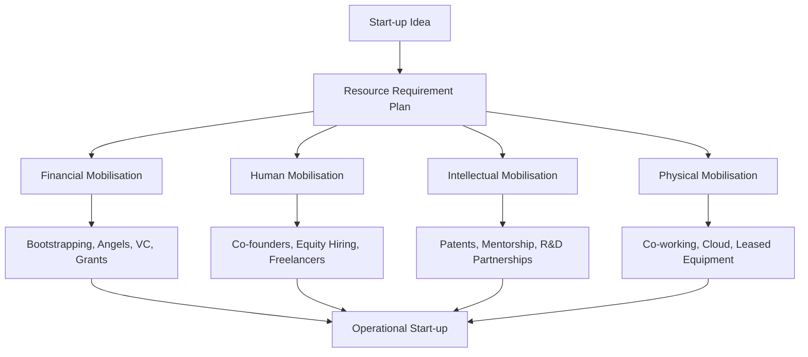

# Mobilisation of resources by start ups Financial Human Intellectual and Physical

## Video Explanation

* [https://www.youtube.com/watch?v=1e9aM4Kz1bQ](https://www.youtube.com/watch?v=1e9aM4Kz1bQ)

## Visual Aids

## 1. Definition

Resource mobilisation for start-ups refers to the process of identifying, acquiring, and effectively utilising the essential inputs — money, people, knowledge, and physical assets — required to launch and grow a new venture. It is the strategic activity of gathering the right resources in the right quantity at the right time without breaking the fledgling enterprise.

## 2. Concept Explanation

A start-up begins with an idea, but an idea alone cannot create a business. The basic idea behind resource mobilisation is that every venture needs a mix of four fundamental resources to function: financial capital, human talent, intellectual property or know-how, and physical infrastructure. Start-ups usually lack these resources initially. Mobilisation is the art of acquiring them through creative, low-cost, and strategic means.

How it works: The founders first map out exactly what resources are critical at each stage. They then tap into various sources: personal savings, angel investors, government grants, and venture capital for money; co-founders, freelancers, and employee stock options for people; patents, mentorship, and research partnerships for intellectual assets; and co-working spaces, rented equipment, and shared infrastructure for physical resources. The start-up assembles these piece by piece, often doing more with less.

Why it is important: Many brilliant ideas die because the entrepreneur cannot muster the needed resources. Effective mobilisation bridges the gap between a concept and a functioning company. It reduces time to market, lowers initial risk, and creates the foundation for scaling. Without it, a start-up remains just a dream.

## 3. Key Characteristics / Features

- **Multiple Resource Categories:** Start-ups must address four key pillars simultaneously: finance, human capital, intellectual property, and physical infrastructure. Neglecting any one can stall growth.
- **Lean and Frugal Approach:** Unlike established firms, start-ups often mobilise resources on a shoestring budget, using bootstrapping, barter, and shared economy models.
- **Stage-Dependent Intensity:** The need for each resource changes with the lifecycle — a pre-revenue start-up desperately needs intellectual and human resources, while a scaling start-up requires heavy financial and physical resources.
- **High Dependence on Founder's Network:** Start-ups primarily rely on the personal and professional networks of founders to access initial funding, talent, and advice, rather than institutional channels.
- **Use of Non-Traditional Sources:** Start-ups increasingly use crowdfunding, incubators, remote freelancers, open-source intellectual property, and cloud-based physical resources to mobilise assets without huge upfront investment.

## 4. Types / Classification (The Four Key Resources)

Resources that a start-up must mobilise are classified into four main types.

- **Financial Resources:** The money required to fund operations, product development, marketing, and expansion. Sources include personal savings (bootstrapping), family and friends, angel investors, venture capital, bank loans, government grants, and crowdfunding.
- **Human Resources:** The people who work on the venture, from co-founders and core team to part-time specialists. Start-ups mobilise human resources by offering equity (ESOPs), flexible work environments, challenging roles, and a compelling vision.
- **Intellectual Resources:** The knowledge, ideas, proprietary technology, brand, patents, and data that give the start-up a competitive edge. These are mobilised through research, partnerships with universities, mentorship, licensing technology, and hiring experts.
- **Physical Resources:** The tangible assets like office space, machinery, computers, inventory, and logistics infrastructure. Start-ups often mobilise these through co-working spaces, equipment leasing, on-demand manufacturing, and third-party fulfilment centres.

## 5. Working / Mechanism

The process of mobilising each resource type follows a sequential and parallel approach.

1.  **Financial Mobilisation:** The founder prepares a financial model quantifying the funding needed. They first invest personal savings, then approach friends and family. A pitch deck is created to present to angel investors and venture capitalists. Government schemes and bank loans are explored simultaneously. Funds are released in tranches based on milestones.
2.  **Human Resource Mobilisation:** Co-founders are brought on board with complementary skills. The initial team is hired from the founder's network, often working for equity or deferred salaries. Freelancers and interns fill skill gaps without long-term commitments. A strong company culture and ESOP pool attract talent later.
3.  **Intellectual Resource Mobilisation:** The start-up protects its core idea through patents, trademarks, or simple non-disclosure agreements. It builds industry knowledge by joining incubators, attending conferences, and hiring veteran mentors as advisors. Research collaboration with labs or universities may provide patents and technical know-how.
4.  **Physical Resource Mobilisation:** Instead of buying assets, the start-up rents or shares office space, uses cloud computing instead of servers, and opts for third-party logistics instead of owning a delivery fleet. Manufacturing is often subcontracted to reduce the need for heavy machinery.
5.  All mobilisation activities are coordinated so that financial resources are available to pay for human talent, which then develops the intellectual property, while necessary physical infrastructure is put in place just in time for launch. The entire mechanism is dynamic, continually reassessed, and gradually professionalised as the start-up grows.

## 6. Diagram

## 7. Mathematical Formulation

Not applicable for this topic.

## 8. Example

GreenBox, an agri-tech start-up, plans to sell IoT-based cold storage boxes to farmers. The founders first invest ₹5 lakhs of their own money (financial bootstrapping). They bring in a tech-savvy co-founder by offering 20% equity (human). They partner with a university's engineering lab to test the IoT prototype and get mentorship on patent filing (intellectual). They rent a small co-working facility, use cloud platforms for data, and contract a local fabrication unit to manufacture the box (physical). Through this multi-pronged mobilisation, GreenBox launches a working product without heavy debt or asset purchase.

## 9. Analogy

Consider building a cricket team for a local tournament. You need money for kit and travel (financial), good players (human), a game plan and a coach's advice (intellectual), and a ground and stumps (physical). A clever manager might raise money from the colony, scout players from the neighbourhood, borrow a strategy from a YouTube coach, and practise on the shared community ground. A start-up does exactly this: it creatively pulls together all four types of resources on a tight budget to compete and win.

## 10. Comparison

| Feature | Financial Resources | Human Resources |
|--------|---------------------|-----------------|
| Meaning | Money needed to fund all activities. | People with skills who execute the work. |
| Examples | Bootstrapping, venture capital, bank loans. | Co-founders, employees, freelancers, advisors. |
| Mobilisation Strategy | Pitching to investors, leveraging government schemes. | Offering equity, flexible work, compelling mission. |
| Risk of Shortage | Unable to pay bills or scale; cash crunch. | Lack of expertise, delayed product, burnout. |

## 11. Advantages

- Creative resource mobilisation allows start-ups to launch with minimal capital and survive the early "valley of death".
- Using equity and flexible work models attracts passionate talent who are personally invested in success.
- Intellectual resource mobilisation creates a defensible moat around the start-up's unique innovation, enhancing valuation.
- Sharing and leasing physical resources keep fixed costs low, improving cash flow and agility.
- Accessing government start-up grants and incubator resources provides accredited support and validation for further funding.

## 12. Disadvantages / Limitations

- Over-reliance on equity as compensation can dilute the founder's share significantly over multiple funding rounds.
- Lean physical resources (e.g., co-working, cloud) might not be sufficient for regulated industries requiring dedicated, secure facilities.
- Intellectual property battles can drain resources; without proper legal protection, core ideas can be easily copied.
- Mobilising highly skilled human resources is extremely competitive, and a single wrong hire can severely disrupt a tiny team.
- Financial mobilisation from multiple investors can lead to conflicting demands on strategy and unrealistic growth pressures.

## 13. Important Points / Exam Notes

- Star-tups need to mobilise four critical resources: financial, human, intellectual, and physical.
- Bootstrapping (using personal savings) is the most common initial financial resource for many founders.
- ESOPs (Employee Stock Ownership Plans) are a key tool for human resource mobilisation when cash is short.
- Intellectual resources include patents, trade secrets, and knowledge gained from mentors and incubators.
- Start-ups prefer "asset-light" models for physical resources — renting instead of buying, using cloud instead of servers.
- The government of India supports resource mobilisation through schemes like Startup India Seed Fund, Atal Incubation Centres, and tax holidays.

## 14. Applications / Use Cases

- **Ed-tech Start-up:** Mobilises financial resources from education-focused venture capitalists; human resources — teachers and content creators — on contract; intellectual resource — curriculum design and learning pedagogy; physical resources — cloud platform for video delivery.
- **Direct-to-Consumer (D2C) Food Brand:** Uses crowdfunding for initial production; hires food technologists and home bakers as partners; trademarks the brand name; uses shared commercial kitchen spaces and third-party logistics for delivery.
- **Electric Vehicle Start-up:** Raises series A funding for R&D; recruits battery scientists and automotive engineers through ESOPs; files patents for battery management system; manufactures prototypes at an incubator's test lab rather than building own factory.
- **Health-tech App:** Takes a small innovation grant from the biotechnology department; brings in doctors as advisors (intellectual); uses freelancers for app development; hosts on cloud with no physical server room.
- **Agri-logistics Platform:** Gets bank loan under Mudra scheme; hires local village youth as micro-entrepreneurs; uses GPS route intelligence developed in partnership with a tech institute; sets up collection centres in rented godowns.

## 15. MCQs

**Q1. Which of the following is an example of physical resource mobilisation by a start-up?**

A. Filing a patent for a new device  
B. Hiring a Chief Technology Officer  
C. Using a co-working space instead of a leased office  
D. Raising funds from an angel investor  
**Answer:** C  
**Explanation:** Physical resources include tangible infrastructure; co-working is a smart way to manage physical space without long-term commitment.

**Q2. ESOPs (Employee Stock Ownership Plans) are primarily used to mobilise which resource?**

A. Financial resources  
B. Human resources  
C. Intellectual resources  
D. Physical resources  
**Answer:** B  
**Explanation:** ESOPs give employees a stake in the company, attracting skilled human talent when cash is limited.

**Q3. The term "bootstrapping" in start-up resource mobilisation refers to:**

A. Launching a footwear business  
B. Using personal savings and operating revenues to fund the venture  
C. Raising money through venture capital  
D. Taking large bank loans  
**Answer:** B  
**Explanation:** Bootstrapping means funding the start-up internally without external investors, relying on personal finances and early sales.

**Q4. Which resource type does a start-up’s registered trademark belong to?**

A. Financial resource  
B. Human resource  
C. Intellectual resource  
D. Physical resource  
**Answer:** C  
**Explanation:** Trademarks, patents, and proprietary knowledge are classified as intellectual resources.

**Q5. A start-up partners with a university lab to test its hardware prototype. This primarily mobilises:**

A. Financial resources  
B. Human resources  
C. Intellectual and physical resources  
D. Only financial resources  
**Answer:** C  
**Explanation:** The lab provides technical knowledge (intellectual) and testing facilities (physical).

**Q6. Which of the following is a disadvantage of using equity to mobilise human resources?**

A. It attracts unmotivated employees  
B. Founder's ownership percentage gets diluted over time  
C. It increases monthly cash outflow immediately  
D. It is illegal in India  
**Answer:** B  
**Explanation:** Giving away equity reduces the founder’s share of the company, which can be a problem in later funding rounds.

**Q7. Cloud computing services for a start-up are a way to mobilise:**

A. Financial resources  
B. Human resources  
C. Intellectual resources  
D. Physical resources (virtually)  
**Answer:** D  
**Explanation:** Cloud replaces physical servers, providing computational infrastructure in an asset-light model.

**Q8. The Startup India Seed Fund Scheme is a government initiative to help start-ups with:**

A. Physical office space  
B. Intellectual property rights alone  
C. Financial resources in the early stage  
D. Hiring international CEOs  
**Answer:** C  
**Explanation:** The seed fund provides early-stage financial support to start-ups for proof of concept and prototype development.

**Q9. A start-up that relies heavily on free open-source software is primarily mobilising:**

A. Financial resources  
B. Intellectual resources  
C. Physical resources  
D. Human resources  
**Answer:** B  
**Explanation:** Open-source software is a form of intellectual resource available without direct cost.

**Q10. Which resource mobilisation strategy is most characteristic of an "asset-light" start-up model?**

A. Purchasing a large factory building  
B. Leasing equipment and using shared infrastructure  
C. Hiring only full-time permanent employees  
D. Keeping all intellectual property unregistered  
**Answer:** B  
**Explanation:** Asset-light start-ups minimise ownership of physical assets, preferring lease and pay-per-use models to preserve cash.