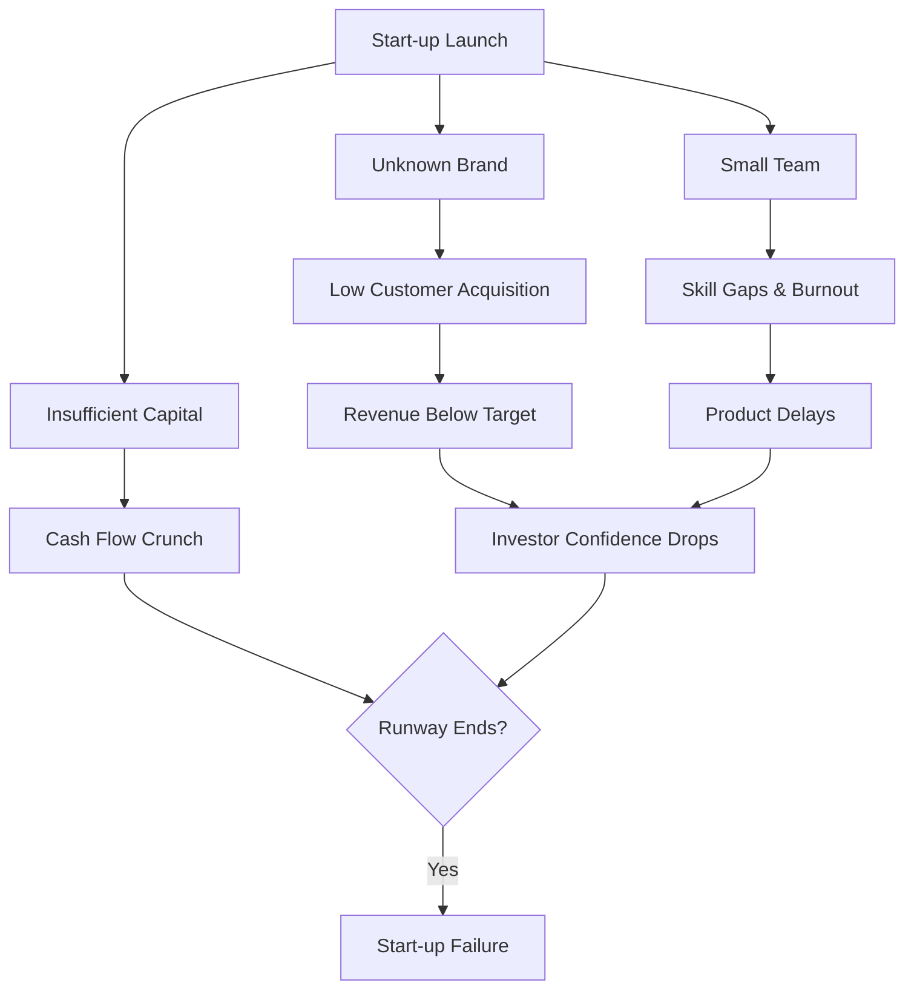

# Problems and Challenges Faced by Start-ups

## 1. Definition

Start-up problems and challenges refer to the obstacles, difficulties, and risks that new ventures typically face during their early stages of operation. These issues span finance, market, team, operations, and legal aspects, and can threaten the survival and growth of the business if not managed properly.

---

## 2. Concept Explanation

Starting a new business is exciting, but it is also extremely difficult. The basic idea is that a start‑up operates with limited resources, no reputation, and an unproven idea. Many things can go wrong, and the founders must solve problems continuously.

How it works: A start‑up begins with a great idea, but transforming that idea into a selling product requires money, skilled people, and customers. At each step, obstacles appear. The founders may run out of cash before sales grow. The product may not get market acceptance. Hiring good people is difficult without big salary offers. Legal compliances and paperwork slow down the speed. These challenges test the resilience and creativity of the entrepreneur.

Why it is important: Understanding common start‑up problems prepares entrepreneurs for reality. Preventing or managing these challenges increases the chance of survival. Investors, governments, and support organisations focus on helping start‑ups overcome these very problems. A start‑up that identifies its challenges early can build a risk mitigation plan and pivot if needed.

---

## 3. Key Characteristics / Features

- **Resource shortage:** Start‑ups lack sufficient money, skilled manpower, and infrastructure compared to established firms.
- **Uncertain demand:** The customer base is not proven; revenue forecasts are projections, not certainties.
- **High failure rate:** Statistically, a large percentage of start‑ups close within the first few years due to multiple problems.
- **Multidimensional nature:** Challenges come from finance, marketing, technology, legal, operations, and team management simultaneously.
- **Dynamic and evolving:** The nature of challenges changes as the start‑up moves from idea to growth stage.
- **Founder dependency:** Early start‑ups are heavily dependent on the founder(s); if the founder burns out or leaves, the venture often fails.
- **External factors:** Economic downturns, regulation changes, and competitor actions add to internal problems.

---

## 4. Types / Classification

Start‑up challenges can be grouped into the following categories:

- **Financial challenges:** Insufficient initial capital, difficulty in raising funds, poor cash‑flow management, delayed payments from customers, and high burn rate.
- **Market challenges:** Low customer awareness, intense competition, difficulty in communicating unique value, pricing pressure, and changing market trends.
- **Team and human resource challenges:** Finding co‑founders with complementary skills, hiring quality talent, high attrition, and maintaining team morale with limited resources.
- **Operational and technical challenges:** Product development delays, quality issues, supply chain disruptions, absence of standard processes, and technology failures.
- **Legal and regulatory challenges:** Multiple licenses and compliances, intellectual property protection, contract disputes, and changing government policies.
- **Strategic and scaling challenges:** Pivoting at the right time, maintaining culture during growth, and avoiding premature scaling that exhausts cash.

---

## 5. Working / Mechanism (How challenges typically arise)

1. The founder invests personal savings and develops a prototype. At this stage, cash is burning while no revenue comes in – **cash‑flow challenge**.
2. A small batch is launched in the market. Customer response is lukewarm because the brand is unknown – **market acceptance challenge**.
3. To improve the product, the founder tries to hire a developer, but cannot match the salary offered by big companies – **talent acquisition challenge**.
4. A competitor with deep pockets launches a similar product at a discount – **competition challenge**.
5. Orders start growing, and the founder quickly scales production. Quality slips and returns increase – **operational scaling challenge**.
6. In the rush, legal documents like supplier contracts and employee agreements are ignored. A co‑founder leaves and demands a stake settlement – **legal and team conflict challenge**.
7. The founder realises that keeping up with tax filings, GST, and state‑level factory rules is taking up huge time and requires expensive consultants – **compliance challenge**.

These challenges often occur together, forming a cycle that tests the start‑up’s existence.

---

## 6. Diagram

---

## 7. Mathematical Formulation

*There is no single formula for start‑up challenges, but a useful survival metric is the start‑up survival rate:*

$$
\text{Survival Rate} = \frac{\text{Number of start‑ups still active after } t \text{ years}}{\text{Total start‑ups started at the beginning}} \times 100\%
$$

Where:  
- \( t \) is typically 1, 3, or 5 years.  
- A low survival rate indicates that the challenges faced are collectively severe enough to close many businesses.

---

## 8. Example

**“FreshFridge”** is a start‑up offering IoT‑enabled mini‑fridges to offices.

- **Financial challenge:** Raised ₹30 lakh from family but blew 70% on product development. Could not pay for marketing.
- **Market challenge:** Offices saw the product as an expensive luxury; only 3 sales in 4 months.
- **Technical challenge:** The IoT sensor failed in humid conditions, causing returns.
- **Team challenge:** The hardware engineer left, leaving the founder alone to fix firmware bugs.
- **Legal challenge:** The start‑up missed GST registration, and a notice was issued when a corporate client demanded a GST invoice.

These problems combined forced FreshFridge to halt operations, and the founder eventually pivoted to selling only the sensor component to AC manufacturers – a lesson in managing challenges and being flexible.

---

## 9. Analogy

A start‑up is like a tiny boat trying to cross an ocean. The large waves are the financial crashes; the stormy winds are cut‑throat competition; the leak in the boat is the problem of skill shortage; and the changing currents are market shifts. If the captain (founder) does not constantly pump water out, adjust the sail, and steer, the boat will sink. Only those who have a sturdy boat, a good team, and the ability to navigate rough seas reach the other shore.

---

## 10. Comparison (Start‑up Challenges vs. Established Business Problems)

| Feature | Start‑up Challenges | Established Business Problems |
|--------|---------------------|--------------------------------|
| Risk level | Very high – survival is the main objective | Moderate – concern is sustaining growth |
| Cash cushion | Minimal; very sensitive to cash gaps | Better cash reserves and credit lines |
| Brand trust | Non‑existent, need to build from zero | Established reputation aids sales |
| Process maturity | No defined processes; everything is experimental | Structured processes lead to predictable operations |
| Talent acquisition | Difficult due to low salary and job insecurity | Easier due to brand and better compensation |
| Regulatory handling | Often neglected or delayed | Dedicated legal and compliance teams |

---

## 11. Advantages (of Understanding and Overcoming These Challenges)

- The founder builds personal resilience, decision‑making skills, and the ability to handle pressure.
- Overcoming each challenge forces process improvements and creates a durable business model.
- Early mistakes teach valuable lessons that large companies sometimes never learn.
- A start‑up that survives heavy challenges becomes a strong, respected brand with a loyal early customer base.
- Investors prefer founders who have demonstrably solved tough problems over those with untested ideas.
- Crisis management capability developed in the early days becomes a competitive edge later.

---

## 12. Disadvantages / Limitations (If Challenges Are Not Managed)

- Uncontrolled cash‑flow problems lead to sudden closure, even if the product is good.
- Loss of key team members due to high workload and low salary can derail product timelines permanently.
- Persistent market rejection without a pivot causes complete failure.
- Ignoring legal compliance invites penalties, lawsuits, and even cancellation of business registration.
- Founder burnout and mental health stress are common and can destroy the venture from within.
- A damaged reputation from poor‑quality products or missed deliveries is extremely hard to repair for a new brand.

---

## 13. Important Points / Exam Notes

- Start‑ups face multidimensional problems: financial, market, team, operational, legal, and strategic.
- Financial challenges are the number one reason for start‑up failure – specifically, running out of cash.
- Classic start‑up failure curve: high excitement, resource burn, delayed revenue, cash crisis, shutdown.
- Founders must be flexible: pivoting (changing business model) is a common response to market challenges.
- Legal challenges include licenses, GST, contracts, and intellectual property; ignoring them is risky.
- A minimum viable product (MVP) helps test market with minimal cost, reducing financial and market risks.
- Building a complementary team is critical; one‑person shows rarely survive all challenges.
- Government schemes and incubators exist specifically to help start‑ups overcome these hurdles.

---

## 14. Applications / Use Cases

- **Business planning:** Entrepreneurs list potential challenges and prepare contingency plans for each category.
- **Pitching to investors:** A start‑up that clearly explains the risks and its mitigation strategy appears more credible.
- **Policy making:** Governments design start‑up policies (seed funds, incubation, single‑window clearance) to reduce these common challenges.
- **Education and incubation:** B‑schools and incubator programmes use these challenges as a framework to coach new founders.
- **Self‑evaluation:** A founder periodically reviews which challenge (cash, team, market) is currently the most threatening and prioritises action.

---

## 15. MCQs

**Q1. Which of the following is the most common reason for start‑up failure?**  
A. Too many employees  
B. Running out of cash  
C. Excessive profits  
D. Strong market demand  
**Answer:** B  
**Explanation:** Cash‑flow shortage is the top killer of early‑stage businesses.

**Q2. Market challenges for a start‑up typically include:**  
A. Low raw material cost  
B. Unknown brand and difficulty acquiring customers  
C. Abundant cash reserves  
D. Fully automated compliance  
**Answer:** B  
**Explanation:** New ventures lack reputation, making customer acquisition expensive and slow.

**Q3. A “pivot” in start‑up terminology means:**  
A. Firing all employees  
B. Changing the business model or product direction based on feedback  
C. Buying a big company  
D. Paying off all debts  
**Answer:** B  
**Explanation:** Pivot is a strategic shift made to overcome market or product challenges and find a better fit.

**Q4. Legal challenges for a start‑up in India often include:**  
A. Immediate IPO listing  
B. Delayed or incomplete GST registration and missing licenses  
C. Zero tax liability always  
D. Automatic patent grant  
**Answer:** B  
**Explanation:** Start‑ups frequently overlook tax and regulatory registrations, leading to notices and penalties.

**Q5. Talent acquisition is harder for start‑ups because:**  
A. They can offer unlimited holidays  
B. They often cannot match the salaries and job security of established firms  
C. No one wants to work in start‑ups  
D. They require no skills at all  
**Answer:** B  
**Explanation:** Limited budgets and perceived instability make attracting skilled employees difficult.

**Q6. The start‑up survival rate after 5 years is typically:**  
A. 100%  
B. Around 50% or less, depending on the industry  
C. Exactly 0%  
D. Guaranteed by the government  
**Answer:** B  
**Explanation:** Statistics show that roughly half or fewer of all new start‑ups survive beyond five years due to various challenges.

**Q7. Operational challenges include:**  
A. Having too much cash  
B. Product quality issues and supply chain disruptions  
C. Brand loyalty from day one  
D. No need for any processes  
**Answer:** B  
**Explanation:** Start‑ups often lack mature processes, causing product delays and quality inconsistencies.

**Q8. Which of the following is NOT a typical start‑up challenge?**  
A. Difficulty in raising funds  
B. Established global brand from day one  
C. Lack of skilled team  
D. Regulatory compliance burden  
**Answer:** B  
**Explanation:** Brand recognition is built over time; no start‑up begins with a worldwide established reputation.

**Q9. Market acceptance challenge can be reduced by:**  
A. Ignoring customer feedback  
B. Launching a Minimum Viable Product (MVP) to test and improve  
C. Spending all money on office decoration  
D. Keeping the product secret forever  
**Answer:** B  
**Explanation:** An MVP allows early user feedback, reducing the risk of market rejection.

**Q10. Why is understanding start‑up challenges important for an entrepreneur?**  
A. It guarantees 100% success  
B. It helps in better planning, risk management, and avoiding common pitfalls  
C. It is only useful for statistics  
D. It reduces the need for any capital  
**Answer:** B  
**Explanation:** Awareness of pitfalls allows proactive measures, increasing the probability of survival.