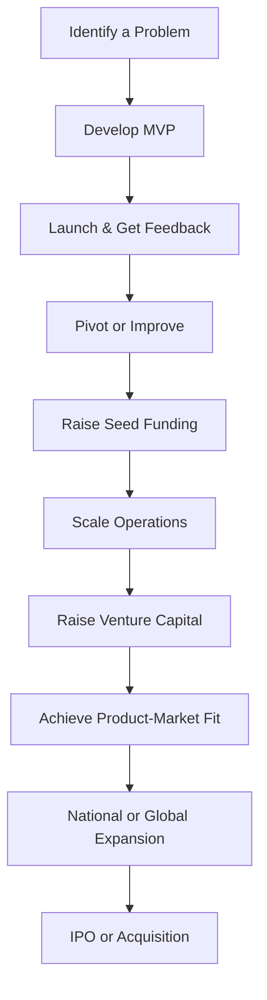

# Start up Ventures in India Contemporary Success Stories and Case Studies

## Video Explanation

* [https://www.youtube.com/watch?v=HfZy6sUeP6A](https://www.youtube.com/watch?v=HfZy6sUeP6A)

## Visual Aids

## 1. Definition

A start-up success story is a real-life account of a new business venture that grew from an idea into a profitable and recognized company. A case study is a detailed analysis of such a venture, examining its journey, challenges, strategies, and achievements.

## 2. Concept Explanation

The basic idea behind studying contemporary Indian start-up success stories is to understand how young entrepreneurs built scalable businesses despite limited resources. These stories show the path from identifying a market problem to developing a solution, raising funds, and achieving growth.

How it works: Each success story follows a pattern of problem recognition, product development, market entry, funding rounds, scaling operations, and eventually becoming a market leader. Students learn real-world applications of business concepts like lean start-up, pivoting, customer acquisition, and unit economics.

Why it is important: These stories inspire new entrepreneurs, provide practical lessons, demonstrate resilience, and highlight the role of innovation and technology in solving Indian problems. They also show how government policies like Start-up India support new ventures.

## 3. Key Characteristics / Features

- **Problem-solving orientation:** Successful Indian start-ups solve real and urgent problems faced by consumers or businesses.
- **Scalable business model:** They have the ability to grow rapidly without a proportional increase in costs.
- **Use of technology:** Most contemporary success stories leverage digital platforms, apps, or data analytics.
- **Access to funding:** They successfully raised capital from angel investors, venture capitalists, or public markets.
- **Strong leadership:** Founders demonstrate vision, adaptability, and persistence through failures and setbacks.
- **Customer focus:** These start-ups continuously collect feedback and improve their products or services.
- **Social impact:** Many success stories also create jobs and contribute to the economy.

## 4. Types / Classification

Indian start-up success stories can be classified by their industry sector:

| Sector | Examples |
|--------|----------|
| E-commerce | Flipkart, Nykaa, Meesho |
| Fintech | Paytm, Razorpay, PolicyBazaar |
| Food tech | Zomato, Swiggy |
| Edtech | Byju's (early success), Unacademy |
| Mobility | Ola, OYO (travel/hospitality) |
| Healthtech | Practo, PharmEasy |
| SaaS (Software as a Service) | Freshworks, Zoho |

Another classification is by growth stage:
- **Unicorns:** Start-ups valued at over $1 billion (e.g., Zomato, Ola, Razorpay)
- **Soonicorns:** Start-ups close to reaching unicorn status
- **Profitable start-ups:** Those that have achieved net profit without unicorn valuation (e.g., Zoho)

## 5. Working / Mechanism

The journey of a successful Indian start-up typically follows these steps:

1. **Identify a problem:** Founders observe a common inconvenience or gap in the market within India.
2. **Develop a minimum viable product (MVP):** They build a basic version of the solution to test with early users.
3. **Launch and gather feedback:** The start-up releases the MVP to a small group and collects user responses.
4. **Pivot or improve:** Based on feedback, the founders modify the product or business model.
5. **Raise seed funding:** They approach angel investors or incubators for initial capital.
6. **Scale operations:** With funding, they expand the team, improve technology, and increase marketing.
7. **Raise venture capital:** For rapid growth, they secure Series A, B, C funding from venture capital firms.
8. **Achieve product-market fit:** The start-up reaches a stage where customers consistently use and pay for the product.
9. **Expand nationally or globally:** They enter new cities or countries.
10. **Exit or IPO:** Founders may take the company public (IPO) or sell it to a larger corporation.

## 6. Diagram

## 7. Mathematical Formulation

Not applicable for this topic.

## 8. Example

**Case Study: Zomato**

Zomato started in 2008 as "FoodieBay" by Deepinder Goyal and Pankaj Chaddah. The idea came when they observed that customers in restaurants struggled to see menus. They first scanned menus of Delhi-NCR restaurants and put them online.

Initially, Zomato was a simple menu-listing website. Over time, they added restaurant ratings, reviews, and photos. They faced competition but kept improving. In 2010, they raised seed funding from Info Edge. By 2014, Zomato expanded to 22 countries.

The company faced challenges such as burning cash on expansion and the COVID-19 pandemic. They pivoted to food delivery, acquired Uber Eats India, and cut losses. In 2021, Zomato launched its Initial Public Offer (IPO), which was oversubscribed. Today, Zomato is a listed company and a leader in food delivery and restaurant discovery in India.

Key lessons: Persistence, ability to pivot, use of data, and understanding customer behaviour.

## 9. Analogy

A start-up success story is like a seed growing into a big tree. The seed is the business idea. Soil represents the market demand. Water and sunlight are funding and mentorship. Pruning represents pivoting or removing bad features. The tree finally bears fruit when the start-up becomes profitable or gets listed on the stock exchange.

## 10. Comparison

| Feature | Zomato (Food tech) | Paytm (Fintech) |
|---------|--------------------|-----------------|
| Year founded | 2008 | 2010 |
| Founder(s) | Deepinder Goyal, Pankaj Chaddah | Vijay Shekhar Sharma |
| Main product | Restaurant discovery and food delivery | Digital payments and financial services |
| Initial problem | No online restaurant menus | Difficult to pay mobile bills online |
| Key funding source | Info Edge, Ant Group, SoftBank | Alibaba, SoftBank, Berkshire Hathaway |
| Current status | Publicly listed (IPO 2021) | Publicly listed (IPO 2021) |
| Unique challenge | High cash burn on delivery | Competition from Google Pay, PhonePe |

## 11. Advantages

- **Inspiration for new entrepreneurs:** Success stories motivate students and first-time founders to take risks.
- **Practical learning:** They teach real-world strategies that textbooks cannot provide.
- **Understanding failure points:** Studying failures within success stories helps avoid common mistakes.
- **Evidence of Indian market potential:** These cases prove that Indian consumers are ready for digital and innovative products.
- **Role model creation:** Successful founders become mentors and investors for the next generation.

## 12. Disadvantages / Limitations

- **Survivorship bias:** We only see stories of successful start-ups, while thousands fail without visibility.
- **Unique circumstances not replicable:** Luck, timing, and specific networks cannot be copied.
- **Oversimplification:** Case studies often skip day-to-day struggles and focus only on highlights.
- **Rapidly changing context:** A success story from five years ago may no longer be relevant due to market shifts.
- **Overemphasis on funding:** Many students wrongly believe that raising money equals success.

## 13. Important Points / Exam Notes

- First Indian start-up to become a unicorn: **Flipkart** (2014, valued at $1 billion).
- Zomato and Paytm both had their IPOs in **2021**.
- OYO was founded by **Ritesh Agarwal** at the age of 19.
- Razorpay is India’s first fintech unicorn, founded by **Harshil Mathur and Shashank Kumar**.
- Nykaa, founded by **Falguni Nayar**, became India's first woman-led unicorn to go public.
- Meesho is a social commerce platform that helped small sellers and resellers.
- The **Start-up India** scheme (launched 2016) provides tax benefits and funding support.
- Unicorn count in India crossed **100** in 2023.
- Freshworks became the first Indian SaaS start-up to list on **Nasdaq** in 2021.
- Common reasons for failure include lack of product-market fit, running out of cash, and poor team dynamics.

## 14. Applications / Use Cases

- **Entrepreneurship education:** Teachers use these case studies to explain business models, marketing, and finance.
- **Investor decision making:** Venture capitalists analyse past success stories to identify future winners.
- **Government policy design:** Success stories show which sectors need support, such as fintech or edtech.
- **Corporate innovation:** Large companies study start-ups to learn agility and customer focus.
- **Start-up incubators:** Mentors use case studies to train new founders on scaling strategies.

## 15. MCQs

**Q1. Which Indian start-up became the country's first unicorn in 2014?**  
A. Zomato  
B. Paytm  
C. Flipkart  
D. Ola  
**Answer:** C  
**Explanation:** Flipkart achieved a valuation of $1 billion in 2014, making it the first Indian start-up to become a unicorn.

**Q2. Who is the founder of Zomato?**  
A. Vijay Shekhar Sharma  
B. Sachin Bansal  
C. Deepinder Goyal  
D. Ritesh Agarwal  
**Answer:** C  
**Explanation:** Zomato was founded by Deepinder Goyal along with Pankaj Chaddah in 2008.

**Q3. In which year did Zomato and Paytm launch their IPOs?**  
A. 2019  
B. 2020  
C. 2021  
D. 2022  
**Answer:** C  
**Explanation:** Both Zomato and Paytm made their initial public offerings in 2021, marking a significant year for Indian start-up listings.

**Q4. Which Indian start-up was founded by Falguni Nayar?**  
A. Meesho  
B. Nykaa  
C. Lenskart  
D. Practo  
**Answer:** B  
**Explanation:** Falguni Nayar, a former investment banker, founded Nykaa, an e-commerce platform for beauty and wellness products.

**Q5. What is the primary product of Razorpay?**  
A. Food delivery  
B. Online payments processing  
C. Ride hailing  
D. Hotel booking  
**Answer:** B  
**Explanation:** Razorpay provides payment gateway solutions for businesses to accept, process, and disburse payments online.

**Q6. Which Indian SaaS start-up was the first to list on Nasdaq?**  
A. Zoho  
B. Freshworks  
C. Druva  
D. Postman  
**Answer:** B  
**Explanation:** Freshworks listed on Nasdaq in September 2021, becoming the first Indian SaaS start-up to do so.

**Q7. The Start-up India scheme was launched in which year?**  
A. 2014  
B. 2015  
C. 2016  
D. 2017  
**Answer:** C  
**Explanation:** The Government of India launched the Start-up India initiative on 16th January 2016 to promote entrepreneurship.

**Q8. Who founded OYO at the age of 19?**  
A. Bhavish Aggarwal  
B. Ritesh Agarwal  
C. Kunal Shah  
D. Nithin Kamath  
**Answer:** B  
**Explanation:** Ritesh Agarwal founded OYO Rooms (originally Oravel Stays) in 2013 when he was 19 years old.

**Q9. Which sector does the start-up "Meesho" operate in?**  
A. Edtech  
B. Healthtech  
C. Social commerce  
D. Fintech  
**Answer:** C  
**Explanation:** Meesho is a social commerce platform that enables small businesses and individuals to sell products through social networks like WhatsApp and Facebook.

**Q10. As of 2023, the number of Indian unicorns crossed which figure?**  
A. 50  
B. 75  
C. 100  
D. 150  
**Answer:** C  
**Explanation:** India’s start-up ecosystem achieved over 100 unicorns by 2023, making it the third-largest unicorn hub after the US and China.