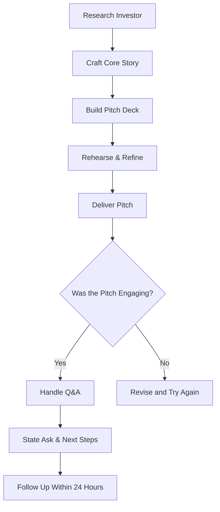

# Communication of ideas to potential investors Investor Pitch

## Video Explanation

* [https://www.youtube.com/watch?v=Hf6Q1uY6h8k](https://www.youtube.com/watch?v=Hf6Q1uY6h8k)

## Visual Aids

## 1. Definition

An investor pitch is a short, persuasive presentation where an entrepreneur clearly explains a business idea, the problem it solves, the market, the team, and the amount of funding needed, with the goal of convincing one or more investors to provide capital.

## 2. Concept Explanation

Every start‑up needs money to build, grow, and scale. Investors control that money but will only part with it if they believe the idea can become a valuable company. The investor pitch is the bridge between the entrepreneur’s vision and the investor’s cheque.

The basic idea is simple: you have a short window of time – sometimes just a few minutes – to grab an investor’s attention and make them think, “I want to be part of this.” You do this by telling a clear, compelling story backed by facts. How it works: an entrepreneur researches the investor, prepares a slide deck, and delivers a spoken pitch. The best pitches are not just about a great product; they demonstrate deep knowledge of the customer, the competition, and the numbers.

Why it is important: in reality, investors see hundreds of ideas. A great idea communicated poorly will be ignored. A well‑structured, passionate, and data‑driven pitch significantly raises the chance of funding. It also forces the entrepreneur to think critically about every part of the business. Thus, communication of ideas is just as important as the idea itself.

## 3. Key Characteristics / Features

- **Clarity above everything:** The problem, solution, and why now are stated in language anyone can understand – no complex jargon.
- **Emotionally engaging opening:** A powerful hook, personal story, or shocking statistic is used in the first 30 seconds.
- **Problem‑solution fit:** The pitch proves that a real, painful problem exists for a large group of people and that the solution is clearly better.
- **Proof of traction (if any):** Evidence of early sales, user sign‑ups, or letters of intent makes the idea credible and less risky.
- **Team strength is highlighted:** Investors back people; the pitch shows that the founders have the right skills, experience, and hunger.
- **Clear and realistic ask:** The pitch ends by stating exactly how much money is needed, what it will be used for, and what the investor gets in return.
- **Visual and short:** A pitch deck rarely exceeds 10‑12 slides, and the total presentation is kept crisp – often following the 10‑20‑30 rule.

## 4. Types / Classification

Based on format and audience, investor pitches can be classified as follows.

- **Elevator pitch:** A 30‑60 second verbal summary of the idea, used when meeting an investor unexpectedly or to start a conversation.
- **Formal pitch deck presentation:** A 10‑15 minute slide‑supported presentation in a scheduled meeting, covering all major aspects.
- **Demo Day pitch:** A highly polished 3‑5 minute presentation delivered on stage to a large audience of investors at an incubator or accelerator programme.
- **One‑on‑one investor meeting:** An in‑depth conversation where the pitch deck is used as a backdrop, but extensive Q&A and negotiation can happen.
- **Video pitch:** A recorded short video sent to investors who are not physically present; it must be visually strong and to the point.

Pitches can also be classified by the funding stage: a **pre‑seed pitch** focuses on vision and founder capability; a **seed pitch** shows an MVP and some early traction; a **Series A pitch** must prove a scalable business model with strong unit economics.

## 5. Working / Mechanism

Creating and delivering an investor pitch follows a disciplined series of steps.

1.  **Research the investor:** Understand what sectors they invest in, what ticket size, and what they value. Customise the pitch accordingly.
2.  **Craft the core story:** Define a single compelling narrative that ties the problem, solution, and impact together.
3.  **Build the pitch deck:** Prepare 10‑12 slides covering: Title, Problem, Solution, Why Now, Market Size, Business Model, Traction, Competition, Team, Financial Projections, and Ask.
4.  **Design for visuals, not text:** Use high‑quality images, simple charts, and minimal text. The entrepreneur’s spoken words do the explaining; the slide reinforces the message.
5.  **Rehearse relentlessly:** Practice the pitch aloud many times. Time it to fit within the allowed slot. Record and review.
6.  **Start with a powerful hook:** In the first 30‑60 seconds, grab attention with a personal experience, a startling fact, or a rhetorical question.
7.  **Present with energy and conviction:** Maintain eye contact, speak clearly, and convey passion. Body language should reflect confidence.
8.  **Handle questions calmly:** Listen to the investor’s questions fully, answer honestly, and do not get defensive. If you don’t know something, admit it and promise to follow up.
9.  **End with a clear ask and next steps:** State “We are raising ₹X for Y% equity, and we would love to sit down for a detailed discussion this week.” Provide contact details.
10. **Follow up promptly:** Send the pitch deck (or a one‑pager), any additional data requested, and a thank‑you note within 24 hours.

## 6. Diagram

## 7. Mathematical Formulation

A key number investors focus on is the valuation and the corresponding equity offered.

$$
\text{Post‑Money Valuation} = \frac{\text{Investment Amount}}{\text{Equity Given}}
$$

For example, if an investor puts in ₹50 lakh for 10% equity, post‑money valuation = ₹50,00,000 / 0.10 = ₹5,00,00,000 (₹5 crore). Pre‑money valuation = Post‑money valuation − Investment = ₹4.5 crore.

Another best practice is the **10‑20‑30 rule** for pitch decks:

- 10 slides maximum in a presentation.
- 20 minutes for the entire pitch.
- 30‑point minimum font size to keep text readable and slides clean.

While not a financial formula, it is a powerful communication rule that prevents data overload and keeps the pitch sharp.

## 8. Example

Riya, a diploma holder in mechanical engineering, has developed a low‑cost, portable cold storage unit for small vegetable vendors. She applies to a local angel network. In her 5‑minute pitch, she opens with a story of a farmer who lost 40% of his produce due to lack of cold storage. She shows the total addressable market (₹3,000 crore in India), displays a working prototype video, shares that 15 vendors have pre‑ordered at ₹25,000 per unit, and introduces her co‑founder who has supply‑chain experience. She ends by saying “We need ₹30 lakh for 10% equity to manufacture the first 200 units and build a sales team. I would love to share our detailed financial model in a one‑on‑one.” Three angels express interest for a follow‑up meeting.

## 9. Analogy

An investor pitch is like a movie trailer. Moviegoers decide whether to watch a full film based on a two‑minute trailer. The trailer doesn’t show everything – it highlights the best scenes, the story hook, and the promise of a great experience. Similarly, a pitch is not a full business plan; it is a teaser designed to create enough excitement and curiosity for an investor to want the full story in a longer meeting.

## 10. Comparison

| Feature | Investor Pitch | Business Plan Presentation |
|--------|----------------|----------------------------|
| **Length** | Very short (3‑15 minutes) | Can be 30‑60 minutes or longer |
| **Slides / Pages** | 10‑12 slides, highly visual | 30‑50 page document, detailed text |
| **Purpose** | Generate interest, secure a follow‑up meeting | Provide comprehensive information for due diligence |
| **Audience** | Time‑pressed investors hearing many ideas | A specific investor or bank that has already shown interest |
| **Style** | Story‑driven, emotional, high‑level | Data‑driven, analytical, in‑depth |
| **When used** | Early engagement, first meeting | Later stage, after initial interest is established |

## 11. Advantages

- **Opens the door to capital:** A strong pitch is the most reliable way to move from an idea to a funded venture.
- **Builds investor relationships:** Even if an investor says no, a good impression can lead to referrals to other investors.
- **Forces clarity of thought:** Preparing a pitch distils the entire business into its clearest, most essential form.
- **Generates valuable feedback:** Investor questions reveal blind spots and weaknesses early, saving costly mistakes later.
- **Boosts team confidence:** A well‑delivered pitch creates excitement within the team and attracts talent.
- **Starts a snowball effect:** One committed investor often influences others to join the round.

## 12. Disadvantages / Limitations

- **Extremely time‑consuming:** Creating and perfecting a pitch, plus travelling for meetings, takes the founder away from building the product.
- **High rejection rate:** It is normal to hear “no” dozens of times; this can be emotionally draining.
- **Risk of idea leakage:** Sharing the idea with many people increases the chance that someone else may try to copy it, though most investors are ethical.
- **Oversimplification danger:** A short pitch may hide real technical or market complexities, leading to unrealistic expectations later.
- **Pressure to overpromise:** To stand out, founders may get tempted to exaggerate traction or capability, which can destroy trust when facts emerge.
- **Bias toward presentation skills:** A mediocre idea presented by a charismatic speaker may get funded while a better idea from a shy founder is ignored.

## 13. Important Points / Exam Notes

- The goal of an investor pitch is not to explain every detail but to secure a second meeting.
- A typical pitch deck follows a sequence: Problem → Solution → Why Now → Market → Business Model → Traction → Team → Ask.
- The **10‑20‑30 rule** (10 slides, 20 minutes, 30‑point font) is a thumb rule to avoid information overload.
- Know the investor’s focus area; a pitch for an agri‑tech investor should highlight farming impact, not just tech.
- Traction trumps everything – a working prototype, paying customers, or signed LOIs dramatically improve the odds.
- Always state the investment ask clearly: how much money, for what purpose, and what equity or instrument.
- Practice handling tough questions: “Why will big players not copy you?”, “How did you arrive at this valuation?”
- Confidentiality: never ask investors to sign an NDA before a pitch; it is considered unprofessional. Rely on trust and protect only truly sensitive IP separately.
- Post‑pitch follow‑up must be polite, persistent, and provide any requested data quickly.
- In India, platforms like Shark Tank, startup incubators, and government pitch competitions (like Startup India Seed Fund) require a formal pitch.

## 14. Applications / Use Cases

- **Raising seed or angel funding:** A diploma engineer’s health‑tech start‑up pitches to an angel network using a 12‑slide deck and a live prototype demo.
- **Incubator/accelerator selection:** Shortlisted start‑ups pitch on a demo day to a panel of investors and mentors for a ₹20 lakh seed grant.
- **Crowdfunding pitch:** An entrepreneur creates a compelling video pitch on a platform; it must convince hundreds of small backers.
- **Internal corporate innovation:** A team within a large engineering firm pitches a new business unit idea to the board for internal funding.
- **Government scheme competitions:** Start‑up India Grand Challenge requires a video and live pitch to win grant money and incubation support.

## 15. MCQs

**Q1. The primary goal of an investor pitch is to**

A. Sell the product to a customer  
B. Explain every technical detail of the idea  
C. Convince an investor to schedule a follow‑up meeting or invest  
D. Register the company with the ROC  

**Answer:** C  
**Explanation:** A pitch is designed to generate enough interest to move to the next stage.

---

**Q2. The 10‑20‑30 rule for pitch decks suggests**

A. 10 slides, 20 minutes, 30‑point minimum font  
B. 20 slides, 10 minutes, 30‑point maximum font  
C. 10 minutes, 20 slides, 30 words per slide  
D. 30 slides, 20 minutes, 10 images  

**Answer:** A  
**Explanation:** The rule helps keep presentations crisp and readable.

---

**Q3. Which element is most critical to show in a pitch when a start‑up is very new and has no revenue?**

A. Profit generated last year  
B. Experienced team and deep understanding of the problem  
C. Office location  
D. Personal hobbies of the founder  

**Answer:** B  
**Explanation:** In the absence of traction, the team and problem‑solution fit become the main evidence of potential.

---

**Q4. “Traction” in a pitch context means**

A. The amount of debt the start‑up has  
B. Early evidence that customers want and use the product  
C. The speed of the internet connection  
D. The founder’s educational degrees  

**Answer:** B  
**Explanation:** Traction can be sales, user sign‑ups, pilot contracts, or letters of intent.

---

**Q5. An elevator pitch should ideally last**

A. 30‑60 seconds  
B. 15‑20 minutes  
C. 1 hour  
D. 2 minutes exactly  

**Answer:** A  
**Explanation:** It is a very short, impactful summary that can be delivered in the time of an elevator ride.

---

**Q6. What is the best practice when an investor asks a question you cannot answer on the spot?**

A. Make up an answer confidently  
B. Ignore the question and move on  
C. Admit you do not know and promise to provide the answer after the meeting  
D. End the pitch immediately  

**Answer:** C  
**Explanation:** Honesty builds trust; a follow‑up is the professional approach.

---

**Q7. In a pitch deck, the “Ask” slide typically states**

A. How many employees the company wants to hire  
B. The amount of money needed, the instrument, and what it will be used for  
C. The list of competitors  
D. The founder’s biography  

**Answer:** B  
**Explanation:** It clarifies the financial requirement and the proposed deal structure.

---

**Q8. Asking an investor to sign a Non‑Disclosure Agreement (NDA) before a standard pitch is generally**

A. Highly recommended and mandatory  
B. Considered unprofessional and often refused  
C. Required by law in India  
D. The only way to protect intellectual property  

**Answer:** B  
**Explanation:** Investors see many ideas; demanding an NDA upfront creates friction and shows inexperience.

---

**Q9. Which of the following is a major disadvantage of the investor pitching process?**

A. It helps clarify the business concept  
B. It may require dozens of meetings and has a high rejection rate  
C. It always guarantees funding  
D. It reduces the need for a business plan  

**Answer:** B  
**Explanation:** Fundraising through pitching is long, uncertain, and emotionally tough.

---

**Q10. A demo day pitch is most commonly associated with**

A. Annual general meetings of listed companies  
B. Graduation events of start‑up incubators and accelerators  
C. Political rallies  
D. Loan disbursement functions of banks  

**Answer:** B  
**Explanation:** Start‑up cohorts present to a room full of investors on demo day.