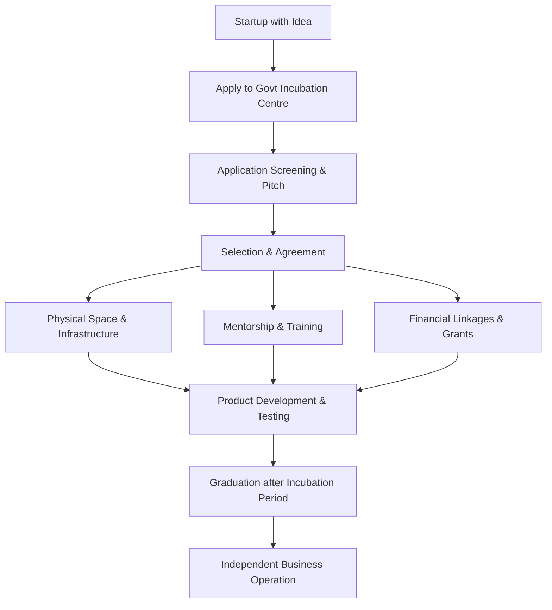

# Govt Initiatives Including Incubation Centre to Boost Start-up Ventures

## 1. Definition

Government initiatives for start-ups are special programmes, schemes, and policies launched by central and state governments to provide financial support, infrastructure, mentorship, and a favourable business environment. An incubation centre is a facility that offers shared office space, expert guidance, networking, and early-stage funding to help new ventures survive and grow during their initial critical years.

---

## 2. Concept Explanation

**Basic idea:** Start-ups are fragile and face high failure rates. Governments recognise that nurturing new enterprises creates jobs, innovation, and economic growth. Therefore, they step in to fill gaps that private investors and markets often leave at the earliest stages. Incubation centres are one of the most direct ways governments provide this support.

**How it works:** A government or government-funded body sets up an incubation centre. Start-ups apply with their business idea. If selected, they get a physical desk or office, access to high‑speed internet, laboratories, and meeting rooms. Seasoned mentors and industry experts guide them on product development, marketing, and legal matters. The centre also connects them to banks, venture capitalists, and grant schemes. The start‑up stays for a fixed period (usually 6‑18 months) until it becomes strong enough to operate independently.

**Why it is important:** Without such initiatives, many innovative ideas would die due to lack of initial money, expert advice, or a supportive ecosystem. Government‑backed incubation reduces the risk for founders and creates a pipeline of successful companies that contribute to the economy.

---

## 3. Key Characteristics / Features

- **Structured support system:** Incubation centres provide a time‑bound programme covering mentorship, training, and resource access.
- **Physical and technical infrastructure:** Start‑ups receive furnished office space, labs, prototyping tools, and internet without heavy upfront costs.
- **Financial linkage:** They help start‑ups access government grants, bank loans (e.g., Mudra), and connect with angel investors and seed funds.
- **Mentorship and hand‑holding:** Experts from industry, academia, and management coach the founders regularly.
- **Networking ecosystem:** Start‑ups meet other founders, potential customers, partners, and investors through events and demo days.
- **Legal and compliance assistance:** Guidance on company registration, GST, patents, and trademarks is often provided through empanelled professionals.
- **Focus on innovation:** Majority of government incubation initiatives target technology, social impact, and manufacturing start‑ups to promote indigenous solutions.

---

## 4. Types / Classification

Government initiatives for start‑ups can be grouped into four broad categories.

- **Financial Initiatives:**  
  - *MUDRA Yojana* – Collateral‑free loans up to ₹10 lakh for micro units.  
  - *SIDBI Fund of Funds* – Indirect funding to start‑ups through SEBI‑registered venture capital funds.  
  - *Startup India Seed Fund Scheme (SISFS)* – Grants and seed money to early‑stage start‑ups.  
  - *Credit Guarantee Fund Trust for Micro and Small Enterprises (CGTMSE)* – Guarantee cover for loans without collateral.

- **Infrastructure and Incubation Initiatives:**  
  - *Atal Incubation Centres (AIC)* – Established by Atal Innovation Mission in universities and private institutions.  
  - *NIDHI (National Initiative for Developing and Harnessing Innovations)* – Promotes technology‑based incubators and start‑ups.  
  - *Technology Business Incubators (TBIs)* – Hosted at IITs, NITs, and other technical institutes, supported by DST.  
  - *MSME Development Institutes and Tool Rooms* – Provide prototyping and testing facilities.

- **Tax and Regulatory Benefits:**  
  - *Startup India Action Plan* – Offers tax holiday for three consecutive years, fast‑track patent examination, and self‑certification for labour and environmental laws.  
  - *Section 80‑IAC* of Income Tax Act – Exemption from income tax for eligible start‑ups.

- **Information and Networking Platforms:**  
  - *Startup India Hub* – Online portal connecting start‑ups with investors, mentors, and government schemes.  
  - *National Startup Awards* – Recognition and visibility by the government.

---

## 5. Working / Mechanism (How a start‑up avails an incubation initiative)

1. The start‑up identifies a suitable government incubation centre (e.g., an Atal Incubation Centre or a NIDHI‑supported TBI) based on its sector and location.
2. It submits an online application with a detailed business plan, prototype details, team profile, and market analysis.
3. The incubation centre screens the application and calls shortlisted teams for a pitch presentation.
4. After selection, the centre signs an agreement with the start‑up and provides a dedicated workspace and facilities.
5. The start‑up undergoes a structured incubation programme: regular mentorship sessions, technical workshops, and compliance support.
6. The incubation centre connects the start‑up to potential government grants and seed fund schemes.
7. At the end of the incubation period (typically 12‑18 months), the start‑up “graduates” and moves to its own premises, often while keeping a network link with the incubator.

---

## 6. Diagram

---

## 7. Mathematical Formulation

*Not applicable. Government initiatives are qualitative policy measures; no mathematical formula defines them. However, metrics such as the number of incubators or funds disbursed can be tracked numerically.*

---

## 8. Example

**Atal Incubation Centre – CIIE (IIM Ahmedabad):**  
A young team developed a low‑cost water purification device. They applied to the Atal Incubation Centre at IIM Ahmedabad. After selection, they received a seed grant of ₹20 lakh under the Startup India Seed Fund Scheme, free office space, legal help to file a patent, and mentorship from senior industry professionals. Within 15 months, they launched the product in three states and raised follow‑up funding from a venture capital firm.

---

## 9. Analogy

A government incubation centre is like a **greenhouse nursery**. A tiny sapling (start‑up) would struggle to survive in the open with harsh weather (market competition, cash shortage). The nursery provides controlled temperature, water, and protection (office, mentorship, grants). Once the sapling grows strong roots and leaves, it is transplanted outdoors where it can thrive on its own.

---

## 10. Comparison (Government Incubation vs. Private Incubator)

| Feature | Government Incubation Centre | Private Incubator / Accelerator |
|--------|------------------------------|----------------------------------|
| Meaning | Set up or funded by government to promote entrepreneurship | Run by private investors, corporates, or individuals |
| Cost to start-up | Low or free; heavily subsidised | Often takes equity (5‑10%) in return for support |
| Focus | Social impact, job creation, inclusive growth | High returns, rapid scaling, profitable exits |
| Funding type | Grants, subsidised loans | Angel, VC funding through demo days |
| Example | Atal Incubation Centres, NIDHI‑TBI | Y Combinator, Sequoia Surge |

---

## 11. Advantages

- Reduces the financial burden on founders by providing free or low‑cost infrastructure.
- Connects start‑ups with a ready network of mentors, industry partners, and government agencies.
- Improves survival chances through structured guidance and constant hand‑holding.
- Facilitates early‑stage capital through direct grants, seed funds, and credit guarantee schemes.
- Simplifies legal and regulatory processes via single‑window assistance and self‑certification.
- Promotes inclusive entrepreneurship; special focus is often on women, rural, and social enterprise start‑ups.
- Creates a steady deal flow for investors, as incubated start‑ups are pre‑vetted and mentored.

---

## 12. Disadvantages / Limitations

- Government selection processes can be slow and bureaucratic, causing delay in support.
- Incubation centres are concentrated in certain cities; start‑ups in remote areas may struggle to access them.
- The quality of mentorship varies widely across different centres; not all provide top‑grade guidance.
- Some start‑ups become overly dependent on the incubator and fail to develop independent survival skills.
- Government‑funded incubators may lack the aggressive commercial mindset needed to push start‑ups towards rapid profitability.
- Schemes and grants often involve complex documentation and disbursement delays.

---

## 13. Important Points / Exam Notes

- Startup India Action Plan (2016) is the flagship initiative; includes tax exemption, self‑certification, and patent fast‑track.
- Atal Innovation Mission (AIM) under NITI Aayog establishes Atal Incubation Centres (AICs) across India.
- NIDHI (DST) promotes technology business incubators and provides start‑up seed support.
- MUDRA Yojana provides collateral‑free loan up to ₹10 lakh; categorised as Shishu, Kishore, Tarun.
- SIDBI Fund of Funds invests in SEBI‑registered venture capital funds, not directly in start‑ups.
- Section 56(2)(viib) exemption and Section 80‑IAC tax holiday are key legal benefits for recognised start‑ups.
- Incubation centres provide comprehensive support – physical space, mentorship, funding access, and networking.
- Government initiatives focus on fostering innovation, employment, and inclusive growth.
- The objective is to create a strong entrepreneurial ecosystem and reduce dependency on traditional jobs.

---

## 14. Applications / Use Cases

- **IIT Bombay’s SINE (TBI):** A government‑supported technology business incubator that has nurtured over 160 deep‑tech start‑ups including ideaForge (drones) and Sedemac (engine controls).
- **Kerala Startup Mission (KSUM):** A state government initiative that runs incubation centres, gives innovation grants, and organises startup challenges; has made Kerala a vibrant start‑up hub.
- **Villgro Innovations Foundation:** Supported by government schemes, it incubates rural social enterprises in agriculture and energy.
- **SFURTI Scheme:** Provides assistance for traditional industry clusters with Common Facility Centres that act like incubation for artisans.

---

## 15. MCQs

**Q1. Which of the following is the flagship government programme for start‑ups in India launched in 2016?**  
A. Make in India  
B. Startup India Action Plan  
C. Digital India  
D. Skill India  
**Answer:** B  
**Explanation:** Startup India Action Plan was launched in 2016 to create a strong ecosystem for fostering innovation and start‑ups.

**Q2. Atal Incubation Centres (AICs) are established under which mission?**  
A. National Manufacturing Mission  
B. Atal Innovation Mission (AIM)  
C. Clean India Mission  
D. National Education Mission  
**Answer:** B  
**Explanation:** AIM under NITI Aayog sets up AICs to promote innovation and entrepreneurship.

**Q3. The primary function of an incubation centre is to:**  
A. Provide large‑scale industrial land  
B. Offer free shares to the public  
C. Nurture early‑stage start‑ups with mentorship, infrastructure, and funding support  
D. Charge high rent for office space  
**Answer:** C  
**Explanation:** Incubation centres provide a supportive environment to help start‑ups survive and grow in their early stages.

**Q4. Which government scheme provides collateral‑free loans up to ₹10 lakh for micro enterprises?**  
A. Stand‑Up India  
B. Pradhan Mantri MUDRA Yojana  
C. SIDBI Make in India Fund  
D. PMEGP  
**Answer:** B  
**Explanation:** MUDRA Yojana offers loans under Shishu, Kishore, and Tarun categories without any collateral.

**Q5. The Startup India Seed Fund Scheme (SISFS) aims to:**  
A. Construct roads for industrial parks  
B. Provide financial grants and seed support to early‑stage start‑ups  
C. Train only government employees  
D. Offer free international travel  
**Answer:** B  
**Explanation:** SISFS gives financial assistance to selected incubators to disburse seed funds to start‑ups for proof of concept and prototype development.

**Q6. Section 80‑IAC of the Income Tax Act provides eligible start‑ups with:**  
A. Tax exemption for ten consecutive years  
B. A tax holiday for three consecutive assessment years  
C. No tax benefit at all  
D. Exemption from GST only  
**Answer:** B  
**Explanation:** Recognised start‑ups can claim deduction of 100% of profits for any three consecutive years out of the first ten years.

**Q7. NIDHI is an initiative of which department to promote technology‑based innovations?**  
A. Department of Space  
B. Department of Science and Technology (DST)  
C. Ministry of Corporate Affairs  
D. Ministry of Defence  
**Answer:** B  
**Explanation:** NIDHI stands for National Initiative for Developing and Harnessing Innovations, operated by DST.

**Q8. Which of the following is NOT a service typically offered by a government incubation centre?**  
A. Free office space for a limited period  
B. Mentorship and business advisory  
C. Guaranteed 100% market share  
D. Networking and investor connections  
**Answer:** C  
**Explanation:** Incubators provide support but cannot guarantee market success or market share; that depends on the start‑up’s execution.

**Q9. A major advantage of government incubation over private accelerators is:**  
A. Higher equity taken from founders  
B. Low cost or free services and no dilution of equity  
C. More aggressive profit push  
D. Only digital start‑ups allowed  
**Answer:** B  
**Explanation:** Government incubators usually charge nominal fees and do not take equity, unlike private accelerators.

**Q10. The SIDBI Fund of Funds operates by:**  
A. Giving direct loans to street vendors  
B. Investing in SEBI‑registered venture capital funds that fund start‑ups  
C. Only funding NGOs  
D. Setting up retail stores  
**Answer:** B  
**Explanation:** The Fund of Funds does not invest directly in start‑ups but contributes to VC funds that make investments.