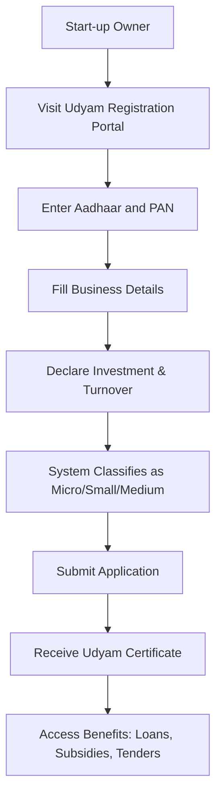

# MSME Registration for Start ups its benefits

## Video Explanation

* [https://www.youtube.com/watch?v=2q3K5xX0WmE](https://www.youtube.com/watch?v=2q3K5xX0WmE)

## Visual Aids

## 1. Definition

MSME registration is a government certification issued to micro, small, and medium enterprises under the Micro, Small and Medium Enterprises Development (MSMED) Act, 2006. For start-ups, this registration provides official recognition and access to various financial and non-financial benefits.

## 2. Concept Explanation

The basic idea behind MSME registration is to identify and support small businesses that form the backbone of the Indian economy. A start-up, after commencing operations, can voluntarily register itself as an MSME. The registration process is online, free of cost, and does not require any fee.

How it works: Based on the investment in plant and machinery (for manufacturing) or equipment (for services) and annual turnover, a business is classified as micro, small, or medium. Once registered, the start-up receives an MSME certificate and a unique number called Udyam Registration Number (formerly Udyog Aadhaar).

Why it is important: MSME registration helps start-ups obtain easier loans at lower interest rates, tax benefits, government tender eligibility, protection against delayed payments, and subsidy on patent registration. For a young start-up with limited capital, these benefits can significantly reduce operational costs and improve cash flow.

## 3. Key Characteristics / Features

- **Free and online process:** Registration is done through the Udyam Registration portal without any cost.
- **Self-declaration based:** No need to upload documents; information is self-certified by the start-up owner.
- **PAN and GST linked:** Registration uses the start-up’s Permanent Account Number (PAN) and GST number for verification.
- **Classification based on investment and turnover:** The categorisation into micro, small, or medium depends on the value of assets and annual revenue.
- **Permanent registration:** Once registered, the MSME status is valid for lifetime unless the business crosses the threshold for a higher category.
- **Aadhaar authentication:** The proprietor or managing director’s Aadhaar is required for application.
- **No renewal required:** Udyam Registration does not need periodic renewal.

## 4. Types / Classification

Under MSME registration, start-ups are classified into three types based on investment in plant & machinery (for manufacturing) or equipment (for services) and annual turnover:

| Classification | Investment (Manufacturing) | Investment (Services) | Annual Turnover |
|---------------|---------------------------|----------------------|------------------|
| Micro | Up to Rs. 1 crore | Up to Rs. 1 crore | Up to Rs. 5 crore |
| Small | Up to Rs. 10 crore | Up to Rs. 10 crore | Up to Rs. 50 crore |
| Medium | Up to Rs. 20 crore | Up to Rs. 20 crore | Up to Rs. 100 crore |

A start-up that falls into any of these categories can register. If the start-up exceeds the limits for medium, it ceases to be an MSME.

## 5. Working / Mechanism

The process of MSME registration for a start-up involves the following steps:

1. **Visit the official Udyam Registration portal:** The start-up owner goes to udyamregistration.gov.in.
2. **Enter Aadhaar number:** The proprietor, partner, or director provides their Aadhaar number and name for authentication.
3. **Provide PAN details:** The start-up’s PAN is entered. The system automatically fetches GST details if available.
4. **Fill business information:** The owner enters the start-up name, address, bank account details, and activity type (manufacturing or service).
5. **Declare investment and turnover:** The owner self-declares the investment in plant/machinery/equipment and the annual turnover of the previous financial year.
6. **Choose classification:** The system automatically determines whether the start-up is micro, small, or medium based on the entered data.
7. **Submit the application:** The owner reviews the information and submits the application.
8. **Receive Udyam Registration Certificate:** A certificate with a unique registration number is generated instantly and sent to the registered email.

## 6. Diagram

## 7. Mathematical Formulation

Not applicable for this topic.

## 8. Example

Example: Priya starts a small software development start-up. She invests Rs. 15 lakhs in computers, servers, and software tools. Her expected annual turnover is Rs. 1.2 crore. She applies for MSME registration online. Since her investment is below Rs. 1 crore and turnover below Rs. 5 crore, she is classified as a micro enterprise. After registration, she applies for a collateral-free loan under the CGTMSE scheme and receives Rs. 20 lakhs at 7.5% interest. She also gets a 50% subsidy on patent filing for her unique software product.

## 9. Analogy

MSME registration is like a student getting a library card. Without the card, the student can still read books but cannot borrow them. With the card, the student can borrow books, attend special workshops, and get discounts on courses. Similarly, without MSME registration, a start-up can still run its business. But with registration, it gains access to loans, subsidies, government tenders, and protection, all of which help the start-up grow faster.

## 10. Comparison

| Feature | MSME Registered Start-up | Non-Registered Start-up |
|---------|--------------------------|-------------------------|
| Loan eligibility | Eligible for collateral-free loans under CGTMSE | Must provide collateral for most loans |
| Interest rate on bank loans | Lower (typically 1-2% less) | Higher standard rate |
| Government tender participation | Allowed with fee exemptions | Allowed but no exemptions |
| Protection against delayed payments | Can claim interest under MSMED Act | Only standard legal recourse |
| Tax benefits | Some states offer tax rebates | No special tax benefits |
| Subsidy on patent/ trademark | Up to 50% subsidy available | Full cost to be paid |

## 11. Advantages

- **Collateral-free loans:** Start-ups can avail loans up to Rs. 5 crore without providing any security under the CGTMSE scheme.
- **Lower interest rates:** Banks offer interest rate concessions (usually 1-2% lower) to MSME registered start-ups.
- **Protection against delayed payments:** Under the MSMED Act, buyers must pay within 45 days. Otherwise, the start-up can claim compound interest from the buyer.
- **Government tender benefits:** Registered start-ups get exemption from Earnest Money Deposit (EMD) and preference in public procurement.
- **Subsidy on intellectual property registration:** The government reimburses up to 50% of the cost for patent, trademark, or design registration.
- **Tax and compliance benefits:** Some state governments offer stamp duty exemption, electricity duty concession, and simpler annual returns.
- **Easy to get licenses and approvals:** MSME registration helps in obtaining factory license, pollution clearance, and other regulatory approvals faster.
- **ISO certification reimbursement:** The government bears the cost of ISO certification for MSMEs.

## 12. Disadvantages / Limitations

- **Limited to small businesses:** Once a start-up grows beyond the medium enterprise limits, it loses MSME benefits.
- **No direct cash benefit:** Registration itself does not provide funds; the start-up must still apply separately for loans or subsidies.
- **Paperwork for higher categories:** For small and medium enterprises, maintaining proof of investment and turnover can be time consuming.
- **Not applicable for all start-ups:** Start-ups in certain sectors like liquor, gambling, or tobacco manufacturing are not eligible for MSME registration.
- **Dependence on self-declaration:** False declarations can lead to cancellation of registration and penalties.
- **State-wise variation:** Some benefits like tax rebates differ from state to state, creating confusion.

## 13. Important Points / Exam Notes

- MSME registration is now called **Udyam Registration** (since 1st July 2020). Udyog Aadhaar is discontinued.
- The registration is completely **free of cost** and online. No agent or fee is required.
- Both manufacturing and service sector start-ups can register as MSME.
- **Investment limits:** For manufacturing, investment in plant & machinery; for services, investment in equipment.
- Turnover limits: **Micro** (Rs. 5 crore), **Small** (Rs. 50 crore), **Medium** (Rs. 100 crore).
- A start-up cannot have both MSME registration and Start-up India recognition? Actually, they can have both; they are different schemes.
- **CGTMSE:** Credit Guarantee Fund Trust for Micro and Small Enterprises provides collateral-free loans.
- Delayed payment penalty: The buyer must pay **compound interest at three times the bank rate** (as per RBI) for delayed payment beyond 45 days.
- MSME registered units get **priority in government purchases** under the Public Procurement Policy (15% of total purchases reserved for MSMEs).
- No renewal is required; registration is for a lifetime unless the enterprise voluntarily cancels or exceeds limits.

## 14. Applications / Use Cases

- **New start-up seeking a loan:** A start-up needing working capital can register as MSME and apply for a collateral-free loan up to Rs. 5 crore.
- **Freelancer or small consultant:** A sole proprietor offering digital marketing services can register as a micro enterprise to get tender benefits.
- **Manufacturing start-up:** A small unit making eco-friendly packaging can register as MSME to get subsidy on machinery and lower electricity duty.
- **E-commerce seller:** A start-up selling handmade products can use MSME registration to participate in Government e-Marketplace (GeM) tenders.
- **Tech start-up filing a patent:** A software start-up can register as MSME and get 50% reimbursement on patent filing fees.

## 15. MCQs

**Q1. What is the new name for MSME registration as of July 2020?**  
A. Udyog Aadhaar  
B. Udyam Registration  
C. Aadhaar MSME  
D. MSME Udhyam  
**Answer:** B  
**Explanation:** The Government of India replaced Udyog Aadhaar with Udyam Registration from 1st July 2020.

**Q2. Up to what amount can a micro enterprise invest in plant and machinery (manufacturing sector)?**  
A. Rs. 50 lakhs  
B. Rs. 1 crore  
C. Rs. 5 crore  
D. Rs. 10 crore  
**Answer:** B  
**Explanation:** For a micro manufacturing enterprise, the investment in plant and machinery must not exceed Rs. 1 crore.

**Q3. What is the maximum annual turnover for a small enterprise under MSME classification?**  
A. Rs. 5 crore  
B. Rs. 25 crore  
C. Rs. 50 crore  
D. Rs. 100 crore  
**Answer:** C  
**Explanation:** A small enterprise has an annual turnover of up to Rs. 50 crore and investment up to Rs. 10 crore.

**Q4. Under the MSMED Act, within how many days must a buyer pay an MSME supplier to avoid penalty?**  
A. 30 days  
B. 45 days  
C. 60 days  
D. 90 days  
**Answer:** B  
**Explanation:** The buyer must make payment within 45 days of acceptance of goods or services. Delay beyond this attracts compound interest.

**Q5. Which scheme provides collateral-free loans to MSME-registered start-ups?**  
A. PMEGP  
B. MUDRA  
C. CGTMSE  
D. SIDBI  
**Answer:** C  
**Explanation:** The Credit Guarantee Fund Trust for Micro and Small Enterprises (CGTMSE) guarantees collateral-free loans to MSMEs.

**Q6. What document is mandatory for the proprietor to apply for Udyam Registration?**  
A. Voter ID  
B. Passport  
C. Aadhaar  
D. Driving licence  
**Answer:** C  
**Explanation:** The applicant’s Aadhaar number is required for authentication and linking with the registration.

**Q7. Is there any fee for Udyam Registration?**  
A. Rs. 100  
B. Rs. 500  
C. Rs. 1000  
D. No fee, it is free  
**Answer:** D  
**Explanation:** MSME registration through the official Udyam portal is completely free of cost.

**Q8. Which of the following is NOT a benefit of MSME registration?**  
A. Direct cash grant from government  
B. Lower interest rate on loans  
C. Protection against delayed payments  
D. Exemption from earnest money deposit in tenders  
**Answer:** A  
**Explanation:** MSME registration does not provide direct cash grants. It offers indirect benefits like loan eligibility, subsidies, and protections.

**Q9. What is the maximum collateral-free loan amount available to an MSME under CGTMSE?**  
A. Rs. 1 crore  
B. Rs. 2 crore  
C. Rs. 5 crore  
D. Rs. 10 crore  
**Answer:** C  
**Explanation:** The CGTMSE scheme covers collateral-free loans up to Rs. 5 crore for MSMEs.

**Q10. For a service sector micro enterprise, the investment limit on equipment is up to?**  
A. Rs. 50 lakhs  
B. Rs. 1 crore  
C. Rs. 5 crore  
D. Rs. 10 crore  
**Answer:** B  
**Explanation:** For service enterprises (micro), the investment in equipment should not exceed Rs. 1 crore, same as manufacturing.