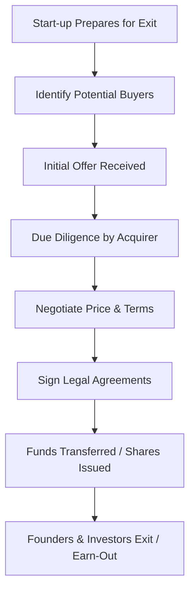

# Merger and acquisition exit

## Video Explanation

* [https://www.youtube.com/watch?v=3gZz5c7X8l8](https://www.youtube.com/watch?v=3gZz5c7X8l8)

## Visual Aids

## 1. Definition

A merger and acquisition (M&A) exit is an exit strategy where an entrepreneur sells their start‑up to another company (acquisition) or combines it with another entity to form a new company (merger), in order to convert their ownership stake into cash or shares of the acquiring firm.

## 2. Concept Explanation

For many start‑up founders, the ultimate goal is not to run a small business forever but to create value and eventually harvest it. An M&A exit is one of the most common ways to achieve that. The basic idea is that a larger, established company sees strategic value in the start‑up – its technology, team, customer base, or market position – and decides to buy it.

How it works: the acquirer evaluates the start‑up, negotiates a price, and purchases either the entire company or a controlling stake. The founders and early investors receive cash, shares of the acquirer, or a mix of both. The start‑up may continue to operate as a division or be fully absorbed.

Why it is important: an M&A exit provides liquidity without requiring an IPO, which is costly and complex. It rewards the founders for their years of risk and effort, and returns capital to investors. For the start‑up ecosystem, successful exits encourage more investment and innovation.

## 3. Key Characteristics / Features

- **Immediate liquidity event:** Founders and investors receive cash or marketable shares, turning paper wealth into real money.
- **Strategic rationale:** The acquirer buys the start‑up for technology, talent (acqui‑hire), customer access, or to eliminate a competitor.
- **Negotiated transaction:** The sale price and terms are determined through direct negotiation between buyer and seller, not through a public market.
- **Ownership transfer:** Full ownership and control pass to the acquirer; the entrepreneur may stay for a transition period or leave.
- **Speed compared to IPO:** An M&A exit can be completed in months, whereas an IPO often takes a year or more.
- **Confidential process:** Details are kept private until the deal is announced, avoiding market speculation.

## 4. Types / Classification

M&A exits can be classified based on the nature of the combination and the structure of the deal.

- **Based on business relationship:**
  - *Horizontal acquisition:* Buying a direct competitor in the same industry (e.g., a food delivery start‑up buying another food delivery app).
  - *Vertical acquisition:* Buying a company in the supply chain (e.g., a manufacturer buying a key supplier).
  - *Conglomerate merger:* Unrelated businesses combining (less common for start‑up exits).
  - *Acqui‑hire:* The primary motive is to acquire the talented team, not the product; the product may be shut down.

- **Based on deal structure:**
  - *Stock purchase:* The acquirer buys all the shares of the start‑up; the company becomes a subsidiary.
  - *Asset purchase:* The acquirer buys specific assets (IP, machines, contracts) rather than the entire legal entity.
  - *Merger:* Two companies combine to form a new legal entity; original shareholders receive shares in the new company.

- **Based on acquirer type:**
  - *Strategic buyer:* A company in the same or adjacent industry where the start‑up adds competitive advantage.
  - *Financial buyer:* A private equity firm or investment group looking to grow and later resell the start‑up.

## 5. Working / Mechanism

The M&A exit process follows a structured series of steps.

1.  **Preparation and positioning:** The start‑up gets its financials audited, secures intellectual property rights, and builds a strong track record to become attractive.
2.  **Identifying potential acquirers:** Founders, often with investment bankers, list companies that would gain strategic value from the start‑up.
3.  **Initial contact and expression of interest:** The acquirer signs a Non‑Disclosure Agreement and receives an Information Memorandum.
4.  **Valuation and indicative offer:** The acquirer submits a non‑binding offer with a price range and deal structure.
5.  **Due diligence:** The acquirer thoroughly examines the start‑up’s technology, legal contracts, finances, and customer base. Any hidden risks can lower the price.
6.  **Negotiation and final agreement:** Both parties negotiate the final price, payment method (cash vs. stock), earn‑out clauses, and employment contracts for key founders.
7.  **Legal documentation and closing:** Sale and purchase agreements are signed. Regulatory approvals (if needed) are obtained. Funds are transferred.
8.  **Post‑merger integration:** The start‑up’s team, product, and systems are merged into the acquirer’s operations. Founders may stay to lead the integration or exit after a handover period.

## 6. Diagram

## 7. Mathematical Formulation

The exit value for a founder is a direct function of the acquisition price and their ownership percentage.

$$
\text{Founder Exit Value} = \text{Acquisition Price} \times \text{Founder's Ownership \%} \times (1 - \text{Transaction Costs \%})
$$

Where:
- Acquisition Price = Total consideration paid by the acquirer (can be cash, stock, or a mix).
- Founder’s Ownership % = The fully diluted percentage of shares held by the founder.
- Transaction Costs % = Legal, banking, and advisory fees, typically 2‑5% of the deal value.

Valuation is often based on a revenue or EBITDA multiple:

$$
\text{Acquisition Price} = \text{Annual Revenue (or EBITDA)} \times \text{Industry Multiple}
$$

For example, a SaaS start‑up with ₹5 crore ARR and a 10x revenue multiple would be valued at ₹50 crore.

## 8. Example

A diploma engineer’s start‑up builds an affordable solar‑powered cold storage unit for farmers. After three years, it has 500 installations and patented thermal management technology. A large appliance company wants to enter the cold‑chain market and offers to buy the start‑up for ₹30 crore in cash. The founder owns 40% equity. After transaction costs, the founder receives approximately ₹11.5 crore. The technology gets scaled under the big brand, farmers benefit, and the founder achieves a successful exit. The founder stays as a technical advisor for one year as part of an earn‑out agreement.

## 9. Analogy

Selling a start‑up through an acquisition is like selling a carefully renovated house to a big real‑estate developer. You have improved the property, added unique features, and found a buyer who values it more than you could realise by living in it yourself. The developer pays you a lump sum, and you move on to build your next dream house. The house (start‑up) gets a new owner who can scale it into an apartment complex.

## 10. Comparison

| Feature | M&A Exit | IPO Exit |
|--------|----------|----------|
| **Nature** | Sale to a specific buyer or merger partner | Public listing on a stock exchange |
| **Time required** | 3‑9 months typically | 12‑24 months |
| **Complexity** | Moderate; involves negotiation and due diligence | Very high; involves regulatory filings (SEBI), underwriting |
| **Ownership after exit** | Founders give up control fully or partially | Founders may retain significant ownership as shares become publicly traded |
| **Liquidity** | Immediate cash or acquirer’s shares | Lock‑in period for founders; gradual liquidity through market sales |
| **Suitable for** | Start‑ups with strategic value to a large buyer | High‑growth, very large start‑ups ready for public scrutiny |

## 11. Advantages

- **Immediate wealth realisation:** Founders can convert years of effort into a substantial cash payout quickly.
- **Less regulatory burden than IPO:** No need for continuous public disclosures, quarterly reporting, or stock exchange compliances.
- **Strategic synergies:** The acquirer may provide resources, distribution, and brand credibility that the start‑up could never achieve alone.
- **Risk reduction:** Founders eliminate future risk by transferring ownership; they are no longer exposed to market downturns or competition.
- **Retention of team value:** Many M&A deals include retention bonuses and job roles for the start‑up team, ensuring employment.
- **Faster and cleaner exit:** Multiple co‑founders and investors can exit collectively in a single negotiated transaction.

## 12. Disadvantages / Limitations

- **Loss of independence:** The start‑up loses its identity and the founder’s vision may be diluted or abandoned by the acquirer.
- **Lower valuation possible:** Acquirers may pay a “control premium” but can also undervalue the company, especially if founders lack negotiation power.
- **Cultural clash:** The start‑up’s agile, informal culture may not survive integration into a large, bureaucratic corporation.
- **Earn‑out risks:** Part of the payment is often linked to future performance; if targets are not met, founders may receive far less.
- **Emotional difficulty:** Founders often feel they are giving away their “baby”; psychological stress is common.
- **Limited future upside:** Once sold, founders no longer benefit from any future explosive growth of the company.

## 13. Important Points / Exam Notes

- M&A exit is the most common exit route for start‑ups; far more acquisitions happen than IPOs.
- A merger creates a new entity; an acquisition usually absorbs the target into the buyer.
- Key M&A terminology: acquirer, target, due diligence, term sheet, letter of intent, valuation, earn‑out, non‑compete clause.
- Due diligence covers financial, legal, technical, and human resource audits.
- Acqui‑hire: acquisition mainly for the engineering team, common in tech start‑ups where product may be discontinued.
- Valuation methods: comparable company analysis, discounted cash flow, and revenue multiples.
- Strategic buyers often pay higher valuations than financial buyers because of synergy benefits.
- Earn‑out is a deferred payment that depends on the start‑up achieving certain milestones post‑acquisition.
- Regulatory approvals may be needed from CCI (Competition Commission of India) if the transaction crosses certain asset/turnover thresholds.
- An M&A exit is a “trade sale” – selling the business to another business.

## 14. Applications / Use Cases

- **Tech start‑up acquisition:** A large e‑commerce company acquires a logistics start‑up to strengthen last‑mile delivery (Flipkart acquiring smaller delivery start‑ups).
- **Pharmaceuticals:** A drug company buys a biotech start‑up for its promising new drug formula and patent portfolio.
- **Auto industry:** An electric vehicle manufacturer acquires a battery‑cooling technology start‑up to improve its own range.
- **Food brand exit:** A local healthy snacks start‑up gets acquired by a multinational food corporation wanting a foothold in the health‑conscious market.
- **Ed‑tech consolidation:** An ed‑tech unicorn acquires multiple smaller content creation or assessment tool start‑ups to broaden its offering.

## 15. MCQs

**Q1. In an acquisition exit, the start‑up is generally**

A. Listed on a stock exchange  
B. Sold to another company  
C. Shut down permanently  
D. Converted into a non‑profit  

**Answer:** B  
**Explanation:** An acquisition exit involves the sale of the start‑up to a larger or strategic buyer.

---

**Q2. An acqui‑hire is a type of acquisition where the primary motive is to**

A. Acquire the start‑up’s office building  
B. Acquire the talented team of the start‑up  
C. Launch a new brand name  
D. Pay the start‑up’s outstanding debts  

**Answer:** B  
**Explanation:** The acquirer buys the company mainly to hire its skilled employees.

---

**Q3. Which of the following is a key advantage of an M&A exit for a founder compared to an IPO?**

A. Retaining full control forever  
B. Immediate and simpler liquidity without public regulatory requirements  
C. No need for any due diligence  
D. Guarantee of a higher valuation  

**Answer:** B  
**Explanation:** An M&A exit typically offers faster cash and avoids the complexities of going public.

---

**Q4. “Earn‑out” in an M&A deal refers to**

A. The profit earned after the exit  
B. A portion of the sale price that is paid later based on future performance  
C. The bid‑ask spread  
D. The interest earned on bank deposits  

**Answer:** B  
**Explanation:** Earn‑out is contingent payment tied to post‑acquisition milestones.

---

**Q5. A merger differs from an acquisition because in a merger**

A. Only assets are bought  
B. Two companies combine to form a new entity  
C. The acquired company always shuts down  
D. No money changes hands  

**Answer:** B  
**Explanation:** A merger results in a new legal entity; both companies pool their operations.

---

**Q6. Which of the following is NOT a type of M&A based on business relationship?**

A. Horizontal  
B. Vertical  
C. Digital  
D. Conglomerate  

**Answer:** C  
**Explanation:** Horizontal, vertical, and conglomerate are standard classifications; “Digital” is not a type.

---

**Q7. Due diligence in an M&A process is conducted to**

A. Increase the valuation  
B. Verify the legal, financial, and operational health of the start‑up  
C. Announce the deal to the public  
D. Hire new employees  

**Answer:** B  
**Explanation:** Due diligence uncovers risks and confirms the accuracy of the start‑up’s claims.

---

**Q8. The Competition Commission of India (CCI) must approve an M&A deal if**

A. The start‑up has less than ₹10 lakh turnover  
B. The transaction exceeds certain asset or turnover thresholds  
C. The founders demand it  
D. The deal is below ₹1 crore  

**Answer:** B  
**Explanation:** CCI approval is required for combinations that could have an appreciable adverse effect on competition.

---

**Q9. A founder who holds 30% equity sells her start‑up for ₹100 crore. Ignoring costs, her exit value is**

A. ₹30 crore  
B. ₹70 crore  
C. ₹10 crore  
D. ₹50 crore  

**Answer:** A  
**Explanation:** 30% of ₹100 crore = ₹30 crore.

---

**Q10. Which of the following is a major disadvantage of an M&A exit?**

A. Provides instant liquidity  
B. The founder may lose control and the start‑up’s identity may disappear  
C. It is always slower than an IPO  
D. Investors cannot exit through M&A  

**Answer:** B  
**Explanation:** Loss of independence and cultural integration issues are significant drawbacks.