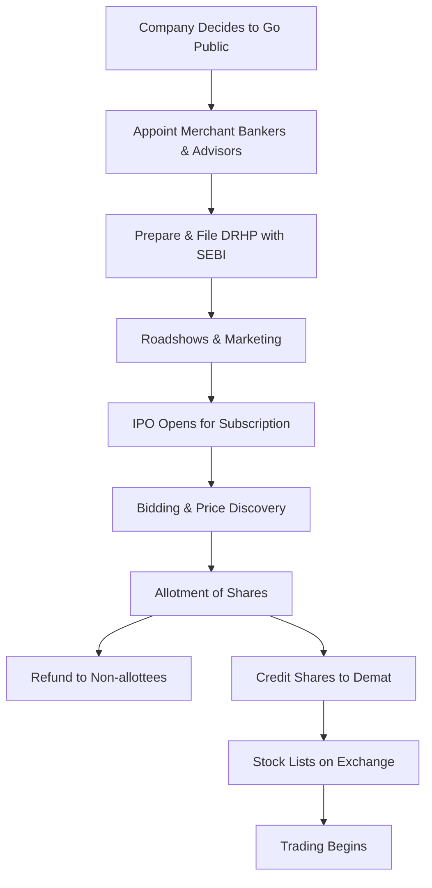

# Initial Public Offering (IPO)

## 1. Definition

An Initial Public Offering (IPO) is the process by which a privately held company offers its shares to the general public for the first time. By doing so, the company gets listed on a stock exchange, and its shares become freely tradable by investors. It transforms a private company into a public company.

## 2. Concept Explanation

When a company is private, only a few founders, employees, and early investors own its shares. To grow further, raise large capital, or provide an exit to early backers, the company may decide to sell a part of its ownership to the public. That first sale is called the Initial Public Offering.

The basic idea: The company issues new shares to raise fresh funds for expansion, or existing shareholders sell a portion of their holdings to cash out. The public buys these shares through a stock exchange. After the IPO, the company’s shares are listed and can be bought and sold daily on the open market.

How it works: The company hires investment banks (merchant bankers) to manage the process. Together, they prepare a draft prospectus, fix a price band, run roadshows to attract investors, and finally open the issue for subscription. After collecting applications, shares are allotted, and the stock begins trading. The market price then reflects investor demand.

Why it is important: For a start-up, an IPO is a major milestone. It provides access to a vast pool of capital, increases brand visibility, and offers liquidity to founders and investors. For the economy, it channels public savings into productive enterprises. Understanding IPOs is essential for entrepreneurs planning long-term growth and eventual exit.

## 3. Key Characteristics / Features

- **First Public Sale:** It is the company's maiden offering of equity shares to retail and institutional investors.
- **Listing on Stock Exchange:** Shares become listed on platforms like NSE, BSE, enabling secondary market trading.
- **Regulatory Oversight:** The process is tightly regulated by the Securities and Exchange Board of India (SEBI) to protect investors.
- **Comprehensive Disclosure:** The company must file a Draft Red Herring Prospectus (DRHP) revealing financials, risks, business model, and use of funds.
- **Price Discovery:** The final share price is determined either through a fixed price method or a book-building process based on investor demand.

## 4. Types / Classification

IPOs can be classified based on the pricing method and the nature of the issue.

- **Based on Pricing Method:**
    - *Fixed Price Issue:* The company decides a specific price in advance, and investors apply at that exact price.
    - *Book Building Issue:* A price band (floor and cap) is offered. Investors bid at various prices within the band, and the final cut-off price is discovered based on demand.
- **Based on Share Issuance:**
    - *Fresh Issue:* The company issues new shares to raise capital. The money goes directly to the company.
    - *Offer for Sale (OFS):* Existing shareholders (founders, venture capitalists) sell their shares. The company receives no money; the proceeds go to the selling shareholders.

## 5. Working / Mechanism

The IPO process follows a meticulous sequence of steps.

1.  The company's board and shareholders approve the plan to go public.
2.  The company appoints a lead manager (merchant banker), legal advisors, and auditors.
3.  A Draft Red Herring Prospectus (DRHP) is prepared and filed with SEBI for review.
4.  After receiving SEBI's observations, the final prospectus is updated.
5.  The company and the bankers conduct roadshows and investor meetings to generate interest.
6.  The IPO opens for subscription for a few days (usually 3–5 days). Investors place bids.
7.  After closure, the issue price is finalised based on bids received in the book building.
8.  Shares are allotted to successful applicants; refunds are given to others.
9.  The shares are credited to demat accounts, and the stock lists on the stock exchange.
10. Trading commences, and the stock price fluctuates according to market forces.

## 6. Diagram

## 7. Mathematical Formulation

The total funds raised in a fresh issue IPO are calculated as:

$$
\text{Funds Raised} = \text{Issue Price per Share} \times \text{Number of New Shares Issued}
$$

Equity dilution for existing shareholders after IPO:

$$
\text{Dilution \%} = \frac{\text{New Shares Issued}}{\text{Pre-IPO Shares} + \text{New Shares Issued}} \times 100
$$

Where:
- **Issue Price per Share** = Final price at which each share is sold to the public.
- **Number of New Shares Issued** = Shares created and sold by the company.
- **Pre-IPO Shares** = Total shares outstanding before the IPO.

## 8. Example

Food delivery platform Zomato launched its IPO in July 2021. The company used a book-building process with a price band of ₹72–₹76 per share. The fresh issue component raised about ₹9,000 crores for the company to fund growth and acquisitions, while the Offer for Sale allowed early investor Info Edge to sell part of its stake. The IPO was heavily oversubscribed, and on listing day, the stock opened at a premium, giving significant returns to IPO allottees.

## 9. Analogy

Think of a popular local restaurant that has been funded by a few family members and close friends. One day, the owners decide to list the restaurant on a platform where anyone from the public can buy a small ownership slice. They issue "restaurant vouchers" (shares) at a certain price. Now, thousands of people own a tiny part of the restaurant, and its ownership can change hands easily. The restaurant gets fresh money for new outlets, and the original family can sell some vouchers to cash out. That is exactly what an IPO does for a company.

## 10. Comparison

| Feature | IPO (Initial Public Offering) | Acquisition / Merger Exit |
|--------|-------------------------------|---------------------------|
| Meaning | Selling shares to the general public via stock exchange | Selling the entire company to another firm |
| Ownership | Company becomes publicly held with many shareholders | Company is absorbed by the acquirer; founders exit |
| Capital Raised | Fresh capital flows into the company (if fresh issue) | Usually cash paid to shareholders, not company |
| Regulatory Burden | High ongoing compliance (SEBI, stock exchange) | Lower post-deal, though complex during negotiation |
| Founder Control | Founders usually retain control with diluted stake | Founders lose control completely |

## 11. Advantages

- An IPO raises large amounts of capital without the obligation to repay, unlike bank loans.
- Shares become liquid, providing an exit route for early investors, venture capitalists, and founders.
- Public listing enhances the company’s brand image, credibility, and visibility with customers and partners.
- Listed shares can be used as currency for future mergers and acquisitions.
- Employee stock options (ESOPs) become more valuable and attractive, aiding talent retention.

## 12. Disadvantages / Limitations

- The process is lengthy, expensive, and involves significant regulatory and compliance costs.
- The company must disclose sensitive financial and strategic information publicly, which competitors can see.
- Pressure to deliver quarterly results can lead to short-termism, hurting long-term innovation.
- Market volatility can cause share price to drop below the issue price, disappointing public investors and harming reputation.
- Founders lose a degree of control, and activist shareholders can influence management decisions.

## 13. Important Points / Exam Notes

- IPO is the first sale of shares by a private company to the public; it results in stock exchange listing.
- SEBI regulates the IPO process in India to ensure transparency and protect investors.
- The prospectus (DRHP) contains all vital information: financials, risk factors, management details, and object of the issue.
- Book Building is the most common price discovery method in IPOs, involving a price band and bid collection.
- A Fresh Issue raises money for the company; an Offer for Sale provides an exit to existing shareholders.
- Post-IPO, the company must comply with listing obligations, including quarterly reporting, corporate governance norms, and insider trading regulations.

## 14. Applications / Use Cases

- **Start-up Growth Capital:** A tech start-up needing ₹500 crores for international expansion files for an IPO with a fresh issue.
- **Founder/VC Liquidation:** Early angel investors sell their stake through an OFS IPO to realise returns after a successful 10-year journey.
- **Employee Wealth Creation:** ESOPs held by employees become liquid post-IPO, allowing them to cash out and share in the company's success.
- **Government Divestment:** The government sells part of its stake in a Public Sector Undertaking (PSU) through an IPO (e.g., LIC IPO).
- **Brand and Credibility Boost:** A regional manufacturing company lists on the main board to gain national visibility and trust from institutional clients.

## 15. MCQs

**Q1. What is the primary purpose of an Initial Public Offering (IPO)?**

A. To sell the company to a competitor  
B. To offer shares to the public for the first time and raise capital  
C. To take a loan from the public  
D. To merge with another listed company  
**Answer:** B  
**Explanation:** An IPO is the first sale of stock to the general public, typically to raise fresh capital or provide liquidity.

**Q2. Which regulatory body oversees IPO processes in India?**

A. RBI  
B. SEBI  
C. IRDAI  
D. NABARD  
**Answer:** B  
**Explanation:** The Securities and Exchange Board of India (SEBI) regulates public issues and ensures investor protection.

**Q3. In a book-building IPO, what does investors bid on?**

A. The exact fixed price announced by the company  
B. A quantity of shares at a specific price within a given price band  
C. The number of board seats they want  
D. The company's future dividend rate  
**Answer:** B  
**Explanation:** Book building allows investors to bid for shares at different prices within the floor-cap range, aiding price discovery.

**Q4. Which part of an IPO issue brings fresh money directly into the company's treasury?**

A. Offer for Sale (OFS)  
B. Fresh Issue  
C. Share Buyback  
D. Bonus Issue  
**Answer:** B  
**Explanation:** Only a fresh issue involves creation of new shares; the proceeds go to the company.

**Q5. An Offer for Sale (OFS) in an IPO means:**

A. The company sells new shares to the public  
B. Existing shareholders sell their own shares to the public  
C. The company buys back its shares  
D. Shares are given for free to employees  
**Answer:** B  
**Explanation:** OFS is a mechanism where promoters or existing investors offload their stake; money goes to them, not the company.

**Q6. Which document contains all the detailed financial and business information about a company before its IPO?**

A. Annual Report  
B. Memorandum of Association  
C. Draft Red Herring Prospectus (DRHP)  
D. Share Certificate  
**Answer:** C  
**Explanation:** The DRHP is the preliminary prospectus filed with SEBI, disclosing comprehensive details about the company and the issue.

**Q7. One major advantage of an IPO for a company is:**

A. Reduced regulatory reporting  
B. Guaranteed increase in share price  
C. Access to a large pool of equity capital without debt repayment  
D. Complete secrecy of financial statements  
**Answer:** C  
**Explanation:** An IPO raises equity funds which do not require fixed interest payments, unlike debt.

**Q8. After a successful IPO, the company’s shares become:**

A. Illiquid and non-transferable  
B. Listed and freely tradable on a stock exchange  
C. Only available to government entities  
D. Converted into bonds  
**Answer:** B  
**Explanation:** Listing enables the shares to be bought and sold publicly, providing liquidity.

**Q9. Which of the following is a disadvantage of going public through an IPO?**

A. Increased brand visibility  
B. Extensive regulatory compliance and public disclosure  
C. Access to more capital  
D. Improved employee retention via ESOPs  
**Answer:** B  
**Explanation:** Public companies face continuous reporting obligations, transparency requirements, and scrutiny, which can be costly and time-consuming.

**Q10. If a company has 10 crore pre-IPO shares and issues 2 crore new shares to the public, the dilution for existing shareholders is approximately:**

A. 10%  
B. 16.67%  
C. 20%  
D. 2%  
**Answer:** B  
**Explanation:** Dilution = 2 crore / (10 crore + 2 crore) = 2/12 ≈ 16.67%.