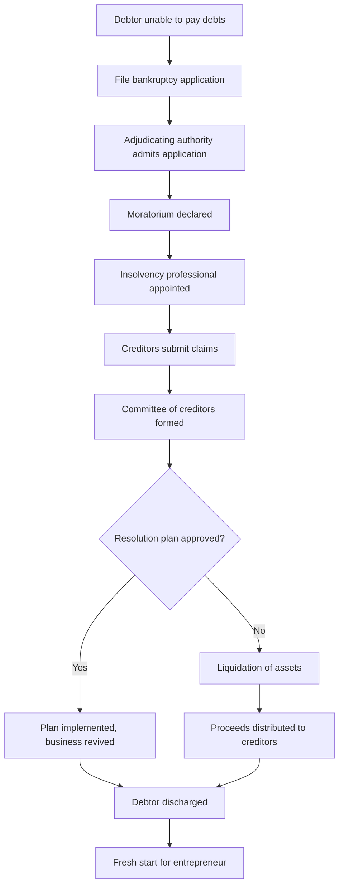

# Bankruptcy

## 1. Definition

Bankruptcy is a legal process in which a person or a business that cannot repay its outstanding debts seeks relief from some or all of the liabilities. Under Indian law, bankruptcy allows an entrepreneur to either restructure debts or liquidate assets to pay creditors.

## 2. Concept Explanation

The basic idea of bankruptcy is to provide a fresh start to honest entrepreneurs who have failed due to business risks, while ensuring fair treatment to creditors. When a start-up or small business accumulates debts beyond its ability to pay, it can file for bankruptcy. 

How it works: The entrepreneur submits an application to the National Company Law Tribunal (NCLT) for companies or to the Debt Recovery Tribunal (DRT) for individuals and partnership firms. An insolvency professional takes over the management, evaluates assets and liabilities, and either proposes a repayment plan or sells the assets to distribute among creditors. 

Why it is important: Bankruptcy protects the entrepreneur from harassment by creditors and legal actions. It also provides a time-bound resolution (usually 180 to 330 days under the Insolvency and Bankruptcy Code, 2016). This helps reduce the stigma of failure and encourages entrepreneurship.

## 3. Key Characteristics / Features

- **Legal protection:** Once bankruptcy is admitted, creditors cannot file fresh lawsuits or recover money forcefully.
- **Time-bound process:** The Insolvency and Bankruptcy Code (IBC) mandates completion within 330 days including extensions.
- **Appointment of insolvency professional:** An independent expert manages the debtor’s affairs during the process.
- **Moratorium period:** For 180 days, all debt recovery actions are stayed automatically.
- **Resolution or liquidation:** The process ends either with a revival plan (resolution) or sale of assets (liquidation).
- **Fresh start for entrepreneur:** After discharge, the entrepreneur is free from past unpaid debts (with exceptions).
- **Applicable to all entity types:** Individuals, partnerships, LLPs, and companies can file for bankruptcy.

## 4. Types / Classification

Under the Insolvency and Bankruptcy Code (IBC) 2016, bankruptcy can be classified into two main types:

| Type | Description | Applicable to |
|------|-------------|----------------|
| Corporate Insolvency Resolution Process (CIRP) | Process for companies where a resolution plan is prepared to revive the business or sell it as a going concern. | Companies, LLPs |
| Individual / Partnership Bankruptcy | Process for non-corporate entities where assets are liquidated and the debtor is discharged. | Individuals, partnership firms |

Additionally, bankruptcy can be voluntary (filed by the debtor) or involuntary (filed by creditors).

- **Voluntary bankruptcy:** The entrepreneur applies when they realise they cannot pay debts.
- **Involuntary bankruptcy:** Creditors apply when the debtor defaults on a debt of at least Rs. 1 lakh (for individuals) or Rs. 1 crore (for companies).

## 5. Working / Mechanism

The bankruptcy process under the IBC follows these steps:

1. **Filing of application:** The entrepreneur (debtor) or creditors file an application with the adjudicating authority (NCLT for companies, DRT for individuals).
2. **Admission or rejection:** The authority checks if the application is complete and if a default exists. If yes, it admits the application.
3. **Moratorium declared:** The court declares a moratorium period (180 days). During this time, no legal proceedings or asset transfers can happen.
4. **Appointment of insolvency professional:** An insolvency professional (IP) is appointed to take control of the debtor’s assets and operations.
5. **Public announcement:** The IP announces the bankruptcy process to invite claims from all creditors.
6. **Formation of committee of creditors:** Creditors form a committee to make major decisions.
7. **Preparation of resolution plan:** Within 180 days, the IP invites resolution plans from interested buyers or the entrepreneur. The committee votes on the best plan.
8. **Approval by tribunal:** If a plan gets 66% approval from creditors, the tribunal approves it. The entrepreneur is discharged and the business continues.
9. **Liquidation (if plan fails):** If no resolution plan is approved within the time limit, the company’s assets are sold. The proceeds are distributed among creditors in a specified order.
10. **Discharge of debtor:** After distribution, the entrepreneur receives a discharge order, freeing them from remaining unpaid debts.

## 6. Diagram

## 7. Mathematical Formulation

Not applicable for this topic.

## 8. Example

Example: Rahul runs a small manufacturing start-up that took a loan of Rs. 2 crores from a bank and Rs. 50 lakhs from suppliers. Due to a sudden drop in demand, his business cannot generate enough revenue. His total assets (machinery, inventory) are worth only Rs. 1 crore. He files for voluntary bankruptcy under the IBC. The NCLT admits his application and appoints an insolvency professional. The moratorium stops the bank from seizing his personal house. No resolution plan is received. The company goes into liquidation. The machinery and inventory are sold for Rs. 80 lakhs. The bank gets first priority and receives Rs. 70 lakhs. Suppliers get the remaining Rs. 10 lakhs. Rahul is discharged from the remaining Rs. 1.7 crore debt. He can now start a new business.

## 9. Analogy

Bankruptcy is like a student who fails an exam but gets a chance to retake it without keeping the old marks. Imagine you borrow a friend’s notes but lose them. Your friend asks you to pay for the notes. You have no money. The school intervenes: they ask you to return any part of the notes you still have (liquidation). Then they forgive the remaining payment. You start fresh with a clean slate. That is what bankruptcy does for an entrepreneur.

## 10. Comparison

| Feature | Bankruptcy | Insolvency |
|---------|------------|------------|
| Meaning | Legal process of declaring inability to pay debts | Financial state where liabilities exceed assets |
| Scope | A legal proceeding | A financial condition |
| Outcome | Discharge of debts or liquidation | May lead to bankruptcy or restructuring |
| Initiation | By court order | Self-declared or identified by creditors |
| Time frame | Fixed by law (e.g., 330 days under IBC) | No fixed time; can be temporary |

## 11. Advantages

- **Fresh start:** The entrepreneur is freed from most past debts and can begin a new venture.
- **Protection from creditors:** The moratorium stops all recovery actions, lawsuits, and harassment.
- **Time-bound resolution:** IBC ensures a decision within 330 days, avoiding endless legal battles.
- **Maximizes value for creditors:** Professional management and competitive bidding help get better asset prices.
- **Reduces stigma:** Bankruptcy is treated as a business failure, not a moral crime, encouraging risk-taking.
- **Revival possible:** Through a resolution plan, the business can continue under new management or restructured debt.

## 12. Disadvantages / Limitations

- **Loss of control:** The entrepreneur loses management rights to the insolvency professional.
- **Reputation damage:** Bankruptcy affects credit score and may make future loans difficult.
- **Costly process:** Legal fees, insolvency professional fees, and other costs reduce the amount available for creditors.
- **Certain debts not discharged:** Taxes due to government, student loans, and debts from fraud cannot be wiped out.
- **Personal assets at risk:** In sole proprietorship and partnership, personal assets may be liquidated.
- **Time consuming despite limits:** Even 330 days can be too long for small entrepreneurs who need quick relief.

## 13. Important Points / Exam Notes

- Bankruptcy in India is governed by the **Insolvency and Bankruptcy Code (IBC), 2016**.
- The adjudicating authority for companies is **NCLT** (National Company Law Tribunal).
- For individuals and partnership firms, the authority is **DRT** (Debt Recovery Tribunal).
- **Moratorium period** is 180 days, extendable by 90 days (total 270 days) for company resolution.
- Under IBC, the **corporate insolvency resolution process** must complete within **330 days** including litigation time.
- Minimum default amount for filing against a company: **Rs. 1 crore** (for operational creditors earlier; now raised).
- Minimum default amount for individuals: **Rs. 1,000** under some provisions, but practical threshold is Rs. 1 lakh.
- **Priority of distribution** during liquidation: 1) Insolvency resolution costs, 2) Secured creditors, 3) Employee wages for 24 months, 4) Unsecured creditors, 5) Government dues, 6) Shareholders.
- A **discharge order** releases the debtor from all dischargeable debts.
- Bankruptcy does not apply to **agricultural land** and certain trust properties.

## 14. Applications / Use Cases

- **Failed start-up:** A tech start-up that burnt through investor money and cannot pay salaries files for bankruptcy. Creditors are paid partially from selling code and equipment.
- **Sole proprietor with heavy debt:** A small shop owner with accumulated loans files for individual bankruptcy to protect his future income.
- **Partnership firm dissolution:** Two partners unable to pay business debts use bankruptcy to liquidate assets and end the firm legally.
- **Corporate turnaround:** A manufacturing company under CIRP receives a resolution plan from a new investor who buys the company, pays creditors, and restarts operations.
- **Entrepreneur with personal guarantee:** An entrepreneur who gave personal guarantee for business loan files for bankruptcy after business fails to protect personal assets up to exempt limits.

## 15. MCQs

**Q1. Which law governs bankruptcy for companies and individuals in India?**  
A. Companies Act, 2013  
B. Insolvency and Bankruptcy Code, 2016  
C. SARFAESI Act, 2002  
D. Indian Contract Act, 1872  
**Answer:** B  
**Explanation:** The Insolvency and Bankruptcy Code (IBC), 2016 is the primary legislation for bankruptcy and insolvency in India.

**Q2. What is the maximum time allowed for completion of corporate insolvency resolution process under IBC including extensions?**  
A. 180 days  
B. 270 days  
C. 330 days  
D. 365 days  
**Answer:** C  
**Explanation:** The CIRP must be completed within 180 days extendable by 90 days, total 270 days, but including litigation time, the overall limit is 330 days.

**Q3. Which authority hears bankruptcy applications for companies?**  
A. Debt Recovery Tribunal (DRT)  
B. High Court  
C. National Company Law Tribunal (NCLT)  
D. Supreme Court  
**Answer:** C  
**Explanation:** NCLT is the adjudicating authority for corporate bankruptcy under IBC.

**Q4. What is the moratorium period automatically granted after admission of bankruptcy application?**  
A. 90 days  
B. 180 days  
C. 270 days  
D. 330 days  
**Answer:** B  
**Explanation:** A moratorium of 180 days is declared from the date of admission of the application.

**Q5. Who takes over the management of the debtor during bankruptcy process?**  
A. Court receiver  
B. Company directors  
C. Insolvency professional  
D. Creditors’ committee  
**Answer:** C  
**Explanation:** An insolvency professional appointed by the adjudicating authority manages the debtor’s affairs.

**Q6. In liquidation, which creditor gets payment first?**  
A. Unsecured creditors  
B. Government taxes  
C. Insolvency resolution process costs  
D. Secured creditors  
**Answer:** C  
**Explanation:** The costs of the insolvency resolution process (fees, expenses) have the highest priority in distribution.

**Q7. Bankruptcy filed by the debtor themselves is called?**  
A. Involuntary bankruptcy  
B. Compulsory bankruptcy  
C. Voluntary bankruptcy  
D. Forced bankruptcy  
**Answer:** C  
**Explanation:** When the debtor initiates the bankruptcy application, it is termed voluntary bankruptcy.

**Q8. Under IBC, for a company to be forced into bankruptcy by a creditor, the minimum default amount is?**  
A. Rs. 10 lakhs  
B. Rs. 50 lakhs  
C. Rs. 1 crore  
D. Rs. 5 crore  
**Answer:** C  
**Explanation:** For operational creditors, the minimum default amount to file against a corporate debtor is Rs. 1 crore (raised from Rs. 1 lakh in 2020).

**Q9. What happens after the debtor receives a discharge order in bankruptcy?**  
A. He must pay all debts within one year  
B. He is free from dischargeable debts  
C. He loses all personal property  
D. He cannot start another business  
**Answer:** B  
**Explanation:** A discharge order releases the debtor from obligation to pay debts that are dischargeable under the law.

**Q10. Which of the following debts is NOT discharged in bankruptcy?**  
A. Bank loan  
B. Supplier invoice  
C. Tax dues to government  
D. Credit card debt  
**Answer:** C  
**Explanation:** Government dues such as unpaid taxes are generally not dischargeable in bankruptcy under Indian law.