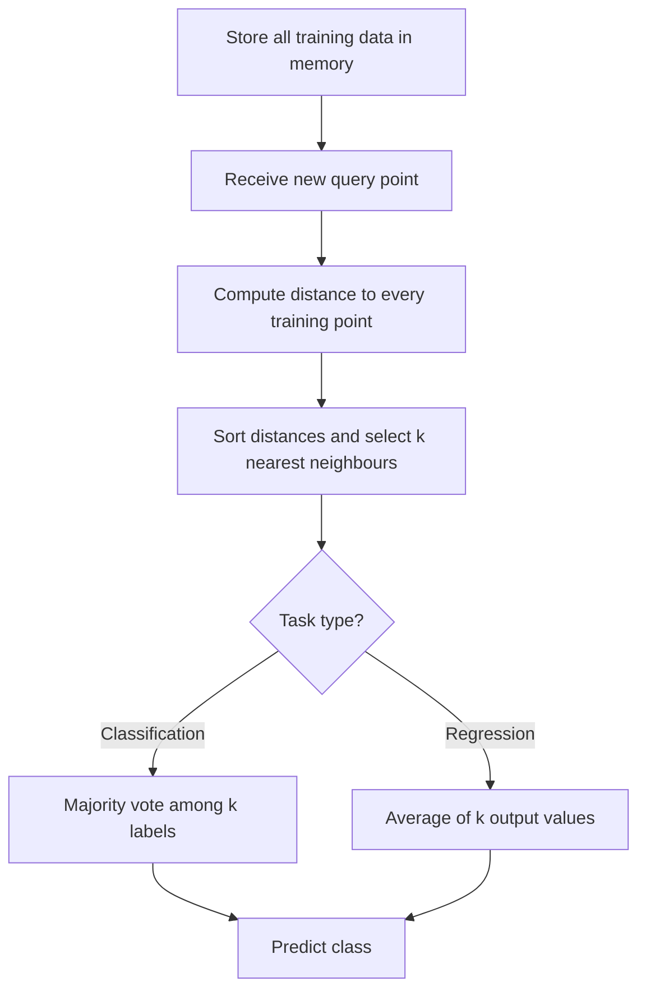

# Distance based methods

## Video Explanation

* [https://www.youtube.com/watch?v=4HKqjENq9OU](https://www.youtube.com/watch?v=4HKqjENq9OU)

## Visual Aids

## 1. Definition

Distance-based methods are a family of machine learning algorithms that make predictions by measuring the similarity (or distance) between data points. In these methods, the output for a new input is determined by considering the outputs of its nearest neighbours in the feature space. The most well-known example is the k-Nearest Neighbours (k-NN) algorithm, used for both classification and regression.

## 2. Concept Explanation

Imagine you want to predict the price of a house. Instead of building a complex equation, you look for similar houses in the neighbourhood and average their prices. This simple idea is the core of distance‑based methods: **similar things have similar outputs**. The learner stores the entire training dataset and, when asked to make a prediction for a new point, measures how far it is from every stored example. The closest ones “vote” on the prediction.

Why do we use them? Because they require no training phase and can model arbitrarily complex decision boundaries. They are non‑parametric, meaning they make no assumptions about the underlying data distribution. In machine learning systems, distance‑based methods are often used as baselines, in recommendation engines, and in anomaly detection.

## 3. Key Characteristics / Features

- **Lazy learning:** No explicit training takes place. The algorithm simply memorises the training data and postpones all computation until prediction time.
- **Distance metric dependent:** The choice of how distance is measured (Euclidean, Manhattan, etc.) has a big impact on performance.
- **Non‑parametric:** There is no fixed set of parameters; the model complexity grows with more data.
- **Local decision boundary:** A new point is classified only by the data in its immediate vicinity, which allows very flexible shapes.
- **Sensitive to scaling:** If one feature has a much larger numeric range than others, it dominates the distance computation unless features are normalised.
- **Interpretable:** The reasoning “the neighbours voted for class A” is easy to understand and explain to non‑experts.

## 4. Types / Classification

Distance‑based methods can be grouped by the prediction task and the neighbourhood logic.

- **k‑Nearest Neighbours (k‑NN):** The classic approach. For a new point, find the **k** closest training examples and return the majority class (classification) or the average value (regression).
- **Weighted k‑NN:** Neighbours closer to the query point get a higher weight in the vote, often using the inverse of distance.
- **Radius‑based neighbour methods:** Instead of a fixed number **k**, we define a radius **r**. All training points inside that hypersphere contribute to the prediction. Useful when the density of data varies a lot across the space.
- **Distance‑based clustering:** Though unsupervised, algorithms like K‑Means also rely heavily on distance (e.g., Euclidean) to assign cluster membership.
- **Distance‑based anomaly detection:** Points that are far away from most other data points are flagged as outliers.

## 5. Working / Mechanism

The k‑Nearest Neighbours algorithm works step by step as follows.

1.  **Store the training data:** The entire dataset of features X and labels y is kept in memory.
2.  **Receive a new query point x_q:** This is the point for which we want a prediction.
3.  **Compute distances:** Calculate the distance from x_q to every single training example using a chosen metric (e.g., Euclidean).
4.  **Sort the distances:** Arrange all training points from closest to farthest.
5.  **Select the k nearest neighbours:** Pick the top k points from the sorted list.
6.  **Aggregate the outputs:**
    - If it is a classification task, count the class labels of the k neighbours. The predicted class is the one with the highest count (majority vote).
    - If it is a regression task, the predicted value is the mean (or weighted mean) of the target values of the k neighbours.
7.  **Return the prediction:** The aggregated value becomes the output.

## 6. Diagram

## 7. Mathematical Formulation

The most common distance metric is Euclidean distance. Given two points p and q with n features, the distance is:

$$
d(p,q) = \sqrt{\sum_{i=1}^{n} (p_i - q_i)^2}
$$

Another frequent choice is Manhattan distance:

$$
d(p,q) = \sum_{i=1}^{n} |p_i - q_i|
$$

For a classification task using weighted k‑NN, the predicted class label \(\hat{y}\) is determined by:

$$
\hat{y} = \arg\max_{c} \sum_{j \in \text{neighbours}} w_j \cdot [y_j = c]
$$

Where:

- \(p_i, q_i\) are the i‑th feature values of points p and q.
- \(n\) is the number of features.
- \(k\) is the number of neighbours chosen.
- \(w_j\) is the weight of neighbour \(j\) (often \(w_j = \frac{1}{d(x_q, x_j)}\) or 1 for plain k‑NN).
- \([y_j = c]\) is 1 if the neighbour’s label equals class \(c\), else 0.

## 8. Example

Suppose we want to classify whether a fruit is an apple or an orange based on two features: weight (grams) and redness (0–255). A new fruit has weight 180 g and redness 200. We compute the Euclidean distance from this point to every fruit in a stored dataset of previously labelled fruits. If we set k=3 and the three nearest fruits are two apples and one orange, the majority vote classifies the new fruit as an apple.

In practice, libraries like scikit‑learn implement k‑NN with a fit() method that simply stores the data and a predict() method that performs the distance calculations.

## 9. Analogy

Think of a visitor in a new city asking for a good restaurant. They don’t study a city‑wide map; they simply walk a few steps, ask the people immediately around them, and go to the place most of them recommend. The visitor is the query point, the people nearby are the k nearest neighbours, and the restaurant choice is the prediction.

## 10. Comparison

| Feature | Distance‑based methods (k‑NN) | Model‑based methods (e.g., linear regression) |
|--------|-------------------------------|----------------------------------------------|
| **Training phase** | None (lazy) or only storing data | Explicit training to learn parameters (weights) |
| **Prediction speed** | Slow for large datasets because of full scan | Fast, uses learned parameters |
| **Interpretability** | High, neighbours explain the output | Lower, coefficients may be hard to grasp for non‑linear models |
| **Underlying assumption** | Similar inputs have similar outputs | Data follows a specific functional form (e.g., linear) |
| **Handling non‑linearity** | Naturally captures complex shapes | Requires feature engineering or non‑linear models |

## 11. Advantages

- **No training time:** The algorithm can be applied immediately to a dataset without any learning phase.
- **Simple and intuitive:** The principle is easy to understand, implement, and debug.
- **Adaptable to any number of classes:** Works naturally for multi‑class classification without modifications.
- **Non‑linear decision boundaries:** Can model very complex shapes without any assumption about the data distribution.
- **Easy to update:** Adding new training data simply means storing more points; no retraining is required.

## 12. Disadvantages / Limitations

- **Slow at prediction time:** For each new query, the distance to every training point must be calculated, making it impractical for very large datasets.
- **Curse of dimensionality:** As the number of features grows, the distance between any two points becomes similar, degrading performance.
- **Memory intensive:** The entire training dataset must be stored in memory, which can be prohibitive.
- **Sensitive to irrelevant features:** Noisy or meaningless features can distort the distance measure.
- **Choosing k is tricky:** A small k makes the model noisy; a large k can smooth away genuine patterns. The optimal value often requires cross‑validation.

## 13. Important Points / Exam Notes

- k‑NN is a **lazy learner** and a **non‑parametric** method.
- The **choice of distance metric** is a hyperparameter; Euclidean is standard for numerical data.
- **Feature scaling (normalisation/standardisation)** is mandatory before applying distance‑based methods.
- For binary classification, **k should be an odd number** to avoid ties.
- **Weighted k‑NN** assigns higher importance to closer neighbours, often improving accuracy.
- In regression, the prediction is the **mean or weighted mean** of the neighbours’ target values.
- The **curse of dimensionality** is the main theoretical limitation.
- Distance‑based methods can be used for **imputation of missing values** (predicting a missing feature from neighbours).
- **Cross‑validation** is the recommended way to select the best k.
- Popular distance measures besides Euclidean: **Manhattan, Minkowski, Hamming, cosine similarity**.

## 14. Applications / Use Cases

- **Recommendation systems:** Suggesting movies or products by finding users with similar taste (collaborative filtering).
- **Pattern recognition:** Handwriting or facial recognition where new samples are compared to stored templates.
- **Medical diagnosis:** Predicting a disease based on similarity to historical patient records.
- **Credit scoring:** Flagging loan applicants whose profile closely resembles past defaulters.
- **Anomaly/fraud detection:** Identifying transactions that are far away from normal transaction clusters.
- **Real estate pricing:** Estimating a property’s value by averaging the prices of recently sold nearby houses.

## 15. MCQs

**Q1. k‑Nearest Neighbours is called a lazy learner because**

A. It requires heavy training before prediction
B. It does not learn a discriminative function but stores training data
C. It only works with small datasets
D. It uses a lazy evaluation of features

**Answer:** B
**Explanation:** Lazy learners simply memorise the training set and postpone all computation until a query is made.

---

**Q2. Which distance metric is most commonly used in k‑NN for numerical data?**

A. Hamming distance
B. Cosine similarity
C. Euclidean distance
D. Jaccard distance

**Answer:** C
**Explanation:** Euclidean distance is the straight‑line distance in a multidimensional space and is the default for continuous features.

---

**Q3. In k‑NN classification, if k=5 and the five nearest neighbours have labels [A, B, A, A, B], the predicted class is**

A. B with 60% confidence
B. A with 60% confidence
C. A, because it is a majority vote
D. B, because it is the last neighbour

**Answer:** C
**Explanation:** There are three A’s and two B’s; majority voting selects class A.

---

**Q4. Why is feature scaling important for distance‑based methods?**

A. To increase the size of the dataset
B. To ensure that no single feature dominates the distance calculation
C. To reduce the number of neighbours k
D. To convert categorical features into numerical ones

**Answer:** B
**Explanation:** Distance is a combination of differences across features. Without scaling, a feature with larger magnitude will outweigh others.

---

**Q5. The curse of dimensionality in k‑NN refers to**

A. The algorithm failing when the dataset has fewer than 1000 points
B. Distances becoming almost equal in high‑dimensional spaces, making neighbours meaningless
C. The need to increase k with more dimensions
D. The excessive memory required for one‑dimensional data

**Answer:** B
**Explanation:** As dimensionality increases, the volume of the space grows so fast that data points become sparse, and the concept of “nearest” loses its discriminative power.

---

**Q6. In weighted k‑NN, neighbours are usually weighted by**

A. Their class label frequency
B. Their distance from the origin
C. The inverse of their distance to the query point
D. A random weight assigned at query time

**Answer:** C
**Explanation:** Closer neighbours get a higher weight (e.g., \(w = 1/d\)), so they influence the decision more than distant ones.

---

**Q7. Which statement about k‑NN is FALSE?**

A. It can be used for both classification and regression
B. It is sensitive to noisy data
C. It requires an explicit training phase to learn weights
D. The value of k influences the bias‑variance trade‑off

**Answer:** C
**Explanation:** k‑NN is a lazy learner; it does not have an explicit training phase for weight learning.

---

**Q8. To find the optimal k in k‑NN, a data scientist should**

A. Always use k=1 for maximum accuracy
B. Always set k equal to the number of classes
C. Use cross‑validation on a validation set
D. Ask the domain expert for a fixed number

**Answer:** C
**Explanation:** Cross‑validation helps choose the k that gives the best generalisation performance on unseen data.

---

**Q9. In k‑NN regression, the predicted value is typically the**

A. Weighted sum of all training outputs
B. Median of the k nearest neighbours’ target values
C. Mean (or weighted mean) of the k nearest neighbours’ target values
D. Standard deviation of the neighbours’ outputs

**Answer:** C
**Explanation:** For regression, the output is the average of the targets of the k nearest points; weighted versions use distance‑based weights.

---

**Q10. A dataset has 1 million training examples with 2 features. The main challenge when applying k‑NN at prediction time will be**

A. High bias in the model
B. Slow prediction speed because distances to all points must be computed
C. Inability to handle two features
D. The model being under‑parameterised

**Answer:** B
**Explanation:** k‑NN requires computing the distance to every training point for each prediction, which is computationally expensive for large N.