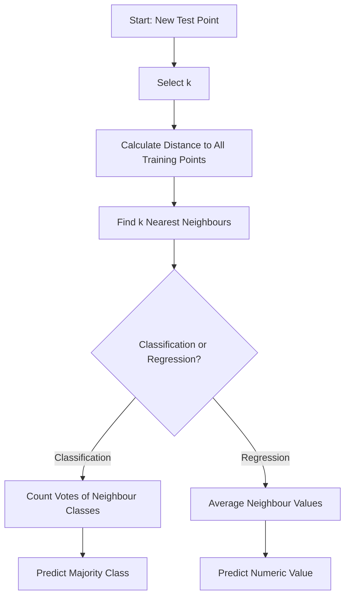

# Nearest Neighbours

## Video Explanation

* [https://www.youtube.com/watch?v=HVXime0nQeI](https://www.youtube.com/watch?v=HVXime0nQeI)

## Visual Aids

## 1. Definition

The Nearest-Neighbours algorithm is a simple, non-parametric, instance-based learning method used for both classification and regression tasks. It predicts the output for a new data point by looking at the 'k' closest training examples in the feature space and aggregating their outputs (majority vote for classification, average for regression). The core idea is that similar things exist in close proximity.

## 2. Concept Explanation

Imagine you are in a new city and want to guess what kind of food a restaurant serves. You look at the three nearest restaurants: two are Italian, one is Chinese. The most common type among them is Italian, so you predict the new restaurant is Italian. This is how Nearest-Neighbours works.

In Machine Learning, the algorithm memorises the entire training dataset. When a new, unseen example arrives, it calculates how far this new point is from every training point using a distance measure like Euclidean distance. It then selects the 'k' training points that are closest (nearest neighbours). For classification, the most frequent class among these neighbours becomes the predicted class. For regression, the average (or weighted average) of the neighbours’ values is the predicted output.

The method is "lazy" because it does not build an explicit model during training. All computation happens at prediction time. It is widely used as a baseline algorithm because it is easy to understand and implement. It works well when the decision boundaries are irregular and the dataset is small to medium-sized.

## 3. Key Characteristics / Features

- **Non-parametric:** It makes no assumptions about the underlying data distribution. The model structure is determined directly by the data.
- **Instance-based (Lazy Learning):** It does not learn a discriminative function from the training data. It simply stores the training instances and delays all computation until a query is made.
- **Distance-driven:** The prediction depends entirely on a distance metric (e.g., Euclidean, Manhattan). The choice of metric significantly affects performance.
- **Hyperparameter k:** The number of neighbours, k, is the most critical parameter. A small k captures local patterns but can be noisy; a large k smooths the decision boundary but may miss fine details.
- **Uniform or Weighted Voting:** In classification, each neighbour can cast an equal vote (uniform) or a vote weighted by its distance (closer neighbours have more influence). Weighting usually improves robustness.

## 4. Types / Classification

The Nearest-Neighbours principle is applied to two main types of tasks based on the output variable.

- **k-Nearest Neighbours Classifier (k-NN Classifier):** Used when the target is a categorical class label. The prediction is the majority class among the k closest training examples. For example, classifying an image as 'cat' or 'dog'.
- **k-Nearest Neighbours Regressor (k-NN Regressor):** Used when the target is a continuous numerical value. The prediction is the mean (or weighted mean) of the target values of the k nearest neighbours. For example, predicting the price of a house based on similar houses.

## 5. Working / Mechanism

The k-NN algorithm follows these steps for every new query point.

1.  **Store the training dataset:** All feature vectors and their corresponding labels (or values) are kept in memory.
2.  **Choose the number of neighbours k:** The user specifies a positive integer k (e.g., k=5). This is often tuned using cross-validation.
3.  **Calculate distances:** For the new test point, compute the distance to every single training point. The most common distance metric is Euclidean distance:
    $$
    d(x, x_i) = \sqrt{\sum_{j=1}^{n} (x_j - x_{ij})^2}
    $$
    where $n$ is the number of features. Other metrics like Manhattan or Minkowski can also be used.
4.  **Identify the k nearest neighbours:** Sort all distances in ascending order and pick the top k training points with the smallest distances.
5.  **Aggregate neighbour outputs:**
    - For **classification**: Perform majority voting. The predicted class is the one that appears most frequently among the k neighbours. If weighted voting is used, each neighbour's vote is weighted by the inverse of its distance.
    - For **regression**: Compute the average (mean) of the k neighbours’ target values. For weighted regression, a distance-weighted average is calculated.
6.  **Output the prediction:** The resulting class or numerical value is returned as the prediction for the test point.

## 6. Diagram

## 7. Mathematical Formulation

### Euclidean Distance (common metric)

$$
d(\mathbf{x}, \mathbf{x}_i) = \sqrt{\sum_{j=1}^{n} (x_j - x_{ij})^2}
$$

Where:

- $\mathbf{x}$ = feature vector of the query point
- $\mathbf{x}_i$ = feature vector of the $i$-th training sample
- $x_j$ = $j$-th feature of the query point
- $x_{ij}$ = $j$-th feature of the $i$-th training sample
- $n$ = number of features/dimensions

### k-NN Classification Prediction

For uniform voting:

$$
\hat{y} = \text{mode}(\{y_i \mid i \in \mathcal{N}_k(\mathbf{x})\})
$$

For distance-weighted voting, each neighbour $i$ receives a weight $w_i = \frac{1}{d(\mathbf{x}, \mathbf{x}_i)}$ and the class with the highest total weight is predicted.

### k-NN Regression Prediction

For uniform average:

$$
\hat{y} = \frac{1}{k} \sum_{i \in \mathcal{N}_k(\mathbf{x})} y_i
$$

Where $\mathcal{N}_k(\mathbf{x})$ is the set of indices of the k nearest neighbours.

## 8. Example

Suppose we have historical data about whether customers bought a product based on their age and income:

| Age | Income (in ₹) | Purchased |
|-----|---------------|-----------|
| 25  | 30,000        | No        |
| 35  | 60,000        | Yes       |
| 45  | 80,000        | Yes       |
| 20  | 20,000        | No        |
| 30  | 50,000        | Yes       |

Now, a new customer is 28 years old with an income of ₹48,000. We want to predict whether they will purchase using k=3. Compute Euclidean distances between the new point (28, 48000) and all training points. The three closest neighbours are:

- (25, 30000) → No
- (30, 50000) → Yes
- (35, 60000) → Yes

Two neighbours say "Yes", one says "No". Majority voting predicts **Yes**, so the customer is likely to buy.

## 9. Analogy

Think of predicting the weather for tomorrow in your city. You look back at the past 100 days and find the 5 days that had the **most similar** temperature, humidity, and wind speed to today. If it rained on 4 of those 5 days, you would predict rain. That is exactly what k-NN does: find the most similar historical situations and assume the outcome will be similar.

## 10. Comparison

| Feature          | k-Nearest Neighbours (k-NN)       | Decision Tree                    |
| ---------------- | --------------------------------- | -------------------------------- |
| Learning type    | Lazy (instance-based)             | Eager (model built during training) |
| Training phase   | Just stores data                  | Builds a tree structure          |
| Prediction speed | Slow for large datasets (must compute all distances) | Fast (traversing a tree)       |
| Interpretability | Low (black-box neighbour set)     | High (rules can be visualised)   |
| Data assumptions | No explicit assumptions            | May overfit without pruning      |

## 11. Advantages

- **Simple and intuitive:** The algorithm is easy to understand and implement; no complex math for training.
- **No training time:** The model is ready to use as soon as data is stored; no gradient descent or iterative optimization.
- **Naturally handles multi-class problems:** No extra modification needed for more than two classes.
- **Flexible decision boundaries:** It can capture very complex, non-linear patterns because it makes no linearity assumption.
- **Very few hyperparameters:** Mainly just k and the distance metric, making tuning straightforward.

## 12. Disadvantages / Limitations

- **Computationally expensive at prediction:** For large datasets, calculating distance to every point is slow and memory-intensive. This makes it unsuitable for real-time applications with millions of records.
- **Curse of dimensionality:** As the number of features grows, the distance between points becomes less meaningful, degrading performance. Feature selection or dimensionality reduction is essential.
- **Sensitive to irrelevant features:** Noisy or irrelevant features can distort distance calculations, hurting accuracy. Feature scaling (normalization) is mandatory.
- **Needs storage of entire training set:** High memory requirement for large datasets.
- **Imbalanced data problem:** The classifier may be biased toward the majority class; a lower k or distance weighting can help.

## 13. Important Points / Exam Notes

- k-NN is a **lazy, non-parametric, instance-based** learning algorithm.
- Prediction uses **majority voting** (classification) or **averaging** (regression) of k nearest neighbours.
- The number of neighbours **k** is a hyperparameter; a small k leads to high variance (overfitting), a large k leads to high bias (underfitting). Tune using cross-validation.
- **Distance metrics**: Euclidean (continuous features), Manhattan, Hamming (categorical), Minkowski.
- **Feature scaling** (e.g., Min-Max, Z-score) is critical because distance calculations are sensitive to magnitude.
- Weighted k-NN gives higher weight to closer neighbours, often improving performance.
- Time complexity at query: O(N * d) for brute-force, where N is training size and d is feature dimension. Speed-ups possible with KD-trees, Ball trees.

## 14. Applications / Use Cases

- **Recommendation Systems:** Recommending movies or products by finding users with similar preference profiles (collaborative filtering).
- **Image Recognition:** Early digit or character recognition where each image is compared to stored templates.
- **Fraud Detection:** Identifying fraudulent transactions by comparing a new transaction to historical fraud patterns.
- **Customer Segmentation:** Predicting customer behaviour based on similar customers in the database.
- **Medical Diagnosis:** Predicting disease risk by comparing a patient’s test results with patients who have known outcomes.

## 15. MCQs

**Q1. What is the fundamental assumption behind the k-NN algorithm?**

A. Data follows a Gaussian distribution.
B. Features are linearly separable.
C. Points that are close in the feature space have similar target values.
D. There is no noise in the training data.
**Answer:** C
**Explanation:** Nearest-Neighbours assumes that instances with similar feature vectors will behave similarly, i.e., have the same class or similar numeric value.

**Q2. In k-NN classification with k=5 and uniform voting, the predicted class is:**

A. The class of the single nearest neighbour.
B. The class that appears at least 3 times among the 5 neighbours.
C. The average of the 5 neighbours' classes.
D. A random class from the 5 neighbours.
**Answer:** B
**Explanation:** Majority voting means the class that gets the most votes (at least 3 out of 5) is selected.

**Q3. Why is feature scaling essential before applying k-NN?**

A. To reduce the dimensionality of the data.
B. To ensure all features contribute equally to the distance calculation.
C. To speed up the training process.
D. To convert categorical features into numerical ones.
**Answer:** B
**Explanation:** Distance metrics are affected by the scale of features; without scaling, features with larger magnitudes dominate the distance measure.

**Q4. A small value of k (e.g., k=1) is likely to cause which problem?**

A. High bias
B. High variance / overfitting
C. Underfitting
D. High training time
**Answer:** B
**Explanation:** k=1 means the model captures all local noise, making the decision boundary very jagged and sensitive to outliers, leading to high variance.

**Q5. Which distance metric is most commonly used for continuous numerical features in k-NN?**

A. Hamming distance
B. Euclidean distance
C. Cosine distance
D. Jaccard distance
**Answer:** B
**Explanation:** Euclidean distance (straight-line distance) is the default choice for continuous variables because it is simple and geometrically intuitive.

**Q6. k-NN is called a "lazy learner" because:**

A. It takes a long time to train.
B. It does not generalize well.
C. It delays all computation until a query is made.
D. It requires a lot of memory for training.
**Answer:** C
**Explanation:** Lazy learning means there is no explicit training phase; the algorithm simply stores the data and processes it at prediction time.

**Q7. For a regression task using k=3, the nearest neighbours' target values are 200, 220, and 240. What is the predicted output using uniform weighting?**

A. 200
B. 220
C. 230
D. 240
**Answer:** B
**Explanation:** The uniform weighted average is (200+220+240)/3 = 220.

**Q8. Which of the following is a major disadvantage of the brute-force k-NN approach?**

A. Difficulty in handling multi-class classification.
B. Very slow predictions on large datasets because it scans all training points.
C. It requires a large amount of RAM during training.
D. It cannot handle numeric features.
**Answer:** B
**Explanation:** Brute-force k-NN computes distances to all training points for every query, making it O(N*d) per query; with many test points it becomes prohibitively slow.

**Q9. The "curse of dimensionality" affects k-NN because:**

A. More features increase model accuracy always.
B. In high dimensions, all points tend to become nearly equidistant, making the concept of nearest neighbour meaningless.
C. It makes the algorithm impossible to implement.
D. It automatically reduces the value of k.
**Answer:** B
**Explanation:** As the number of dimensions increases, the volume of the space grows exponentially, and distances between points converge, deteriorating k-NN's performance.

**Q10. Weighted k-NN is often preferred over uniform k-NN because:**

A. It is faster to compute.
B. It gives more influence to closer neighbours, which are more likely to be similar.
C. It requires a smaller k.
D. It works without a distance metric.
**Answer:** B
**Explanation:** By weighting neighbours by the inverse of distance, closer points (which are more relevant) have a stronger say, usually leading to better predictions.