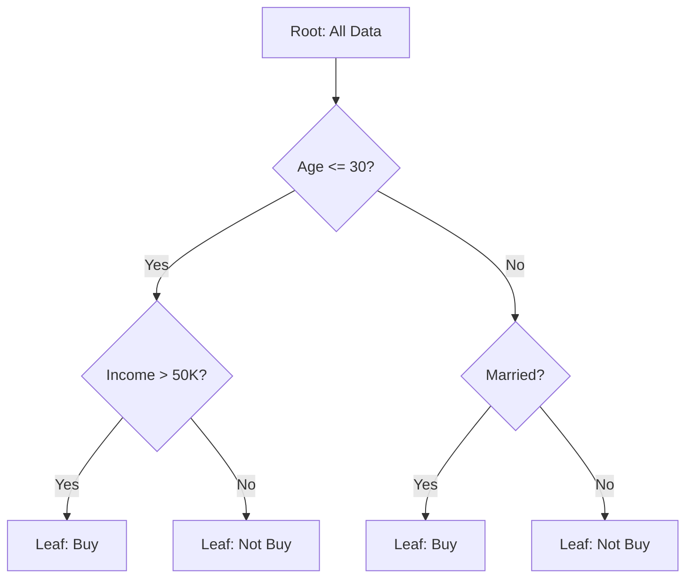

# Decision Trees

## 1. Definition

A decision tree is a supervised machine learning algorithm used for both classification and regression tasks. It models decisions and their possible consequences as a tree structure, where internal nodes represent tests on features, branches represent the outcome of those tests, and leaf nodes represent the final predicted class label (for classification) or a continuous value (for regression). The algorithm learns simple decision rules inferred from the training data to make predictions on unseen data.

---

## 2. Concept Explanation

**Basic Idea:** A decision tree works like a flowchart that helps us reach a decision by asking a series of questions. For example, to decide whether a person will buy a product, we might first ask, "Is the person younger than 30?" If yes, then check "Is their income above ₹50,000?" This sequence continues until a final decision (buy or not buy) is reached. Each question splits the data into smaller, more homogeneous groups.

**Technical Explanation:** The tree is constructed by recursively partitioning the feature space. At each step, the algorithm selects the feature and a split point that best separates the data according to a certain criterion (like Gini impurity or information gain for classification, and variance reduction for regression). The process repeats on each resulting subset until a stopping condition is met (e.g., maximum tree depth, minimum samples per leaf, or pure nodes). The result is a tree where each path from root to leaf represents a conjunction of rules, and the leaf gives the prediction.

**Where it is applied:** Decision trees are widely used in finance for credit scoring, in medicine for diagnosis, in marketing for customer segmentation, and as base learners in ensemble methods like random forests and gradient boosting.

---

## 3. Key Characteristics / Features

* **Non‑parametric model:** Decision trees do not assume any specific distribution for the data. They can model complex, non‑linear relationships without any functional form.
* **Interpretability:** The tree structure is easy to visualise and understand. The decision rules can be explained in plain language, which is crucial in domains requiring transparency.
* **Handles mixed data types:** They can handle both numerical and categorical features without needing dummy encoding or scaling, unlike many other algorithms.
* **Automatic feature selection:** At each split, the algorithm selects the most informative feature, effectively performing built‑in feature selection and ignoring irrelevant attributes.
* **White‑box model:** The internal logic is fully visible and can be inspected. This contrasts with black‑box models like neural networks.
* **Greedy top‑down approach:** The tree is built by repeatedly partitioning the data using local optimal splits. The algorithm chooses the best split at the current node without considering future splits.
* **Prone to overfitting:** A deep tree with few samples per leaf can memorise noise in the training data, resulting in poor generalisation. Regularisation techniques like pruning and minimum samples per leaf are used to control this.

---

## 4. Types / Classification

Decision trees can be classified based on the target variable and the splitting criterion.

* **Based on task:**
    * **Classification Tree:** The target variable is categorical. Each leaf node assigns a class label (the majority class of training instances reaching that leaf). Splitting criteria include Gini impurity, entropy (information gain), and misclassification error.
    * **Regression Tree:** The target variable is continuous. Each leaf node predicts a numerical value (usually the mean of the target variable for training instances in that leaf). Splitting criteria include mean squared error (MSE) reduction and mean absolute error (MAE) reduction.

* **Based on algorithm:**
    * **CART (Classification and Regression Trees):** Produces binary splits only. Uses Gini impurity for classification and MSE for regression. This is the most common implementation in libraries like scikit‑learn.
    * **ID3 (Iterative Dichotomiser 3):** Used only for classification with categorical features. Uses information gain (based on entropy) as splitting criterion. It can produce multi‑way splits.
    * **C4.5:** An improved version of ID3 that can handle both continuous and categorical features, uses gain ratio to avoid bias towards features with many values, and supports pruning.

---

## 5. Working / Mechanism

The construction of a decision tree follows a recursive, greedy algorithm. The steps below describe a typical CART‑style tree:

1. **Start at the root node:** Place the entire training dataset at the root node.
2. **Select the best feature and split point:** For every feature and every possible split point (for continuous features, sort values and test midpoints), compute the chosen impurity measure (e.g., Gini index for classification). Select the feature and split that result in the largest impurity reduction.
3. **Partition the data:** Divide the dataset into two or more subsets based on the chosen feature and split. Each subset corresponds to a child node.
4. **Recurse:** Repeat steps 2–3 on each child node, using only the data assigned to that node.
5. **Stop when a termination condition is met:** Common stopping criteria include:
   * All samples in a node belong to the same class (pure node).
   * No remaining features to split.
   * Maximum tree depth is reached.
   * Minimum number of samples in a node is below a threshold.
6. **Assign leaf values:** For a classification tree, assign the majority class of the training samples in the leaf. For a regression tree, assign the mean target value of the training samples in the leaf.
7. **Predict on new data:** To predict, start at the root and follow the branch according to the feature test at each internal node until a leaf is reached. The leaf value is the prediction.

---

## 6. Diagram

*Explanation:* The diagram illustrates a simple classification tree. The root splits on Age. The left branch further splits on Income, while the right branch splits on Marital status. Leaves contain the final decision (Buy/Not Buy).

---

## 7. Mathematical Formulation

**Gini Impurity (for Classification):**

Measures the probability of misclassifying a randomly chosen element if it were randomly labeled according to the class distribution in the node.

$$
Gini = 1 - \sum_{i=1}^{C} p_i^2
$$

Where:
* \( C \) = number of classes
* \( p_i \) = proportion of samples belonging to class \( i \) in the node

A Gini index of 0 indicates a perfectly pure node (all samples belong to one class).

**Information Gain (Entropy‑based):**

Measures the reduction in entropy after a dataset is split on a feature. Entropy measures the uncertainty in the data.

$$
Entropy = - \sum_{i=1}^{C} p_i \log_2(p_i)
$$

Where \( p_i \) is again the proportion of class \( i \) in the node. Information Gain is:

$$
IG(D, A) = Entropy(D) - \sum_{v \in Values(A)} \frac{|D_v|}{|D|} Entropy(D_v)
$$

Where \( D \) is the dataset, \( A \) is the attribute, and \( D_v \) are the subsets after splitting on \( A \).

**Reduction in Variance (for Regression):**

The split is chosen to minimise the weighted variance of the child nodes, which is equivalent to maximising the reduction in variance.

$$
Variance = \frac{1}{n} \sum_{i=1}^{n} (y_i - \bar{y})^2
$$

Where \( y_i \) are the target values and \( \bar{y} \) is the mean.

---

## 8. Example

Consider a small dataset of whether a person will play tennis based on weather conditions. The features are Outlook (sunny, overcast, rainy), Temperature, Humidity, and Wind.

| Outlook  | Humidity | Wind   | Play Tennis |
|----------|----------|--------|-------------|
| Sunny    | High     | Weak   | No          |
| Sunny    | High     | Strong | No          |
| Overcast | High     | Weak   | Yes         |
| Rainy    | High     | Weak   | Yes         |
| Rainy    | Normal   | Weak   | Yes         |
| Rainy    | Normal   | Strong | No          |
| Overcast | Normal   | Strong | Yes         |
| Sunny    | High     | Weak   | No          |
| Sunny    | Normal   | Weak   | Yes         |
| Rainy    | Normal   | Weak   | Yes         |
| Sunny    | Normal   | Strong | Yes         |
| Overcast | High     | Strong | Yes         |
| Overcast | Normal   | Weak   | Yes         |
| Rainy    | High     | Strong | No          |

A decision tree may first split on Outlook. Overcast leads directly to "Yes". Sunny and Rainy further split on Humidity or Wind to finally predict "Play Tennis" or "Not Play".

---

## 9. Analogy

Imagine you are finding a lost item in your house. You start by asking a broad question: "Is it in the bedroom or the living room?" (first split). If in the bedroom, you ask: "Is it in the cupboard or under the bed?" (second split). You continue asking specific questions until you pinpoint the item's exact location. A decision tree works exactly like this: each question (feature test) narrows down the possibilities until a final decision (prediction) is reached.

---

## 10. Comparison (if needed)

| Feature            | Decision Tree                                   | Logistic Regression                            |
| ------------------ | ----------------------------------------------- | ----------------------------------------------- |
| Model type         | Non‑parametric, rule‑based                      | Parametric, linear model                        |
| Decision boundary  | Axis‑parallel, can be highly non‑linear         | Linear (without transformations)                |
| Interpretability   | Very high (visual tree)                         | Moderate (coefficients)                         |
| Handling non‑linearity | Excellent, naturally captures interactions    | Requires manual feature engineering             |
| Sensitivity to outliers | Less sensitive (outliers affect leaves only) | More sensitive (influences coefficients globally) |

---

## 11. Advantages

* **Interpretable and visual:** The tree structure can be visualised, making it easy to understand and explain to non‑technical stakeholders. This is vital in medical diagnosis or credit scoring.
* **Minimal data preparation:** Requires little data preprocessing—no need for feature scaling, centering, or one‑hot encoding of categorical variables (though some implementations require numerical inputs).
* **Handles both numerical and categorical data:** Can mix different feature types without additional transformations.
* **Captures complex interactions:** Automatically models feature interactions by placing one split after another, without manual specification.
* **Provides variable importance estimates:** After training, the reduction in impurity attributed to each feature can be used to rank features by relevance.

---

## 12. Disadvantages / Limitations

* **Easily overfits:** Without pruning or proper stopping criteria, a tree can grow to fit noise perfectly, resulting in poor test performance.
* **Instability:** Small variations in the training data can result in a completely different tree structure because the splits are selected greedily.
* **Bias towards features with many levels:** Information‑gain‑based methods (without gain ratio) tend to favor categorical features with many categories.
* **Limited expressiveness for some relationships:** Decision trees produce axis‑parallel boundaries, which are inefficient for modeling diagonal or circular patterns; they require many splits to approximate them.
* **Greedy learning:** The local optimal choice at each node does not guarantee a globally optimal tree, though ensemble methods often mitigate this.
* **Cannot extrapolate beyond training range:** In regression trees, predictions are constant within leaf intervals and cannot predict values outside the range of target values seen during training.

---

## 13. Important Points / Exam Notes

* **Decision tree** = supervised learning algorithm, used for both classification and regression.
* **Internal nodes** test features, **branches** show test outcomes, **leaf nodes** give predictions.
* **Splitting criteria**: Gini impurity, entropy (information gain) for classification; variance reduction (MSE) for regression.
* **CART** produces binary trees; ID3/C4.5 handle multi‑way splits.
* **Overfitting** is controlled by **pruning** (pre‑pruning: stop early; post‑pruning: remove branches after full growth), `max_depth`, `min_samples_split`, `min_samples_leaf`.
* **Characteristic**: White‑box, non‑parametric, greedy, unstable.
* **Feature importance** can be derived from the total impurity reduction due to that feature.
* **Ensemble methods** (Random Forest, GBM) combine many trees to reduce overfitting and variance.

---

## 14. Applications / Use Cases

* **Credit risk assessment:** Banks use decision trees to approve or reject loan applications based on applicant characteristics (income, credit history, employment status).
* **Medical diagnosis:** Predicting a disease based on symptoms and test results; the interpretability allows doctors to validate the reasoning.
* **Customer segmentation and churn prediction:** Telecom companies use decision trees to identify customers likely to switch providers and target them with retention offers.
* **Fraud detection:** Flagging suspicious transactions by learning patterns from historical fraud data.
* **Recommendation systems:** As a component of collaborative filtering, decision trees can model user preferences.
* **Quality control in manufacturing:** Classifying products as defective or non‑defective based on sensor measurements and process parameters.

---

## 15. MCQs

**Q1. Which of the following best describes a decision tree?**

A. A clustering algorithm that groups similar data points.
B. A probabilistic model that assumes features are independent.
C. A flowchart-like structure where internal nodes test attributes and leaf nodes give predictions.
D. A neural network with no hidden layers.

**Answer:** C
**Explanation:** Decision trees represent decisions as a tree, with tests on features at nodes and outcomes at leaves. Option A describes clustering, B describes Naive Bayes, D is incorrect.

---

**Q2. Which impurity measure is used by the CART algorithm for classification trees?**

A. Entropy
B. Information gain
C. Gini impurity
D. Mean squared error

**Answer:** C
**Explanation:** CART uses Gini impurity for classification. While entropy/information gain can be used, Gini is the default in many implementations like scikit‑learn's CART.

---

**Q3. How does a regression tree make a prediction for a new sample?**

A. By averaging the target values of all training samples.
B. By traversing the tree to a leaf and outputting the mean target value of training samples in that leaf.
C. By solving a linear regression model at each leaf.
D. By applying a support vector machine.

**Answer:** B
**Explanation:** In regression trees, each leaf holds the mean (or median) of the target values of training instances that reached that leaf. A new instance follows the path to a leaf and receives that mean value.

---

**Q4. What is the primary purpose of pruning a decision tree?**

A. To increase the tree's depth for better training accuracy.
B. To reduce overfitting by removing unnecessary branches.
C. To convert a classification tree into a regression tree.
D. To handle missing values.

**Answer:** B
**Explanation:** Pruning simplifies the tree by removing sections that provide little predictive power, thereby reducing overfitting and improving generalisation to unseen data.

---

**Q5. Which of the following is a major disadvantage of single decision trees?**

A. They cannot handle numerical features.
B. They are highly interpretable.
C. They are prone to overfitting and instability.
D. They require feature scaling.

**Answer:** C
**Explanation:** Single trees can easily overfit and are sensitive to small data changes (high variance). Options A and D are false (they handle numerical features and do not need scaling), and B is an advantage, not a disadvantage.

---

**Q6. In a binary classification tree, a node contains 40 samples of Class A and 10 samples of Class B. What is the Gini impurity of this node?**

A. 0.0
B. 0.32
C. 0.5
D. 1.0

**Answer:** B
**Explanation:** Proportions: p_A = 40/50 = 0.8, p_B = 10/50 = 0.2. Gini = 1 – (0.8² + 0.2²) = 1 – (0.64 + 0.04) = 1 – 0.68 = 0.32.

---

**Q7. Which algorithm extends decision trees to handle both missing values and continuous attributes elegantly?**

A. ID3
B. C4.5
C. Perceptron
D. k‑Means

**Answer:** B
**Explanation:** C4.5 is an improvement over ID3. It handles continuous attributes by finding the best binary split and can handle missing values by computing gain using only known values or through probabilistic weighting.

---

**Q8. A fully grown decision tree without any stopping criteria often results in:**

A. High bias and low variance.
B. Low bias and high variance.
C. Equal bias and variance.
D. Inability to make predictions.

**Answer:** B
**Explanation:** A deep tree fits the training data very closely (low bias) but varies a lot with small changes in data (high variance). It overfits and generalises poorly.

---

**Q9. In a decision tree, what does the term “feature importance” refer to?**

A. The time taken to split on each feature.
B. The total decrease in node impurity weighted by the number of samples reaching that node, summed over all splits using that feature.
C. The correlation coefficient between the feature and target.
D. The percentage of missing values in each feature.

**Answer:** B
**Explanation:** Feature importance is calculated as the sum of the impurity reductions (e.g., Gini decrease) contributed by all splits involving that feature, often normalised. It reflects how useful the feature was in building the tree.

---

**Q10. Which of the following is NOT a typical stopping criterion for building a decision tree?**

A. Maximum depth of the tree is reached.
B. Minimum number of samples required to split an internal node.
C. The feature importance value drops below a threshold.
D. All samples in a node belong to the same class.

**Answer:** C
**Explanation:** Stopping criteria are typically based on tree depth, minimum samples per leaf or per split, and purity of nodes. Feature importance is a post‑training analysis measure, not used as a stopping condition during training.