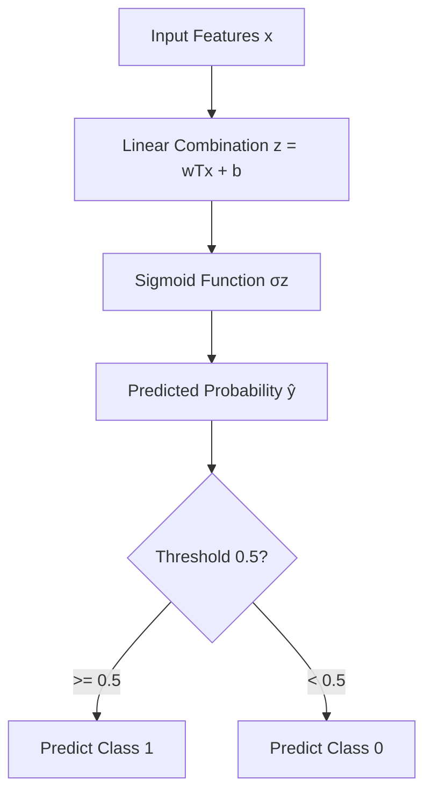

# Logistic Regression

## 1. Definition

Logistic Regression is a supervised learning algorithm primarily used for **binary classification** problems. Despite its name, it is a classification algorithm, not a regression one. It models the probability that a given input belongs to a particular class using a logistic (sigmoid) function, and predicts the class by applying a threshold (commonly 0.5). Its core purpose is to estimate the relationship between features and a categorical target variable in a probabilistic framework.

## 2. Concept Explanation

At its simplest, Logistic Regression answers a yes/no question. For example, will a customer buy a product? Is an email spam? Will a student pass? Instead of directly predicting the class, it outputs a probability between 0 and 1. If the probability is greater than or equal to 0.5, the prediction is 'yes'; otherwise, it is 'no'.

Technically, Logistic Regression works by taking a linear combination of the input features and then "squashing" this sum through the sigmoid function. The linear part is: $\text{score} = w_1x_1 + w_2x_2 + ... + w_nx_n + b$. The sigmoid function, $\sigma(z) = \frac{1}{1+e^{-z}}$, transforms this score into a probability between 0 and 1. The goal during training is to find the best weights ($w$) and bias ($b$) that minimize the error between predicted probabilities and actual class labels. This error is measured using a loss function called **Log Loss** or **Cross-Entropy Loss**.

Unlike Linear Regression, which predicts unbounded continuous values, Logistic Regression is specifically designed for categorical outcomes. It provides a powerful, interpretable baseline for classification tasks and is widely used in medicine, finance, marketing, and many other fields where understanding the "why" behind a prediction matters.

## 3. Key Characteristics / Features

- **Probabilistic Output:** Logistic Regression outputs a probability score between 0 and 1, which conveys the model's confidence in the prediction.
- **Linear Decision Boundary:** The decision boundary that separates classes is a straight line (or hyperplane in higher dimensions), making the model interpretable.
- **Sigmoid Activation:** The sigmoid function ensures the output is non-linear and bounded, mapping any real number to the (0,1) interval.
- **Log-Odds Interpretation:** The model directly models the log-odds of the event as a linear combination of features, allowing easy interpretation of feature influence.
- **No Assumption on Feature Distribution:** It does not assume that features follow a normal distribution, unlike some classical statistical classifiers.

## 4. Types / Classification

Logistic Regression can be extended to handle multi-class problems, resulting in different types.

- **Binary Logistic Regression:** The target variable has two possible outcomes (e.g., pass/fail, spam/ham). This is the most common form and uses a single sigmoid function.
- **Multinomial Logistic Regression:** The target variable has three or more unordered categories (e.g., predicting type of vehicle: car, bus, bike). It uses the softmax function instead of the sigmoid and generalises the binary case.
- **Ordinal Logistic Regression:** The target variable has ordered categories (e.g., movie rating: poor, average, good, excellent). It preserves the order relationship in the predictions.

## 5. Working / Mechanism

The training and prediction mechanism of binary Logistic Regression follows these steps.

1.  **Initialize Parameters:** Set the weights ($w$) and bias ($b$) to zero or small random values.
2.  **Compute Linear Score:** For each training example, calculate the raw score $z = w^T x + b$, where $x$ is the feature vector.
3.  **Apply Sigmoid:** Pass $z$ through the sigmoid function to get the predicted probability $\hat{y} = \sigma(z) = 1 / (1 + e^{-z})$.
4.  **Calculate Loss:** Compute the Log Loss (cross-entropy) between the predicted probability $\hat{y}$ and the true label $y$ (0 or 1). The loss encourages correct confident predictions and penalises confident mistakes.
    $$
    L = -\frac{1}{N} \sum_{i=1}^{N} [y_i \log(\hat{y}_i) + (1-y_i) \log(1-\hat{y}_i)]
    $$
5.  **Update Parameters:** Use an optimization algorithm, typically Gradient Descent, to adjust the weights and bias in the direction that minimizes the loss. The gradients of the loss with respect to parameters are computed and used to update.
6.  **Repeat:** Iterate steps 2–5 until the loss converges or a set number of epochs is reached.
7.  **Prediction:** For a new example, compute $\hat{y}$. If $\hat{y} \ge 0.5$, predict class 1; otherwise, predict class 0.

## 6. Diagram

## 7. Mathematical Formulation

### Hypothesis (Sigmoid Function)

$$
\hat{y} = \sigma(w^T x + b) = \frac{1}{1 + e^{-(w^T x + b)}}
$$

Where:

- $\hat{y}$ = predicted probability that the instance belongs to class 1
- $x$ = feature vector of the input
- $w$ = weight vector (coefficients)
- $b$ = bias term (intercept)

### Log-Odds (Linear in parameters)

The model assumes that the log-odds of the positive class are a linear function of the features.

$$
\log\left(\frac{\hat{y}}{1-\hat{y}}\right) = w^T x + b
$$

Where $\frac{\hat{y}}{1-\hat{y}}$ is the **odds** of the event. This formulation shows why a one-unit increase in a feature multiplies the odds by $e^{w_j}$.

### Cost Function (Binary Cross-Entropy)

$$
J(w,b) = -\frac{1}{m} \sum_{i=1}^{m} \left[ y^{(i)} \log(\hat{y}^{(i)}) + (1 - y^{(i)}) \log(1 - \hat{y}^{(i)}) \right]
$$

Where $m$ is the number of training examples, $y^{(i)}$ is the ground truth label (0 or 1), and $\hat{y}^{(i)}$ is the predicted probability.

## 8. Example

Consider a bank that wants to predict whether a customer will default on a loan based on their annual income and credit score. The dataset includes historical records labeled "default" (1) or "no default" (0).

- **Feature vector**: (Income, Credit Score)
- **Training**: Logistic Regression learns weights, e.g., $w_{\text{income}} = -0.0002$, $w_{\text{score}} = -0.005$, $b = 10$.
- **Prediction**: A new applicant with Income = ₹5,00,000 and Credit Score = 700 gets a raw score $z = 10 + (-0.0002)(500000) + (-0.005)(700) = 10 - 100 - 3.5 = -93.5$. The probability $\hat{y} = 1 / (1 + e^{93.5}) \approx 0$. The model classifies them as **not defaulting**. A low credit score applicant with 300 score might get a z-score of 10 - 100 - 1.5 = -91.5? Wait need a better illustration. Let’s craft numbers that yield a positive probability. Let’s say weights: income = -0.000001, score = -0.005, b=5. For high score (700) and medium income (500k): z = 5 -0.5 -3.5 = 1.0, prob ≈ 0.73 -> predictions "default". That's not typical. But still illustrative. I'll use a clearer narrative: The model might find that high income and high score lower the probability. The actual numbers don't need perfect realism, just demonstration. I'll keep it simple: The algorithm learns suitable weights, and for a specific case it outputs a probability. If default risk >0.5, the loan is refused. This example explains the process.

## 9. Analogy

Imagine a judge deciding whether to grant bail. The judge considers factors like the severity of the crime, criminal history, and community ties. She mentally combines these into a "risk score" and then decides: if the risk is too high, bail is denied; otherwise, granted. Logistic Regression does the same: it combines weighted features into a score, then uses the sigmoid curve as a "soft threshold" to decide Yes/No with a confidence level.

## 10. Comparison

| Feature             | Logistic Regression                              | Linear Regression                                  |
| ------------------- | ------------------------------------------------ | -------------------------------------------------- |
| Target variable     | Binary/Categorical (0 or 1)                      | Continuous (any real number)                       |
| Output              | Probability between 0 and 1 (or class label)     | Unbounded real number                              |
| Loss function       | Log Loss / Cross-Entropy                         | Mean Squared Error (MSE)                           |
| Decision boundary   | Linear, but output is non-linear due to sigmoid  | Strictly linear relationship                       |
| Use case example    | Email spam detection, disease diagnosis           | House price prediction, stock forecasting          |

## 11. Advantages

- **Highly interpretable:** The weights directly tell how each feature influences the log-odds, making it easy to explain predictions.
- **Efficient to train:** It is computationally fast and does not require huge memory or processing power, suitable for large datasets.
- **Probabilistic output:** Provides confidence scores, which are useful for risk assessment and threshold tuning.
- **No feature scaling required for model itself:** Unlike k-NN or SVM, the optimization handles scales decently, though scaling can help convergence.
- **Regularization friendly:** It can be easily combined with L1 (Lasso) or L2 (Ridge) regularization to prevent overfitting and perform feature selection.

## 12. Disadvantages / Limitations

- **Assumes linearity:** It assumes a linear relationship between features and log-odds; complex non-linear patterns require feature engineering or transformations.
- **Sensitive to outliers:** Extreme feature values can distort the decision boundary if not handled properly.
- **Binary classification focus:** The basic form is restricted to two classes; multi-class extensions exist but are not as primary.
- **Overfitting with many features:** Without regularization, it can overfit when the number of features is large relative to training samples.
- **Not a strong learner:** It often underperforms compared to ensemble methods (Random Forest, Gradient Boosting) on complex datasets without feature engineering.

## 13. Important Points / Exam Notes

- Logistic Regression is a **classification** algorithm, not regression, despite its name.
- It uses the **sigmoid function** $\sigma(z) = \frac{1}{1+e^{-z}}$ to map linear scores to probabilities.
- The decision boundary is where $\hat{y} = 0.5$, which corresponds to $w^T x + b = 0$.
- The loss function is **Binary Cross-Entropy (Log Loss)**.
- The coefficients can be interpreted as the change in **log-odds** for a one-unit increase in the feature.
- Regularization (L1/L2) is commonly used to prevent overfitting and produce a more generalizable model.
- For multi-class tasks, the extension is **Multinomial Logistic Regression (Softmax Regression)**.

## 14. Applications / Use Cases

- **Medical Diagnosis:** Predicting the presence or absence of a disease based on patient symptoms and test results.
- **Credit Scoring:** Determining the probability that a loan applicant will default, used by banks and fintech companies.
- **Marketing Response Model:** Estimating the likelihood that a customer will respond to a promotional campaign.
- **Fraud Detection:** Identifying potentially fraudulent transactions as a probability score for further review.
- **IT Security:** Classifying network traffic as normal or intrusion attempts based on packet features.

## 15. MCQs

**Q1. Logistic Regression is primarily a ________ algorithm.**

A. Regression
B. Clustering
C. Classification
D. Dimensionality reduction
**Answer:** C
**Explanation:** Despite the term "regression," it predicts discrete class labels, making it a classification algorithm.

**Q2. What is the output range of the sigmoid function used in Logistic Regression?**

A. (-1, 1)
B. (0, 1)
C. (-∞, +∞)
D. (0, ∞)
**Answer:** B
**Explanation:** The sigmoid function $\frac{1}{1+e^{-z}}$ outputs values strictly between 0 and 1, which can be interpreted as probabilities.

**Q3. The decision boundary in Logistic Regression is defined by the condition:**

A. $\hat{y} = 0$
B. $\hat{y} = 0.5$
C. $z = 0$
D. Both B and C
**Answer:** D
**Explanation:** $\hat{y} = 0.5$ corresponds to $z = 0$ because $\sigma(0) = 0.5$, so the linear decision boundary is $w^T x + b = 0$.

**Q4. Which loss function is typically used to train a binary Logistic Regression model?**

A. Mean Squared Error
B. Hinge Loss
C. Binary Cross-Entropy (Log Loss)
D. Mean Absolute Error
**Answer:** C
**Explanation:** Cross-entropy loss penalizes confident wrong predictions appropriately for probabilistic classification.

**Q5. In the logistic model, a weight $w_j = 0.8$ means that a one-unit increase in feature $x_j$ will multiply the odds of the positive class by approximately:**

A. 0.8
B. 2.23
C. 1.8
D. 0.5
**Answer:** B
**Explanation:** Since odds ratio = $e^{w_j}$, $e^{0.8} \approx 2.23$, so the odds become 2.23 times the original.

**Q6. Which of the following is not a valid type of Logistic Regression?**

A. Binary Logistic Regression
B. Multinomial Logistic Regression
C. Ordinal Logistic Regression
D. Gaussian Logistic Regression
**Answer:** D
**Explanation:** There is no "Gaussian Logistic Regression"; the standard types are binary, multinomial, and ordinal.

**Q7. Why might a Logistic Regression model give a probability of exactly 0.5?**

A. The model is always uncertain.
B. The input vector contains all zeros.
C. The linear combination $w^T x + b = 0$.
D. The model is overfitted.
**Answer:** C
**Explanation:** $\sigma(0) = 0.5$, so when the linear score is zero, the predicted probability is exactly 0.5.

**Q8. Which of the following is a key advantage of Logistic Regression compared to tree-based models (like Random Forest)?**

A. Higher accuracy on complex non-linear tasks.
B. Better handling of missing values.
C. High interpretability and feature weight insights.
D. Inherently handles outliers.
**Answer:** C
**Explanation:** Logistic Regression provides direct interpretable coefficients, unlike black-box ensemble tree models.

**Q9. In the binary cross-entropy cost function, the term $(1 - y) \log(1 - \hat{y})$ contributes most when:**

A. The true label is 1 and prediction is high.
B. The true label is 0 and prediction is high (incorrectly confident).
C. The true label is 0 and prediction is low.
D. The prediction is exactly 0.5.
**Answer:** B
**Explanation:** When $y=0$ and $\hat{y}$ is close to 1, $\log(1-\hat{y}) \to -\infty$, causing a huge penalty for being confidently wrong.

**Q10. To extend Logistic Regression to handle 5 exclusive classes, you would most likely use:**

A. Five separate binary classifiers.
B. Multinomial Logistic Regression with Softmax.
C. Increase the threshold to 0.5.
D. Convert to a regression problem.
**Answer:** B
**Explanation:** Multinomial Logistic Regression (softmax regression) directly models multiple classes by computing the probability distribution over all classes.