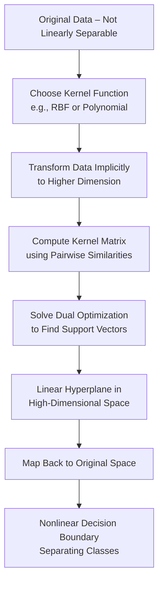

# Support Vector Machines Nonlinearity

## Video Explanation

* [https://www.youtube.com/watch?v=efR1C6CvhmE](https://www.youtube.com/watch?v=efR1C6CvhmE)

## Visual Aids

## 1. Definition

Nonlinearity in Support Vector Machines (SVM) refers to the ability of the model to find a decision boundary that is not a straight line (or a flat hyperplane) in the original feature space. SVM achieves this by transforming the input data into a higher-dimensional space where a linear boundary can separate the classes, effectively creating a nonlinear boundary in the original space.

## 2. Concept Explanation

In many real-world classification problems, the data is not linearly separable. This means you cannot draw a single straight line (in 2D) or a flat plane (in 3D) to separate the classes. For example, consider a dataset where one class forms a circle and the other class surrounds it. No straight line can separate them.

The basic idea of handling nonlinearity in SVM is to transform the original features into a higher-dimensional space using a mathematical function called a **kernel function**. In this new space, the data becomes linearly separable. The SVM then finds a linear hyperplane in that high-dimensional space. When this hyperplane is mapped back to the original space, it appears as a curved, nonlinear boundary.

Why is this used? Real-world data is rarely linearly separable. Nonlinear SVM allows us to solve complex classification problems without explicitly computing the high-dimensional transformation, which would be computationally expensive. This is achieved through the **kernel trick**.

How it works: The kernel function computes the dot product of the transformed feature vectors directly from the original features. This avoids the need to actually perform the transformation. Popular kernel functions for nonlinear SVM include polynomial kernel, radial basis function (RBF) kernel, and sigmoid kernel.

## 3. Key Characteristics / Features

- **Handles nonlinearly separable data:** Nonlinear SVM can create complex, curved decision boundaries such as circles, ellipses, or irregular shapes.
- **Uses kernel functions:** The kernel trick allows computation in high-dimensional space without explicit transformation.
- **Maps to higher dimensions:** The original feature space is projected into a space of higher (sometimes infinite) dimensions where separation becomes linear.
- **Computationally efficient with kernels:** Kernel functions are computed directly on original features, avoiding the curse of dimensionality.
- **Preserves margin maximization:** Even in the transformed space, SVM still maximizes the margin between classes.
- **Supports various kernel types:** Different kernels (polynomial, RBF, sigmoid) offer flexibility for different data patterns.

## 4. Types / Classification

Nonlinearity in SVM is implemented through different **kernel functions**. The main types are:

| Kernel Type | Formula | Characteristics |
|-------------|---------|------------------|
| Polynomial Kernel | \( K(x, x') = (x \cdot x' + c)^d \) | Creates polynomial decision boundaries of degree `d`. Suitable for data with polynomial interactions. |
| Radial Basis Function (RBF) Kernel | \( K(x, x') = \exp(-\gamma \|x - x'\|^2) \) | Most popular. Creates circular or spherical boundaries. Can model complex, local patterns. |
| Sigmoid Kernel | \( K(x, x') = \tanh(\alpha (x \cdot x') + c) \) | Similar to neural network activation. Less common in practice. |
| Custom Kernel | Any function satisfying Mercer's condition | Allows domain-specific similarity measures. |

Among these, the **RBF kernel** is the default choice for most nonlinear problems because it is flexible and has only one hyperparameter (`γ`) to tune.

## 5. Working / Mechanism

The process of handling nonlinearity in SVM follows these steps:

1. **Receive input data:** The original dataset has features `x` in a low-dimensional space where classes are not linearly separable.
2. **Select a kernel function:** Choose a kernel such as RBF or polynomial. This kernel implicitly defines a mapping `φ(x)` to a higher-dimensional space.
3. **Apply the kernel trick:** Instead of computing `φ(x)` explicitly, the SVM algorithm computes the kernel `K(x_i, x_j) = φ(x_i) · φ(x_j)` for every pair of training points.
4. **Solve the dual optimization problem:** The SVM solves for the Lagrange multipliers `α_i` using the kernel matrix. The dual objective is:
   `max Σ α_i - ½ Σ Σ α_i α_j y_i y_j K(x_i, x_j)`
5. **Identify support vectors:** The points with non-zero `α_i` become support vectors. These lie on or within the margin.
6. **Define the decision function:** For a new point `x`, the prediction is:
   `f(x) = sign( Σ α_i y_i K(x_i, x) + b )`
7. **Visualize the nonlinear boundary:** When plotted in the original space, the decision boundary is curved because it corresponds to a linear hyperplane in the transformed space projected back.

## 6. Diagram

## 7. Mathematical Formulation

**The mapping function:**
Let `φ(x)` be the transformation from original feature space `R^d` to a higher-dimensional space `R^D` (where `D > d` or infinite). The SVM finds a linear hyperplane in `R^D`:
`w · φ(x) + b = 0`

**The kernel trick:**
Instead of computing `φ(x)` explicitly, we define a kernel function:
`K(x_i, x_j) = φ(x_i) · φ(x_j)`

**Common kernel formulas:**

Polynomial kernel (degree `d`):
$$
K(x_i, x_j) = (x_i \cdot x_j + c)^d
$$

RBF (Gaussian) kernel:
$$
K(x_i, x_j) = \exp\left(-\gamma \|x_i - x_j\|^2\right)
$$

Where:
- `γ` (gamma) = parameter that controls the influence of a single training point. Large `γ` means narrow influence (complex boundary), small `γ` means wide influence (smooth boundary).
- `c` = constant term in polynomial kernel
- `d` = degree of polynomial
- `\|x_i - x_j\|` = Euclidean distance between two points

**Decision function for nonlinear SVM:**
$$
f(x) = \text{sign}\left( \sum_{i \in SV} \alpha_i y_i K(x_i, x) + b \right)
$$

Where:
- `α_i` = Lagrange multiplier for support vector `i`
- `y_i` = class label (+1 or -1)
- `SV` = set of support vectors
- `b` = bias term
- `K(x_i, x)` = kernel similarity between support vector and new point

## 8. Example

**Problem:** Classify points arranged in two concentric circles (inner circle = class +1, outer ring = class -1). No straight line can separate them.

**Solution using nonlinear SVM with RBF kernel:**

- Dataset: 200 points in 2D space (x1, x2). The inner circle has radius 1, outer ring has radius between 2 and 3.
- We use SVM with RBF kernel and `γ = 1.0`.
- The algorithm implicitly maps each point `(x1, x2)` to an infinite-dimensional space using radial basis functions.
- In that space, the points become linearly separable: all inner circle points lie on one side of a hyperplane, and all outer ring points lie on the other side.
- When we project the decision boundary back to 2D, it becomes a circle of radius approximately 1.5 separating the two classes.

**Result:** The SVM perfectly separates the two circular patterns with a nonlinear circular boundary, whereas any linear classifier would fail completely.

## 9. Analogy

Think of nonlinearity in SVM like folding a crumpled paper. Suppose you have a sheet of paper with red and blue dots that are mixed together in a tangled way. You cannot draw a straight line to separate them on the flat sheet. But if you lift and fold the paper into a third dimension (like making a mountain), the dots may separate into different layers. Then you can slice between them with a flat knife. When you flatten the paper back, the cut becomes a curved line. The kernel function is like the folding rule that tells you how to lift the paper. The SVM does the slicing in the folded (higher-dimensional) space, giving you a curved boundary in the original flat space.

## 10. Comparison

| Feature | Linear SVM | Nonlinear SVM (with kernel) |
|---------|------------|----------------------------|
| Decision boundary | Straight line or flat hyperplane | Curved, wavy, or complex shape |
| Transformation required | None | Implicit via kernel function |
| Computational complexity | Lower (O(n)) | Higher (O(n^2) to O(n^3) for kernel matrix) |
| Interpretability | Easy (coefficients show feature importance) | Difficult (weights in transformed space are not intuitive) |
| Overfitting risk | Low | High (especially with complex kernels) |
| Suitable data | Linearly separable or almost separable | Nonlinearly separable with complex patterns |
| Parameter tuning | Few (C only) | Many (C + kernel parameters like γ, degree) |

## 11. Advantages

- **Solves real-world problems:** Most real datasets are not linearly separable. Nonlinear SVM provides a robust solution.
- **Kernel trick efficiency:** The algorithm never computes the high-dimensional transformation explicitly, keeping computation feasible.
- **Flexible decision boundaries:** Different kernels can model circles, ellipses, polynomials, and even irregular shapes.
- **Still maximizes margin:** Even with nonlinear boundaries, SVM maintains the principle of maximum margin, improving generalization.
- **Works with infinite-dimensional spaces:** RBF kernel maps to infinite dimensions, yet computation remains finite.
- **Handles high-dimensional input well:** Even without transformation, SVM with kernels works well when original features are many.

## 12. Disadvantages / Limitations

- **Computationally expensive for large datasets:** Computing the kernel matrix requires O(n²) memory and O(n³) time for training, making it impractical for very large datasets (>50,000 points).
- **Difficult to interpret:** The nonlinear mapping makes it hard to understand why a particular prediction was made.
- **Risk of overfitting:** Complex kernels with high γ or high degree can fit noise in the training data, leading to poor generalization.
- **Many hyperparameters to tune:** Choosing the right kernel and its parameters (C, γ, degree) requires cross-validation and domain knowledge.
- **No probability outputs directly:** SVM outputs a decision value, not a probability. Probability calibration adds extra computation.
- **Sensitive to feature scaling:** Nonlinear SVM is very sensitive to the scale of features; all features must be normalized before training.

## 13. Important Points / Exam Notes

- Nonlinear SVM uses the **kernel trick** to implicitly map data to a higher-dimensional space.
- The **RBF (Gaussian) kernel** is the most popular choice and often works well without prior knowledge.
- The kernel function must satisfy **Mercer's condition** (be a valid inner product in some space).
- **γ (gamma)** in RBF kernel controls the influence radius of each support vector. Small γ = smoother, underfitting; large γ = wiggly, overfitting.
- The **dual formulation** of SVM naturally incorporates kernels; the primal formulation does not.
- Support vectors in nonlinear SVM are those points that lie on or within the margin in the transformed space.
- A **linear SVM is a special case** of nonlinear SVM using the linear kernel `K(x, x') = x·x'`.
- **Polynomial kernel of degree 1** with c=0 is equivalent to linear kernel.
- Nonlinear SVM does **not** guarantee linear separability in the transformed space if the kernel is poorly chosen; it still tries to maximize margin with slack variables.
- **Feature scaling** is critical: all features should be normalized to [0,1] or standardised to zero mean and unit variance.

## 14. Applications / Use Cases

- **Image classification:** Recognising handwritten digits (MNIST) where pixel patterns are highly nonlinear.
- **Bioinformatics:** Classifying protein sequences or gene expression data where interactions are complex.
- **Text categorization:** Separating documents into topics when word relationships are nonlinear.
- **Face detection:** Identifying faces in images using RBF kernel SVM.
- **Medical diagnosis:** Classifying tumours as benign or malignant based on cell characteristics that have nonlinear separations.
- **Stock market prediction:** Forecasting price direction using historical patterns that are not linearly separable.
- **Object recognition in autonomous vehicles:** Distinguishing pedestrians from vehicles using sensor data with nonlinear boundaries.

## 15. MCQs

**Q1. What is the main purpose of using nonlinearity in Support Vector Machines?**  
A. To reduce the number of features  
B. To handle data that is not linearly separable  
C. To speed up training time  
D. To eliminate support vectors  
**Answer:** B  
**Explanation:** Nonlinear SVM is designed to classify datasets where a straight line or flat hyperplane cannot separate the classes.

**Q2. Which technique allows SVM to handle nonlinearity without explicitly computing high-dimensional transformations?**  
A. Gradient descent  
B. Kernel trick  
C. Principal component analysis  
D. One-hot encoding  
**Answer:** B  
**Explanation:** The kernel trick computes dot products in the transformed space using a kernel function applied to original features, avoiding explicit transformation.

**Q3. Which kernel is most commonly used for nonlinear SVM as a default choice?**  
A. Linear kernel  
B. Polynomial kernel of degree 2  
C. RBF (Gaussian) kernel  
D. Sigmoid kernel  
**Answer:** C  
**Explanation:** RBF kernel is flexible, has only one parameter (γ), and works well for many nonlinear problems, making it the default choice.

**Q4. What does the parameter γ (gamma) control in the RBF kernel?**  
A. The slope of the linear boundary  
B. The degree of the polynomial  
C. The influence radius of each support vector  
D. The number of support vectors  
**Answer:** C  
**Explanation:** Gamma determines how far the influence of a single training point reaches. Low gamma means far influence (smooth boundary), high gamma means near influence (complex boundary).

**Q5. What is the formula for the RBF kernel?**  
A. \( (x \cdot x' + c)^d \)  
B. \( \tanh(\alpha (x \cdot x') + c) \)  
C. \( \exp(-\gamma \|x - x'\|^2) \)  
D. \( x \cdot x' \)  
**Answer:** C  
**Explanation:** The RBF kernel is defined as \( K(x_i, x_j) = \exp(-\gamma \|x_i - x_j\|^2) \).

**Q6. Which of the following is a major limitation of nonlinear SVM?**  
A. Cannot handle binary classification  
B. High computational cost for large datasets  
C. Only works with numerical features  
D. Requires feature scaling only for linear kernels  
**Answer:** B  
**Explanation:** Nonlinear SVM requires computing the kernel matrix of size n×n and solving an O(n³) optimization, which is impractical for large n.

**Q7. In nonlinear SVM, the decision boundary in the original feature space is:**
A. Always a straight line  
B. Always a flat hyperplane  
C. Always a circle  
D. Nonlinear (curved)  
**Answer:** D  
**Explanation:** Because the linear boundary in the transformed space maps back to a curved or nonlinear boundary in the original space.

**Q8. Which kernel would you use to create a polynomial decision boundary of degree 3?**  
A. Linear kernel  
B. Polynomial kernel with d=3  
C. RBF kernel with γ=3  
D. Sigmoid kernel  
**Answer:** B  
**Explanation:** The polynomial kernel \( (x \cdot x' + c)^d \) with d=3 produces a cubic decision boundary.

**Q9. What is the primary disadvantage of using a very high γ value in RBF kernel?**  
A. Underfitting (too smooth boundary)  
B. Overfitting (boundary too wiggly, fits noise)  
C. Training becomes slower  
D. Kernel becomes linear  
**Answer:** B  
**Explanation:** High γ means each support vector has a very narrow influence, causing the decision boundary to be highly wiggly and sensitive to noise, leading to overfitting.

**Q10. Which of the following statements about the kernel trick is true?**  
A. It explicitly computes the high-dimensional mapping φ(x) for every data point.  
B. It replaces the dot product φ(x_i)·φ(x_j) with a kernel function K(x_i, x_j).  
C. It only works for linear kernels.  
D. It increases the memory requirement exponentially.  
**Answer:** B  
**Explanation:** The kernel trick uses a kernel function to compute the dot product in the transformed space without explicitly performing the transformation φ.