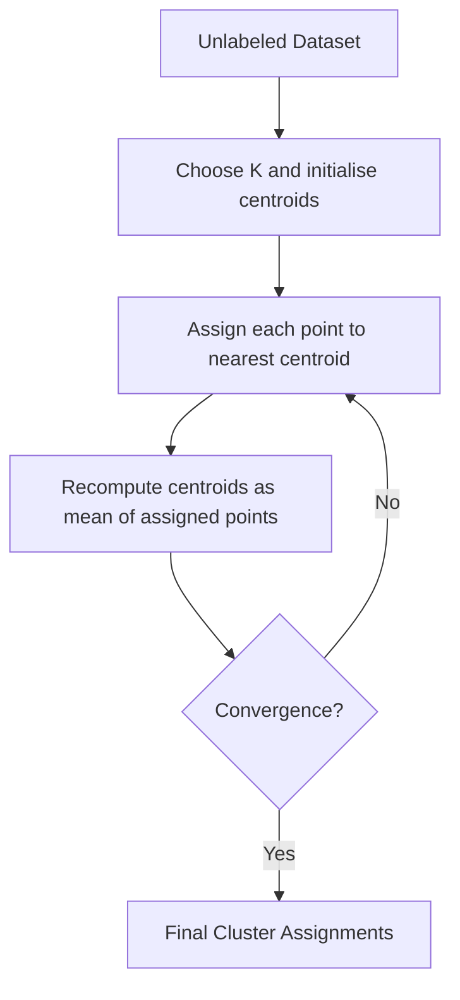

# Clustering K means Kernel K means

## Video Explanation

* [https://www.youtube.com/watch?v=4b5d3muPQmA](https://www.youtube.com/watch?v=4b5d3muPQmA)

## Visual Aids

## 1. Definition

**K‑means** is a centroid‑based, unsupervised machine learning algorithm that partitions a dataset into \( K \) distinct, non‑overlapping groups (clusters) by minimising the within‑cluster sum of squared distances.

**Kernel K‑means** is an extension of K‑means that uses a kernel function to map data into a higher‑dimensional space where non‑linearly separable clusters become linearly separable. It then applies the K‑means objective in that transformed space, enabling the discovery of complex cluster shapes.

## 2. Concept Explanation

K‑means is the simplest method to group unlabeled data. Imagine you have a set of points scattered on a piece of paper, and you want to organise them into a few piles. You drop \( K \) “centroids” onto the paper, move each point to the nearest centroid, and then shift each centroid to the middle of the points that landed in its group. Repeating these two steps makes the centroids stabilise at the natural centres of the data.

Kernel K‑means addresses a fundamental weakness of standard K‑means: it can only find clusters that are roughly spherical and linearly separable. If the true clusters are concentric circles, K‑means fails. Kernel K‑means fixes this by implicitly projecting the data into a high‑dimensional feature space using the “kernel trick”. In that new space, even complicated shapes can appear as compact, spherical clouds, and K‑means works perfectly. Crucially, we never explicitly compute the high‑dimensional coordinates; we only evaluate a kernel function (e.g., Gaussian RBF) between pairs of points.

Together, these algorithms form the backbone of centroid‑based clustering, widely used in customer segmentation, image compression, and anomaly detection.

## 3. Key Characteristics / Features

- **Unsupervised learning:** Neither K‑means nor Kernel K‑means uses labelled data. They discover groupings based solely on feature similarity.
- **Centroid‑based representation:** Each cluster is summarised by a single representative centre. In K‑means that centre is a point in the original input space; in Kernel K‑means it exists in the implicit feature space.
- **Number of clusters \( K \) must be specified in advance:** The user must decide how many groups to find. Techniques like the elbow method help choose a suitable \( K \).
- **Iterative refinement:** Both algorithms start with a random initialisation and alternate between assignment and update steps until convergence (no further change in assignments or centroids).
- **Distance metric dependent:** Standard K‑means ordinarily uses Euclidean distance. Kernel K‑means replaces explicit distance with a kernel‑based similarity calculation, allowing arbitrary non‑linear boundaries.
- **Susceptible to local minima:** Because initial centroids are chosen randomly, different runs can lead to different final clusterings. It is common practice to run the algorithm multiple times and pick the best result.

## 4. Types / Classification

Clustering methods can be broadly classified, and the K‑means family falls under **partitional clustering** (hard clustering, each point belongs to exactly one cluster). Two key variants are:

- **Standard K‑means (Lloyd’s algorithm):** The classic algorithm that works in the original feature space using Euclidean distance. It assumes clusters are convex and isotropic.
- **Kernel K‑means:** A non‑linear extension that replaces the dot product \( x_i \cdot x_j \) with a kernel function \( K(x_i, x_j) \). It can separate clusters that are not linearly separable. Common kernel choices include the Gaussian (RBF) kernel, polynomial kernel, and sigmoid kernel.

Other K‑means variants (like K‑medoids, fuzzy C‑means) also exist, but the focus here is on the hard, centroid‑based linear and kernelised forms.

## 5. Working / Mechanism

### Standard K‑means algorithm (Lloyd’s algorithm):
1.  **Choose \( K \)** and **initialise \( K \) centroids** randomly (e.g., pick \( K \) random data points or use K‑means++ initialisation).
2.  **Assignment step:** For every data point \( x_i \), compute its Euclidean distance to all \( K \) centroids. Assign the point to the cluster whose centroid is nearest.
3.  **Update step:** Recalculate each centroid as the arithmetic mean of all points currently assigned to that cluster.
4.  **Repeat** steps 2 and 3 until the assignments no longer change (or a maximum number of iterations is reached).
5.  **Output** the final cluster assignments and centroid positions.

### Kernel K‑means algorithm:
1.  **Select kernel function** (e.g., RBF \( K(a,b) = \exp(-\gamma \|a-b\|^2) \)) and a value for \( K \).
2.  **Initialise cluster assignments** randomly.
3.  **Compute the kernel matrix** \( \mathbf{K} \) where \( \mathbf{K}_{ij} = K(x_i, x_j) \) for all pairs of data points.
4.  **Assignment step (looped for each point):** Temporarily assign each point to the cluster that minimises a “kernel distance” expressed entirely in terms of the pre‑computed kernel values. The distance to the centroid of cluster \( c \) in feature space is:
    $$ d_{\phi}^2(x_i, \mu_c) = K(x_i, x_i) - \frac{2}{|c|} \sum_{j \in c} K(x_i, x_j) + \frac{1}{|c|^2} \sum_{j,l \in c} K(x_j, x_l) $$
    The point is assigned to the cluster that gives the smallest value. (Here \( |c| \) is the number of points in cluster \( c \).)
5.  **Repeat** the assignment step until cluster membership stabilises.
6.  **Output** final cluster labels.

Because centroids in feature space cannot be explicitly computed, the algorithm keeps only the cluster assignments and uses the kernel matrix for all distance calculations.

## 6. Diagram

For Kernel K‑means, the flow is similar, but “nearest centroid” is computed via kernel distances rather than explicit Euclidean distance in the original space.

## 7. Mathematical Formulation

### Standard K‑means objective (within‑cluster sum of squares, WCSS):

$$
J = \sum_{c=1}^{K} \sum_{x_i \in C_c} \| x_i - \mu_c \|^2
$$

Where:
- \( K \) = number of clusters.
- \( C_c \) = set of points in cluster \( c \).
- \( \mu_c = \frac{1}{|C_c|} \sum_{x_i \in C_c} x_i \) = centroid of cluster \( c \).
- \( \| \cdot \| \) denotes Euclidean norm.

The algorithm alternates between minimising \( J \) with respect to assignments (step 2) and with respect to centroids (step 3).

### Kernel K‑means objective (in feature space):

$$
J_\phi = \sum_{c=1}^{K} \sum_{x_i \in C_c} \| \phi(x_i) - \tilde{\mu}_c \|^2
$$

Where:
- \( \phi \) is an implicit mapping to a high‑dimensional feature space.
- \( \tilde{\mu}_c = \frac{1}{|C_c|} \sum_{x_j \in C_c} \phi(x_j) \) is the centroid in feature space.

Using the kernel trick \( K(x_i, x_j) = \langle \phi(x_i), \phi(x_j) \rangle \), the distance term becomes:

$$
\| \phi(x_i) - \tilde{\mu}_c \|^2 = K(x_i, x_i) - \frac{2}{|C_c|} \sum_{j \in C_c} K(x_i, x_j) + \frac{1}{|C_c|^2} \sum_{j,l \in C_c} K(x_j, x_l)
$$

All calculations use the kernel matrix, avoiding an explicit mapping \( \phi \).

## 8. Example

- **Standard K‑means:** A marketing team wants to segment 10,000 customers based on annual income and spending score. They run K‑means with \( K=5 \) and obtain five clusters: ‘high income / high spend’, ‘low income / low spend’, etc. This helps design targeted promotions.
- **Kernel K‑means:** A dataset of sensor readings forms two concentric rings. Standard K‑means cannot separate them because the inner ring is surrounded by the outer ring. Using a Gaussian kernel, kernel K‑means implicitly lifts the data into a space where the rings become nested spheres that can be separated by a flat boundary, successfully uncovering the two true clusters.

## 9. Analogy

Think of a teacher dividing students into study groups. The teacher places a few coloured flags (centroids) on the floor. Each student walks to the nearest flag. Once everyone is standing by a flag, the teacher moves each flag to the centre of the students clustered around it. The process repeats until nobody changes groups. This is K‑means.

Now suppose the students are standing on a curved hill, and groups need to be formed based on their friendship network (complex similarity) rather than physical distance. The teacher gives each student a “friendship device” that measures how close they feel to others (kernel function). Even if two friends are far apart on the hill, the device shows they are close, and the teacher can group them together. That is kernel K‑means.

## 10. Comparison

| Feature             | K‑means                               | Kernel K‑means                                     |
|---------------------|---------------------------------------|----------------------------------------------------|
| **Cluster shape**   | Assumes spherical, linearly separable clusters | Can find arbitrarily shaped, non‑convex clusters |
| **Input space**     | Works directly on the original input features | Operates implicitly in a high‑dimensional feature space via kernel |
| **Distance metric** | Explicit Euclidean distance           | Kernel‑induced distance (e.g., RBF)                |
| **Centroid calculation** | Mean of assigned points in input space | Centroid is not computed explicitly; only assignment is tracked |
| **Scalability**     | Very scalable; \( O(n \cdot K \cdot d) \) per iteration | Less scalable; requires computing and storing an \( n \times n \) kernel matrix |
| **Hyperparameters** | Number of clusters \( K \)            | \( K \) plus kernel type and kernel parameters (e.g., \( \gamma \) for RBF) |

## 11. Advantages

- **K‑means is simple and fast:** It is easy to implement, runs efficiently on large datasets, and converges quickly in practice.
- **Interpretable results:** Each cluster is described by a single prototype (centroid), making it easy to explain what each group represents.
- **Kernel K‑means handles non‑linear separations:** It can discover complex structures like concentric circles, spirals, or intertwined moons where standard K‑means fails completely.
- **Flexibility through kernel choice:** By changing the kernel function and its parameters, the user can adapt the algorithm to different data distributions without designing new features.
- **Both are widely supported:** Implementations exist in all major ML libraries (scikit‑learn, etc.), making them accessible for prototyping and production.

## 12. Disadvantages / Limitations

- **\( K \) must be set manually:** Both algorithms require the number of clusters to be known beforehand. Choosing the wrong \( K \) leads to poor partitions.
- **Sensitivity to initial centroids:** Standard K‑means can converge to a local optimum. K‑means++ helps but does not guarantee a global optimum. Kernel K‑means also suffers from local minima due to random initial assignments.
- **Standard K‑means fails with non‑spherical clusters:** It assumes clusters are isotropic and equally sized; real‑world data rarely satisfies this.
- **Kernel K‑means is memory‑intensive:** Storing and manipulating the \( n \times n \) kernel matrix becomes impractical for very large datasets (\( n > 10^4 \)).
- **Kernel parameter sensitivity:** The performance of kernel K‑means heavily depends on the chosen kernel width (\( \gamma \) for RBF). Poor choices can merge distinct clusters or create artificial subdivisions.
- **Outlier sensitivity:** Both algorithms can be distorted by outliers because extreme points pull the centroids toward them.

## 13. Important Points / Exam Notes

- K‑means is an **unsupervised, hard‑clustering, centroid‑based** algorithm.
- The **objective** is to minimise the within‑cluster sum of squares (WCSS) or inertia.
- **Lloyd’s algorithm** alternates between assignment and update steps; it converges to a local minimum.
- **K‑means++** is an improved initialisation method that spreads out initial centroids and often yields better results.
- The **elbow method** and **silhouette score** are common ways to select an appropriate \( K \).
- **Kernel trick** allows K‑means to operate in an implicit high‑dimensional space without ever computing the coordinates.
- In kernel K‑means, the **kernel matrix** \( K(x_i, x_j) \) stores all pairwise similarities; the algorithm modifies only the cluster assignment labels.
- Common **kernel functions**: Gaussian (RBF) \( e^{-\gamma \|x-y\|^2} \), polynomial \( (x^T y + c)^d \).
- **Convergence** for standard K‑means is guaranteed because the objective \( J \) decreases monotonically.
- Kernel K‑means is **computationally expensive** for large \( n \); approximate methods like random Fourier features or core‑sets exist.

## 14. Applications / Use Cases

- **Customer segmentation:** Retailers group shoppers by purchase history and demographics to personalise marketing.
- **Image compression and colour quantisation:** K‑means reduces the number of colours in an image by replacing each pixel’s colour with the nearest cluster centroid (a palette).
- **Anomaly detection:** Points far from any K‑means centroid can be flagged as outliers in network traffic or manufacturing.
- **Document clustering:** Grouping news articles or research papers by topic using TF‑IDF vectors; kernel K‑means can capture non‑linear semantic relationships.
- **Bioinformatics:** Gene expression data often has complex cluster structures; kernel K‑means helps identify subtypes of cancer.
- **Computer vision:** Kernel K‑means can segment images where object boundaries are not linear, e.g., separating overlapping cells in microscopy.

## 15. MCQs

**Q1. K‑means is an example of which type of machine learning?**

A. Supervised learning  
B. Unsupervised learning  
C. Reinforcement learning  
D. Semi‑supervised learning  

**Answer:** B  
**Explanation:** K‑means finds patterns in unlabeled data without any target output.

---

**Q2. The objective function of standard K‑means minimises**

A. Silhouette score  
B. Within‑cluster sum of squared distances  
C. Between‑cluster sum of squares  
D. Log‑loss  

**Answer:** B  
**Explanation:** K‑means iteratively minimises the sum of squared Euclidean distances from points to their assigned centroids.

---

**Q3. Kernel K‑means is needed when**

A. The dataset has more than 100 features  
B. Clusters are linearly separable  
C. Clusters have non‑spherical shapes that cannot be separated by straight lines  
D. The number of clusters is unknown  

**Answer:** C  
**Explanation:** Kernel K‑means implicitly projects data to a space where non‑linear boundaries become linear, enabling separation of complex shapes.

---

**Q4. In Kernel K‑means, what replaces the direct calculation of Euclidean distance to a centroid?**

A. Cosine similarity  
B. A distance expressed in terms of kernel function evaluations  
C. Manhattan distance  
D. The dot product of the original features  

**Answer:** B  
**Explanation:** Distances are computed via kernel matrix entries, e.g., \( K(x_i,x_i) - \frac{2}{|c|}\sum_{j}K(x_i,x_j) + \frac{1}{|c|^2}\sum_{j,l}K(x_j,x_l) \).

---

**Q5. Which of the following is a common kernel used in kernel K‑means?**

A. Linear discriminant kernel  
B. Gaussian (RBF) kernel  
C. ReLU kernel  
D. Softmax kernel  

**Answer:** B  
**Explanation:** The Gaussian kernel \( \exp(-\gamma\|x-y\|^2) \) is widely used to capture non‑linear similarities.

---

**Q6. The main computational disadvantage of kernel K‑means is**

A. It cannot handle more than two clusters  
B. It never converges  
C. The need to store an \( n \times n \) kernel matrix, which is memory‑intensive for large datasets  
D. It requires labelled data  

**Answer:** C  
**Explanation:** The memory and time complexity grow quadratically with the number of data points due to the kernel matrix.

---

**Q7. K‑means++ is a technique that improves**

A. The choice of the kernel function  
B. The speed of convergence by using a different optimisation algorithm  
C. The initial placement of centroids to avoid poor local minima  
D. The automatic selection of the optimal number of clusters  

**Answer:** C  
**Explanation:** K‑means++ initialises centroids to be distant from each other, leading to better and more consistent clustering results.

---

**Q8. In standard K‑means, after the assignment step, how is a centroid updated?**

A. By selecting the data point that is median in distance  
B. By taking the mode of the cluster members  
C. By computing the arithmetic mean of all points assigned to that cluster  
D. By moving the centroid a small step in the direction of the gradient  

**Answer:** C  
**Explanation:** The new centroid is the mean vector of all points currently belonging to that cluster.

---

**Q9. If the elbow method shows a sharp bend at \( K=3 \), this suggests that**

A. The dataset has exactly 3 features  
B. Increasing \( K \) beyond 3 does not significantly reduce within‑cluster variation  
C. The model is underfitting for any \( K \)  
D. Kernel K‑means must be used  

**Answer:** B  
**Explanation:** The elbow point indicates that adding more clusters yields little additional decrease in WCSS, making 3 a reasonable choice.

---

**Q10. Which of the following statements about K‑means is FALSE?**

A. It always finds the globally optimal clustering  
B. It converges to a local minimum of the WCSS objective  
C. The result depends on the initial centroids  
D. It requires the number of clusters to be chosen beforehand  

**Answer:** A  
**Explanation:** K‑means is guaranteed to converge to a local optimum, but the global optimum is not guaranteed due to non‑convexity of the objective.