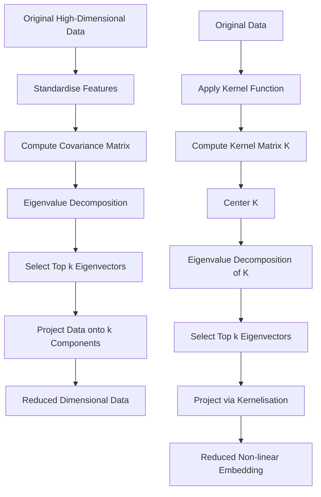

# Dimensionality Reduction: PCA and Kernel PCA

## 1. Definition
Dimensionality reduction is the process of transforming high-dimensional data into a lower-dimensional space while preserving as much meaningful information as possible. **Principal Component Analysis (PCA)** is a linear unsupervised technique that finds orthogonal directions (principal components) of maximum variance. **Kernel PCA** is its non-linear extension that uses the kernel trick to implicitly map data into a higher-dimensional feature space, enabling the capture of non-linear structure.

## 2. Concept Explanation
Real-world datasets often have many features. Not all features are useful; some are redundant or noisy. Dimensionality reduction helps simplify the data while keeping its essential structure. It makes visualization possible, speeds up learning algorithms, and reduces overfitting.

PCA works by identifying new, uncorrelated axes called principal components. The first component points in the direction of the greatest variance; each subsequent component captures the next highest variance while being orthogonal to the previous ones. The original data is then projected onto a few top components, effectively reducing dimensions.

Linear PCA assumes that the data lies on a linear subspace. However, many real datasets have non-linear relationships (e.g., concentric circles, spirals). Kernel PCA solves this by first implicitly mapping data into a high-dimensional space where linear PCA is performed, without ever computing the mapping explicitly. This enables it to find non-linear patterns.

Why it is important: High-dimensional data is hard to analyse, requires more computation, and can suffer from the “curse of dimensionality.” Dimensionality reduction helps visualise data, speeds up model training, removes noise, and can improve model generalisation.

## 3. Key Characteristics / Features
- **Linear vs Non-linear:** Standard PCA captures only linear correlations. Kernel PCA uses kernel functions to discover non-linear structures, making it more flexible.
- **Unsupervised Method:** Both PCA and Kernel PCA do not require class labels; they only use the feature values.
- **Variance Maximisation:** PCA seeks orthogonal axes that maximise the variance of projected data, which preserves information.
- **Kernel Trick in Kernel PCA:** Instead of working directly with original features, it operates on a kernel matrix (e.g., using RBF/ Gaussian kernel), enabling non-linear dimensionality reduction.
- **Interpretation:** PCA components are linear combinations of original features and can sometimes be interpreted. Kernel PCA components are hard to interpret directly because they live in the implicit feature space.

## 4. Types / Classification
Dimensionality reduction methods can be broadly classified, but here we focus on two related forms:
- **Linear PCA (Standard PCA):** Assumes data lies on a linear manifold. Solves an eigenvalue problem on the covariance matrix. Good for data with linear correlations.
- **Kernel PCA:** Extends PCA to handle non-linear manifolds by using a positive semi-definite kernel function. Examples include polynomial kernel, radial basis function (RBF) kernel, and sigmoid kernel.

## 5. Working / Mechanism
### PCA Steps
1. **Standardise the data:** Subtract the mean from each feature and scale to unit variance, so all features contribute equally.
2. **Compute the covariance matrix:** Calculate how features vary together. For $n$ features, we get an $n \times n$ matrix.
   $$
   \Sigma = \frac{1}{m-1} X^T X
   $$
   (where $X$ is the mean-centred data matrix of shape $(m,n)$)
3. **Find eigenvectors and eigenvalues:** Decompose the covariance matrix. Eigenvectors represent principal directions; eigenvalues indicate variance along those directions.
4. **Select top $k$ components:** Choose the eigenvectors corresponding to the $k$ largest eigenvalues to form a projection matrix $W_k$.
5. **Transform the data:** Project the original data onto the selected eigenvectors to obtain the reduced dataset.
   $$
   X_{\text{new}} = X W_k
   $$

### Kernel PCA Steps
1. **Choose a kernel function:** e.g., Radial Basis Function (RBF): $K(x_i, x_j) = \exp(-\gamma \|x_i - x_j\|^2)$.
2. **Compute the kernel matrix $K$** of size $m \times m$, where $(K)_{ij} = \phi(x_i)^T \phi(x_j)$.
3. **Center the kernel matrix:** $K' = K - 1_m K - K 1_m + 1_m K 1_m$, where $1_m$ is a matrix of ones of size $m \times m / m$.
4. **Solve the eigenvalue problem:** Find the eigenvectors $\alpha$ of $K'$ such that $K' \alpha = \lambda \alpha$. The eigenvalues are $\lambda$.
5. **Select top $k$ eigenvectors** with largest eigenvalues. Normalise them by dividing each by $\sqrt{\lambda}$.
6. **Projection:** For a new point $x$, compute its kernel vector $k_x$ against all training points, center it, and project onto the top eigenvectors to get coordinates in the reduced space.

## 6. Diagram

- The left branch shows standard PCA, the right branch shows Kernel PCA.

## 7. Mathematical Formulation
### PCA
The principal components are the eigenvectors of the covariance matrix $\Sigma$:
$$
\Sigma v = \lambda v
$$
The proportion of variance explained by the $i$-th component:
$$
\text{Explained Variance Ratio} = \frac{\lambda_i}{\sum_{j=1}^{n} \lambda_j}
$$
Projection onto first $k$ components: $Z = X W_k$, where $W_k$ contains the top $k$ eigenvectors.

### Kernel PCA
Given kernel function $k(x_i, x_j) = \langle \phi(x_i), \phi(x_j) \rangle$, the centered kernel matrix $\tilde{K}$ is computed as:
$$
\tilde{K} = K - 1_{m} K - K 1_{m} + 1_{m} K 1_{m}
$$
where $1_{m}$ is a matrix with all entries $1/m$. Solve:
$$
\tilde{K} \alpha^{(l)} = \lambda_l \alpha^{(l)}
$$
Normalise eigenvectors: $\alpha^{(l)} \leftarrow \frac{\alpha^{(l)}}{\sqrt{\lambda_l}}$.
For a new point $x$, the $l$-th coordinate in the reduced space is:
$$
z_l = \sum_{i=1}^{m} \alpha_i^{(l)} k(x_i, x)
$$

## 8. Example
Consider a dataset of customer shopping behaviour with 50 product purchase frequencies as features. Using PCA, we might find that the first two principal components explain 80% of the variance. These components might correspond to “budget consciousness” and “premium preference.” The 50-dimensional data can be reduced to 2 dimensions, allowing visualisation of customer segments in a 2D scatter plot.

For non-linear data, take two concentric circles in a 2D plane, where points class is determined by the circle radius. Linear PCA cannot separate them. Kernel PCA with an RBF kernel projects the data into a feature space where they become linearly separable, making further clustering or classification trivial.

## 9. Analogy
Think of taking a photo of a 3D object. The 3D object has depth, but a photograph is a 2D projection that still conveys most of the essential visual information. PCA is like choosing the best camera angle to capture the most variance of the object. Kernel PCA is like first bending the object in your mind to make its hidden features visible, then taking the photo.

## 10. Comparison
| Feature                | PCA (Linear)                                    | Kernel PCA (Non-linear)                                |
| ---------------------- | ----------------------------------------------- | ------------------------------------------------------ |
| Data assumption        | Linear correlations; data lies on a linear subspace | Data may have non-linear manifold structure         |
| Computation            | Eigen-decomposition of covariance matrix ($n \times n$) | Eigen-decomposition of kernel matrix ($m \times m$) |
| Mapping                | Uses original feature space directly            | Implicitly maps to higher-dimensional space via kernel  |
| Hyperparameters        | None, except number of components $k$           | Choice of kernel and its parameters (e.g., $\gamma$ in RBF) |
| Interpretability       | High; components are linear combinations of original features | Low; components lie in implicit feature space         |

## 11. Advantages
- **Reduces computational cost:** Fewer features mean faster training and prediction for downstream models.
- **Removes noise and redundancy:** By discarding low-variance components, it often filters out noise and improves model performance.
- **Facilitates data visualisation:** Projecting to 2D or 3D makes it possible to visually inspect patterns, clusters, and outliers.
- **Handles multicollinearity:** PCA decorrelates features, solving issues for models that assume independent predictors (e.g., linear regression).
- **Kernel PCA captures non-linearity:** Extends the benefits of PCA to data with complex, non-linear patterns that linear methods miss.

## 12. Disadvantages / Limitations
- **Loss of interpretability:** Original features are combined; understanding what a principal component means can be difficult, especially in Kernel PCA.
- **Computationally expensive for large datasets:** Kernel PCA requires an $m \times m$ matrix, making it infeasible for very large $m$.
- **Choice of $k$ is subjective:** The optimal number of components must be determined through trial, scree plots, or cross-validation.
- **PCA is sensitive to outliers:** Extreme values can distort the covariance matrix and dominate principal components.
- **Kernel PCA hyperparameters:** Performance heavily depends on selecting the right kernel and its parameters; poor choices can yield meaningless embeddings.

## 13. Important Points / Exam Notes
- PCA is an **unsupervised linear** dimensionality reduction technique.
- Principal components are the **eigenvectors of the covariance matrix**; eigenvalues indicate the variance explained.
- The first $k$ components can be chosen by setting a threshold on the cumulative explained variance.
- Kernel PCA performs PCA in a **high-dimensional feature space implicitly** using the kernel trick.
- The kernel matrix in KPCA must be centered; otherwise, results are incorrect.
- PCA assumes data is mean-centered; feature scaling (standardisation) is a critical preprocessing step.

## 14. Applications / Use Cases
- **Image compression:** Face recognition using eigenfaces reduces thousands of pixels to a few dozen components.
- **Gene expression analysis:** Visualising and clustering thousands of gene measurements in a 2D plot.
- **Noise reduction in financial data:** PCA can filter random fluctuations in stock returns to reveal dominant market factors.
- **Non-linear pattern extraction:** Kernel PCA is used in digit recognition (MNIST) to produce denoised images by retaining top kernel components.
- **Pre-processing for classification:** Reducing dimensions before applying classifiers like SVM to improve speed and sometimes accuracy.

## 15. MCQs
**Q1. What is the primary goal of Principal Component Analysis (PCA)?**
A. Maximise class separation
B. Minimise reconstruction error by finding directions of maximum variance
C. Find clusters in the data
D. Increase the dimensionality of the data
**Answer:** B
**Explanation:** PCA identifies orthogonal directions (principal components) that capture the most variance, thereby minimising reconstruction error when projecting to a lower dimension.

**Q2. In PCA, the eigenvalues of the covariance matrix represent:**
A. The mean of each feature
B. The amount of variance explained by each principal component
C. The correlation between features
D. The number of data points
**Answer:** B
**Explanation:** Each eigenvalue corresponds to the variance of the data along its eigenvector (principal component). Larger eigenvalue means higher variance.

**Q3. Kernel PCA overcomes which limitation of standard PCA?**
A. Computational complexity
B. Assumption of linearity
C. Need for class labels
D. Sensitivity to missing values
**Answer:** B
**Explanation:** Standard PCA can only capture linear relationships, while Kernel PCA uses the kernel trick to find non-linear structures.

**Q4. What is the dimensionality of the kernel matrix in Kernel PCA for a dataset with $m$ samples?**
A. $m \times n$ (where $n$ is original features)
B. $m \times m$
C. $k \times k$ (where $k$ is target components)
D. $n \times n$
**Answer:** B
**Explanation:** The kernel matrix $K$ contains pairwise similarities between all samples, hence its size is $m \times m$.

**Q5. Which pre-processing step is essential before applying standard PCA?**
A. One-hot encoding of categorical variables
B. Feature standardisation (mean=0, variance=1)
C. Applying a kernel function
D. Adding polynomial features
**Answer:** B
**Explanation:** PCA is sensitive to feature scales; standardisation ensures all features contribute equally to variance.

**Q6. If you choose $k = 2$ principal components and the cumulative explained variance ratio is 0.95, it means:**
A. 95% of the data points are correctly classified.
B. The two components together retain 95% of the total variance present in the original data.
C. The model accuracy is 95%.
D. Only 5% of the features are relevant.
**Answer:** B
**Explanation:** Explained variance ratio cumulates; 0.95 indicates that the first two components capture 95% of the information (variance) from the original dataset.

**Q7. Which kernel is commonly used in Kernel PCA to handle complex non-linear patterns?**
A. Linear kernel
B. Radial Basis Function (RBF) kernel
C. Identity kernel
D. Precomputed kernel
**Answer:** B
**Explanation:** The RBF kernel $\exp(-\gamma \|x - y\|^2)$ can model complex non-linear relationships and is a popular choice in KPCA.

**Q8. Why might one use Kernel PCA instead of simply adding polynomial features and then applying linear PCA?**
A. Kernel PCA avoids the explicit computational blow-up of feature expansion when working with very high-dimensional mappings.
B. Kernel PCA always gives faster results.
C. Kernel PCA does not require any eigenvalues.
D. Linear PCA works only on binary data.
**Answer:** A
**Explanation:** The kernel trick computes similarities without explicitly constructing the high-dimensional feature vectors, which can be infinite-dimensional (as in RBF kernel).

**Q9. A major drawback of Kernel PCA compared to linear PCA is:**
A. It can only find linear patterns.
B. The transformed features are not directly interpretable.
C. It requires more hyperparameters but has lower computational cost.
D. It cannot reduce dimensionality.
**Answer:** B
**Explanation:** Kernel PCA components live in an implicit feature space, making them nearly impossible to map back to the original features in a meaningful way.

**Q10. When performing PCA on a dataset with 1000 samples and 50 features, what is the maximum number of principal components you can obtain?**
A. 1000
B. 50
C. 51
D. 1050
**Answer:** B
**Explanation:** The number of principal components is limited by the minimum of (number of samples, number of features). Since features=50, max components = 50 (actually rank of covariance matrix ≤ min(m,n), but typically it's n if m>n and features are independent; the rank is at most the number of features). Thus, maximum is 50.