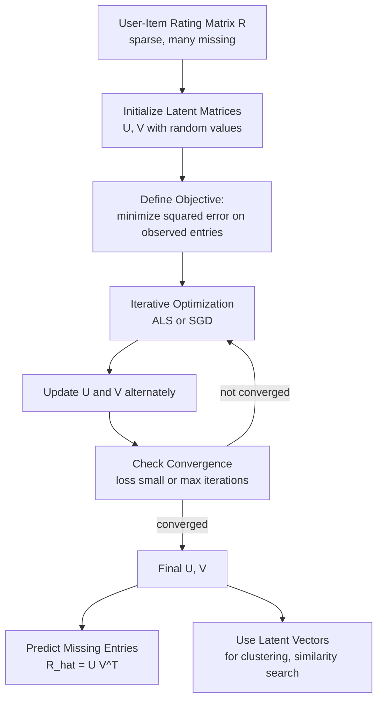

# Matrix Factorization and Matrix Completion

## 1. Definition

Matrix factorization is an unsupervised learning technique that decomposes a large matrix into a product of two or more smaller, lower-dimensional matrices to reveal hidden structure or latent factors. Matrix completion is the closely related task of recovering missing entries in a partially observed matrix, typically by assuming that the complete matrix has low rank and can be accurately reconstructed through factorization.

---

## 2. Concept Explanation

**Basic idea:** Suppose you have a huge table of data, like user ratings for movies. Most of the table is empty because users rate only a few films. The core idea is that there exist a few hidden tastes or themes (e.g., “action fan”, “romance fan”) that explain most of the ratings. Matrix factorization discovers these latent factors, and matrix completion uses them to guess the missing ratings.

**What it is:** Matrix factorization expresses a data matrix \( X \) (size \( m \times n \)) as the product of two much thinner matrices \( U \) (size \( m \times k \)) and \( V \) (size \( n \times k \)), so that \( X \approx U V^\top \). The rows of \( U \) can be thought of as user coordinates in a \( k \)-dimensional taste space, and the rows of \( V \) as item coordinates in the same space. The predicted value for an entry is the dot product of the corresponding user and item vectors.

Matrix completion is the problem of predicting missing entries in a partially observed matrix. It assumes the full matrix is approximately low-rank, i.e., can be well approximated by a factorization of rank much smaller than the matrix dimensions. The challenge is to find the latent matrices \( U \) and \( V \) using only the observed entries, and then use them to estimate the missing ones.

**Why it is used:** These techniques are extremely powerful for dimensionality reduction and uncovering hidden patterns without supervision. They are the foundation of modern recommendation engines (Netflix, Amazon), topic modeling, gene expression analysis, and image inpainting. They turn sparse, incomplete data into actionable predictions and compact representations.

**Where it is applied:** In recommender systems, matrix factorization predicts which items a user will like. In text mining (non-negative matrix factorization), it discovers topics in documents. In computer vision, it denoises images and separates foreground from background. In bioinformatics, it clusters genes by expression profiles.

---

## 3. Key Characteristics / Features

* **Latent factor learning:** The algorithm discovers a small set of unobserved (latent) features that jointly describe the data, providing a compact and interpretable representation.
* **Dimensionality reduction:** The large original matrix is replaced by much smaller factor matrices, reducing storage and computation while preserving essential structure.
* **Handling missing data:** Matrix completion explicitly targets the problem of missing entries, using low-rank assumption to predict unobserved values.
* **Unsupervised nature:** No target labels are needed; the learning signal comes solely from the structure of the input matrix itself.
* **Flexibility of loss and constraints:** Different factorizations arise from choosing different loss functions (Frobenius norm, entry-wise) and constraints (orthogonality, non-negativity, sparsity).
* **Linear embeddings:** The obtained latent vectors can be used as features for downstream tasks like clustering, classification, or visualization.

---

## 4. Types / Classification

Matrix factorization methods can be classified based on the constraints imposed and the optimization technique.

* **Singular Value Decomposition (SVD) / Principal Component Analysis (PCA):** Factorizes a fully observed matrix into three components \( X = U \Sigma V^\top \) with orthonormal columns in \( U \) and \( V \). PCA is the same applied on centered data. It yields a global low-rank approximation with minimum Frobenius norm error.
* **Non‑negative Matrix Factorization (NMF):** Forces the factor matrices \( U \) and \( V \) to have only non‑negative entries. This produces part‑based, interpretable representations, e.g., each topic is a positive combination of base words.
* **Probabilistic Matrix Factorization (PMF):** Places Gaussian priors on the latent vectors and assumes observed entries are generated with Gaussian noise. It yields a probabilistic model that can estimate uncertainty.
* **Singular Value Thresholding / Nuclear Norm Minimization:** A convex relaxation for matrix completion that directly penalizes the nuclear norm (sum of singular values) of the reconstructed matrix, encouraging low rank without explicit factorization.
* **Alternating Least Squares (ALS) vs. Stochastic Gradient Descent (SGD):** These are algorithmic approaches rather than model types, but they strongly influence scalability and handling of implicit feedback.

---

## 5. Working / Mechanism

We describe the standard mechanism for a collaborative filtering recommendation system, which combines matrix factorization with completion.

1. **Construct the user‑item interaction matrix \( R \):** Rows represent users, columns items. Entries are ratings, clicks, or purchases. Most entries are missing (the matrix is sparse).
2. **Initialize latent matrices:** Randomly initialize \( U \) (size \( m \times k \)) and \( V \) (size \( n \times k \)), where \( k \) is the chosen latent dimension (e.g., 50).
3. **Define the objective (loss function):** The goal is to minimize the squared error over known entries plus a regularization term to avoid overfitting:
   \[
   \min_{U,V} \sum_{(i,j) \in \Omega} (R_{ij} - u_i^\top v_j)^2 + \lambda (||U||_F^2 + ||V||_F^2)
   \]
   where \( \Omega \) is the set of observed user‑item pairs, and \( \lambda \) controls regularization strength.
4. **Optimize iteratively:** Two common approaches:
   * **Alternating Least Squares (ALS):** Fix \( V \), compute optimal \( U \) by solving a separate linear regression for each user; then fix \( U \) and optimize \( V \). Repeat until convergence.
   * **Stochastic Gradient Descent (SGD):** Loop over each observed entry, compute the prediction error, and update the corresponding user and item vectors by moving opposite to the gradient.
5. **Convergence check:** Stop when the change in loss or the vectors becomes very small, or after a fixed number of iterations.
6. **Predict missing entries:** Once \( U \) and \( V \) are learned, a missing rating for user \( i \) and item \( j \) is predicted as the dot product \( \hat{R}_{ij} = u_i^\top v_j \).
7. **Use latent vectors as features:** The rows of \( U \) and \( V \) serve as dense, low‑dimensional representations that can be fed into other algorithms.

---

## 6. Diagram

---

## 7. Mathematical Formulation

A rank‑\( k \) matrix factorization expresses the data matrix \( X \in \mathbb{R}^{m \times n} \) as:

$$
X \approx U V^\top
$$

Where:
* \( U \in \mathbb{R}^{m \times k} \) – rows are latent representations of the \( m \) row entities (e.g., users).
* \( V \in \mathbb{R}^{n \times k} \) – rows are latent representations of the \( n \) column entities (e.g., items).
* \( k \ll \min(m,n) \) – the latent dimensionality, capturing the number of hidden factors.

When \( X \) is fully observed, the best approximation in Frobenius norm is given by the truncated SVD: \( X_k = U_k \Sigma_k V_k^\top \).

For matrix completion with partial observations, the optimization problem is:

$$
\min_{U,V} \sum_{(i,j) \in \Omega} \left( X_{ij} - u_i^\top v_j \right)^2 + \lambda \big( \|U\|_F^2 + \|V\|_F^2 \big)
$$

where \( \Omega \) indexes the observed entries, \( \|U\|_F \) is the Frobenius norm (sum of squared entries), and \( \lambda \) is the regularization parameter.

Alternatively, the nuclear norm minimization formulation:

$$
\min_{M} \; \|M\|_* \quad \text{subject to} \quad M_{ij} = X_{ij} \; \forall (i,j) \in \Omega
$$

where \( \|M\|_* \) is the sum of singular values, promoting low‑rank solutions.

---

## 8. Example

Consider a movie streaming service with 100,000 users and 10,000 movies. The rating matrix \( R \) has about 0.1% entries filled. Using matrix factorization with \( k = 50 \), the system learns a 50‑dimensional vector for each user and each movie. For a user who has rated several action and comedy films, their vector might align with comedy action hybrids. The dot product between that user’s vector and a newly released action‑comedy movie’s vector yields a high predicted rating, so the system recommends it. This is exactly how the Netflix Prize winning solution worked, and it scaled to millions of users.

---

## 9. Analogy

Think of matrix factorization like summarizing a massive library of books using only a few tags. Each book gets a profile consisting of the strength of “mystery”, “romance”, “science”, etc. Each reader also gets a taste profile over the same tags. To predict whether a reader will enjoy a book, you compare their profiles: if both are high in “mystery”, the match is high. Matrix factorization automatically finds these tags (latent factors) and the scores, even though no one explicitly defined the tags.

Matrix completion is like having a test paper where some answers are erased. By assuming the answer pattern of each student is a mix of a few underlying skills, you can reconstruct the missing answers from the remaining ones.

---

## 10. Comparison (if needed)

| Feature          | Matrix Factorization                     | Matrix Completion                        |
| ---------------- | ---------------------------------------- | ---------------------------------------- |
| Meaning          | Decomposing a fully or partially known matrix into low‑rank factors | Filling missing entries of a sparse matrix by exploiting low‑rank structure |
| Goal             | Obtain latent representations, reduce dimensionality | Predict unknown entries accurately       |
| Input            | Full matrix (e.g., dense user‑item) or sparse matrix | Partially observed matrix with known entries |
| Core assumption  | Data lies near a low‑dimensional linear subspace | The complete matrix is (approximately) low‑rank |
| Typical method   | SVD, NMF, PMF                            | Minimization of error over observed entries + regularization (ALS, SGD, nuclear norm) |
| Output           | Factor matrices \( U \) and \( V \)      | Completed matrix and optionally factors  |

---

## 11. Advantages

* **Discover hidden structure:** It uncovers interpretable latent factors that describe users, items, and words, enabling explainable recommendations.
* **High scalability:** By storing only \( U \) and \( V \) instead of the full matrix, memory and computation reduce dramatically for large‑scale problems.
* **Excellent for sparse data:** It works well even when the observation ratio is extremely low, as long as the true matrix is low‑rank.
* **Competitive accuracy:** For collaborative filtering tasks, matrix factorization‑based methods consistently achieve state‑of‑the‑art prediction accuracy.
* **Flexible integration:** Latent vectors can be fed into any downstream supervised or unsupervised model, enriching the feature space.
* **Natural framework for side information:** Additional features (user demographics, item metadata) can be incorporated via joint factorization.

---

## 12. Disadvantages / Limitations

* **Rank selection:** The latent dimension \( k \) must be chosen beforehand; too small underfits, too large overfits or slows training. Cross‑validation is required.
* **Non‑convex optimization:** The factorization \( UV^\top \) leads to a non‑convex objective; solutions depend on initialization and may converge to local minima.
* **Cold start problem:** New users or items with no interactions have no latent vectors, making predictions impossible without additional side information.
* **Linearity assumption:** It assumes the data can be expressed as a linear combination of latent factors, which may miss complex non‑linear relationships.
* **Interpretability of latent dimensions:** Latent factors are not always human‑interpretable; NMF helps but may sacrifice accuracy.
* **Sensitivity to outliers:** Outliers can disproportionately influence the factors, although robust variants exist.

---

## 13. Important Points / Exam Notes

* **Matrix factorization** is a core technique for **dimensionality reduction** and **unsupervised representation learning**.
* **SVD/PCA** gives the optimal low‑rank approximation for fully observed data in the Frobenius norm.
* **Matrix completion** solves the problem of predicting missing entries under a **low‑rank assumption**.
* The key optimization is a **regularized least squares** problem over observed entries, solved by **ALS** or **SGD**.
* **Regularization** term \( \lambda (\|U\|^2 + \|V\|^2) \) is essential to prevent overfitting on sparse data.
* **NMF** imposes **non‑negativity**, yielding parts‑based representations popular in topic modeling and image analysis.
* **Nuclear norm minimization** provides a convex approach to matrix completion, with theoretical guarantees.
* Factorization is **linear**; for complex patterns, neural collaborative filtering methods can capture non‑linearities.
* **Evaluation:** Use RMSE or MAE on held‑out ratings for completion tasks; use reconstruction error for representation quality.

---

## 14. Applications / Use Cases

* **Recommender systems:** Netflix, Amazon, Spotify use matrix factorization to predict user ratings and personalize suggestions.
* **Topic modeling:** NMF factorizes a document–term matrix to discover latent topics and assign topics to documents.
* **Image inpainting:** Low‑rank matrix completion recovers missing pixels in corrupted images.
* **Gene expression analysis:** Factorizing expression matrices identifies gene modules and cell types.
* **Link prediction in graphs:** Adjacency matrix factorization predicts missing edges in social networks.
* **Customer segmentation:** Users are clustered in the latent space to define marketing segments.
* **Text denoising:** Matrix completion fills missing words or corrects errors in scanned documents.

---

## 15. MCQs

**Q1. What does matrix factorization attempt to do?**

A. Cluster similar columns by distance.  
B. Decompose a matrix into a product of two lower‑rank matrices.  
C. Find the determinant of the matrix.  
D. Add a new column to the matrix.

**Answer:** B  
**Explanation:** Matrix factorization represents a matrix as \(UV^\top\) with \(U\) and \(V\) having much fewer columns than the original matrix, capturing latent factors.

---

**Q2. In the context of recommender systems, the rows of matrix \(U\) in \(R \approx UV^\top\) typically represent:**

A. Item latent vectors  
B. Rating vectors  
C. User latent vectors  
D. Movie genres

**Answer:** C  
**Explanation:** Usually, \(U\) holds user vectors (size users × k) and \(V\) holds item vectors (size items × k). The dot product gives the predicted rating.

---

**Q3. Matrix completion relies on the assumption that the underlying complete matrix is:**

A. Diagonal  
B. Full rank  
C. Low rank  
D. Symmetric

**Answer:** C  
**Explanation:** The low‑rank assumption allows the matrix to be reconstructed from a small number of observations, as a low‑rank matrix has few degrees of freedom.

---

**Q4. Which method uses non‑negativity constraints to produce part‑based, interpretable latent factors?**

A. SVD  
B. PCA  
C. Non‑negative Matrix Factorization (NMF)  
D. Nuclear norm minimization

**Answer:** C  
**Explanation:** NMF forces \(U\) and \(V\) to be non‑negative, creating an additive, parts‑based representation often used in topic modeling and image analysis.

---

**Q5. In the matrix factorization objective for collaborative filtering, regularization is added to:**

A. Speed up convergence.  
B. Prevent the latent vectors from becoming too large and overfitting the observed data.  
C. Make the matrix square.  
D. Remove all missing entries.

**Answer:** B  
**Explanation:** Regularization penalizes large weights (Frobenius norm), reducing overfitting, especially important when the matrix is sparse.

---

**Q6. Alternating Least Squares (ALS) updates the user and item matrices by:**

A. Updating all parameters randomly.  
B. Solving a convex least‑squares problem for one matrix while fixing the other, iteratively.  
C. Using gradient descent on all parameters simultaneously.  
D. Performing a single SVD on the full matrix.

**Answer:** B  
**Explanation:** ALS alternates between holding \(V\) fixed and solving for \(U\), then holding \(U\) fixed and solving for \(V\), each step being an exactly solvable linear system.

---

**Q7. What is a major challenge when applying matrix factorization to a brand‑new user with no interactions?**

A. The latent factors are too large.  
B. The regularization term becomes infinite.  
C. The cold start problem: no personal latent vector can be estimated.  
D. The matrix becomes full rank.

**Answer:** C  
**Explanation:** Without interaction data, the model cannot learn the user’s latent vector, so predictions rely on defaults or side information.

---

**Q8. Which of the following is a convex relaxation of the matrix completion problem?**

A. Stochastic Gradient Descent on \(UV^\top\)  
B. Truncated SVD  
C. Nuclear norm minimization  
D. Non‑negative Matrix Factorization

**Answer:** C  
**Explanation:** Minimizing the nuclear norm (sum of singular values) subject to matching observed entries is a convex optimization problem that promotes low‑rank solutions.

---

**Q9. In truncated SVD for dimensionality reduction, how is the rank‑\(k\) approximation obtained from the full SVD?**

A. By keeping only the \(k\) largest singular values and corresponding singular vectors.  
B. By keeping the \(k\) smallest singular values.  
C. By averaging all singular values.  
D. By multiplying only the diagonal elements of the matrix.

**Answer:** A  
**Explanation:** Truncated SVD retains the top‑\(k\) singular values (energy), providing the best rank‑\(k\) approximation in Frobenius norm.

---

**Q10. Which loss function is most commonly minimized in standard matrix factorization for collaborative filtering?**

A. Hinge loss  
B. Cross‑entropy loss  
C. Squared error loss on the observed entries  
D. Exponential loss

**Answer:** C  
**Explanation:** The objective minimizes the sum of squared differences between observed ratings and predicted ratings, often with a regularization term. This is the standard for rating prediction tasks.