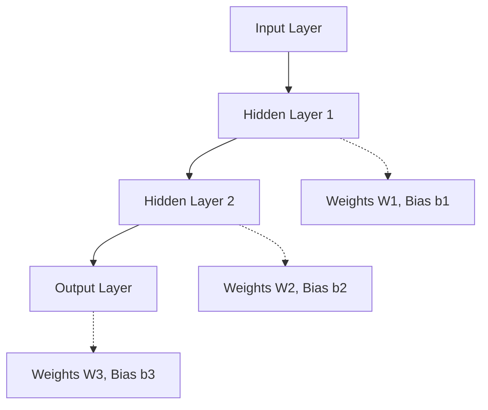

# Neural network representation

## Video Explanation

* [https://www.youtube.com/watch?v=aircAruvnKk](https://www.youtube.com/watch?v=aircAruvnKk)

## Visual Aids

## 1. Definition

A neural network representation is a structured way of describing an artificial neural network using interconnected computing units called neurons. In this representation the network is organised into layers (input, hidden, and output) with directed connections carrying weights, and each neuron applies a non‑linear activation function to the weighted sum of its inputs. It is the mathematical and graphical model that captures how raw data flows through the network to produce a prediction.

## 2. Concept Explanation

Neural networks take inspiration from the human brain, but the actual model is purely mathematical. At the simplest level, a single neuron receives a number of inputs, multiplies each by a weight, adds a bias, and passes the result through an activation function to produce an output. A neural network combines many such neurons arranged in layers.

The input layer accepts the raw features of the data (e.g., pixel values of an image). One or more hidden layers perform transformations, gradually extracting higher‑level patterns. The output layer produces the final prediction, such as a class label or a numeric value. Every connection from one neuron to another has a weight, which the network learns during training. The architecture of these layers, together with the choice of activation functions, determines the function the network can represent.

Why this representation is powerful: stacking layers of neurons with non‑linear activations allows the network to approximate arbitrarily complex functions. Even a single hidden layer with enough neurons can theoretically represent any continuous function (universal approximation theorem). In practice, deeper networks learn a hierarchy of features, from simple edges to complex objects, making them the primary tool for image recognition, speech processing, and language understanding.

## 3. Key Characteristics / Features

- **Layer‑wise organisation:** Neurons are arranged in an input layer, multiple hidden layers, and an output layer. Data flows strictly forward in a standard feed‑forward network.
- **Weighted connections:** Every arrow between any two neurons carries a scalar weight \( w_{ij} \). These weights are the parameters the network learns from data.
- **Bias terms:** Each neuron (except those in the input layer) adds a trainable bias \( b \) that shifts the activation threshold independently of the input.
- **Non‑linear activation:** After computing the weighted sum \( z \), the neuron applies a non‑linear function \( g(z) \) such as ReLU, sigmoid, or tanh. Without this non‑linearity, the entire network would collapse into a simple linear model.
- **Computation is local:** Each neuron independently computes its output from its immediate inputs. This local nature makes the network easy to parallelise.
- **Universality:** A feed‑forward network with at least one hidden layer and non‑linear activation can approximate any Borel‑measurable function to any desired accuracy, given sufficient hidden units.

## 4. Types / Classification

Neural network representation varies with the connectivity pattern and task.

- **Feed‑forward neural networks:** Connections do not form cycles. Information moves only from input to output. This is the most common representation for classification and regression.
- **Convolutional neural networks (CNNs):** A specialised feed‑forward network where layers perform convolution operations. The representation includes shared weights and spatial hierarchies; used for images.
- **Recurrent neural networks (RNNs):** The representation includes cyclic connections, allowing previous outputs to be fed back as inputs. Suitable for sequential data like text and time series.
- **Fully connected (dense) networks:** Every neuron in one layer connects to every neuron in the next. This is the generic building block for most architectures.
- **Sparse or locally connected networks:** Only specific connections exist, reducing the number of parameters. CNNs are a prime example.

All these representations are variations of the same core idea: a weighted graph of neurons with activation functions.

## 5. Working / Mechanism

The flow of computation in a feed‑forward neural network representation follows these steps for a single input example.

1.  **Set the input layer:** Assign each feature of the data sample to a neuron in the input layer. The activation of the neuron \( a^{(0)}_i \) equals the feature value \( x_i \).
2.  **For each hidden layer \( l = 1, 2, \dots, L-1 \):**
    - Compute the weighted input vector \( z^{(l)} = W^{(l)} a^{(l-1)} + b^{(l)} \), where \( W^{(l)} \) is the weight matrix from layer \( l-1 \) to layer \( l \) and \( b^{(l)} \) is the bias vector.
    - Apply the activation function element‑wise: \( a^{(l)} = g(z^{(l)}) \). This produces the activations that are passed to the next layer.
3.  **Compute the output layer (\( l = L \)):** Repeat the same process: \( z^{(L)} = W^{(L)} a^{(L-1)} + b^{(L)} \). The activation function in the output layer is chosen based on the task:
    - For binary classification, use a sigmoid function to obtain a probability.
    - For multi‑class classification, use softmax.
    - For regression, use linear activation (i.e., \( a^{(L)} = z^{(L)} \)).
4.  **Output:** The final activation vector \( \hat{y} = a^{(L)} \) represents the network’s prediction.

## 6. Diagram

All neurons in one layer connect to all neurons in the next; the diagram illustrates the general layered structure with weights and biases shown conceptually.

## 7. Mathematical Formulation

A feed‑forward neural network with \( L \) layers can be represented as a chain of function compositions.

For a single neuron with inputs \( x_1, x_2, \dots, x_n \):

$$
z = \sum_{i=1}^{n} w_i x_i + b
$$
$$
a = g(z)
$$

In matrix form for an entire layer \( l \):

$$
z^{(l)} = W^{(l)} a^{(l-1)} + b^{(l)}
$$
$$
a^{(l)} = g^{(l)}(z^{(l)})
$$

Where:
- \( a^{(0)} = x \) is the input data.
- \( W^{(l)} \) is the weight matrix of shape (neurons in layer \( l \) × neurons in layer \( l-1 \)).
- \( b^{(l)} \) is the bias vector.
- \( g^{(l)} \) is the activation function, e.g., ReLU \( g(z)=\max(0,z) \), sigmoid \( g(z)=\frac{1}{1+e^{-z}} \), or tanh.
- \( a^{(L)} = \hat{y} \) is the final output.

The whole network thus represents a function \( f(x;\Theta) \) where \( \Theta = \{W^{(1)}, b^{(1)}, \dots, W^{(L)}, b^{(L)}\} \) denotes the set of all parameters.

## 8. Example

Consider a simple network for predicting whether a house will sell above market price based on two features: area (sq ft) and age (years). The network has:
- Input layer: 2 neurons (area, age).
- One hidden layer with 3 neurons, ReLU activation.
- Output layer with 1 neuron, sigmoid activation.

A particular house of area = 2000 sq ft and age = 10 years is input as \( a^{(0)} = [2000, 10] \). The hidden layer computes:
\( z^{(1)} = W^{(1)} [2000, 10]^T + b^{(1)} \), then \( a^{(1)} = \text{ReLU}(z^{(1)}) \).
The output layer computes \( z^{(2)} = W^{(2)} a^{(1)} + b^{(2)} \) and \( \hat{y} = \sigma(z^{(2)}) \). If \( \hat{y}=0.85 \), the network predicts an 85% probability that the house sells above market. All the weights and biases are learned from training data.

## 9. Analogy

Imagine a large company where a report is passed through several departments. The raw data (input) enters the mailroom. The first team of analysts (hidden layer 1) reads it, adds their insights, and passes a summary forward. A second team (hidden layer 2) further refines it. Finally, the executive (output layer) reads the refined report and makes a final decision. The expertise of each analyst is the weight; the analyst’s mood (bias) can colour the interpretation; the rule that they cannot write a negative summary unless something is seriously wrong is like the ReLU activation.

## 10. Comparison

| Feature | Neural Network | Linear Regression |
|--------|----------------|-------------------|
| Meaning | Composes multiple non‑linear transformations using layers of neurons | Models the output as a direct linear combination of inputs |
| Decision boundary capacity | Can represent arbitrarily complex, non‑linear functions | Only linear (or polynomial with manual feature engineering) |
| Parameters | Weights and biases in multiple layers | A single weight vector and bias |
| Training | Backpropagation with gradient descent | Ordinary least squares or gradient descent |
| Interpretability | Typically a black box | Coefficients have clear, direct meaning |

## 11. Advantages

- **Universal function approximators:** A neural network with at least one hidden layer can model almost any function, making it suitable for problems where the true relationship is unknown or highly complex.
- **Automatic feature learning:** Hidden layers learn to construct useful representations from raw data, eliminating the need for manual feature engineering in many domains.
- **Scalable to massive datasets:** The representation supports mini‑batch stochastic gradient descent and parallel computation on GPUs, allowing training on millions of examples.
- **Flexibility across tasks:** The same core architecture can be adapted for images (CNNs), sequences (RNNs), and tabular data (dense networks) by changing layer types and activations.
- **Handle high‑dimensional data:** Neural networks work well with inputs like images, speech, and text, where traditional models fail without heavy preprocessing.

## 12. Disadvantages / Limitations

- **Requires large amounts of data:** To generalise well, particularly deep networks need tens of thousands of labelled samples; on small datasets they tend to overfit.
- **Black‑box nature:** Interpreting why a certain decision was made is difficult, which can be problematic in regulated industries.
- **Computationally expensive training:** Training deep architectures involves many matrix multiplications and forward‑backward passes, consuming significant time and energy.
- **Many hyperparameters:** The representation introduces choices of architecture (depth, width, activation type) and training parameters (learning rate, batch size) that require careful tuning.
- **Vanishing/exploding gradients:** When backpropagating through many layers, gradients can become extremely small or large, hindering effective learning unless special techniques are used.

## 13. Important Points / Exam Notes

- A neuron computes \( z = \sum w_i x_i + b \) and applies activation \( a = g(z) \).
- Without non‑linear activation, a multi‑layer network is equivalent to a single linear transformation.
- Weight matrix \( W^{(l)} \) has dimensions \( n_l \times n_{l-1} \), where \( n_l \) is the number of neurons in layer \( l \).
- Common hidden‑layer activations: **ReLU** (default), **tanh**, **sigmoid**. ReLU helps avoid vanishing gradients.
- Output activation: **linear** for regression, **sigmoid** for binary classification, **softmax** for multi‑class.
- A network with \( L \) layers (including input and output) is called an \( L \)-layer network; e.g., one hidden layer makes it a 2‑layer network (input not counted as a learnable layer in some notation, but commonly L‑hidden layers count).
- Feed‑forward means information flows strictly from input to output; no feedback loops.
- The number of learnable parameters in a fully connected layer is (number of neurons in previous layer × number of neurons in current layer) + biases.
- The universal approximation theorem states that a network with a single hidden layer can approximate any continuous function, but it does not guarantee it can be learned efficiently.
- Representation includes the architecture, weight and bias values, and activation functions; the same architecture with different weights represents a different function.

## 14. Applications / Use Cases

- **Image classification:** Convolutional neural networks represent pixels as input and learn hierarchical features to recognise objects, faces, or handwritten digits (e.g., ImageNet, MNIST).
- **Natural language processing:** Transformers and recurrent networks represent word sequences and learn contextual meaning for translation, sentiment analysis, and chatbots.
- **Speech recognition:** Neural networks map audio spectrograms to phoneme probabilities, enabling voice assistants like Alexa and Google Voice.
- **Medical diagnosis:** A dense network takes patient lab results and vital signs as input features to predict disease risks.
- **Autonomous driving:** Neural networks process lidar, camera, and radar data to detect lanes, pedestrians, and traffic signs in real time.

## 15. MCQs

**Q1. What is the primary building block of a neural network representation?**

A. Decision tree node  
B. Support vector  
C. Artificial neuron  
D. K‑means centroid  

**Answer:** C  
**Explanation:** The artificial neuron is the fundamental computing unit in a neural network.

---

**Q2. Without a non‑linear activation function, a multi‑layer neural network would be equivalent to**

A. A single‑layer linear model  
B. A k‑nearest neighbour classifier  
C. A random forest  
D. A clustering algorithm  

**Answer:** A  
**Explanation:** A composition of linear functions is linear. Without non‑linearity, no new representational power is gained.

---

**Q3. Which activation function is most commonly used in hidden layers of modern deep networks?**

A. Linear  
B. Sigmoid  
C. ReLU (Rectified Linear Unit)  
D. Softmax  

**Answer:** C  
**Explanation:** ReLU avoids vanishing gradient problems and is computationally efficient, making it the default for hidden layers.

---

**Q4. In a feed‑forward neural network, the flow of information is**

A. Bidirectional between all layers  
B. From output to input only  
C. Only from the input layer toward the output layer  
D. Randomly between neurons  

**Answer:** C  
**Explanation:** Feed‑forward networks have directed edges that pass information sequentially from input to output without cycles.

---

**Q5. The dimension of the weight matrix connecting a layer with 4 neurons to a layer with 3 neurons is**

A. \( 3 \times 4 \)  
B. \( 4 \times 3 \)  
C. \( 3 \times 3 \)  
D. \( 7 \times 1 \)  

**Answer:** A  
**Explanation:** Weight matrix maps from size 4 to size 3, so its shape is \( 3 \times 4 \) (rows = output size, columns = input size).

---

**Q6. Which output activation function is appropriate for binary classification?**

A. Softmax  
B. Linear  
C. ReLU  
D. Sigmoid  

**Answer:** D  
**Explanation:** Sigmoid squashes the output to (0,1), which can be interpreted as the probability of the positive class.

---

**Q7. The bias term in a neuron allows the network to**

A. Reduce the number of weights to zero  
B. Shift the activation function threshold independently of the input  
C. Replace the need for an activation function  
D. Increase the number of layers automatically  

**Answer:** B  
**Explanation:** Bias shifts the weighted sum, giving the network flexibility to activate even when all inputs are zero.

---

**Q8. The universal approximation theorem states that a feed‑forward network with at least one hidden layer can**

A. Only solve linear regression problems  
B. Approximate any continuous function given enough hidden units  
C. Guarantee zero training error for any dataset  
D. Work without any activation function  

**Answer:** B  
**Explanation:** With sufficient hidden neurons and a suitable activation, such a network can approximate any Borel‑measurable function.

---

**Q9. Which part of the neural network representation is learned from data through training?**

A. The network architecture (number of layers)  
B. The choice of activation function  
C. The weights and biases  
D. The input features  

**Answer:** C  
**Explanation:** While architecture and activations are hyperparameters set by the designer, weights and biases are the parameters that the training algorithm adjusts.

---

**Q10. In the matrix notation \( a^{(l)} = g(W^{(l)} a^{(l-1)} + b^{(l)}) \), \( g \) represents**

A. The learning rate  
B. The bias vector  
C. The activation function applied element‑wise  
D. The loss function  

**Answer:** C  
**Explanation:** \( g \) is the non‑linear activation function that transforms the linear combination computed by the layer.