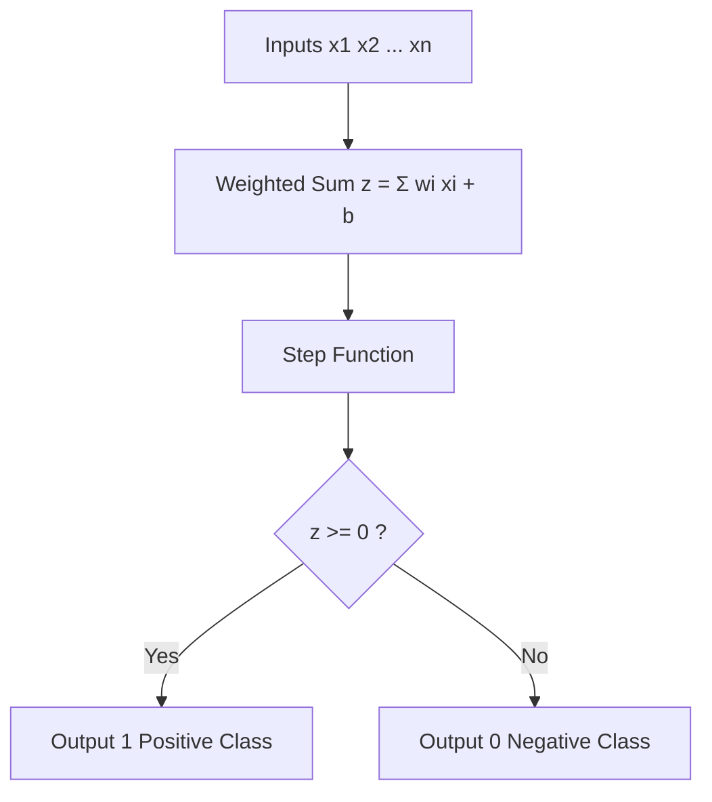

# Perceptron

## 1. Definition
A perceptron is a supervised learning algorithm used for binary classification. It is a simplified mathematical model of a biological neuron that makes predictions by computing a weighted sum of input features and passing the result through a step activation function. It represents the simplest form of an artificial neural network and serves as the fundamental building block for more complex architectures.

## 2. Concept Explanation
Imagine you are a doctor deciding whether a patient has a particular disease. You consider several symptoms (inputs) like fever, cough, and fatigue. Each symptom has a different level of importance (weight) in indicating the disease. You add up the weighted symptoms, and if the total score crosses a certain threshold, you diagnose the disease; otherwise, you declare the patient healthy.

That is exactly how a perceptron works. It takes numerical inputs, multiplies each by a corresponding weight, sums everything together, and adds a bias term. Then it applies a hard threshold (step function): if the sum is greater than or equal to zero, it outputs 1 (positive class); otherwise, it outputs 0 (negative class). The learning process adjusts the weights and bias using a simple error‑driven rule: whenever the perceptron predicts incorrectly, the weights are updated in the direction that reduces the error.

Why is it important? The perceptron, introduced by Frank Rosenblatt in 1958, was the first algorithmically trainable neural network. It laid the foundation for all modern deep learning. Although a single perceptron is limited to linearly separable problems, understanding it is essential for grasping how larger neural networks learn.

## 3. Key Characteristics / Features
- **Linear binary classifier:** The perceptron can only separate classes that can be divided by a straight line (hyperplane).
- **Single‑layer structure:** It consists of only input and output units, with no hidden layers.
- **Hard‑threshold activation:** The step function outputs either 1 or 0 (or +1 and –1), producing a crisp decision with no probability.
- **Online learning:** Weights are updated after every misclassified training example, not after a batch.
- **Convergence guarantee:** If the data is linearly separable, the perceptron is guaranteed to find a separating hyperplane in a finite number of steps (Perceptron Convergence Theorem).

## 4. Types / Classification
While the core perceptron is a single binary classifier, variants exist depending on architecture:
- **Single‑output perceptron:** The standard model with one output unit for two‑class problems.
- **Multi‑output perceptron:** Several independent perceptrons are used in parallel, one per class, for multi‑class classification. Each output neuron learns its own weight vector, and the class with the highest net input is chosen (no softmax, just argmax).

## 5. Working / Mechanism
The training process of a perceptron for binary classification with target labels $t \in \{0,1\}$ follows these steps:

1. **Initialize** all weights $w_i$ and bias $b$ to small random numbers or zeros.
2. For each training sample $(x, t)$, compute the **net input**:  
   $$z = \sum_{i=1}^{n} w_i x_i + b$$
3. Apply the **step activation function** to obtain the predicted output $y$:  
   $$y = \begin{cases} 1 & \text{if } z \ge 0 \\ 0 & \text{if } z < 0 \end{cases}$$
4. Compare the prediction $y$ with the true target $t$. If they are equal, no update is made because the example is already correctly classified.
5. If misclassified ($y \neq t$), update the weights and bias using the **perceptron learning rule**:  
   $$w_i \leftarrow w_i + \eta \, (t - y) \, x_i$$  
   $$b \leftarrow b + \eta \, (t - y)$$
   where $\eta$ is the learning rate (a small positive constant, e.g., 0.1).  
   Note: If $t=1$ and $y=0$, weights are increased, making the net input larger for that example. If $t=0$ and $y=1$, weights are decreased.
6. Repeat steps 2‑5 for multiple **epochs** (full passes over the training set) until all examples are correctly classified, or a preset maximum number of epochs is reached.

Prediction on a new example uses only steps 2 and 3.

## 6. Diagram

*Weights are adjusted during training when the output is incorrect.*

## 7. Mathematical Formulation
The perceptron model is defined by:

$$
z = \sum_{i=1}^{n} w_i x_i + b \quad\text{(net input)}
$$

$$
y = 
\begin{cases}
1 & \text{if } z \ge 0 \\
0 & \text{otherwise}
\end{cases}
\quad\text{(prediction)}
$$

Where:
- $x_i$ is the $i$-th input feature.
- $w_i$ is the weight associated with $x_i$.
- $b$ is the bias term (shifts the decision boundary).
- $y$ is the predicted class label (1 or 0).

**Learning rule** (one weight update per misclassified example):

$$
w_i \leftarrow w_i + \eta \, (t - y) \, x_i
$$

$$
b \leftarrow b + \eta \, (t - y)
$$

- $t$ is the true target label (0 or 1).
- $\eta$ is the learning rate (step size).

When $t=1$ and $y=0$, $t-y = +1$, so the weights are increased to raise $z$. When $t=0$ and $y=1$, $t-y = -1$, so weights are decreased.

## 8. Example
Consider the logical AND problem. The dataset is linearly separable:

| $x_1$ | $x_2$ | Target (AND) |
|-------|-------|--------------|
| 0     | 0     | 0            |
| 0     | 1     | 0            |
| 1     | 0     | 0            |
| 1     | 1     | 1            |

Initialize $w_1 = 0$, $w_2 = 0$, $b = 0$, $\eta = 1$. Process the examples repeatedly:

- (1,1) → target=1: net = 0 → y=0, wrong. Update: $w_1=1$, $w_2=1$, $b=1$.
- Later passes quickly converge. After a few epochs, weights might become $w_1=1$, $w_2=1$, $b = -0.5$ (or similar), which correctly classifies all points. The decision line is $x_1 + x_2 - 0.5 = 0$, perfectly separating the class.

## 9. Analogy
Think of a strict teacher evaluating a student's scholarship eligibility. The teacher considers grades, extracurriculars, and community service, each with a certain importance. The teacher sums up the weighted scores. If the total meets a fixed passing threshold, the scholarship is awarded (output 1). If not, it is denied (output 0). Whenever the teacher misjudges a candidate (the actual scholarship result is known), the teacher slightly adjusts the importance of each factor to correct future mistakes. This is precisely how a perceptron learns.

## 10. Comparison
| Feature              | Perceptron                                    | Logistic Regression                              |
| -------------------- | --------------------------------------------- | ------------------------------------------------ |
| Activation           | Step function (hard threshold, 0/1)           | Sigmoid function (smooth probability between 0 and 1) |
| Output interpretation| Discrete class (no probability)               | Probability of belonging to positive class       |
| Learning algorithm   | Perceptron rule (error‑driven weight update)  | Gradient descent on cross‑entropy loss           |
| Convergence guarantee| Only for linearly separable data (and zero‑loss)| Converges to global optimum because loss is convex |
| Foundation           | First neural model; ancestor of deep networks | Statistical framework; generalised linear model  |

## 11. Advantages
- **Extremely simple and fast:** The algorithm has no matrix inversions or complex maths, making it highly efficient for small problems.
- **Online learning:** It learns one example at a time, which is memory‑efficient and allows the model to adapt to new data on the fly.
- **Convergence guaranteed:** For any linearly separable dataset, it will always find a perfect separating hyperplane.
- **Interpretable weights:** The learned weights directly show the importance and direction of each feature’s influence.
- **Foundation for neural networks:** The perceptron concept is the core building block of all modern deep learning architectures.

## 12. Disadvantages / Limitations
- **Cannot solve non‑linear problems:** It fails on datasets that are not linearly separable, such as the XOR pattern. No single straight line can divide the classes.
- **Binary classification only:** The basic perceptron handles only two classes. Multi‑class extensions lack probabilistic interpretation.
- **Step function not differentiable:** The hard threshold prevents the use of gradient‑based optimizers, limiting its integration with deep neural networks.
- **Sensitive to feature scales:** Inputs with large numerical ranges can dominate the net input, making standardisation a practical requirement.
- **Multiple solutions:** If the data is separable, the final hyperplane depends on weight initialisation and example order; there is no unique optimal boundary.

## 13. Important Points / Exam Notes
- A perceptron is a **single‑layer linear binary classifier** with a **step activation**.
- Decision condition: **$\sum w_i x_i + b = 0$** defines the separating hyperplane.
- **Weights and bias** are updated only when the current example is misclassified: $w_i \leftarrow w_i + \eta (t - y) x_i$.
- The **Perceptron Convergence Theorem** states that if the training data is linearly separable, the algorithm will converge to a perfect solution in a finite number of steps.
- The learning rate $\eta$ controls the magnitude of weight updates; a common choice is $\eta=1$ for separable problems.
- Perceptron cannot solve the **XOR problem**, which motivated the development of multi‑layer networks.

## 14. Applications / Use Cases
- **Simple linear classification:** Picking out objects that are clearly distinguishable by a linear boundary, e.g., classifying emails as “urgent” vs. “non‑urgent” based on keyword counts.
- **Historical character recognition:** Early optical character recognition systems used perceptrons to recognise printed digits.
- **Building block in ensembles:** Perceptrons can serve as weak classifiers in boosting algorithms like the perceptron‑based Adaline and later voted perceptron methods.
- **Educational tool:** The perceptron is widely used to teach the fundamentals of neural networks, weight updates, and the concept of linear separability.

## 15. MCQs

**Q1. The activation function used in a standard perceptron is:**
A. Sigmoid
B. ReLU
C. Step function (hard threshold)
D. Linear identity
**Answer:** C  
**Explanation:** The perceptron uses a step function that outputs either 1 or 0 based on whether the weighted sum exceeds zero.

**Q2. Which of the following problems cannot be solved by a single perceptron?**
A. AND
B. OR
C. XOR
D. NAND
**Answer:** C  
**Explanation:** XOR is not linearly separable; no single straight line can separate the classes. AND, OR, and NAND are linearly separable.

**Q3. In the perceptron learning rule, weights are updated when:**
A. The prediction is correct
B. The prediction is incorrect (misclassified)
C. In every epoch regardless of error
D. Only when the loss is less than a threshold
**Answer:** B  
**Explanation:** The perceptron makes no update for correctly classified examples; weights change only when a misclassification occurs.

**Q4. The net input to a perceptron is computed as:**
A. Product of inputs
B. Sum of squared inputs
C. Weighted sum of inputs plus bias
D. Maximum of inputs
**Answer:** C  
**Explanation:** The net input $z = \sum w_i x_i + b$ is a linear combination of the inputs, with the bias shifting the decision boundary.

**Q5. What is the role of the bias term in a perceptron?**
A. It changes the learning rate.
B. It allows the decision boundary to shift away from the origin.
C. It normalises the input features.
D. It makes the activation function smooth.
**Answer:** B  
**Explanation:** Without a bias, the decision boundary always passes through the origin. The bias term $b$ gives the hyperplane the freedom to be placed anywhere in the space.

**Q6. The Perceptron Convergence Theorem guarantees convergence only if:**
A. A sufficiently large learning rate is used.
B. The training data is linearly separable.
C. The features are standardised to zero mean and unit variance.
D. A differentiable activation function is used.
**Answer:** B  
**Explanation:** The theorem states that given linearly separable classes, the perceptron algorithm will find a separating hyperplane in finite steps, regardless of the initial weights (provided learning rate is constant >0, though usually $\eta=1$).

**Q7. When a perceptron predicts $y=1$ but the true label $t=0$, the weight update rule:**
A. Increases all weights
B. Decreases the weights of the active inputs
C. Does nothing
D. Increases the bias only
**Answer:** B  
**Explanation:** With $t=0$ and $y=1$, the error $(t-y) = -1$. The update $w_i \leftarrow w_i + \eta(-1)x_i$ decreases the weights for the inputs that were active ($x_i>0$), thus lowering future net input for that example.

**Q8. The perceptron is best described as a:**
A. Unsupervised clustering algorithm
B. Reinforcement learning agent
C. Linear binary classifier
D. Non‑linear regression model
**Answer:** C  
**Explanation:** It classifies data into two classes using a linear decision boundary.

**Q9. Why is the perceptron not directly used in modern deep learning architectures?**
A. It requires too much memory.
B. Its step activation function is non‑differentiable, preventing gradient‑based learning.
C. It can only handle continuous inputs.
D. It is too slow for large datasets.
**Answer:** B  
**Explanation:** Modern networks rely on backpropagation, which requires differentiable activation functions. The step function’s gradient is zero almost everywhere, so it cannot be used in such networks.

**Q10. If a dataset is not linearly separable, a single perceptron will:**
A. Converge to a solution after very many epochs.
B. Always give the same output for all inputs.
C. Oscillate, never achieving zero error on all training examples.
D. Automatically add a hidden layer to compensate.
**Answer:** C  
**Explanation:** The algorithm will keep updating weights indefinitely (or until stopped by an epoch limit) because some examples will forever be misclassified, causing weights to oscillate.