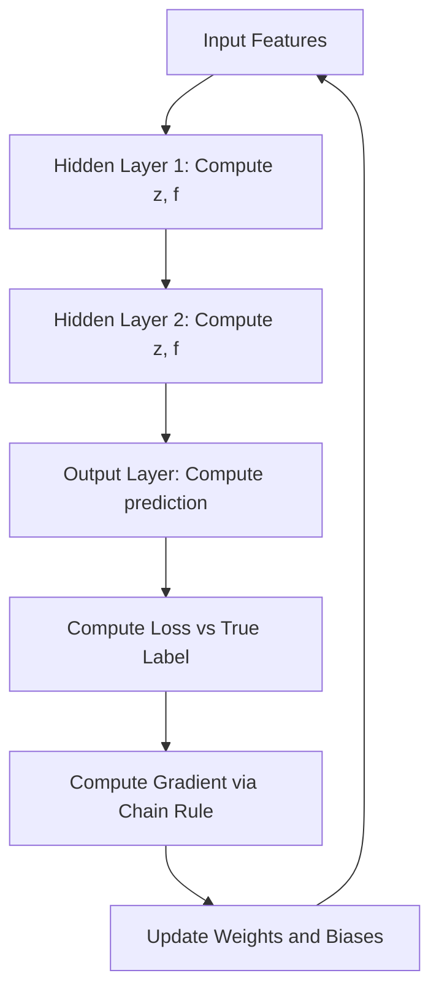

# Multilayer Network and Back Propagation Algorithm

## 1. Definition

A multilayer network (often called a Multilayer Perceptron, MLP) is a feedforward artificial neural network that contains one or more hidden layers between the input and output layers. The back propagation algorithm is the supervised learning method used to train such networks. It computes the gradient of the loss function with respect to every weight by applying the chain rule of calculus backward from the output layer to the input layer, and then updates the weights using gradient descent to minimise the prediction error.

---

## 2. Concept Explanation

**Basic intuitive idea:** Imagine a team of decision‑makers arranged in a chain. The first person looks at the raw data and makes a few simple observations. They pass their conclusions to the next person, who combines these to form more abstract insights. The process continues until the final person announces a decision (e.g., “cat” or “dog”). If the final decision is wrong, a supervisor tells each person how much their contribution should be adjusted, starting from the last person and moving backward. Each person tweaks their own rules to do better next time. This is exactly how a multilayer network and back propagation work.

**What it is:** A multilayer network is a collection of neurons arranged in layers. The first layer receives the input features. Each neuron in a hidden layer takes a weighted sum of all outputs from the previous layer, adds a bias, and passes the result through a non‑linear activation function (like ReLU or sigmoid). The final output layer produces the prediction. No connections skip layers, and information flows only forward.

**Why it is used:** A single‑layer perceptron can only separate data that is linearly separable. Real‑world problems, such as recognizing handwritten digits or understanding speech, require learning complex non‑linear decision boundaries. By stacking hidden layers with non‑linear activations, a multilayer network can approximate any continuous function. Back propagation makes it possible to compute the necessary weight updates efficiently, even for networks with millions of parameters.

**Where it is applied:** Multilayer networks trained with back propagation are the foundation of modern deep learning. They power image classifiers, speech recognition systems, language translators, game‑playing agents, and countless other intelligent systems.

---

## 3. Key Characteristics / Features

* **Feedforward architecture:** Information moves from input to output in one direction. There are no cycles or feedback loops in the basic multilayer perceptron, which keeps the computation predictable and the back propagation algorithm straightforward.
* **Presence of hidden layers:** Unlike a perceptron, an MLP has one or more hidden layers that create internal representations. These intermediate representations allow the network to learn complex, hierarchical features from the data.
* **Non‑linear activation functions:** Each neuron applies a non‑linear function (e.g., sigmoid, tanh, ReLU) to its weighted sum. Without non‑linearity, stacking layers would collapse into a single linear transformation, making the network no more powerful than linear regression.
* **Supervised learning via gradient descent:** The network is trained with labeled examples. Back propagation computes gradients of the loss with respect to each weight; an optimizer (like SGD, Adam) then adjusts weights to minimise the loss.
* **Distributed representation:** Knowledge is stored across many weights. Each hidden neuron contributes a part of the decision, and the network’s behaviour emerges from the collective interaction, giving it robustness to noise and damage.
* **Universal approximation capability:** A multilayer network with at least one hidden layer and a sufficient number of neurons can approximate any continuous function on a compact input domain to arbitrary accuracy. This is a fundamental theoretical property that underpins their expressive power.

---

## 4. Types / Classification

Multilayer networks can be categorised based on their depth and connectivity.

* **Shallow multilayer networks:** Networks with exactly one hidden layer (1 input, 1 hidden, 1 output). Historically the first practical MLPs, they already surpass single‑layer perceptrons and can solve many non‑linear problems like XOR.
* **Deep neural networks (DNNs):** Networks with two or more hidden layers. The extra depth allows learning of hierarchical features (e.g., edges → parts → objects in images) and is the backbone of modern deep learning.
* **Fully connected networks (dense networks):** Every neuron in a layer is connected to every neuron in the next layer. Standard MLPs are fully connected. This is the most common subtype.
* **Sparse or convolutional variants:** While not purely “multilayer perceptrons,” the idea of back propagation extends to networks with sparse connectivity, such as Convolutional Neural Networks (CNNs), which use local connections. Here, “multilayer network” refers to the core feedforward principle, not the connectivity pattern.

---

## 5. Working / Mechanism

The training of a multilayer network with back propagation follows a two‑phase cycle that repeats until convergence.

1. **Forward propagation (compute predictions):**
   * Feed the input vector \(x\) into the input layer.
   * For each hidden layer \(l\): compute the pre‑activation \(z^{(l)} = W^{(l)} a^{(l-1)} + b^{(l)}\), where \(a^{(l-1)}\) is the output of the previous layer (input for the first layer), \(W^{(l)}\) is the weight matrix, and \(b^{(l)}\) is the bias vector.
   * Apply the activation function \(a^{(l)} = f(z^{(l)})\) to get the layer’s output.
   * The output layer produces the final prediction \(\hat{y} = a^{(L)}\).
2. **Compute loss:** Evaluate a suitable loss function \(L(\hat{y}, y)\) (e.g., mean squared error for regression, cross‑entropy for classification) that measures the discrepancy between prediction and true target \(y\).
3. **Backward propagation (compute gradients):**
   * Calculate the error signal at the output layer: \(\delta^{(L)} = \nabla_{\hat{y}} L \odot f'(z^{(L)})\), where \(\odot\) is element‑wise multiplication.
   * For each hidden layer from the last to the first, propagate the error backward: \(\delta^{(l)} = ((W^{(l+1)})^\top \delta^{(l+1)}) \odot f'(z^{(l)})\).
   * Compute the gradient of the loss with respect to each weight and bias: \(\frac{\partial L}{\partial W^{(l)}} = \delta^{(l)} (a^{(l-1)})^\top\) and \(\frac{\partial L}{\partial b^{(l)}} = \delta^{(l)}\).
4. **Update weights:** Apply a gradient descent step (or a variant like SGD with momentum): \(W^{(l)} \leftarrow W^{(l)} - \eta \frac{\partial L}{\partial W^{(l)}}\), \(b^{(l)} \leftarrow b^{(l)} - \eta \frac{\partial L}{\partial b^{(l)}}\), where \(\eta\) is the learning rate.
5. **Repeat:** Perform steps 1–4 over mini‑batches of training data for many epochs until the loss stabilises or a stopping criterion is met.

---

## 6. Diagram

---

## 7. Mathematical Formulation

**Forward pass for a single hidden layer MLP:**

Given input \(x\), the first hidden layer output is:

$$
a^{(1)} = f(W^{(1)} x + b^{(1)})
$$

The output layer produces:

$$
\hat{y} = f_o(W^{(2)} a^{(1)} + b^{(2)})
$$

where \(f\) is a non‑linear activation (e.g., sigmoid, tanh, ReLU) and \(f_o\) is chosen according to the task (e.g., sigmoid for binary classification, softmax for multi‑class).

**Loss function (example binary cross‑entropy):**

$$
L = - [y \log(\hat{y}) + (1-y) \log(1-\hat{y})]
$$

**Back propagation equations (for a two‑layer network):**

Output layer error:

$$
\delta^{(2)} = (\hat{y} - y) \quad \text{(when using cross‑entropy with sigmoid)}
$$

Hidden layer error:

$$
\delta^{(1)} = \big((W^{(2)})^\top \delta^{(2)}\big) \odot f'(z^{(1)})
$$

Gradients:

$$
\frac{\partial L}{\partial W^{(2)}} = \delta^{(2)} (a^{(1)})^\top, \quad
\frac{\partial L}{\partial b^{(2)}} = \delta^{(2)}
$$

$$
\frac{\partial L}{\partial W^{(1)}} = \delta^{(1)} x^\top, \quad
\frac{\partial L}{\partial b^{(1)}} = \delta^{(1)}
$$

Weight update (gradient descent):

$$
W^{(l)} \leftarrow W^{(l)} - \eta \frac{\partial L}{\partial W^{(l)}}
$$

Where:
* \(W^{(l)}, b^{(l)}\) – weight matrix and bias vector of layer \(l\)
* \(z^{(l)}\) – pre‑activation (before applying activation)
* \(f'\) – derivative of activation function
* \(\eta\) – learning rate

---

## 8. Example

Consider the classic XOR problem: input pairs (0,0), (0,1), (1,0), (1,1) with outputs 0, 1, 1, 0. A single‑layer perceptron cannot separate the classes because they are not linearly separable. However, a small MLP with one hidden layer containing two neurons and sigmoid activation can learn the XOR function.

Training with back propagation for a few hundred epochs, the network finds weights such that hidden neurons act as feature detectors for the two input coordinates. For instance, after training, the network may assign hidden outputs like:

* (0,0) → (0.01, 0.02) → output 0.04
* (0,1) → (0.98, 0.02) → output 0.97
* (1,0) → (0.02, 0.98) → output 0.96
* (1,1) → (0.72, 0.75) → output 0.03

This shows that the hidden layer transformed the input into a representation where the classes become linearly separable, and back propagation successfully adjusted the weights to achieve this.

---

## 9. Analogy

Imagine a music producer adjusting a complex sound mixer. Dozens of sliders and knobs affect the final song. When the producer listens to the output and hears too much bass, they don’t randomly change all knobs. They trace the bass back to the channels that contribute to low frequencies (the backward reasoning) and turn down those specific sliders a little (gradient‑based adjustment). They repeat this process, each time listening and making small, directed changes, until the mix sounds right. Back propagation does the same: it identifies exactly how much each weight contributed to the error and adjusts only that weight proportionally to its blame.

---

## 10. Comparison (if needed)

| Feature            | Multilayer Network (MLP with Back Propagation) | Single‑Layer Perceptron                  |
| ------------------ | ---------------------------------------------- | ---------------------------------------- |
| Architecture       | One or more hidden layers                      | No hidden layers                         |
| Non‑linear capability | High (can solve XOR, learn complex boundaries) | Only linearly separable problems        |
| Training algorithm | Back propagation (gradients via chain rule)    | Perceptron learning rule (direct update) |
| Activation         | Non‑linear (sigmoid, ReLU, tanh) mandatory     | Optional, often step or linear           |
| Representational power | Universal function approximator               | Limited to hyperplane separation         |
| Speed of convergence| Slower (many parameters, iterative)            | Fast (simple update rule)                |

---

## 11. Advantages

* **Universal approximation:** A sufficiently large MLP can model any continuous function, making it suitable for a vast range of prediction and classification tasks.
* **Automatic feature learning:** Hidden layers learn useful representations directly from the data, reducing the need for manual feature engineering.
* **Non‑linear decision boundaries:** Complex patterns that cannot be separated by straight lines or planes are naturally handled.
* **Scalability with data:** Given enough data and computational power, larger and deeper MLPs continue to improve, as witnessed in modern deep learning.
* **Mature optimization ecosystem:** Back propagation integrates seamlessly with many advanced optimizers (Adam, RMSprop) and regularisation techniques (dropout, batch normalisation), making training stable and effective.
* **Parallelisability:** Gradients for each layer can be computed independently during the backward pass, and modern GPUs/TPUs exploit this efficiently.

---

## 12. Disadvantages / Limitations

* **Vanishing and exploding gradients:** With many layers, gradients can become extremely small or large, especially with sigmoid/tanh activations, preventing weight updates in early layers. This led to the adoption of ReLU and techniques like batch normalisation.
* **Overfitting risk:** Highly over‑parameterised networks can memorize the training data, performing poorly on unseen data unless regularised appropriately.
* **Hyperparameter selection:** The number of hidden layers, number of neurons per layer, learning rate, activation function, and many other choices must be tuned, often requiring extensive experimentation.
* **Computationally expensive:** Training large MLPs requires significant processing power and memory, particularly for big datasets.
* **Local minima:** The loss landscape is non‑convex, so gradient descent may get stuck in sub‑optimal local minima, though this is less of a practical concern for large networks.
* **Black‑box nature:** Although back propagation explains how weights are adjusted, interpreting why the network makes a specific decision remains difficult.

---

## 13. Important Points / Exam Notes

* A **multilayer network** is a feedforward neural net with at least one **hidden layer**.
* **Back propagation** computes gradients by applying the **chain rule** backward; it requires the **derivative of the activation function**.
* The training cycle is **forward pass → loss → backward pass → weight update**.
* Essential equations:
  * Forward: \( z^{(l)} = W^{(l)}a^{(l-1)} + b^{(l)} \), \( a^{(l)} = f(z^{(l)}) \)
  * Output error (MSE): \( \delta^{(L)} = (\hat{y} - y) \odot f'(z^{(L)}) \)
  * Hidden error: \( \delta^{(l)} = ((W^{(l+1)})^\top \delta^{(l+1)}) \odot f'(z^{(l)}) \)
  * Weight gradient: \( \frac{\partial L}{\partial W^{(l)}} = \delta^{(l)} (a^{(l-1)})^\top \)
* **Activation functions** must be non‑linear; common choices are ReLU, sigmoid, tanh, and softmax for output.
* The **learning rate** \(\eta\) controls the step size; too large leads to oscillation, too small to slow convergence.
* The **vanishing gradient problem** occurs when derivatives are small, preventing learning in early layers; ReLU and skip connections help mitigate it.
* Multilayer networks are **universal approximators**, but the number of hidden units required can be exponential for some functions.

---

## 14. Applications / Use Cases

* **Image classification and object detection:** Deep multilayer networks (CNNs) trained with back propagation recognize faces, animals, and objects in photos and video streams.
* **Speech recognition and natural language processing:** MLPs and their recurrent variants transcribe speech to text, perform machine translation, and analyse sentiment in text.
* **Medical diagnosis:** Networks process patient symptoms, lab results, and imaging data to predict diseases, such as diabetic retinopathy from eye scans.
* **Financial forecasting:** Time‑series prediction of stock prices, currency exchange rates, or credit risk using historical data.
* **Autonomous driving:** Multilayer networks interpret sensor feeds (camera, LiDAR) to detect lanes, traffic signs, pedestrians, and other vehicles.
* **Game playing:** From chess to complex video games, deep reinforcement learning agents use MLPs to approximate value functions or policies.

---

## 15. MCQs

**Q1. What is the primary role of hidden layers in a multilayer network?**

A. They directly output the final prediction.  
B. They store the training data.  
C. They learn intermediate representations that make complex patterns separable.  
D. They ensure gradient descent always converges.

**Answer:** C  
**Explanation:** Hidden layers transform the input into new feature spaces where non‑linear relationships can be captured, enabling the network to learn complex decision boundaries.

---

**Q2. The back propagation algorithm uses which mathematical rule to compute gradients efficiently?**

A. Chain rule of calculus  
B. Bayes’ theorem  
C. Fourier transform  
D. Matrix inversion

**Answer:** A  
**Explanation:** Back propagation applies the chain rule to propagate the error gradient from the output layer back through the network to compute partial derivatives of the loss with respect to each weight.

---

**Q3. In the forward pass of an MLP, the output of a neuron is obtained after applying which operation?**

A. Linear sum followed by a non‑linear activation function  
B. Only a linear sum  
C. A convolution operation  
D. Exponential transformation

**Answer:** A  
**Explanation:** Each neuron computes a weighted sum of its inputs plus a bias, then passes this through an activation function like ReLU or sigmoid to produce its output.

---

**Q4. Which activation function is most commonly used in hidden layers of deep networks to avoid the vanishing gradient problem?**

A. Sigmoid  
B. Tanh  
C. ReLU (Rectified Linear Unit)  
D. Softmax

**Answer:** C  
**Explanation:** ReLU has a derivative of 1 for positive inputs, which helps gradients flow back without significant attenuation, mitigating vanishing gradients common with sigmoid/tanh.

---

**Q5. During back propagation, the error term at a hidden layer depends on:**

A. Only the input data.  
B. The error from the output layer and the weights of the next layer.  
C. The learning rate and batch size.  
D. A random initialisation.

**Answer:** B  
**Explanation:** The hidden layer error \(\delta^{(l)}\) is computed as \(((W^{(l+1)})^\top \delta^{(l+1)}) \odot f'(z^{(l)})\), which uses the error from the subsequent layer and the corresponding weights.

---

**Q6. In weight update using gradient descent, the learning rate \(\eta\) controls:**

A. The size of the step taken in the direction opposite to the gradient.  
B. The number of hidden layers.  
C. The activation function derivative.  
D. The loss function value.

**Answer:** A  
**Explanation:** The weight update rule \(W \leftarrow W - \eta \frac{\partial L}{\partial W}\) subtracts the gradient scaled by \(\eta\). A larger \(\eta\) gives larger steps.

---

**Q7. A single‑layer perceptron fails to solve the XOR problem because:**

A. It cannot compute gradients.  
B. It uses a non‑linear activation.  
C. XOR is not linearly separable.  
D. It has too many layers.

**Answer:** C  
**Explanation:** A single‑layer network can only form a linear decision boundary. XOR requires a non‑linear boundary, which can be achieved by adding a hidden layer.

---

**Q8. Which of the following is NOT a step in the back propagation algorithm?**

A. Computing the forward pass.  
B. Backward computation of error gradients.  
C. Weight update using gradient descent.  
D. Randomly permuting the neurons to improve performance.

**Answer:** D  
**Explanation:** Back propagation consists of forward propagation, error propagation backward, and weight updates. Neuron permutation is not a standard step.

---

**Q9. In a network trained for binary classification with sigmoid output and binary cross‑entropy loss, the derivative of the loss with respect to the pre‑activation simplifies to:**

A. \(\hat{y} - y\)  
B. \(y \log(\hat{y})\)  
C. \(f'(z)\) only  
D. \(\hat{y}(1-\hat{y})\)

**Answer:** A  
**Explanation:** For binary cross‑entropy with sigmoid activation, \(\delta^{(L)} = \hat{y} - y\), a convenient simplification that speeds up computation.

---

**Q10. Which statement about multilayer networks is TRUE?**

A. They are only useful for regression tasks.  
B. Their performance always improves by adding more layers without bound.  
C. They can approximate any continuous function given enough hidden units.  
D. The number of layers must equal the number of input features.

**Answer:** C  
**Explanation:** The universal approximation theorem guarantees that a single hidden layer network with sufficient neurons can approximate any continuous function on a compact set; multiple layers further improve representational efficiency.