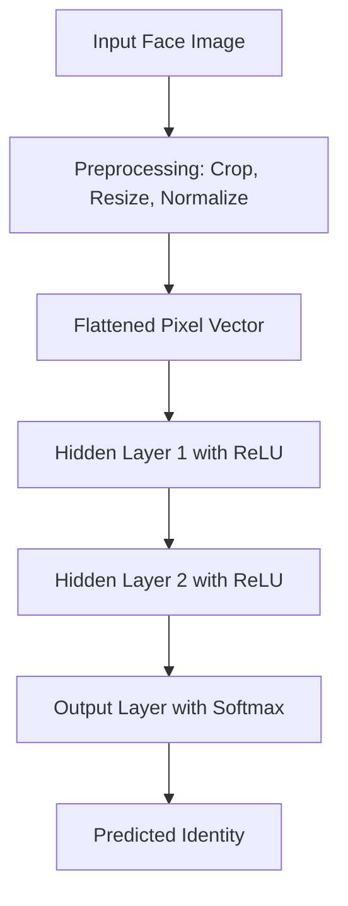

# 04 Illustrative Example: Face Recognition

---

## 1. Definition

**Face recognition using an Artificial Neural Network (ANN)** is a supervised learning task where a neural network learns to identify or verify a person’s identity by mapping facial image inputs to a set of known identities. The network acts as a function approximator that transforms raw pixel values into a class label representing a person.

---

## 2. Concept Explanation

Face recognition is a classic problem in computer vision that ANNs solve effectively. At its core, the task is classification: given a digital image of a face, the system must assign it to one of several known individuals.

An intuitive way to understand this process is to think of how humans recognize faces. We look at features like eye shape, nose position, and jawline, then match them against stored memories of known people. An ANN mimics this by learning a hierarchy of features, starting from simple edges in early layers to complex shapes like eyes and noses in deeper layers, and finally combining them to make a decision.

In a typical ANN-based face recognition system, the input image is first preprocessed (cropped, scaled, and converted to grayscale). Then each pixel intensity becomes an input node. The network processes this high-dimensional input through one or more hidden layers, extracting relevant patterns. The output layer uses a softmax activation to produce probabilities for each known identity. The person with the highest probability is the predicted identity.

Such systems are widely used in security, smartphone unlocking, photo tagging, and surveillance. They illustrate the power of neural networks to handle unstructured data like images.

---

## 3. Key Characteristics / Features

- **Learning from raw pixels:** The ANN learns directly from pixel intensity values, without requiring manually crafted features like distance between eyes. This reduces human effort and captures subtle patterns.
- **Hierarchical feature extraction:** Early hidden layers detect simple edges and textures; deeper layers combine them into complex shapes like facial parts. This layered abstraction is what makes deep networks powerful for visual tasks.
- **Non-linear decision boundaries:** With non-linear activation functions (e.g., ReLU, sigmoid), the network can model complex boundaries between different faces, handling variations in lighting, expression, and pose.
- **Scalability for multiple identities:** The output layer can be extended to recognize many people by simply increasing the number of neurons in the output layer, making it suitable for large-scale identification systems.
- **End-to-end learning:** The entire system is trained jointly using backpropagation, optimizing all weights to minimize classification error without intermediate manual steps.
- **Generalization capability:** Once trained on sufficient varied examples, the network can recognize faces under conditions not seen during training, such as slight angle changes or different facial expressions.

---

## 4. Types / Classification

While “face recognition” itself is a single problem, ANN approaches can be classified based on the learning paradigm and network architecture.

- **Verification vs. Identification:**
  - *Verification (one-to-one):* The network checks if a given face matches a claimed identity. It outputs a similarity score rather than a class label.
  - *Identification (one-to-many):* The network assigns the face to one of many enrolled identities. This is the typical multi-class classification setup.

- **Shallow ANN vs. Deep ANN:**
  - *Shallow ANN:* Uses a few hidden layers. It works for small datasets but struggles with high variability in images.
  - *Deep Convolutional Neural Network (CNN):* Uses convolutional layers that exploit spatial structure. This is the modern standard for face recognition due to its high accuracy.

- **Feature-based vs. holistic approaches:**
  - *Feature-based:* The network is given extracted landmarks (e.g., eye corners) as input. This is less common today.
  - *Holistic:* The entire face image is fed into the network, letting it discover relevant features automatically. This is the approach used in illustrative examples.

---

## 5. Working / Mechanism

The following steps describe how a simple ANN-based face recognition system works.

1. **Image Acquisition and Preprocessing:**
   A digital image containing a face is captured. The face region is detected and cropped using a face detection algorithm (e.g., Haar cascades). The cropped face is resized to a fixed dimension, say 64×64 pixels, and converted to grayscale to reduce complexity without losing essential structure.

2. **Input Representation:**
   The grayscale image is flattened into a 1D vector. For a 64×64 image, this yields 4096 pixel intensity values. Each value is normalized to a range of 0 to 1 (or -1 to 1) to help the network train stably. This normalized vector becomes the input layer of the ANN.

3. **Forward Propagation through Hidden Layers:**
   The input vector passes through one or more fully connected hidden layers. Each neuron computes a weighted sum of inputs, adds a bias, and applies a non-linear activation function (e.g., ReLU). As data flows forward, the network gradually transforms raw pixels into higher-level representations like edges, textures, and eventually facial features relevant for distinguishing identities.

4. **Output Layer and Prediction:**
   The final hidden layer connects to the output layer, which has one neuron per known identity. A softmax activation converts the raw scores into probabilities. The index of the neuron with the highest probability indicates the predicted identity.

5. **Loss Calculation:**
   The prediction is compared against the true label using a loss function, typically categorical cross-entropy. This loss quantifies how far the predicted probability distribution is from the one-hot encoded true label.

6. **Backpropagation and Weight Update:**
   The gradient of the loss with respect to each weight is computed using the chain rule. An optimizer (e.g., Stochastic Gradient Descent or Adam) updates the weights to reduce the loss. This process repeats for many epochs over a training dataset of face images.

7. **Inference:**
   After training, the network is deployed. A new face image undergoes the same preprocessing, and a single forward pass produces the predicted identity without further weight updates.

---

## 6. Diagram

This diagram shows the flow from raw image to predicted person. The hidden layers perform feature extraction and transformation; the softmax output gives a probability distribution over known faces.

---

## 7. Mathematical Formulation

For an input vector **x** (flattened face pixels), the output probabilities are computed as:

$$
P(y = k | \mathbf{x}) = \frac{e^{z_k}}{\sum_{j=1}^{K} e^{z_j}}
$$

where  

$$ z_k = \mathbf{w}_k^T \mathbf{h} + b_k $$

and **h** is the activation of the last hidden layer, computed recursively as  

$$ \mathbf{h} = \text{ReLU}(W \mathbf{x}_{\text{prev}} + \mathbf{b}) $$

**Variables:**

- **x**: Normalized pixel vector of the face image (size *n*).
- **W**, **b**: Weights and biases of a hidden layer.
- **w_k**, **b_k**: Weight vector and bias for class *k* in the output layer.
- **z_k**: Raw score (logit) for class *k*.
- **K**: Total number of identities.
- **P(y = k | x)**: Predicted probability that the input face belongs to person *k*.
- ReLU: Rectified Linear Unit activation, *max(0, value)*.

The network is trained by minimizing the **categorical cross-entropy loss**:

$$ \mathcal{L} = -\sum_{k=1}^{K} y_k \log(\hat{y}_k) $$

where *y_k* is 1 for the true class and 0 otherwise, and *ŷ_k* is the softmax probability.

---

## 8. Example

Consider a small office with 3 employees: Alice, Bob, and Carol. We build a face recognition system to mark attendance automatically.

- **Dataset:** 150 grayscale images per person, captured under different lighting and slight head orientations. Each image is resized to 50×50 pixels.
- **ANN Architecture:**
  - Input layer: 2500 neurons (flattened pixels).
  - Hidden layer 1: 128 neurons, ReLU.
  - Hidden layer 2: 64 neurons, ReLU.
  - Output layer: 3 neurons, softmax.
- **Training:** The network trains for 100 epochs on 70% of the images, with 30% held out for validation. Categorical cross-entropy is the loss; Adam optimizer is used.
- **Result:** After training, the network correctly classifies validation images with 97% accuracy. When a new photo of Bob is presented to the webcam, preprocessing extracts the face, and the network outputs probabilities like [0.02, 0.95, 0.03]. The system predicts Bob and logs his attendance.

This example illustrates how a simple fully connected network can solve a realistic, small-scale face recognition task.

---

## 9. Analogy

Think of the ANN as a **bouncer at an exclusive club** who memorizes the faces of all VIP members. When someone arrives, the bouncer looks at the person’s face, mentally breaks it down into key features (hairline, nose shape, eye spacing), and compares that mental sketch against the memorized VIP list. If the sketch closely matches a VIP, the person is let in; otherwise, access is denied.

The training phase is like the bouncer studying a photo album of VIPs repeatedly until the faces become second nature. The hidden layers are the bouncer’s internal thought process that extracts distinguishing features. The softmax output is the bouncer’s confidence level for each possible identity.

---

## 10. Comparison

Since face recognition can be done with and without neural networks, a comparison clarifies the role of ANNs.

| Feature                  | ANN-based Face Recognition                     | Traditional (e.g., Eigenfaces)          |
| ------------------------ | ---------------------------------------------- | --------------------------------------- |
| Feature extraction       | Learns features automatically from data        | Uses handcrafted or mathematical features (PCA) |
| Accuracy with variation  | High, handles lighting, pose, and expression well | Degrades with significant variation     |
| Training data required   | Large labeled dataset needed                   | Can work with smaller datasets          |
| Interpretability         | Weights are hard to interpret visually         | Eigenfaces can be visualized as face-like images |
| Computational cost       | High during training; moderate at inference    | Lower training cost but less flexible   |

---

## 11. Advantages

- **Automatic feature learning:** The network discovers which facial characteristics are important for discrimination, eliminating the need for manual feature engineering.
- **High accuracy:** Even simple ANNs can achieve impressive accuracy on constrained face datasets, and deep CNNs are state-of-the-art on large benchmarks.
- **Robustness to small variations:** When trained with augmentations (e.g., slight rotations, brightness changes), the network generalizes well to real-world conditions like glasses, mild expressions, or lighting shifts.
- **Fast inference:** After training, a forward pass takes only milliseconds, making it suitable for real-time applications on modern hardware.
- **Scalability:** The same architecture can be extended to recognize hundreds or thousands of identities by enlarging the output layer, provided enough training data per person.

---

## 12. Disadvantages / Limitations

- **Requires large labeled dataset:** Each person needs many example images under diverse conditions; collecting and labeling this data is expensive and time-consuming.
- **Computationally intensive training:** Training a fully connected network on high-resolution images is slow without GPU acceleration, and deep networks require significant resources.
- **Poor performance on unseen identities:** A standard classification network cannot recognize people it was never trained on. The model must be retrained or a separate feature embedding approach (e.g., Siamese networks) must be used.
- **Sensitive to extreme lighting and occlusion:** Severely shadowed faces or faces partially covered by masks, sunglasses, or hands can fool the network if such cases were missing during training.
- **Privacy concerns:** Storing face embeddings or images raises ethical and privacy issues, requiring careful handling and compliance with regulations.

---

## 13. Important Points / Exam Notes

- Face recognition with ANNs is a **multi-class classification problem** where inputs are normalized pixel vectors and outputs are softmax probabilities over identities.
- Preprocessing steps: **face detection → cropping → resizing → normalization** are essential to reduce variability.
- The **softmax function** converts raw output scores into a valid probability distribution.
- **Categorical cross-entropy** is the standard loss function for this multi-class setting.
- ANNs learn a hierarchy of features: lower layers detect edges, higher layers detect facial parts and overall face structure.
- **Overfitting** is a risk when training data per identity is limited; techniques like dropout and data augmentation help.
- A trained ANN can perform **verification** by thresholding the similarity between two face embeddings, often derived from the penultimate layer.
- The illustrative example demonstrates the complete pipeline: input → preprocessing → neural network → prediction, which is foundational for understanding modern deep learning-based face recognition.

---

## 14. Applications / Use Cases

- **Smartphone unlocking:** Apple Face ID and Android face unlock use similar neural network principles, though typically with a dedicated depth sensor and a more sophisticated embedding network.
- **Social media photo tagging:** Platforms like Facebook use face recognition to suggest tags for people in uploaded photos, relying on deep neural networks trained on billions of images.
- **Attendance systems:** Offices and educational institutions deploy face recognition to record employee or student attendance automatically, replacing manual registers.
- **Law enforcement and surveillance:** Security agencies use face recognition to identify suspects from CCTV footage, matching faces against criminal databases.
- **Access control:** Restricted areas in data centers or laboratories use face-based authentication to grant entry only to authorized personnel.
- **Retail personalization:** Stores use face recognition to identify returning customers and provide personalized offers or greetings.

---

## 15. MCQs

**Q1. What type of machine learning task is face recognition using an ANN?**
A. Regression  
B. Clustering  
C. Multi-class classification  
D. Reinforcement learning  
**Answer:** C  
**Explanation:** The network assigns each face image to one of several predefined identities, making it a multi-class classification problem.

**Q2. Why are face images normalized before feeding into the ANN?**
A. To reduce image size  
B. To bring pixel values to a consistent scale for stable training  
C. To make images colorful  
D. To remove background automatically  
**Answer:** B  
**Explanation:** Normalization scales pixel intensities (e.g., to [0,1]) so that weights update uniformly during backpropagation, improving convergence.

**Q3. Which activation function is typically used in the output layer for face recognition?**
A. ReLU  
B. Sigmoid  
C. Softmax  
D. Tanh  
**Answer:** C  
**Explanation:** Softmax converts raw scores into a probability distribution over multiple classes, which is needed for multi-class identity prediction.

**Q4. In an ANN for face recognition, what does each neuron in the output layer represent?**
A. A pixel from the input image  
B. A hidden facial feature  
C. A known person’s identity  
D. The loss value  
**Answer:** C  
**Explanation:** Each output neuron corresponds to one enrolled identity, and its activation indicates the probability that the input face belongs to that person.

**Q5. What is the role of hidden layers in a face recognition ANN?**
A. Store raw images  
B. Compute the loss function  
C. Extract hierarchical features from pixel inputs  
D. Directly output the person’s name  
**Answer:** C  
**Explanation:** Hidden layers apply non-linear transformations to learn increasingly abstract features, from edges to facial parts, enabling the network to distinguish faces.

**Q6. Which loss function is most appropriate for training a face recognition ANN with multiple identities?**
A. Mean squared error  
B. Hinge loss  
C. Categorical cross-entropy  
D. Binary cross-entropy  
**Answer:** C  
**Explanation:** Categorical cross-entropy measures the dissimilarity between the predicted probability distribution and the true one-hot encoded label, ideal for multi-class classification.

**Q7. What is a major limitation of a standard ANN-based face recognition system?**
A. It cannot process grayscale images  
B. It can only recognize people it was trained on  
C. It requires no training data  
D. It always achieves 100% accuracy  
**Answer:** B  
**Explanation:** The network learns to classify only the identities present in training. To recognize a new person, the model must be retrained or a different approach (e.g., embedding comparison) used.

**Q8. What preprocessing step is usually performed before feeding an image into a face recognition ANN?**
A. Encryption  
B. Face detection and cropping  
C. Adding noise  
D. Removing the background completely  
**Answer:** B  
**Explanation:** The face must be located and cropped from the original image so that the ANN receives a standardized face-only input, reducing irrelevant variation.

**Q9. In the analogy of a bouncer recognizing VIPs, what do the hidden layers represent?**
A. The list of VIP names  
B. The club’s music system  
C. The bouncer’s mental process of identifying facial features  
D. The club entrance door  
**Answer:** C  
**Explanation:** Like a bouncer mentally deconstructing a face into memorable features, hidden layers extract and compose features from raw pixel input to recognize identity.

**Q10. How does data augmentation help in training a face recognition ANN?**
A. By reducing the number of identities  
B. By generating varied training samples (e.g., rotated, brightened) to improve generalization  
C. By encrypting the training data  
D. By removing the need for a validation set  
**Answer:** B  
**Explanation:** Augmentation artificially expands the dataset with realistic variations, making the model robust to changes in pose, lighting, and expression, which reduces overfitting.