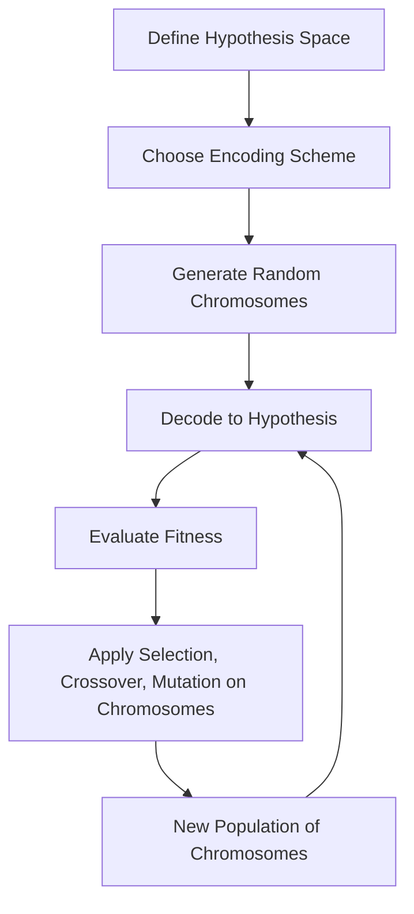

# 01 Representing Hypotheses

## 1. Definition

In genetic algorithms, representing hypotheses means encoding a candidate solution to a problem into a well‑defined data structure – typically a fixed‑length or variable‑length string of symbols – so that the genetic operators (selection, crossover, mutation) can manipulate it. The encoded form is called a chromosome (or individual), and each symbol in the string is a gene. The mapping from the chromosome to an actual hypothesis in the problem domain is the representation scheme.

## 2. Concept Explanation

A genetic algorithm maintains a population of individuals, each representing a possible hypothesis (e.g., a set of rules, neural network weights, a decision tree structure). To apply evolution, we must first convert the hypothesis into a form that the computer can store and modify easily. The choice of representation is crucial because it directly determines the search space, the effectiveness of genetic operators, and the ease of fitness evaluation.

For example, if we are trying to learn a Boolean function (a hypothesis in logic form), we might represent each conjunction of literals as a binary string where each bit indicates whether a particular attribute is included and, if so, whether it is negated. If we are evolving the weights of a neural network, we may serialise all the weights and biases into a real‑valued vector. The genetic algorithm treats each encoded hypothesis as a black‑box candidate; it does not understand the meaning of the bits or numbers. Only the fitness function decodes the chromosome to measure how good the hypothesis is.

Why is representation important? A poor representation can make the search space huge, introduce many invalid individuals, or destroy meaningful building blocks during crossover. A good representation respects the principle of meaningful building blocks: short, low‑order schemata that confer high fitness should be preserved and combined. Thus, hypothesis representation is the creative step that connects the problem to the genetic search.

## 3. Key Characteristics / Features

- **Genotype–phenotype mapping:** The chromosome (genotype) is the artificial genetic material. Decoding it produces the actual hypothesis (phenotype). The mapping can be direct (e.g., weights = gene values) or indirect (e.g., genes specify production rules that generate the hypothesis).
- **Encoded as a string or structure:** Most commonly, chromosomes are binary strings, integer strings, real‑valued vectors, or tree structures (as in genetic programming). The choice depends on the hypothesis complexity.
- **Fixed vs. variable length:** Some problems require a fixed number of parameters (fixed length). Others, like learning rule sets, may benefit from variable‑length chromosomes that can grow or shrink.
- **Locality and epistasis:** A good representation has high locality (small changes in genotype cause small changes in phenotype) to allow a smooth fitness landscape. Epistasis (gene interactions) cannot always be avoided but should be managed.
- **Validity constraints:** The representation should either avoid encoding invalid hypotheses or include repair mechanisms or penalty functions to handle invalid individuals.
- **Domain‑specific semantics:** The meaning of each gene is defined by the representation designer. The genetic operators work blindly on the symbols, so the encoding must be meaningful enough that swapping or mutating genes makes sense.

## 4. Types / Classification

Representation schemes in genetic algorithms are classified based on the nature of the chromosome.

- **Binary representation:** The classic GA representation. Each hypothesis is a string of 0s and 1s. Commonly used for feature selection (1 = feature included), rule learning (bits encode condition presence), and combinatorial problems.
- **Integer representation:** Chromosomes consist of integer numbers. Useful for permutation problems (travelling salesman), or when hypotheses are represented by indices (cluster centres, selected attributes).
- **Real‑valued (floating‑point) representation:** Each gene is a real number. This is the natural choice for evolving continuous parameters, such as weights of a neural network or coefficients of a polynomial hypothesis.
- **Tree‑based representation (Genetic Programming):** Hypotheses are represented as parse trees. Applied when the hypothesis is a program, expression, or decision tree, allowing variable‑length and hierarchical structure.
- **Hybrid and symbolic representations:** Combinations of the above, e.g., binary flags plus real parameters, or rule strings with symbolic attributes (color = red, green, blue). More expressive but require custom genetic operators.

## 5. Working / Mechanism

The process of using a representation within a genetic algorithm follows these generic steps, with the representation playing a central role.

1.  **Choose the representation scheme:** Decide the chromosome type, length, and the mapping from genes to hypothesis components.
2.  **Initialise the population:** Generate a set of random chromosomes according to the chosen representation, ensuring they correspond to valid (or at least potentially valid) hypotheses.
3.  **Decode each chromosome:** For every individual, apply the genotype–phenotype mapping to obtain the explicit hypothesis (e.g., a decision tree, a set of weights, a rule list).
4.  **Evaluate fitness:** Run the hypothesis on the training data (or a simulation) using a predefined fitness function (e.g., classification accuracy, mean squared error). Assign a fitness score to each individual.
5.  **Apply genetic operators:** Use the genetic algorithm’s selection, crossover, and mutation operators. These operators work directly on the chromosome structure (e.g., swapping binary substrings, mutating a real value by adding Gaussian noise). The representation determines how crossover points and mutation steps are defined.
6.  **Create new generation:** Replace the old population with offspring, maintaining the same representation format.
7.  **Repeat steps 3–6:** Continue until a stopping criterion is met. The best chromosome encountered yields the final hypothesis after decoding.

## 6. Diagram

## 7. Mathematical Formulation

A hypothesis \( h \) is represented by a chromosome \( c \). The representation can be formalised as an encoding function \( \Phi \) and a decoding function \( \Phi^{-1} \):

$$
c = \Phi(h), \quad h = \Phi^{-1}(c)
$$

In many cases, the hypothesis is a vector of parameters \( \theta \). A real‑valued representation directly assigns:

$$
c = [\theta_1, \theta_2, \dots, \theta_n] \quad \text{(each gene is a real number)}
$$

For binary representations, a parameter range \([L,U]\) is discretised into \(2^k\) intervals, and a gene of \(k\) bits maps to:

$$
\theta_i = L + \frac{(U-L)}{2^k - 1} \times \text{(binary value of the k-bit string)}
$$

The fitness function \( F \) evaluates the hypothesis after decoding:

$$
\text{Fitness} = F(\Phi^{-1}(c))
$$

These formulas capture that the GA searches in the code space while fitness is measured in the hypothesis space.

## 8. Example

**Problem:** Learn a simple Boolean concept: “a customer buys {laptop, not tablet} if age ≤ 30 and income is high”. We want a genetic algorithm to discover a rule set.

**Representation:** Use a fixed‑length binary string of 6 bits representing three conditions: age, product, income. For each condition, 2 bits encode the value (00 = not used, 01 = true, 10 = false, 11 = undefined/ignore). For example:

- Age: 01 means “age ≤ 30” (true).
- Product: 10 means “not tablet” (false).
- Income: 01 means “high income = yes”.

Chromosome: `01 10 01`. Decoding gives the hypothesis: IF (age ≤ 30) AND (product ≠ tablet) AND (high income) THEN buy.

The genetic algorithm evolves a population of such chromosomes by crossover and mutation, using classification accuracy as fitness. Over generations, it discovers the rule.

## 9. Analogy

Think of a recipe as a hypothesis for a delicious dish. The recipe can be written in a shorthand code: a list of symbolic ingredients and instructions. This coded recipe is the chromosome (the representation). A chef (the GA) reads the code, interprets it to cook the dish, and the taste (fitness) determines if the recipe survives. Different writing styles (representations) – e.g., a structured table vs. a paragraph – affect how easy it is to mix two recipes (crossover) or change an ingredient (mutation).

## 10. Comparison

| Feature | Binary Representation (GA for rule learning) | Tree‑based Representation (Genetic Programming) |
|--------|-----------------------------------------------|-------------------------------------------------|
| Meaning | Hypothesis is encoded as a fixed string of bits. Each bit or substring corresponds to a specific attribute or condition. | Hypothesis is a variable‑sized tree where nodes are functions or terminals. The tree directly represents the hypothesis (e.g., arithmetic expression, program). |
| Use Case | Evolving classifiers, feature selection, knapsack problems. | Evolving symbolic regression models, decision trees, controller programs. |
| Flexibility | Fixed structure; requires a priori decision about which attributes and value ranges exist. | Can evolve both structure and parameters; can grow to accommodate complexity. |
| Crossover | Simple uniform or two‑point crossover on bit strings. | Swapping subtrees between two parent trees. |

## 11. Advantages

- **Standardised operators:** A well‑designed representation allows the use of generic selection, crossover, and mutation operators without domain‑specific modifications.
- **Search space reduction:** A compact, meaningful representation excludes invalid or nonsensical hypotheses, focusing the search on promising areas.
- **Facilitates building‑block theory:** Representations that align gene position with functional components enable genetic algorithms to combine low‑order, high‑fitness schemata effectively.
- **Separation of concerns:** Encoding decouples the search algorithm from the problem evaluation. The same GA core can be reused for different hypothesis spaces just by changing the decode function.
- **Exploration–exploitation balance:** Real‑valued representations allow fine‑grained local search via small mutations, while binary representations preserve high diversity.

## 12. Disadvantages / Limitations

- **Design effort and insight required:** The choice of representation is heuristic. A poor choice (e.g., Hamming cliffs, high epistasis) can mislead the search.
- **Blind genetic operators:** Crossover and mutation work syntactically. They may create semantically invalid or lethal offspring that must be repaired or discarded.
- **Scalability issues:** Fixed‑length binary representations struggle when the optimal hypothesis size is unknown. Variable‑length representations may suffer from bloat (excessive growth without fitness improvement).
- **Premature convergence:** If the representation leads to a highly rugged fitness landscape with many local optima, the GA may get stuck.
- **Interpretability loss:** The final best chromosome may be a dense bit string or long vector that is hard to interpret directly, requiring decoding and sometimes simplification.

## 13. Important Points / Exam Notes

- The **chromosome** is the encoded hypothesis; a **gene** is a single element.
- The **genotype–phenotype mapping** (\( \Phi^{-1} \)) transforms the chromosome into the actual hypothesis.
- The representation must support **meaningful crossover and mutation** so that offspring inherit useful building blocks.
- For **continuous parameter optimisation**, real‑valued vectors are preferred; for **combinatorial problems**, binary or integer strings are typical.
- **Epistasis** refers to gene dependence; high epistasis makes the problem difficult for simple GAs.
- **Schema theory** analyses why certain representations work: a schema is a template that describes a subset of similar chromosomes.
- In **genetic programming**, the hypothesis is a computer program; the representation is a syntax tree.
- The **fitness function** always operates on the decoded hypothesis, not directly on the chromosome.
- **Hybrid representations** (mix of binary and real values) are common in complex ML tasks, e.g., evolving neural network architectures and weights simultaneously.
- A good representation obeys the **principle of meaningful building blocks**: related bits should be close together to survive crossover.

## 14. Applications / Use Cases

- **Feature selection for classification:** A binary chromosome where each bit indicates whether a feature is included. The GA searches for the subset that maximises accuracy while minimising size.
- **Hyperparameter optimisation:** Represent the hyperparameters (learning rate, number of hidden units) as a real‑valued vector. Evolve populations to find the best configuration for a neural network.
- **Rule‑based system learning:** Encode a set of IF‑THEN rules as a variable‑length string, with each gene representing a rule component. Used to create interpretable classifiers for credit scoring or medical diagnosis.
- **Evolving neural network weights (neuroevolution):** A real‑valued chromosome directly encodes all weights. Evolution strategies or GAs train the network without gradient descent, useful for reinforcement learning.
- **Job scheduling:** An integer permutation representation encodes the sequence of jobs on a machine. The GA finds schedules that minimise completion time.

## 15. MCQs

**Q1. In a genetic algorithm, the term “chromosome” refers to**

A. The decoded hypothesis that solves the problem  
B. The encoded representation of a candidate solution  
C. The fitness value of an individual  
D. The mutation operator  

**Answer:** B  
**Explanation:** The chromosome is the encoded string (genotype) that the GA manipulates.

---

**Q2. The genotype–phenotype mapping in a GA serves to**

A. Evaluate the fitness of the raw chromosome  
B. Convert the chromosome into the actual hypothesis for fitness evaluation  
C. Generate the initial population randomly  
D. Select parents based on rank  

**Answer:** B  
**Explanation:** Decoding the chromosome yields the hypothesis (phenotype) on which the fitness function is applied.

---

**Q3. Which representation is most appropriate for evolving continuous parameters such as the learning rate of an ML model?**

A. Binary string of length 64  
B. Real‑valued (floating‑point) vector  
C. Tree structure  
D. Integer permutation  

**Answer:** B  
**Explanation:** Real‑valued chromosomes directly encode continuous parameters, allowing smooth changes through arithmetic crossover or Gaussian mutation.

---

**Q4. What is a major disadvantage of a poorly chosen binary representation for numeric parameters?**

A. It makes mutation impossible  
B. It may introduce Hamming cliffs where consecutive integer values differ in many bits  
C. It requires more computation for fitness evaluation  
D. It always leads to smaller search spaces  

**Answer:** B  
**Explanation:** In standard binary coding, adjacent numbers can have high Hamming distance, causing a rugged fitness landscape known as the Hamming cliff effect.

---

**Q5. In genetic programming, how are hypotheses represented?**

A. As real‑valued vectors  
B. As parse trees combining functions and terminals  
C. As fixed‑length binary strings  
D. As matrices of weights  

**Answer:** B  
**Explanation:** Genetic programming represents programs/hypotheses as variable‑sized trees, allowing evolution of both structure and parameters.

---

**Q6. The fitness function of a genetic algorithm directly evaluates**

A. The chromosome string without decoding  
B. The phenotype obtained after decoding the chromosome  
C. Only the best individual of the previous generation  
D. The crossover probability  

**Answer:** B  
**Explanation:** Fitness is measured on the actual hypothesis; thus it operates after the genotype is mapped to the phenotype.

---

**Q7. If a binary chromosome of length 8 represents the presence (1) or absence (0) of 8 features, what would the chromosome `10100110` mean?**

A. Features 1,3,6,7 are selected  
B. Features 1,3,6,7 are discarded  
C. All features are selected  
D. Only feature 4 is selected  

**Answer:** A  
**Explanation:** Positions with a 1 indicate the corresponding feature is included in the hypothesis (assuming 1‑based indexing: bits 1,3,6,7 are 1).

---

**Q8. Which of the following is NOT a characteristic of a good hypothesis representation in genetic algorithms?**

A. High locality (small genotype change → small phenotype change)  
B. Guarantee that all chromosomes represent optimal solutions  
C. Meaningful building blocks that can survive crossover  
D. Avoidance of producing many invalid individuals  

**Answer:** B  
**Explanation:** No representation can guarantee all chromosomes are optimal; the GA must search for good ones.

---

**Q9. Hybrid representations in GAs often combine**

A. Only binary genes with different lengths  
B. Different encoding types (e.g., binary flags for structure, real‑valued genes for parameters) in one chromosome  
C. Tree structures with neural networks  
D. Selection and mutation into a single operator  

**Answer:** B  
**Explanation:** Hybrid representations mix multiple gene types to handle hypothesis components that have different natures (e.g., discrete architecture choices and continuous weights).

---

**Q10. A researcher wants to evolve a decision tree for classification using a GA. What is the most natural chromosome representation?**

A. A fixed‑length binary string  
B. A real‑valued vector of length equal to the number of leaves  
C. A variable‑length tree‑based representation  
D. An integer permutation of training examples  

**Answer:** C  
**Explanation:** Decision trees have recursive, variable‑size structure; a tree‑based representation (as in genetic programming) can directly encode and evolve them.