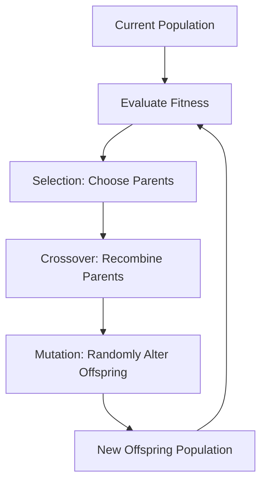

# Genetic Operators

## Video Explanation

* [https://www.youtube.com/watch?v=Y8Z0SgXl3oM](https://www.youtube.com/watch?v=Y8Z0SgXl3oM)

## Visual Aids

## 1. Definition
Genetic operators are the biological-inspired operations in a Genetic Algorithm (GA) that generate new candidate solutions from the existing population. They simulate natural processes to drive the evolution towards better fitness. The three fundamental operators are **selection**, **crossover (recombination)**, and **mutation**. Together, they balance exploration of the search space and exploitation of promising areas.

## 2. Concept Explanation
A Genetic Algorithm maintains a population of individuals, each representing a possible solution to a problem. To improve over generations, we need a way to produce new individuals that inherit good traits from previous ones while occasionally introducing fresh variations. Genetic operators achieve this.

Selection picks individuals that are “fitter” to become the parents of the next generation, just as nature favours the survival and reproduction of the strongest. Crossover combines the genetic material (chromosomes) of two parents to create offspring, mixing characteristics. Mutation randomly alters small parts of a chromosome to maintain diversity and prevent premature convergence. Without selection, the algorithm has no direction; without crossover, good building blocks cannot recombine; without mutation, the algorithm may get stuck in local optima.

Why it is important: Genetic operators are the core computational mechanisms of a GA. Their design and probabilities (crossover rate, mutation rate) directly determine the search behaviour, convergence speed, and quality of final solutions for optimization, machine learning, and design tasks.

## 3. Key Characteristics / Features
- **Selection is fitness‑driven:** It favours individuals with higher fitness scores, making the next generation stronger on average.
- **Crossover is combinatorial:** It exchanges parts of two parent chromosomes, creating offspring that inherit a mix of both, enabling the accumulation of good traits.
- **Mutation is a random perturbation:** It flips or changes small parts of a chromosome with a low probability, maintaining population diversity and allowing escape from local optima.
- **Stochastic nature:** All operators involve randomness; they balance deterministic fitness pressure with probabilistic exploration.
- **Operator‑specific hyperparameters:** Crossover rate ($p_c$) and mutation rate ($p_m$) are critical parameters that must be tuned for each problem.

## 4. Types / Classification
Genetic operators are typically grouped into three main categories.

- **Selection operators:** Choose which individuals become parents for the next generation. Common methods include:
    - *Roulette Wheel (Fitness Proportional) Selection*: Probability of selection is proportional to an individual’s fitness.
    - *Tournament Selection*: Randomly pick $k$ individuals and select the fittest among them.
    - *Rank Selection*: Individuals are sorted by fitness; selection probability depends on rank, not absolute fitness.
    - *Elitism*: Directly copy the best individuals to the next generation, guaranteeing fitness never decreases.
- **Crossover (Recombination) operators:** Combine two parent chromosomes to produce offspring. Examples:
    - *Single‑point Crossover*: Choose one random cut point, exchange the tails of both parents.
    - *Two‑point / Multi‑point Crossover*: Use multiple cut points.
    - *Uniform Crossover*: Each gene is independently swapped with a certain probability (often 0.5).
    - *Arithmetic Crossover*: For real‑valued genomes, offspring are weighted averages of parent genes.
- **Mutation operators:** Introduce small random changes to maintain diversity. Examples:
    - *Bit‑Flip Mutation*: For binary strings, flip a bit (0↔1) with a low probability.
    - *Swap Mutation*: Exchange two randomly chosen positions in a permutation.
    - *Gaussian Mutation*: For real‑valued genes, add a small Gaussian‑distributed noise.

## 5. Working / Mechanism
A generation of a GA uses these operators in sequence:

1. **Selection:** The current population is evaluated (fitness). Parents are selected using a selection operator (e.g., tournament: randomly pick 3 individuals, the one with highest fitness becomes a parent). This process is repeated until enough parents are chosen to create the next generation.
2. **Crossover:** For each pair of parents, with probability $p_c$ (crossover rate), a crossover operator is applied to generate one or two offspring. If crossover is not applied, the parents are copied unchanged. For single‑point crossover, a random index $i$ is chosen; genes before $i$ come from parent1, genes after $i$ from parent2.
3. **Mutation:** Each gene of each offspring is considered independently. With a small probability $p_m$ (mutation rate), the gene is randomly changed (e.g., bit flip). Mutation ensures that the algorithm can explore new regions of the search space.
4. **Replacement:** The newly formed offspring population becomes the population for the next generation. (Often, elitism keeps a few of the best individuals unchanged.)
5. Steps 1‑4 repeat for many generations until a termination condition (e.g., maximum generations, satisfactory fitness) is met.

## 6. Diagram

## 7. Mathematical Formulation
### Single‑point Crossover
Given two binary strings of length $L$, $P_1 = [g_1^1, g_2^1, \dots, g_L^1]$ and $P_2 = [g_1^2, \dots, g_L^2]$, choose a random cut point $k \in \{1, L-1\}$.
Offspring:
$$
O_1 = [g_1^1, \dots, g_k^1, g_{k+1}^2, \dots, g_L^2]
$$
$$
O_2 = [g_1^2, \dots, g_k^2, g_{k+1}^1, \dots, g_L^1]
$$

### Bit‑Flip Mutation
For each gene $g_i$ (0 or 1) of an offspring, with probability $p_m$:
$$
g_i' = 1 - g_i
$$
Otherwise, $g_i' = g_i$.

### Tournament Selection
The probability that individual $i$ wins a tournament of size $k$ (randomly selected without replacement) is proportional to a combination of fitness and rank. No simple closed form, but the mechanism ensures higher‑fitness individuals have a higher chance.

## 8. Example
Suppose we solve the One‑Max problem: maximize the number of 1s in a binary string of length 10. Current population fitness scores guide selection. Two parents chosen via tournament: Parent A = 1100100011 (fitness 6), Parent B = 0110111100 (fitness 6). Single‑point crossover with cut point at position 5 yields:
- Offspring 1: 11001 — 00011? Actually, first 5 bits from A, rest from B: 11001 (A) + 11100 (bits 6-10 of B) = 1100111100 (fitness 7).
- Offspring 2: 01101 (B) + 00011 (bits 6-10 of A) = 0110100011 (fitness 5).
Mutation then flips a random bit, say position 2 of Offspring 1 changes 1→0, fitness might drop to 6. The fitter Offspring 1 survives into the next generation, improving average fitness.

## 9. Analogy
Imagine baking a cake recipe optimization contest. Selection is like choosing the two best‑tasting cakes from the table. Crossover is taking half of the recipe from one cake’s flour/sugar/ingredients and mixing with the other half of the other recipe to create two new recipe combinations. Mutation is randomly tweaking one ingredient amount (e.g., a pinch more salt) to see if it improves taste. Over many rounds, the recipes become better through this inheritance and variation.

## 10. Comparison (Selection Methods)
| Feature              | Roulette Wheel Selection                   | Tournament Selection                   |
| -------------------- | ------------------------------------------ | -------------------------------------- |
| Pressure             | Highly sensitive to fitness distribution; a super‑fit individual can dominate quickly. | Adjustable via tournament size $k$; larger $k$ increases pressure. |
| Selection probability | Proportional to fitness; can bias if fitness values vary hugely.             | Based on relative rank among randomly picked competitors, robust to fitness scaling. |
| Ease of use          | Simple, but requires sum of fitnesses.     | Very simple, no global fitness sum needed. |
| Typical scenario     | Early GA applications.                     | Most modern GAs due to controllability. |

## 11. Advantages
- **Directional search:** Selection and crossover guide the population toward high‑fitness regions, exploiting good solutions.
- **Global exploration:** Mutation injects randomness, preventing the algorithm from getting stuck in local optima.
- **Flexible representation:** Genetic operators can be adapted to binary, integer, permutation, and real‑valued chromosomes, making GAs widely applicable.
- **Parallelism:** Operators implicitly evaluate many regions of the search space simultaneously through the population.
- **No gradient needed:** Works on black‑box objective functions, even discontinuous or noisy ones.

## 12. Disadvantages / Limitations
- **Parameter sensitivity:** Performance heavily depends on crossover and mutation rates; poor tuning may lead to premature convergence or random drift.
- **Computationally expensive:** Evaluating fitness for many generations can be slow, especially for complex simulations.
- **No guarantee of optimality:** GAs can converge to a near‑optimal solution without knowing if it is the true global optimum.
- **Design difficulty:** Encoding a solution and designing effective crossover/mutation operators for a given problem requires domain insight.
- **Premature convergence:** High selection pressure with low diversity can cause the population to become uniform too early, settling on a local optimum.

## 13. Important Points / Exam Notes
- The three core genetic operators are **selection**, **crossover**, and **mutation**.
- **Crossover rate ($p_c$)** controls how often recombination occurs; typical values 0.6–0.9.
- **Mutation rate ($p_m$)** is usually very low, e.g., 0.001–0.01, to preserve good solutions while maintaining diversity.
- **Elitism** preserves the best individual(s) from previous generation, ensuring fitness does not decrease.
- **Single‑point, two‑point, uniform, and arithmetic** are common crossover forms.
- **Tournament selection** avoids premature dominance by a single super‑fit individual.
- GA operators work on **genotype** (encoded chromosome) not directly on phenotype.

## 14. Applications / Use Cases
- **Feature Selection:** GA selects optimal feature subsets for ML models using binary‑encoded chromosomes; crossover and mutation alter feature masks.
- **Neural Architecture Search:** Genetic operators create new network architectures (crossover combines layers, mutation adds/removes layers or changes hyperparameters).
- **Scheduling and Routing:** Permutation‑based GAs solve Traveling Salesman Problem using order‑based crossover (PMX) and swap mutation.
- **Game Playing:** Evolution of strategies for board games; crossover mixes strategy components.
- **Engineering Design:** Optimizing aerodynamic shapes; real‑valued GA with arithmetic crossover and Gaussian mutation refines parameters.

## 15. MCQs

**Q1. Which of the following is NOT one of the three primary genetic operators in a standard GA?**
A. Selection
B. Crossover
C. Mutation
D. Gradient descent
**Answer:** D  
**Explanation:** GA uses selection, crossover, and mutation, not gradient‑based methods.

**Q2. The main purpose of the mutation operator is to:**
A. Increase convergence speed
B. Combine good traits from two parents
C. Maintain population diversity and prevent local optima
D. Eliminate low‑fitness individuals
**Answer:** C  
**Explanation:** Mutation randomly alters genes, introducing new genetic material that helps explore the search space and avoid stagnation.

**Q3. In single‑point crossover with cut point at index 5, Parent1 = 10101010, Parent2 = 11001100. What is the first offspring (bits 1‑5 from Parent1, rest from Parent2)?**
A. 10101—10011
B. 10101—1100
C. 11001—1010
D. 10101—0100
**Answer:** B  
**Explanation:** Bits 1‑5 of Parent1: 10101; bits 6‑8 of Parent2: 100 (assuming 8‑bit strings, indices 6,7,8 are 1,0,0, so "100"). Offspring = 10101 + 100 = 10101100. However Parent2 is 11001100, bits 6‑8 are 0,1,1? Wait: Parent2 = 11001100 (indices 1‑8: 1,1,0,0,1,1,0,0). So bits 1‑5: 11001; bits 6‑8: 100. Offspring1 with bits 1‑5 from P1 (10101) and bits 6‑8 from P2 (100) = 10101100. That matches B: 10101—1100 (the option says B "10101—1100" which is 10101100). So B is correct.

**Q4. Tournament selection with a larger tournament size ($k$) will:**
A. Decrease selection pressure
B. Increase selection pressure
C. Have no effect on selection
D. Increase mutation rate
**Answer:** B  
**Explanation:** Larger $k$ means more competitors; the fittest among a larger random set is more likely to be very fit, increasing pressure.

**Q5. Elitism in a genetic algorithm refers to:**
A. Mutating elites more
B. Copying the best individuals directly to the next generation without change
C. Selecting only high‑rank individuals
D. Removing the worst individuals at each generation
**Answer:** B  
**Explanation:** Elitism ensures that the best‑known solutions survive unchanged, preventing the GA from losing the best fitness.

**Q6. A typical mutation rate ($p_m$) for bit‑flip mutation is:**
A. 0.5
B. 0.0
C. 0.001 – 0.01
D. 0.9
**Answer:** C  
**Explanation:** The mutation rate is kept low so that the search does not become random; a small percentage of bits are flipped each generation.

**Q7. Which crossover operator is most suitable for real‑valued (continuous) chromosomes?**
A. Single‑point binary crossover
B. Uniform crossover
C. Arithmetic crossover
D. Swap crossover
**Answer:** C  
**Explanation:** Arithmetic crossover creates an average (or weighted combination) of parent values, appropriate for real numbers.

**Q8. What could happen if mutation rate is set to 1.0?**
A. The algorithm converges faster.
B. The GA becomes essentially random search with no exploitation of good solutions.
C. Crossover no longer works.
D. The population size must increase.
**Answer:** B  
**Explanation:** A mutation rate of 1.0 means every gene is flipped every generation, destroying learned good building blocks and reducing GA to random guessing.

**Q9. The main role of crossover is to:**
A. Randomly explore new regions
B. Recombine existing building blocks from two parents to potentially create a better individual
C. Remove weak individuals
D. Adjust the learning rate
**Answer:** B  
**Explanation:** Crossover is exploitation; it mixes parts of good solutions with the hope of combining their strengths.

**Q10. In a GA, a population has converged to a uniform set of individuals but with suboptimal fitness. This is likely due to:**
A. Too little selection pressure
B. Too high mutation rate
C. Too much elitism without enough mutation (premature convergence)
D. Perfect exploration
**Answer:** C  
**Explanation:** Lack of genetic diversity (all individuals identical) results from high selection pressure and low mutation, trapping the population at a local optimum.