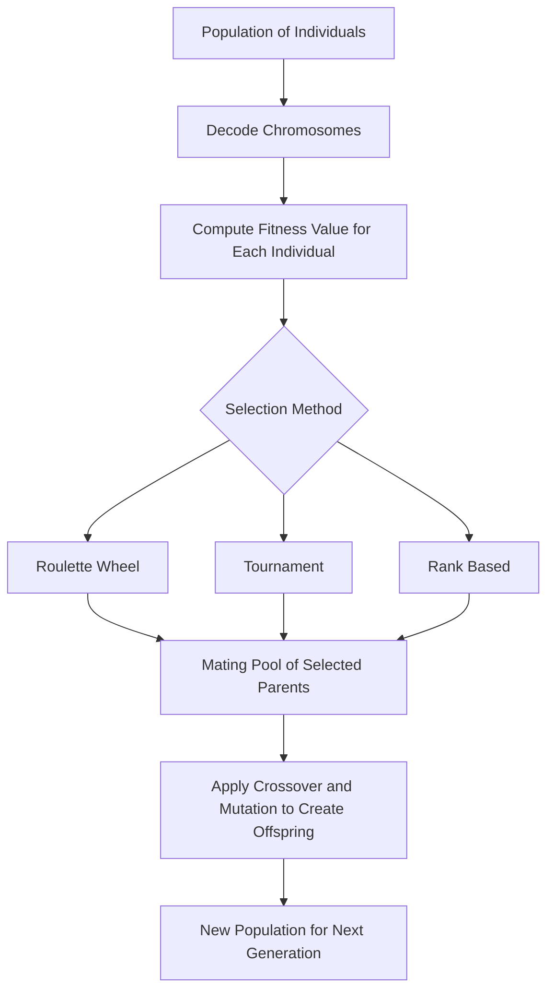

# Fitness Function and Selection

## Video Explanation

* [https://www.youtube.com/watch?v=nhT56blfRpE&t=300s](https://www.youtube.com/watch?v=nhT56blfRpE&t=300s)

## Visual Aids

## 1. Definition

A fitness function is a specific objective function used in genetic algorithms to evaluate and assign a scalar score (fitness value) to each candidate solution in the population, indicating how close that solution is to the desired optimal outcome. Selection is the process of choosing which individuals from the current population will be allowed to reproduce and pass their genetic material to the next generation, with fitter individuals receiving more opportunities to be selected.

---

## 2. Concept Explanation

**Basic idea:** In nature, organisms that are better adapted to their environment survive longer and have more offspring. Genetic algorithms copy this idea. A fitness function acts as the “environment” that measures how well each candidate (individual) solves the problem. Selection then picks the most promising candidates to become parents, ensuring that good traits propagate through generations.

**Why it is used:** Without a fitness function, the algorithm cannot distinguish between good and bad solutions; it would have no direction for improvement. Without a selection mechanism, the algorithm would randomly mate individuals and lose any progress achieved. Together, fitness and selection guide the search towards optimal or near‑optimal solutions, mimicking natural evolution.

**Where it is applied:** In machine learning, genetic algorithms are used for hyperparameter tuning, feature selection, and training certain neural network architectures. In engineering, they optimize resource allocation, scheduling, and design. In finance, they optimize portfolios and trading strategies. Every evolutionary algorithm depends centrally on a meaningful fitness function and a robust selection strategy.

---

## 3. Key Characteristics / Features

* **Quantifies quality:** The fitness function converts a candidate solution’s genotype or decoded phenotype into a single numeric score. A higher score (in maximization problems) indicates a better solution.
* **Defines the direction of search:** By rewarding traits that improve fitness, the algorithm is steered toward regions of the search space containing better solutions. The fitness landscape shape heavily influences convergence speed and the risk of getting stuck.
* **Problem‑dependent design:** The same genetic algorithm skeleton can solve vastly different problems only by changing the fitness function. Therefore, the function must accurately capture all constraints and objectives of the real‑world problem.
* **Maintains diversity:** The selection mechanism must balance exploitation (picking highly fit individuals) with exploration (allowing less fit but novel individuals a chance). This balance prevents the population from converging too early to a local optimum.
* **Stochastic selection:** Selection is often probabilistic, not deterministic. Fitter individuals have a higher probability of being chosen, but weaker ones still have a small chance, preserving genetic variety.
* **Computational simplicity:** A fitness function must be evaluated for many individuals over many generations. Complex or slow fitness calculations drastically increase overall runtime.

---

## 4. Types / Classification

Selection methods are the core variant of this topic. They can be classified as follows:

* **Fitness‑Proportionate Selection (Roulette Wheel):** Each individual’s probability of being chosen is proportional to its fitness relative to the total population fitness. This is simple but suffers from scaling issues: a super‑fit individual can quickly dominate, and when all fitness values are close, selection pressure becomes weak.
* **Rank Selection:** All individuals are sorted by fitness, and selection probability depends on rank rather than absolute fitness value. This prevents a very fit individual from monopolising the mating pool and works well even when fitness differences are small.
* **Tournament Selection:** A subset of \(k\) individuals is randomly chosen from the population, and the fittest among them is selected. The process repeats for each parent needed. Tournament size \(k\) controls selection pressure: larger \(k\) increases pressure for fitter individuals.
* **Stochastic Universal Sampling (SUS):** An improved roulette method that places several equally spaced pointers on the wheel, guaranteeing that the number of times an individual is selected is at least the floor of its expected count. It reduces sampling noise.
* **Elitism:** A complementary mechanism, not a full selection method, wherein a few of the fittest individuals are directly copied to the next generation unchanged. This ensures that the best solution found so far is never lost.

---

## 5. Working / Mechanism

A typical genetic algorithm performs fitness evaluation and selection in the following order within a single generation:

1. **Decode chromosomes:** Each individual’s chromosome (binary string, real‑valued vector, etc.) is decoded into a candidate solution representation meaningful to the problem.
2. **Evaluate fitness:** The fitness function computes a numerical score for each individual based on the decoded solution. For maximization tasks, higher is better; for minimization, fitness may be transformed (e.g., reciprocal) so that better solutions get higher fitness.
3. **Check termination:** If the best fitness satisfies the desired threshold or the maximum number of generations is reached, the algorithm stops and returns the best solution.
4. **Construct mating pool:** Apply one of the selection methods. For example, in roulette wheel selection, each individual gets a sector of a virtual wheel proportional to its fitness. The algorithm spins the wheel \(N\) times (population size) to pick parents. In tournament selection, repeatedly pick \(k\) random individuals and return the winner.
5. **Pair parents and reproduce:** The selected parents undergo crossover and mutation to produce offspring, forming the new population for the next generation.
6. **Apply elitism (if configured):** A small number of the absolute best individuals from the current generation are preserved unchanged in the next generation, guaranteeing that the maximum fitness never decreases.

---

## 6. Diagram

---

## 7. Mathematical Formulation

**Fitness Proportionate Selection:** For a population of \(N\) individuals with fitness values \(f_1, f_2, \dots, f_N\), the probability \(p_i\) of selecting individual \(i\) is:

$$
p_i = \frac{f_i}{\sum_{j=1}^{N} f_j}
$$

Where:
* \(f_i\) = fitness of the \(i\)-th individual (must be non‑negative for this formula; for minimization problems, a transformation like \(f_i = \frac{1}{1+obj_i}\) is used).
* The denominator normalises the probabilities so they sum to 1.

**Tournament Selection:** Select a set of \(k\) individuals uniformly at random (the tournament). The winner is the individual with the highest fitness among the \(k\). With larger \(k\), the probability of the best in the tournament being among the top overall individuals increases.

**Linear Rank Selection:** For \(N\) individuals sorted by fitness (rank 1 = fittest, rank \(N\) = worst), probability is often assigned linearly:

$$
p_i = \frac{2 - s}{N} + \frac{2i(s - 1)}{N(N - 1)}
$$

Where \(s\) is the selection pressure (\(1 < s \leq 2\)), controlling how much more often the best are chosen.

---

## 8. Example

**Problem:** Find the maximum of \(f(x) = x^2\) over integers \(x \in [0, 31]\).

We encode \(x\) as a 5‑bit binary chromosome. Fitness is simply the function value \(x^2\) (a maximization problem). The population has 4 individuals:

| Individual | Binary | \(x\) | Fitness \(f(x)\) |
|------------|--------|------|------------------|
| A | 01100 | 12 | 144 |
| B | 10001 | 17 | 289 |
| C | 00110 | 6  | 36  |
| D | 11011 | 27 | 729 |

Total fitness = 144 + 289 + 36 + 729 = 1198.

Roulette wheel selection probabilities:
* A: 144/1198 ≈ 0.12 (12%)
* B: 289/1198 ≈ 0.24 (24%)
* C: 36/1198 ≈ 0.03 (3%)
* D: 729/1198 ≈ 0.61 (61%)

Individual D has a 61% chance of being selected each spin. Most of the time, D will reproduce, spreading its near‑optimal genes. However, A and B still have a combined 36% chance, preserving diversity. Over generations, the population converges toward the optimum \(x = 31\) (fitness = 961).

---

## 9. Analogy

Imagine a talent show with 100 contestants. The judges (fitness function) rank every performance. The audience vote (selection) then picks which performers advance, but not purely on ranking: the best performers get many extra votes, making them far more likely to proceed. Still, a few wild‑card contestants, even if not the top, slip through with a small chance, sometimes bringing a completely new style that later wins the show. The fitness function scores the performance, selection decides who stays and who goes.

---

## 10. Comparison (if needed)

| Feature | Roulette Wheel Selection | Tournament Selection | Rank Selection |
|--------|-------------------------|-----------------------|----------------|
| Principle | Probability based on absolute fitness share | Picks best among a random subset | Probability based on rank, not absolute fitness |
| Sensitivity to fitness scaling | High – a large fitness outlier may dominate | Low – depends only on relative ranking within subset | Immune to scaling, depends only on order |
| Selection pressure | Variable; weak when fitness values are similar | Adjustable via tournament size \(k\) | Controllable via parameter \(s\) |
| Computational cost | One pass to sum fitness, then binary search or sequential | \(O(k)\) per selection; very fast | Sort population once per generation (\(O(N \log N)\)) |
| Diversity preservation | Low when a single individual is much fitter | Good; moderate selection keeps diversity | Good; prevents dominance by a few |

---

## 11. Advantages

* **Directs the evolutionary search:** A well‑designed fitness function immediately gives the algorithm a clear gradient toward better solutions, even in rugged or multimodal landscapes.
* **Flexible across domains:** The same genetic algorithm code can be applied to scheduling, design, and machine learning by swapping only the fitness function. This makes it a universal optimization framework.
* **Selection maintains improvement without destroying variety:** Probabilistic selection ensures that superior traits spread, while still keeping enough less‑fit individuals to sustain exploration and avoid premature convergence.
* **Elitism guarantees non‑decreasing best solution:** By preserving the best individuals, the maximum fitness over generations is monotonically improving, giving safe convergence behaviour.
* **Simple to implement and parallelise:** Fitness evaluation is usually the most expensive step, but it can be computed independently per individual, making it highly parallelisable across multiple processors.

---

## 12. Disadvantages / Limitations

* **Fitness function design is critical and hard:** For complex real‑world problems, defining a single scalar that captures all trade‑offs, constraints, and objectives is extremely difficult. A poor fitness function misleads the entire algorithm.
* **Computational expense:** In machine learning applications (e.g., evolving a neural network), evaluating fitness requires training a model, which can be prohibitively time‑consuming for large populations.
* **Premature convergence:** If selection pressure is too high or the population loses diversity early, the algorithm may converge to a local optimum, missing the global optimum.
* **Fitness scaling issues:** With fitness‑proportionate selection, a few extremely fit individuals can quickly take over the population (selection pressure too high), while later, when all individuals have similar fitness, progress stalls because selection becomes nearly random.
* **Deceptive fitness landscapes:** Some problems have fitness landscapes that guide the search away from the true optimum; the selection will then systematically reward wrong traits and the GA fails.

---

## 13. Important Points / Exam Notes

* **Fitness function** = an objective function that assigns a quality score to each chromosome; higher score means a better solution.
* **Selection** = the process of choosing individuals as parents for the next generation; fitter individuals have a higher chance.
* **Roulette wheel (fitness proportionate)** probability: \(p_i = f_i / \sum f_j\). Needs non‑negative fitness.
* **Tournament selection:** pick \(k\) random individuals, winner with highest fitness. Increasing \(k\) raises selection pressure.
* **Rank selection:** based on relative position in sorted population, avoids dominance by super‑fit outliers.
* **Elitism** copies the top \(N_e\) individuals unchanged to the next generation, guaranteeing monotonic improvement of the best fitness.
* Selection must balance **exploration** (maintain diversity) and **exploitation** (use best genes).
* **Premature convergence** = loss of genetic diversity too early, trapping the GA at a local optimum.
* Fitness function must be **fast to compute** because it is called the most often in the algorithm.
* For **minimization problems**, fitness is often defined as \(f = 1/(1 + \text{objective})\) or \(f = -\text{objective}\) (with adjustments).

---

## 14. Applications / Use Cases

* **Hyperparameter optimization for ML models:** Genetic algorithms search for the best combination of learning rate, number of layers, or dropout rate. Fitness is validation accuracy (maximization) or validation error (minimization).
* **Automated neural network architecture search (Neuroevolution):** Fitness evaluates the accuracy of a given network topology after training, guiding the evolution of more efficient architectures.
* **Engineering design optimization:** For example, designing an aerodynamic car shape. Fitness is the computed fuel efficiency and downforce from simulation.
* **Job scheduling in manufacturing:** A chromosome represents a job sequence; fitness is total completion time or machine idle time to be minimised. Selection picks the best schedules.
* **Portfolio selection in finance:** Fitness could be the Sharpe ratio (return per unit risk) of a portfolio of assets, to be maximised.
* **Route planning (Travelling Salesman Problem):** Fitness is the inverse of total path length; selection pushes the population toward shorter, more efficient routes.

---

## 15. MCQs

**Q1. The primary role of a fitness function in a genetic algorithm is to:**

A. Encode solutions into chromosomes.  
B. Quantify how close a candidate solution is to the desired goal.  
C. Perform crossover between two parents.  
D. Control the mutation rate.

**Answer:** B  
**Explanation:** The fitness function evaluates a solution and assigns a numerical score that reflects its quality, which the selection mechanism then uses.

---

**Q2. In fitness‑proportionate (roulette wheel) selection, an individual with fitness twice that of another will be selected, on average:**

A. The same number of times.  
B. Twice as often.  
C. Exactly once.  
D. It depends on the mutation rate.

**Answer:** B  
**Explanation:** Probability is directly proportional to fitness. So if individual A has fitness 2 and B has fitness 1, A is expected to be selected twice as many times as B.

---

**Q3. Which selection method completely ignores the absolute magnitude of fitness and relies only on the ordering of individuals?**

A. Roulette wheel selection  
B. Tournament selection  
C. Rank selection  
D. Elitism

**Answer:** C  
**Explanation:** Rank selection assigns probabilities based on rank (1st, 2nd, etc.), ignoring the actual fitness values.

---

**Q4. In tournament selection with tournament size \(k = 1\), the selection pressure is:**

A. Maximum; only the best individual is chosen.  
B. None; selection is purely random (each individual equally likely).  
C. Same as roulette wheel.  
D. Equivalent to rank selection.

**Answer:** B  
**Explanation:** A tournament of size 1 simply picks a random individual with no comparison, so every individual has equal probability regardless of fitness.

---

**Q5. Elitism in genetic algorithms ensures that:**

A. The population size doubles every generation.  
B. The worst individual is always removed.  
C. The best individual(s) of the current generation are preserved unchanged into the next.  
D. Mutation is applied to every individual.

**Answer:** C  
**Explanation:** Elitism directly copies the fittest chromosomes to the next generation, guaranteeing that the best found solution is not lost.

---

**Q6. A major drawback of naive fitness‑proportionate selection is that:**

A. It requires sorting the population.  
B. It performs poorly when all fitness values are very close, making selection nearly random.  
C. It cannot be used with real‑valued chromosomes.  
D. It always selects only the best individual.

**Answer:** B  
**Explanation:** When fitness values are similar, the differences in probability are small, and selection pressure collapses, slowing down progress.

---

**Q7. In the given example, which individual has the highest probability of being selected using roulette wheel selection? (Fitness values: A=10, B=20, C=30, D=40)**

A. A  
B. B  
C. C  
D. D

**Answer:** D  
**Explanation:** D has fitness 40; total fitness = 100. Probability = 40/100 = 0.4, highest among the four.

---

**Q8. What is the purpose of using a selection mechanism in a genetic algorithm?**

A. To randomly generate new chromosomes.  
B. To compute fitness values.  
C. To decide which individuals will reproduce and pass genes to the next generation.  
D. To terminate the algorithm when convergence is achieved.

**Answer:** C  
**Explanation:** Selection creates the mating pool of parents, favouring fitter individuals to influence the next generation’s genetic composition.

---

**Q9. For a minimization problem with objective function \(g(x) \geq 0\), the fitness function \(f(x)\) is often defined as:**

A. \(f(x) = g(x)\)  
B. \(f(x) = 1 / (1 + g(x))\)  
C. \(f(x) = 1 - g(x)\)  
D. \(f(x) = \log(g(x))\)

**Answer:** B  
**Explanation:** Using \(f = 1/(1+g)\) converts a minimization problem into a maximization where lower \(g\) gives higher fitness, and ensures non‑negative fitness values required by some selection methods.

---

**Q10. In rank selection, the selection pressure parameter is typically set to a value in the range:**

A. 0 to 1  
B. 1 to 2  
C. 0 to 10  
D. -1 to 0

**Answer:** B  
**Explanation:** In linear rank selection, the parameter \(s\) usually lies between 1 and 2, where 1 gives equal probability (no pressure) and 2 gives maximum difference.