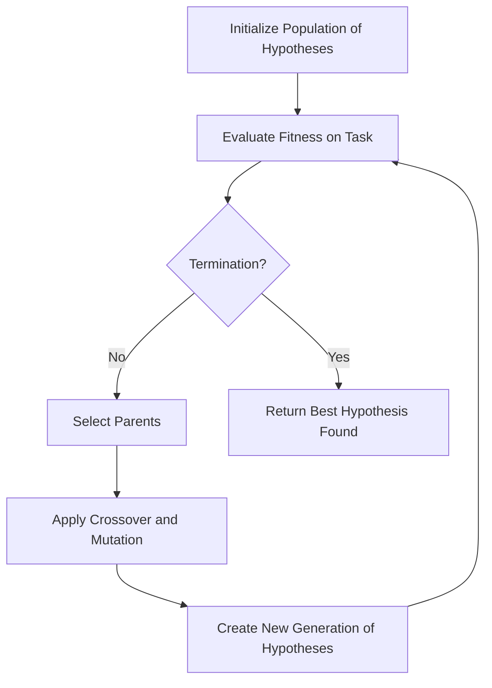

# Hypothesis space search

## Video Explanation

* [https://www.youtube.com/watch?v=Y8Z0SgXl3oM&t=200s](https://www.youtube.com/watch?v=Y8Z0SgXl3oM&t=200s)

## Visual Aids

---

## 1. Definition

**Hypothesis space search** in the context of genetic algorithms is the process of exploring the set of all possible hypotheses (candidate solutions) for a given learning task by evolving a population of hypotheses through genetic operators. The genetic algorithm acts as a stochastic search procedure that navigates this space to find a hypothesis that optimizes a predefined fitness function, typically representing performance on a task such as classification or regression.

---

## 2. Concept Explanation

In machine learning, a hypothesis is a candidate function that maps inputs to outputs. The hypothesis space is the complete set of such functions that a learning algorithm can represent. For example, the set of all possible decision trees, neural network weight configurations, or symbolic rules for a problem forms its hypothesis space.

Searching this space exhaustively is often impossible due to its enormous size. A genetic algorithm offers a biologically inspired way to perform this search. Instead of testing one hypothesis at a time, it maintains a population of diverse hypotheses, evaluates their quality via a fitness function, and iteratively creates new generations by combining and slightly modifying the most promising individuals. Over generations, the population converges toward high-quality regions of the hypothesis space.

This approach is especially useful when the hypothesis space is complex, discontinuous, or non-differentiable, making traditional optimization methods like gradient descent ineffective. The GA balances **exploration** (searching new areas) and **exploitation** (refining existing good hypotheses) through crossover and mutation.

---

## 3. Key Characteristics / Features

- **Population-based search:** Multiple hypotheses are evaluated simultaneously, allowing parallel exploration of different regions of the hypothesis space, which reduces the chance of getting trapped in poor local optima.
- **Stochastic nature:** Genetic operators like selection, crossover, and mutation introduce randomness, which helps the search escape local optima and discover novel solutions.
- **Fitness-driven navigation:** A fitness function quantifies the quality of each hypothesis, guiding the search toward regions with better-performing hypotheses without requiring gradient information.
- **Global search capability:** Because the GA samples from many starting points and recombines partial solutions, it can explore the hypothesis space globally and often finds near-optimal solutions even in highly irregular spaces.
- **Implicit parallelism:** The GA implicitly evaluates many schemas (patterns of genes) in parallel, which means it efficiently searches the space of building blocks that form good hypotheses.
- **Representation flexibility:** Hypotheses can be encoded as binary strings, real-valued vectors, trees, or rule sets, making the search adaptable to a wide variety of machine learning models.

---

## 4. Types / Classification

Based on how hypotheses are represented in the genetic algorithm, hypothesis space search can be classified into the following types.

- **Binary-encoded hypothesis space:** Each hypothesis is a fixed-length binary string. This is common in simple classifier systems or when learning Boolean functions. Example: a rule condition “Age > 30” might be encoded as bits representing thresholds.
- **Real-valued hypothesis space:** Hypotheses are vectors of real numbers. This encoding is used when optimizing numerical parameters, such as weights in a neural network or coefficients in a linear regression model.
- **Tree-based hypothesis space (Genetic Programming):** Hypotheses are represented as parse trees, enabling the evolution of executable programs or symbolic expressions. This is popular for discovering mathematical models or decision rules.
- **Rule-based hypothesis space (Learning Classifier Systems):** Hypotheses are a set of IF-THEN rules that together form a classifier. The GA can evolve individual rules or entire rule sets, often using a combination of niche GA and reinforcement learning.

---

## 5. Working / Mechanism

The following steps describe how a genetic algorithm performs hypothesis space search.

1. **Define hypothesis representation and fitness function:**
   A suitable encoding scheme (genotype) is chosen to represent hypotheses as chromosomes, and a fitness function is defined to measure hypothesis quality, such as classification accuracy or mean squared error.

2. **Initialize population:**
   A population of *N* candidate hypotheses is generated randomly. This initialization ensures that the search starts from a broad coverage of the hypothesis space.

3. **Evaluate fitness:**
   Each hypothesis in the population is applied to the training data (or a simulation), and its fitness score is computed. This step assigns a survival probability to each individual.

4. **Selection:**
   Parents are selected from the current population with a bias toward fitter individuals. Common selection methods include tournament selection and roulette wheel selection. Better hypotheses have a higher chance of reproduction.

5. **Crossover:**
   Pairs of selected parent hypotheses exchange parts of their chromosome to create offspring. This operation recombines building blocks from different regions of the hypothesis space, moving the search into new, promising areas.

6. **Mutation:**
   Offspring chromosomes undergo small random changes, such as flipping a bit or adding Gaussian noise. Mutation maintains diversity and prevents the population from converging prematurely to a suboptimal region.

7. **Replacement:**
   A new generation is formed, typically by replacing the least fit individuals with offspring. Some elitism may be used to keep the best hypothesis unchanged.

8. **Termination check:**
   Steps 3–7 repeat until a stopping criterion is met, such as a maximum number of generations or a satisfactory fitness level. The best hypothesis found so far is the output of the search.

---

## 6. Diagram

The diagram illustrates the cyclic process of genetic algorithm-based search through the hypothesis space, where a population continuously evolves until a termination condition is satisfied.

---

## 7. Mathematical Formulation

The fitness of a hypothesis *h* is commonly defined as a function of its error on a training dataset *D*:

$$
\text{Fitness}(h) = \frac{1}{1 + \text{Error}_D(h)}
$$

or simply  

$$ \text{Fitness}(h) = - \text{Loss}(h) $$

For a classification task, the loss can be the 0-1 loss:

$$ \text{Loss}(h) = \frac{1}{|D|} \sum_{(x,y) \in D} \mathbb{1}[h(x) \neq y] $$

Where:

- `h(x)` is the predicted output of hypothesis `h` for input `x`.
- `y` is the true label.
- `𝕀[·]` is the indicator function, returning 1 if the condition is true, else 0.
- The fitness function assigns higher values to hypotheses that make fewer mistakes, directing the search toward low-error regions of the hypothesis space.

The genetic algorithm maximises this fitness (or equivalently minimises the error) without requiring derivatives, making it suitable for non-differentiable or discrete hypothesis spaces.

---

## 8. Example

Consider learning a set of classification rules to predict whether a customer will buy a product based on age and income. The hypothesis space consists of rules like:

`IF (Age < 40) AND (Income = High) THEN Buy = Yes`

**Hypothesis encoding:** A rule is encoded as a binary chromosome where each segment represents an attribute condition. For simplicity, assume two attributes each discretized into 3 bins; the chromosome is a 6-bit string selecting allowed bins.

**Fitness function:** The classification accuracy of the rule on a training set of customer data.

**Search process:**  
- A population of 50 random rule-encoding chromosomes is created.  
- Each rule is tested on data, and its accuracy becomes its fitness.  
- Selection favors high-accuracy rules; crossover combines promising attribute conditions from two rules; mutation flips a bin selection bit.  
- After 30 generations, the best rule achieves 92% accuracy, effectively navigating the hypothesis space of rule structures to find a near-optimal decision rule.

---

## 9. Analogy

Imagine a vast, pitch-dark cave containing a hidden treasure that represents the best hypothesis. You have a team of explorers (the population) spread across the cave. Each explorer carries a flashlight that can evaluate the quality of the spot where they stand (fitness). The explorers communicate and share location information (crossover) and occasionally take random steps (mutation) to avoid getting stuck in dead ends. Over time, the team concentrates around the richest treasure areas and eventually recovers the best possible reward. This is how a genetic algorithm searches a hypothesis space — through collective exploration, communication, and gradual refinement.

---

## 10. Comparison

Comparison between hypothesis space search using a genetic algorithm versus gradient-based search (e.g., backpropagation in neural networks).

| Feature                  | GA-based Hypothesis Space Search           | Gradient-based Search                  |
| ------------------------ | ------------------------------------------- | -------------------------------------- |
| Search strategy          | Population-based, stochastic                | Point-based, deterministic along gradient |
| Differentiability required | No, fitness can be arbitrary               | Yes, requires differentiable error function |
| Global optimum           | Tends to find near-global optimum           | Can get stuck in local optima          |
| Parallelism              | Inherently parallel (population)            | Sequential; parallel across batches but not search points |
| Computational cost       | High (many evaluations)                     | Lower per iteration, often faster overall |
| Hypothesis representation| Flexible (discrete, trees, rules)           | Typically real-valued vectors only     |

---

## 11. Advantages

- **No gradient requirement:** The GA can search hypothesis spaces where the fitness landscape is rugged, discontinuous, or defined over discrete structures, which gradient methods cannot handle.
- **Global exploration:** By maintaining a diverse population and using mutation, the algorithm efficiently avoids local optima and often discovers globally competitive solutions.
- **Flexible encoding:** Any hypothesis structure — rules, graphs, programs, or numeric vectors — can be evolved with suitable genetic operators, making GAs highly adaptable to different machine learning problems.
- **Parallelizable search:** The evaluation of individuals in a population can be distributed across multiple processors, significantly reducing wall-clock time for large-scale tasks.
- **Robustness to noise:** Because selection is based on relative fitness and the population buffers against outliers, GA search is inherently robust to noisy fitness evaluations.

---

## 12. Disadvantages / Limitations

- **High computational cost:** Each generation requires evaluating a whole population, which becomes expensive when fitness evaluation involves training a model or processing large datasets.
- **No convergence guarantee:** The stochastic nature means there is no guarantee of finding the global optimum or even convergence to a single solution within practical limits.
- **Parameter sensitivity:** The performance heavily depends on population size, crossover and mutation rates, selection pressure, and other hyperparameters, often requiring extensive trial-and-error tuning.
- **Premature convergence:** An overly strong selection pressure can lead to loss of diversity, causing the population to converge on a suboptimal region before the space has been adequately explored.
- **Late-stage inefficiency:** Once the population is near an optimum, the random exploration may slow down final fine-tuning compared to gradient-based refinement.

---

## 13. Important Points / Exam Notes

- Hypothesis space is the set of all possible hypotheses a learner can represent; GA searches it by evolving a population of encoded hypotheses.
- The three core genetic operators are: **selection** (driven by fitness), **crossover** (recombination of building blocks), and **mutation** (random perturbation to maintain diversity).
- Fitness function maps a hypothesis to a scalar performance score; the GA seeks to maximize (or minimize) this value without derivative information.
- Elitism preserves the best hypothesis to prevent regression across generations.
- GA-based search is a **generate-and-test** strategy with parallel, stochastic exploration — suitable when the hypothesis space is large, complex, or non-differentiable.
- Schema theorem provides a theoretical justification: GAs implicitly evaluate many schemas (patterns) each generation, explaining their power in searching hypothesis spaces.
- Learning classifier systems and genetic programming are concrete frameworks that use GA to search rule and program hypothesis spaces respectively.

---

## 14. Applications / Use Cases

- **Rule learning for classification:** GA searches the space of IF-THEN rules to discover accurate and interpretable classifiers in domains like medical diagnosis.
- **Feature selection:** The hypothesis space consists of subsets of features; GA evolves binary vectors indicating inclusion/exclusion, significantly reducing dimensionality for model training.
- **Neural network weight optimization:** Instead of backpropagation, a GA can search the continuous weight space of a neural network, useful when the loss landscape has many poor local minima.
- **Genetic programming for symbolic regression:** The hypothesis space is the set of mathematical expressions; GA evolves tree structures to discover equations that fit experimental data.
- **Hyperparameter tuning:** The hypothesis space is the grid or continuous space of algorithm hyperparameters; GA efficiently searches this space to find optimal configurations.
- **Robotics and control:** The space of control policies (e.g., parameters of a PID controller) is searched using GAs to achieve desired robot behaviour.

---

## 15. MCQs

**Q1. In a genetic algorithm, what represents a hypothesis?**
A. The fitness function  
B. A chromosome  
C. The training data  
D. The mutation operator  
**Answer:** B  
**Explanation:** A hypothesis is encoded as a chromosome (the genotype), which is a representation of the candidate solution inside the GA.

**Q2. What is the role of the fitness function in hypothesis space search?**
A. To produce random hypotheses  
B. To measure how good a hypothesis is for the task  
C. To define the mutation rate  
D. To store the best hypothesis  
**Answer:** B  
**Explanation:** The fitness function evaluates each hypothesis and assigns a score that drives selection and guides the search toward better regions.

**Q3. Which GA operation helps maintain diversity and avoid local optima?**
A. Selection  
B. Crossover  
C. Mutation  
D. Elitism  
**Answer:** C  
**Explanation:** Mutation introduces random changes into chromosomes, keeping the population diverse and enabling the search to jump out of local optima.

**Q4. Why can a genetic algorithm search hypothesis spaces where gradient descent fails?**
A. It is always faster  
B. It does not require the fitness function to be differentiable  
C. It uses only one solution  
D. It guarantees the global optimum  
**Answer:** B  
**Explanation:** GA relies only on fitness evaluations and does not need derivatives, so it can handle non-differentiable, discrete, or noisy spaces.

**Q5. What is the purpose of the selection operator?**
A. To initialize the population  
B. To randomly change genes  
C. To decide which hypotheses reproduce based on fitness  
D. To terminate the algorithm  
**Answer:** C  
**Explanation:** Selection favours fitter individuals to become parents, so their genetic material is passed to the next generation, focusing the search on promising areas.

**Q6. In the context of GA-based hypothesis space search, what is a “schema”?**
A. A complete hypothesis  
B. A pattern of gene values describing a set of hypotheses  
C. The fitness landscape  
D. The training data structure  
**Answer:** B  
**Explanation:** A schema is a template (like a pattern with fixed and wildcard positions) that represents a subset of similar chromosomes; GAs implicitly process many schemas in parallel.

**Q7. Which hypothesis representation is used in genetic programming for model discovery?**
A. Binary strings  
B. Real-valued vectors  
C. Tree structures  
D. Rule sets  
**Answer:** C  
**Explanation:** Genetic programming evolves programs or mathematical expressions using tree-like chromosomes to search the space of executable functions.

**Q8. What problem can occur if selection pressure is too high?**
A. Too much diversity  
B. Premature convergence to a local optimum  
C. No crossover  
D. The algorithm will never terminate  
**Answer:** B  
**Explanation:** Extremely strong selection can cause the population to quickly lose diversity and converge to a suboptimal region before the space is well explored.

**Q9. How does elitism help in GA-based hypothesis space search?**
A. It increases mutation rate  
B. It ensures the best hypothesis survives unchanged to the next generation  
C. It initializes the population with expert knowledge  
D. It evaluates fitness faster  
**Answer:** B  
**Explanation:** Elitism copies the fittest individual(s) directly to the new population, preventing the loss of the best solution found so far due to crossover or mutation.

**Q10. Which of the following is a real-world application of hypothesis space search with GAs?**
A. Sorting a list of numbers  
B. Optimizing hyperparameters of a support vector machine  
C. Storing a database  
D. Sending emails  
**Answer:** B  
**Explanation:** Hyperparameter tuning involves searching a complex, often non-continuous space; GAs efficiently find good configurations, improving model performance.