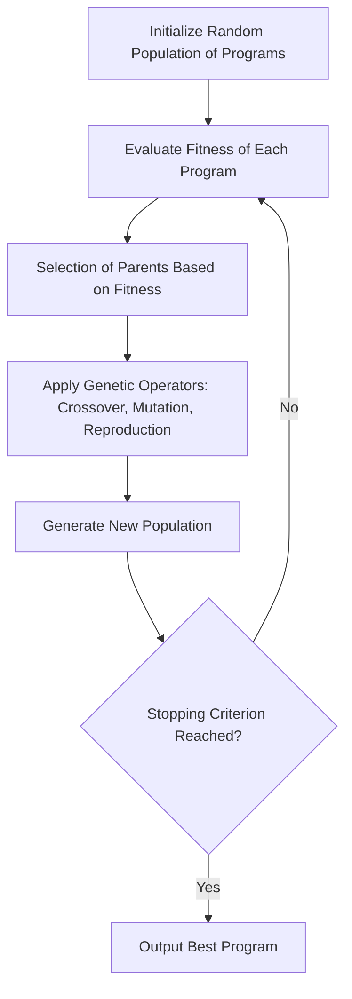

# Genetic Programming

## Video Explanation

* [https://www.youtube.com/watch?v=nhT56blfRpE&t=600s](https://www.youtube.com/watch?v=nhT56blfRpE&t=600s)

## Visual Aids

---

## 1. Definition

Genetic Programming (GP) is an evolutionary algorithm technique that automatically evolves computer programs to perform a user-defined task. It belongs to the family of evolutionary computation methods and extends the genetic algorithm by representing solutions as executable structures (typically tree-shaped programs) rather than fixed-length strings. The core purpose is to discover both the structure and parameters of a program that solves a problem without requiring the programmer to specify the exact form of the solution.

---

## 2. Concept Explanation

Imagine you want a computer to find a mathematical formula that fits a set of data points, but you have no idea what the formula looks like. Genetic Programming approaches this by creating a population of random formulas, testing how well each one fits the data, and then repeatedly selecting the best formulas to produce new variants through processes inspired by natural evolution.

Technically, a program in GP is often represented as a **parse tree**. The internal nodes of the tree are functions (e.g., addition, multiplication, if-else, loops), and the leaf nodes are terminals (e.g., input variables, constants). The algorithm starts with a randomly generated population of such trees. Each tree is evaluated by running it as a program on the task, and a fitness score measures its performance (e.g., prediction error). Parents are selected probabilistically, favouring fitter individuals. Then genetic operators—**crossover** (swapping subtrees between two parents) and **mutation** (replacing a randomly chosen subtree with a new random tree)—create offspring. After many generations, the population evolves toward programs that solve the problem well.

GP is used when the structure of the solution is unknown or complex, and traditional hand-coded solutions are difficult to design. It is applied in symbolic regression, automatic feature engineering, robot control, and even in discovering new algorithms.

---

## 3. Key Characteristics / Features

- **Programs as individuals:** Each candidate solution is an executable program, not a fixed-length vector of numbers. This allows the system to evolve the logic of the solution directly.
- **Variable-length representation:** The parse trees can grow or shrink due to crossover and mutation, enabling the discovery of solutions with appropriate complexity.
- **Automated structure and parameter optimization:** Unlike many ML methods where a human designs the model architecture, GP searches for both the program structure and the numerical constants simultaneously.
- **Use of domain-specific functions and terminals:** The user provides a set of functions (e.g., arithmetic operators, boolean operators, domain-specific operations) and terminals (inputs, constants) that define the building blocks of a valid program.
- **Crossover at subtree level:** Genetic material is exchanged by swapping subtrees, preserving syntactic validity if the function and terminal sets are type-consistent.
- **Bloat phenomenon:** Programs tend to increase in size over generations without corresponding fitness improvement, often due to redundant or inactive code.
- **Interpretable output:** The final program is often a human-readable expression (e.g., a mathematical formula or a small program), which aids understanding of the discovered solution.

---

## 4. Types / Classification

Genetic Programming can be classified based on the representation of individuals:

- **Tree-based GP:** The classical form introduced by John Koza. Programs are represented as parse trees with internal nodes as functions and leaves as terminals. Crossover swaps subtrees between two trees.
- **Linear GP:** Programs are represented as sequences of instructions (e.g., machine code or imperative statements). Individuals have a fixed or variable length list of operations, and crossover may exchange instruction subsequences.
- **Graph-based GP (Cartesian GP):** Programs are defined as directed acyclic graphs, where nodes represent functions and edges define data flow. This representation allows the reuse of intermediate results and often yields compact solutions.
- **Stack-based GP:** Uses a stack-based language where programs are sequences of commands that manipulate a stack; the representation is linear but execution is stack-driven.

Each type has its own strengths: tree-based GP is most popular for symbolic regression; linear GP is close to real machine code and can be very efficient; graph-based GP excels in digital circuit design and image processing.

---

## 5. Working / Mechanism

The mechanism of Genetic Programming follows a generational evolutionary cycle:

1. **Initialize population:** Generate a population of random programs (trees) using the provided function set and terminal set. A common method is the ramped half-and-half approach, which creates trees of varying depths and shapes.
2. **Evaluate fitness:** Execute each program on the problem (e.g., compute its output for training inputs) and measure its performance using a predefined fitness function (e.g., mean squared error, classification accuracy, or number of correctly solved cases).
3. **Select parents:** Use a selection method such as tournament selection or fitness-proportionate selection to choose individuals for reproduction, giving higher chance to fitter programs.
4. **Apply genetic operators:** Create a new generation by applying:
   - **Reproduction (elitism):** Copy a few of the best individuals directly to the next generation to preserve top solutions.
   - **Crossover:** Select two parent trees, randomly choose a crossover point (a node) in each, and exchange the corresponding subtrees, producing two offspring.
   - **Mutation:** Select a parent tree, randomly choose a mutation node, delete its subtree, and grow a new random subtree in its place.
5. **Build new population:** Combine the offspring (and possibly the best old individuals) to form the next generation.
6. **Check termination condition:** If the stopping criterion (e.g., maximum generations, perfect solution found, or fitness plateau) is met, stop and output the best program. Otherwise, go back to step 2.

Throughout the process, closure property must be maintained: every function must be able to handle any possible input type produced by its child nodes.

---

## 6. Diagram

---

## 7. Mathematical Formulation

A typical fitness function for symbolic regression with GP is the mean squared error between the program’s output and the target values:

$$
Fitness(P) = \frac{1}{N} \sum_{i=1}^{N} (y_i - P(x_i))^2
$$

Where:  
- \( P \) : the program (evolved expression).  
- \( x_i \) : the input vector for the \( i \)-th training example.  
- \( P(x_i) \) : the output produced by program \( P \) when run on \( x_i \).  
- \( y_i \) : the true target value for the \( i \)-th example.  
- \( N \) : total number of training examples.  
- \( Fitness(P) \) : the error to be minimized; a lower value indicates a better program.

In other tasks, fitness could be classification accuracy, number of solved test cases, or a domain-specific objective. The selection probability is often based on normalized fitness.

---

## 8. Example

**Symbolic Regression:** Suppose we have data generated from the unknown function \( f(x) = x^3 - 2x + 5 \). The GP system is given the terminal set {x, random constants} and function set {+, -, *, /}. It starts with random trees like \( x + 3 \) or \( (x * x) / 2 \). The fitness of each program is its mean squared error on a set of (x, y) points. Through generations, crossover may combine a sub-expression that approximates \( x^3 \) with one that approximates \( -2x \), and mutation may fine-tune constants. Eventually, the population yields a program like \( (x * x * x) - (2 * x) + 4.98 \), which closely matches the original function.

This demonstrates how GP discovers both the algebraic structure and the numerical coefficients automatically.

---

## 9. Analogy

Imagine you want to breed a dog that excels at retrieving objects from water. You start with a large litter of random mixed-breed puppies. You throw a ball into a pond and record how quickly and reliably each puppy retrieves it. The best retrievers are selected as parents for the next litter. Occasionally, a random genetic mutation gives a puppy webbed feet or a water-resistant coat. After many generations, you have a stable breed of excellent water retrievers. Genetic Programming works similarly: random programs are tested, the fittest are “bred” through crossover and mutation, and over time the population evolves into highly effective programs for the task.

---

## 10. Comparison

| Feature          | Genetic Algorithm (GA)                        | Genetic Programming (GP)                     |
| ---------------- | --------------------------------------------- | -------------------------------------------- |
| Representation   | Fixed-length binary/real-valued strings       | Variable-length tree/program structures      |
| Output           | Optimal set of parameters or configuration    | An executable program or expression          |
| Crossover        | Exchanges substrings between two strings      | Swaps subtrees between two program trees     |
| Search space     | Typically fixed-dimensional parameter space   | Space of possible program structures         |
| Interpretability | Often yields a vector of numbers              | Can produce a human-readable formula/program |
| Typical use case | Optimizing weights, scheduling, routing       | Symbolic regression, automatic programming   |

---

## 11. Advantages

- **Discovers novel solutions:** GP can produce unexpected, creative program structures that a human designer might not consider.
- **No need to pre-specify model architecture:** The user only provides building blocks; the algorithm searches for the structure.
- **Interpretable output:** The final program is often a simple formula or decision tree that can be understood and analyzed.
- **Handles diverse problem types:** Can be applied to regression, classification, control, design, and any problem expressible as a computer program.
- **Inherently parallelizable:** The fitness evaluation of distinct individuals can be done simultaneously.

---

## 12. Disadvantages / Limitations

- **High computational cost:** Evaluating thousands of programs over many generations requires significant CPU time.
- **Bloat:** Programs can grow excessively large with non-functional code, increasing evaluation cost and reducing interpretability.
- **Overfitting:** Evolved programs may fit noise in the training data, especially if not properly regularized.
- **Difficulty in function set design:** Choosing an appropriate set of functions that is expressive yet safe (i.e., no division by zero) is non-trivial.
- **Premature convergence:** The population may converge to a suboptimal solution due to loss of diversity.

---

## 13. Important Points / Exam Notes

- Genetic Programming is an evolutionary technique that automatically evolves computer programs, pioneered by John Koza.
- Individuals are typically represented as **parse trees** with functions (internal nodes) and terminals (leaves).
- The main genetic operators are **crossover** (subtree exchange) and **mutation** (subtree replacement); elitism preserves best solutions.
- **Fitness** measures how well a program solves the given task, e.g., mean squared error.
- The **closure** property requires that every function can handle any value returned by its child nodes.
- **Bloat** is the uncontrolled growth of program size without fitness improvement; parsimony pressure can counteract it.
- GP is distinct from Genetic Algorithms: GP evolves executable structures, GA evolves fixed-length parameter vectors.
- Common termination criteria: maximum number of generations, reaching an acceptable fitness threshold, or stagnation.
- Symbolic regression is the most classic application: discovering a mathematical expression from data.

---

## 14. Applications / Use Cases

- **Symbolic regression:** Automatically finding mathematical equations that match experimental data in physics, finance, and engineering.
- **Feature construction:** Evolving new features (mathematical combinations of original inputs) to improve the performance of other machine learning models.
- **Automated design:** Designing analog electrical circuits, controllers, or antennas; GP has created patentable inventions.
- **Robot control programs:** Evolving real-time control logic for autonomous robots navigating complex environments.
- **Bioinformatics:** Discovering classification rules for gene expression data or protein structure prediction.
- **Game playing:** Evolving strategies or heuristics for board games and video games.

---

## 15. MCQs

**Q1.** What is the primary representation of an individual in standard tree-based Genetic Programming?  
A. A fixed-length binary string  
B. A parse tree with functions as internal nodes and terminals as leaves  
C. A directed acyclic graph  
D. A sequence of assembly instructions  
**Answer:** B  
**Explanation:** In classical GP, programs are expressed as trees where internal nodes are functions and leaves are terminals (inputs or constants).

**Q2.** Which genetic operator is unique to Genetic Programming compared to a standard Genetic Algorithm?  
A. Selection  
B. Fitness evaluation  
C. Subtree crossover  
D. Random initialization  
**Answer:** C  
**Explanation:** GP uses subtree crossover, exchanging randomly chosen subtrees between two program trees. GA typically uses string-based crossover.

**Q3.** What is the “bloat” phenomenon in Genetic Programming?  
A. The fitness function becoming too complex  
B. Individuals growing in size without corresponding fitness improvement  
C. The population losing diversity quickly  
D. The mutation rate increasing over time  
**Answer:** B  
**Explanation:** Bloat refers to the tendency of programs to accumulate non-functional code, increasing length/complexity with no fitness gain.

**Q4.** In symbolic regression using GP, the fitness function is most often:  
A. The program’s execution time  
B. The number of nodes in the parse tree  
C. The prediction error on training data  
D. The depth of the tree  
**Answer:** C  
**Explanation:** Fitness measures how close the program’s output is to the target values; common choices are mean squared error or mean absolute error.

**Q5.** Why must the closure property be satisfied in GP function and terminal sets?  
A. To ensure the program terminates  
B. To guarantee that every function can safely accept any possible input from its child nodes  
C. To limit the tree depth  
D. To allow the use of linear representations  
**Answer:** B  
**Explanation:** Closure ensures type consistency so that any function can process the outputs of other functions, avoiding runtime errors.

**Q6.** Which of the following is a key advantage of Genetic Programming over manually programming a solution?  
A. Guaranteed optimal solution  
B. Always faster execution  
C. Ability to automatically discover both structure and parameters of a solution  
D. No need to define a fitness function  
**Answer:** C  
**Explanation:** GP explores the space of possible program structures and coefficients, finding a working program without the human specifying its exact form.

**Q7.** What is typically used as the initial population in a GP run?  
A. Only programs that are known to be partially correct  
B. Randomly generated programs built from the function and terminal sets  
C. Programs copied from previous runs  
D. A single hand-crafted program  
**Answer:** B  
**Explanation:** GP starts with a diverse random population of programs (trees) created using the defined primitives to ensure initial exploration.

**Q8.** In GP, the mutation operation generally involves:  
A. Swapping two complete trees  
B. Changing the fitness evaluation method  
C. Selecting a random node and replacing its subtree with a new random subtree  
D. Changing the selection mechanism  
**Answer:** C  
**Explanation:** Mutation alters an individual by randomly replacing a subtree with a newly generated random tree, introducing variation.

**Q9.** Which statement is true about the comparison between Genetic Algorithm (GA) and Genetic Programming (GP)?  
A. GA solutions are executable programs, while GP solutions are strings  
B. GP individuals are fixed in size, while GA individuals vary in size  
C. GA typically uses fixed-length linear chromosomes; GP evolves variable-length tree structures  
D. Both use exactly the same crossover operator  
**Answer:** C  
**Explanation:** GA chromosomes are usually fixed-length strings; GP individuals are parse trees of variable size and shape. The crossover operations differ accordingly.

**Q10.** Which real-world application is most directly associated with Genetic Programming?  
A. Training deep neural networks  
B. Automatic extraction of mathematical expressions from data  
C. Database indexing  
D. Sorting algorithms complexity analysis  
**Answer:** B  
**Explanation:** Symbolic regression, which discovers mathematical formulas from data automatically, is a classic and widespread application of GP.