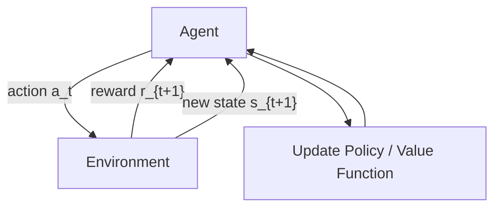

# 01 The Learning Task

## 1. Definition

The reinforcement learning (RL) task is the problem of an agent learning to make decisions by interacting with an environment. The agent perceives the environment’s state, selects actions, and receives numerical rewards as feedback. The objective is to learn a policy – a mapping from states to actions – that maximises the expected cumulative reward over time.

## 2. Concept Explanation

In supervised learning we give the model correct answers (labels) for each example. In reinforcement learning there are no ready‑made correct answers. The agent must discover which actions lead to high long‑term reward through trial and error. It is like a student who is not told the answer but only informed whether the final result was good or bad, and must figure out the steps that led there.

The **learning task** is formalised as a **Markov Decision Process (MDP)**. At each time step, the agent observes the current state \( s \), chooses an action \( a \), receives a scalar reward \( r \), and the environment transitions to a new state \( s' \). The agent’s goal is to maximise the **return** – often the discounted sum of future rewards. The return can be written as \( G_t = r_{t+1} + \gamma r_{t+2} + \gamma^2 r_{t+3} + \dots \), where \( \gamma \in [0,1] \) is the discount factor that balances immediate and future rewards.

Why is this important? Many real‑world problems are sequential: an action taken now affects future states and thus future rewards. RL is the natural framework for learning in such settings, from game‑playing AI (AlphaGo) to robotic control, autonomous driving, and dynamic pricing.

## 3. Key Characteristics / Features

- **Learning from interaction:** The agent actively influences the environment and learns from the consequences, unlike passive supervised learning that uses a fixed dataset.
- **Trial‑and‑error search:** The agent explores actions to discover which ones yield high reward, balancing exploration (trying new actions) and exploitation (choosing the best known action).
- **Delayed reward:** The reward signal may be delayed; an action taken now may influence whether a reward is obtained much later. The agent must solve the temporal credit assignment problem.
- **Goal‑directed behaviour:** The objective is explicitly to maximise a scalar reward signal. All other considerations (e.g., safety, comfort) must be encoded through the reward function.
- **Sequential decision making:** The task unfolds over time steps, and actions have long‑term consequences because they affect future states.
- **Agent‑environment boundary:** Every interaction is partitioned into an agent (learner) and an environment (everything outside the agent). The environment gives rewards and new states; the agent chooses actions.

## 4. Types / Classification

Reinforcement learning tasks can be categorised along several dimensions.

- **Episodic vs. Continuing tasks:**
  - *Episodic tasks* have a natural end point (terminal state), like a chess game or a robot navigating to a goal. The agent resets after each episode.
  - *Continuing tasks* have no natural termination; the agent runs indefinitely (e.g., a process controller). The return is often defined as the average reward per step.
- **Model‑based vs. Model‑free:**
  - *Model‑based RL*: The agent learns (or is given) a model of the environment (transition probabilities and reward function) and uses it to plan.
  - *Model‑free RL*: The agent directly learns a policy or value function from experience without an explicit model.
- **Value‑based, Policy‑based, and Actor‑Critic:**
  - *Value‑based* methods (e.g., Q‑learning, DQN) learn a value function and derive the policy from it (e.g., ε‑greedy).
  - *Policy‑based* methods (e.g., REINFORCE) directly parameterise and optimise the policy.
  - *Actor‑Critic* methods combine both: an actor updates the policy, and a critic evaluates the action.
- **Single‑agent vs. Multi‑agent:** The task may involve a single decision maker or several interacting agents (competitive, cooperative, or mixed).

## 5. Working / Mechanism

The core learning loop of a reinforcement learning task unfolds step by step.

1.  **Initialise:** The agent starts with an initial (possibly random) policy and value estimates. The environment presents an initial state \( s_0 \).
2.  **Observe state:** At time step \( t \), the agent receives the current state \( s_t \) from the environment.
3.  **Select action:** Based on its current policy (e.g., ε‑greedy with respect to learned Q‑values), the agent chooses an action \( a_t \). The policy may incorporate exploration noise.
4.  **Execute action:** The action is applied to the environment.
5.  **Receive feedback:** The environment responds with a scalar reward \( r_{t+1} \) and transitions to a new state \( s_{t+1} \). This is the only training signal the agent receives.
6.  **Learn (update knowledge):** Using the experience tuple \((s_t, a_t, r_{t+1}, s_{t+1})\), the agent updates its policy, value function, or model according to its learning algorithm (e.g., temporal‑difference update, policy gradient).
7.  **Prepare for next step:** \( s_t \leftarrow s_{t+1} \). If the state is terminal and the task is episodic, reset the environment.
8.  **Repeat** steps 2–7 until the policy converges or a performance threshold is met.

## 6. Diagram

The loop illustrates the fundamental interaction: the agent sends an action, the environment returns reward and next state, and the agent updates its knowledge.

## 7. Mathematical Formulation

The RL task is commonly formalised as a Markov Decision Process (MDP) defined by the tuple:

$$
(\mathcal{S}, \mathcal{A}, \mathcal{P}, \mathcal{R}, \gamma)
$$

Where:
- \( \mathcal{S} \) = set of all possible states.
- \( \mathcal{A} \) = set of all possible actions.
- \( \mathcal{P}(s' | s, a) \) = probability of transitioning to state \( s' \) after taking action \( a \) in state \( s \).
- \( \mathcal{R}(s, a, s') \) = expected immediate reward for that transition.
- \( \gamma \in [0,1] \) = discount factor, controlling the importance of future rewards.

**Return** (cumulative discounted reward) from time step \( t \):

$$
G_t = r_{t+1} + \gamma r_{t+2} + \gamma^2 r_{t+3} + \dots = \sum_{k=0}^{\infty} \gamma^k r_{t+k+1}
$$

The agent’s goal is to learn a policy \( \pi(a|s) \) that maximises the expected return. Value functions formalise this objective:

- State‑value function: \( V^\pi(s) = \mathbb{E}_\pi[G_t \mid s_t = s] \)
- Action‑value function: \( Q^\pi(s,a) = \mathbb{E}_\pi[G_t \mid s_t = s, a_t = a] \)

The optimal policy \( \pi^* \) satisfies \( V^{\pi^*}(s) \ge V^\pi(s) \) for all states \( s \) and any policy \( \pi \).

## 8. Example

**Grid world navigation:** A robot moves in a 4×4 grid. Some cells contain positive reward (+1 for the goal), others give negative reward (−1 for a pit). At each step the robot can move up, down, left, or right. Actions can be stochastic: the robot moves in the intended direction with 80% probability, and 20% it slips to a perpendicular direction.

The agent does not know the grid layout initially. It must learn through trial and error a policy that takes it from the start to the goal while avoiding pits. Using a model‑free method like Q‑learning, after many episodes the robot discovers that going right from cell (2,1) is optimal, because it leads to a sequence of high‑reward states. The learning task is to find that mapping from positions to actions purely from reward feedback.

## 9. Analogy

Teaching a puppy a new trick is a good analogy for the RL learning task. You do not show the puppy a video of the perfect trick. You give a command (state), the puppy tries something (action), and you either give it a treat (positive reward) or say “no” (negative reward). Over many attempts the puppy learns which actions lead to treats and gradually refines its behaviour. The puppy’s learning task is to discover the policy that maximises treats, exactly like an RL agent.

## 10. Comparison

| Feature | Reinforcement Learning | Supervised Learning |
|--------|------------------------|---------------------|
| **Training signal** | Scalar reward after actions; may be delayed | Labelled correct output for each input |
| **Data** | Generated by the agent’s interaction with the environment | Fixed, pre‑collected dataset of input‑output pairs |
| **Decision making** | Sequential; actions influence future inputs (state) | Independent predictions; each example is separate |
| **Goal** | Maximise cumulative reward over time | Minimise prediction error on given labels |
| **Exploration** | The agent must explore to discover good actions | No exploration required |

## 11. Advantages

- **Handles sequential decision problems:** RL is ideal for tasks where decisions have long‑term effects, such as game playing, robotics, and finance.
- **Learns without explicit correct answers:** It requires only a reward signal, not a labelled dataset, making it applicable when designing a supervisory signal is easier than providing exact actions.
- **Adapts to dynamic environments:** The agent continuously learns from interaction, so it can adjust if the environment changes (e.g., in online recommendation systems).
- **Discovers novel strategies:** Through trial and error, RL agents can find surprising high‑reward strategies that humans might not consider (e.g., AlphaGo’s Move 37).
- **General framework:** MDPs and RL subsume many other learning formulations; it provides a unified mathematical language for goal‑directed learning.

## 12. Disadvantages / Limitations

- **Sample inefficiency:** RL often requires huge numbers of interactions to learn, which can be impractical in real‑world settings (e.g., robotics with physical wear and tear).
- **Exploration risk:** To discover good actions the agent must sometimes take suboptimal or dangerous steps (e.g., a self‑driving car trying an unsafe manoeuvre).
- **Credit assignment problem:** It is hard to determine which past action was responsible for a delayed reward, particularly in long episodes.
- **Sensitive to reward design:** The reward function must be carefully crafted; misspecified rewards can lead to unintended or even harmful behaviour (reward hacking).
- **Stability and convergence issues:** Without careful tuning, algorithms may diverge or exhibit high variance, especially when using function approximators like neural networks.

## 13. Important Points / Exam Notes

- The reinforcement learning task is formalised as a **Markov Decision Process (MDP)**.
- The agent’s objective is to maximise the **expected cumulative discounted reward** (return).
- Key components: **agent, environment, state, action, reward, policy, value function**.
- The policy \( \pi \) defines the agent’s behaviour: \( \pi(a|s) \) for stochastic, \( a = \pi(s) \) for deterministic.
- Two main value functions: **state‑value \( V(s) \)** and **action‑value \( Q(s,a) \)**.
- The **Bellman equations** form the theoretical foundation for value‑based RL.
- The **exploration‑exploitation dilemma** is central: the agent must balance trying new actions and leveraging known good actions.
- The **discount factor \( \gamma \)** controls the present value of future rewards; \( \gamma=0 \) makes the agent myopic, \( \gamma \to 1 \) makes it far‑sighted.
- RL methods are classified as **model‑based** (use a model of the environment) or **model‑free** (learn directly from samples).
- The **reward hypothesis** states that all goals can be described as the maximisation of expected cumulative reward.

## 14. Applications / Use Cases

- **Game playing:** AlphaGo, chess engines, Atari game agents trained with Deep Q‑Networks (DQN).
- **Robotics:** Teaching robots to walk, grasp objects, or assemble parts through trial and error in simulation and reality.
- **Autonomous driving:** Lane‑keeping, adaptive cruise control, and intersection negotiation learned via RL.
- **Recommendation systems:** Dynamically adapting suggestions based on user clicks to maximise long‑term engagement.
- **Resource management:** Data centre cooling optimisation, energy trading, and network traffic routing by constantly adjusting parameters to reduce cost.
- **Healthcare:** Personalised treatment planning (e.g., sepsis treatment) where the sequence of decisions affects patient outcomes.

## 15. MCQs

**Q1. In the reinforcement learning learning task, the agent learns by**

A. Studying a fixed dataset of inputs and outputs  
B. Minimising the cross‑entropy loss  
C. Interacting with an environment and receiving reward signals  
D. Clustering unlabeled data points  

**Answer:** C  
**Explanation:** RL is interaction‑based; the agent learns from rewards obtained through trial and error.

---

**Q2. The objective of a reinforcement learning agent is to maximise**

A. The immediate reward after the next action  
B. The cumulative discounted reward in the long run  
C. The number of actions taken per episode  
D. The exploration rate  

**Answer:** B  
**Explanation:** The agent aims to maximise the expected return \( G_t = \sum \gamma^k r_{t+k+1} \).

---

**Q3. Which term describes the trade‑off between trying new actions and choosing the current best‑known action?**

A. Bias‑variance trade‑off  
B. Exploration‑exploitation dilemma  
C. Overfitting‑underfitting dilemma  
D. Stability‑plasticity dilemma  

**Answer:** B  
**Explanation:** Exploration (trying new things) and exploitation (using known good actions) must be balanced.

---

**Q4. In an episodic reinforcement learning task,**

A. The agent never resets  
B. The discount factor must be 1  
C. The interaction is broken into separate trials that end in a terminal state  
D. The reward is always zero  

**Answer:** C  
**Explanation:** Episodic tasks have a clear ending; the agent restarts after reaching a terminal state.

---

**Q5. The function that maps states to actions is called the**

A. Value function  
B. Transition function  
C. Policy  
D. Reward function  

**Answer:** C  
**Explanation:** The policy \( \pi \) defines the agent’s behaviour; it can be deterministic or stochastic.

---

**Q6. A Markov Decision Process (MDP) formalisation of the RL task includes**

A. A dataset of labelled examples  
B. States, actions, transition probabilities, rewards, and a discount factor  
C. Only states and actions  
D. A pre‑trained neural network  

**Answer:** B  
**Explanation:** An MDP is defined by \( (\mathcal{S}, \mathcal{A}, \mathcal{P}, \mathcal{R}, \gamma) \) and provides the mathematical framework.

---

**Q7. The main difficulty of the temporal credit assignment problem is that**

A. Rewards arrive only at the very first time step  
B. It is hard to determine which past actions contributed to a delayed future reward  
C. The state cannot be observed  
D. The actions are continuous  

**Answer:** B  
**Explanation:** Delayed rewards make it challenging to assign credit to specific earlier actions.

---

**Q8. A value function \( V^\pi(s) \) estimates**

A. The probability of reaching state \( s \) under policy \( \pi \)  
B. The expected return from state \( s \) when following policy \( \pi \)  
C. The immediate reward received on entering state \( s \)  
D. The number of actions that can be taken in state \( s \)  

**Answer:** B  
**Explanation:** \( V^\pi(s) = \mathbb{E}_\pi[G_t \mid s_t = s] \) predicts the long‑term cumulative reward from that state.

---

**Q9. Which of the following is NOT a characteristic of the reinforcement learning task?**

A. The agent influences the future state distribution  
B. Training examples are independent and identically distributed  
C. The feedback is a scalar reward, not a target output  
D. The agent must balance exploration and exploitation  

**Answer:** B  
**Explanation:** RL data is sequential and correlated; actions affect future states, violating i.i.d. assumption.

---

**Q10. The reward hypothesis suggests that**

A. All goals can be framed as maximising cumulative reward  
B. The agent should always act randomly  
C. Rewards must be immediate for learning to occur  
D. A model of the environment is always required  

**Answer:** A  
**Explanation:** RL operates under the hypothesis that a suitably defined reward signal can capture any goal.